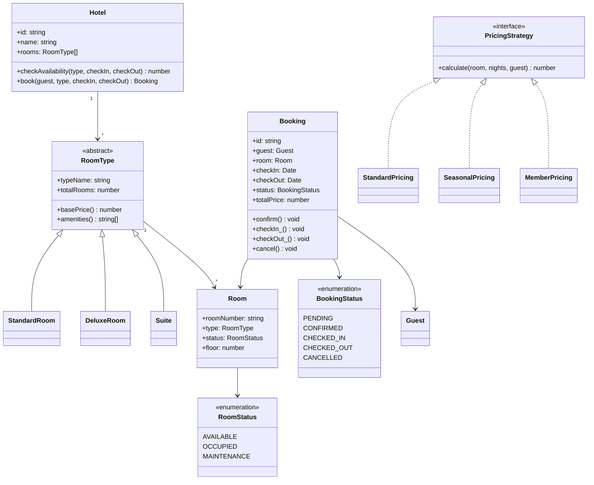
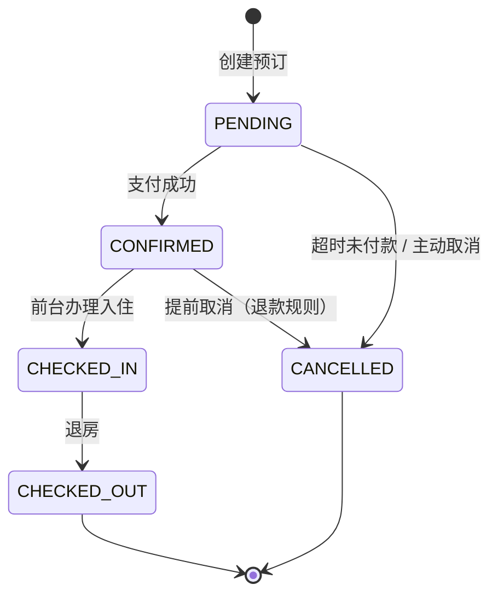

# OOD：酒店预订系统（Hotel Booking）

## 核心考点

房间类型多态、库存并发防超卖（乐观锁）、预订状态机、Strategy 计价（淡旺季、会员折扣）。

---

## 类图



---

## 实现

```typescript
// ── 日期工具 ──────────────────────────────────────────
function nightsBetween(checkIn: Date, checkOut: Date): number {
  const ms = checkOut.getTime() - checkIn.getTime();
  return Math.ceil(ms / (1000 * 60 * 60 * 24));
}

function datesOverlap(s1: Date, e1: Date, s2: Date, e2: Date): boolean {
  return s1 < e2 && s2 < e1;
}

// ── 房间类型（多态） ────────────────────────────────────
abstract class RoomType {
  abstract typeName(): string;
  abstract basePrice(): number;  // 每晚基础价（元）
  abstract amenities(): string[];
}

class StandardRoom extends RoomType {
  typeName()   { return 'Standard'; }
  basePrice()  { return 399; }
  amenities()  { return ['WiFi', 'TV', 'AC']; }
}

class DeluxeRoom extends RoomType {
  typeName()   { return 'Deluxe'; }
  basePrice()  { return 699; }
  amenities()  { return ['WiFi', 'TV', 'AC', 'Minibar', 'City View']; }
}

class Suite extends RoomType {
  typeName()   { return 'Suite'; }
  basePrice()  { return 1599; }
  amenities()  { return ['WiFi', 'TV', 'AC', 'Minibar', 'Jacuzzi', 'Butler Service']; }
}

// ── 房间状态 ───────────────────────────────────────────
enum RoomStatus { AVAILABLE = 'AVAILABLE', OCCUPIED = 'OCCUPIED', MAINTENANCE = 'MAINTENANCE' }

class Room {
  public status: RoomStatus = RoomStatus.AVAILABLE;

  constructor(
    public readonly roomNumber: string,
    public readonly type: RoomType,
    public readonly floor: number
  ) {}
}

// ── 客人 ──────────────────────────────────────────────
enum MemberTier { REGULAR = 'REGULAR', SILVER = 'SILVER', GOLD = 'GOLD', PLATINUM = 'PLATINUM' }

class Guest {
  constructor(
    public readonly id: string,
    public readonly name: string,
    public readonly email: string,
    public readonly memberTier: MemberTier = MemberTier.REGULAR
  ) {}
}

// ── 计价策略（Strategy） ────────────────────────────────
interface PricingStrategy {
  calculate(room: Room, nights: number, guest: Guest): number;
}

class StandardPricing implements PricingStrategy {
  calculate(room: Room, nights: number): number {
    return room.type.basePrice() * nights;
  }
}

class SeasonalPricing implements PricingStrategy {
  constructor(private multiplier: number) {}
  calculate(room: Room, nights: number): number {
    return room.type.basePrice() * nights * this.multiplier;
  }
}

class MemberPricing implements PricingStrategy {
  private discounts: Record<MemberTier, number> = {
    [MemberTier.REGULAR]:  1.0,
    [MemberTier.SILVER]:   0.95,
    [MemberTier.GOLD]:     0.90,
    [MemberTier.PLATINUM]: 0.80,
  };

  calculate(room: Room, nights: number, guest: Guest): number {
    const base     = room.type.basePrice() * nights;
    const discount = this.discounts[guest.memberTier];
    return Math.round(base * discount);
  }
}

// ── 预订状态机 ─────────────────────────────────────────
enum BookingStatus {
  PENDING     = 'PENDING',
  CONFIRMED   = 'CONFIRMED',
  CHECKED_IN  = 'CHECKED_IN',
  CHECKED_OUT = 'CHECKED_OUT',
  CANCELLED   = 'CANCELLED',
}

class Booking {
  public status: BookingStatus = BookingStatus.PENDING;

  constructor(
    public readonly id: string,
    public readonly guest: Guest,
    public readonly room: Room,
    public readonly checkIn: Date,
    public readonly checkOut: Date,
    public readonly totalPrice: number
  ) {}

  confirm(): void {
    this.assert(BookingStatus.PENDING);
    this.status = BookingStatus.CONFIRMED;
  }

  doCheckIn(): void {
    this.assert(BookingStatus.CONFIRMED);
    this.status = BookingStatus.CHECKED_IN;
    this.room.status = RoomStatus.OCCUPIED;
  }

  doCheckOut(): void {
    this.assert(BookingStatus.CHECKED_IN);
    this.status = BookingStatus.CHECKED_OUT;
    this.room.status = RoomStatus.AVAILABLE;
  }

  cancel(): void {
    if (this.status === BookingStatus.CHECKED_IN || this.status === BookingStatus.CHECKED_OUT) {
      throw new Error('Cannot cancel an active or finished stay');
    }
    this.status      = BookingStatus.CANCELLED;
    this.room.status = RoomStatus.AVAILABLE;
  }

  nights(): number { return nightsBetween(this.checkIn, this.checkOut); }

  private assert(expected: BookingStatus): void {
    if (this.status !== expected) {
      throw new Error(`Expected ${expected}, got ${this.status}`);
    }
  }
}

// ── 酒店（Facade + 防超卖） ─────────────────────────────
class Hotel {
  private rooms:    Room[]    = [];
  private bookings: Booking[] = [];
  private idCounter = 0;
  private pricingStrategy: PricingStrategy = new MemberPricing();

  constructor(public readonly name: string) {}

  addRoom(room: Room): void { this.rooms.push(room); }

  setPricingStrategy(s: PricingStrategy): void { this.pricingStrategy = s; }

  // 查询指定类型和日期段的可用房间数
  checkAvailability(typeName: string, checkIn: Date, checkOut: Date): Room[] {
    const occupied = new Set(
      this.bookings
        .filter(b =>
          b.status !== BookingStatus.CANCELLED &&
          b.status !== BookingStatus.CHECKED_OUT &&
          datesOverlap(b.checkIn, b.checkOut, checkIn, checkOut)
        )
        .map(b => b.room.roomNumber)
    );

    return this.rooms.filter(
      r => r.type.typeName() === typeName &&
           r.status === RoomStatus.AVAILABLE &&
           !occupied.has(r.roomNumber)
    );
  }

  // 预订（乐观锁防超卖：再次确认房间可用才分配）
  book(guest: Guest, typeName: string, checkIn: Date, checkOut: Date): Booking {
    const available = this.checkAvailability(typeName, checkIn, checkOut);
    if (available.length === 0) throw new Error(`No ${typeName} rooms available`);

    const room   = available[0]; // 实际系统中选最优房间（楼层、偏好等）
    const nights = nightsBetween(checkIn, checkOut);
    const price  = this.pricingStrategy.calculate(room, nights, guest);

    const booking = new Booking(
      `BK-${String(++this.idCounter).padStart(6, '0')}`,
      guest, room, checkIn, checkOut, price
    );
    booking.confirm();
    this.bookings.push(booking);
    return booking;
  }

  getBooking(id: string): Booking | undefined {
    return this.bookings.find(b => b.id === id);
  }
}
```

---

## 预订状态机



---

## 面试追问

**Q: 如何防止同一房间被并发预订两次（超卖）？**

数据库层加乐观锁：`rooms` 表加 `version` 列，预订时 `UPDATE rooms SET version=version+1 WHERE room_id=? AND version=旧版本`，受影响行数为 0 则说明被别人抢了，重试或报错。

**Q: 如何处理取消退款策略（免费取消 / 不退款）？**

在 `Booking` 上增加 `CancellationPolicy`（Strategy），`cancel()` 时调用策略计算退款金额：`FreeCancellation`（全退）、`PartialRefund`（部分退）、`NonRefundable`（不退）。

**Q: 酒店有很多分类（商务房、家庭房、海景房），如何扩展？**

`RoomType` 已经是抽象类，新增一个子类即可，无需改动 `Booking` 或 `Hotel` 的核心逻辑（开闭原则）。还可以用组合替代继承：`Room` 持有 `features: string[]`，通过 Builder 模式构建不同配置。
