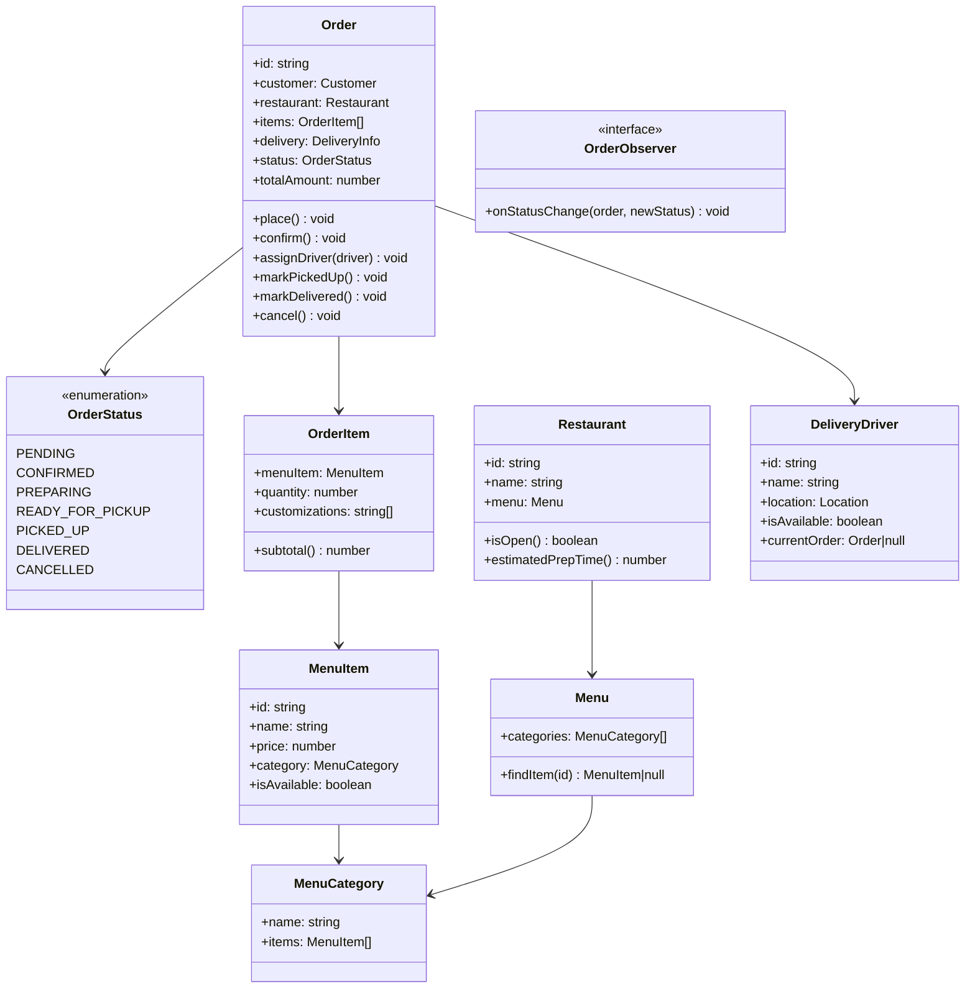
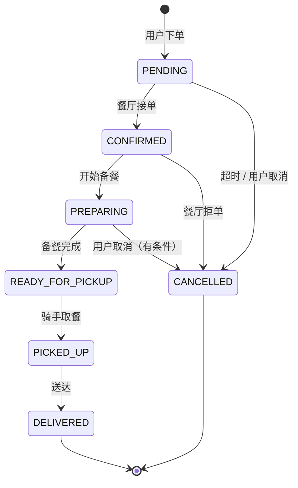

# OOD：外卖系统（Food Delivery）

## 核心考点

订单状态机、菜单建模（Composite 菜品分类）、Observer 推送通知、多配送员策略。

---

## 类图



---

## 实现

```typescript
// ── 菜单建模 ───────────────────────────────────────────
class MenuItem {
  constructor(
    public readonly id: string,
    public readonly name: string,
    public readonly price: number,      // 分（整数避免浮点）
    public isAvailable: boolean = true
  ) {}
}

class MenuCategory {
  public readonly items: MenuItem[] = [];

  constructor(public readonly name: string) {}

  addItem(item: MenuItem): void { this.items.push(item); }

  findItem(id: string): MenuItem | undefined {
    return this.items.find(i => i.id === id);
  }
}

class Menu {
  public readonly categories: MenuCategory[] = [];

  addCategory(cat: MenuCategory): void { this.categories.push(cat); }

  findItem(id: string): MenuItem | null {
    for (const cat of this.categories) {
      const item = cat.findItem(id);
      if (item) return item;
    }
    return null;
  }
}

// ── 订单条目 ───────────────────────────────────────────
class OrderItem {
  constructor(
    public readonly menuItem: MenuItem,
    public readonly quantity: number,
    public readonly customizations: string[] = []
  ) {}

  subtotal(): number { return this.menuItem.price * this.quantity; }
}

// ── 配送信息 ──────────────────────────────────────────
class Address {
  constructor(
    public readonly street: string,
    public readonly city:   string,
    public readonly lat:    number,
    public readonly lng:    number
  ) {}
}

// ── Observer 接口 ─────────────────────────────────────
interface OrderObserver {
  onStatusChange(order: Order, newStatus: OrderStatus): void;
}

class CustomerNotifier implements OrderObserver {
  onStatusChange(order: Order, status: OrderStatus): void {
    const messages: Partial<Record<OrderStatus, string>> = {
      [OrderStatus.CONFIRMED]:         '餐厅已接单，正在备餐',
      [OrderStatus.READY_FOR_PICKUP]:  '餐食已备好，骑手正在前往',
      [OrderStatus.PICKED_UP]:         '骑手已取餐，正在配送',
      [OrderStatus.DELIVERED]:         '已送达，请好评',
      [OrderStatus.CANCELLED]:         '订单已取消',
    };
    const msg = messages[status];
    if (msg) console.log(`[短信] ${order.customer.phone}: ${msg}`);
  }
}

class RestaurantNotifier implements OrderObserver {
  onStatusChange(order: Order, status: OrderStatus): void {
    if (status === OrderStatus.CONFIRMED) {
      console.log(`[餐厅通知] 新订单 #${order.id}，请及时确认`);
    }
  }
}

// ── 订单状态机 ─────────────────────────────────────────
enum OrderStatus {
  PENDING          = 'PENDING',
  CONFIRMED        = 'CONFIRMED',
  PREPARING        = 'PREPARING',
  READY_FOR_PICKUP = 'READY_FOR_PICKUP',
  PICKED_UP        = 'PICKED_UP',
  DELIVERED        = 'DELIVERED',
  CANCELLED        = 'CANCELLED',
}

class Order {
  public status: OrderStatus = OrderStatus.PENDING;
  public driver: DeliveryDriver | null = null;
  private observers: OrderObserver[] = [];

  constructor(
    public readonly id: string,
    public readonly customer: Customer,
    public readonly restaurant: Restaurant,
    public readonly items: OrderItem[],
    public readonly deliveryAddress: Address
  ) {}

  addObserver(obs: OrderObserver): void { this.observers.push(obs); }

  totalAmount(): number { return this.items.reduce((s, i) => s + i.subtotal(), 0); }

  // 状态转换方法
  confirm(): void {
    this.transition(OrderStatus.PENDING, OrderStatus.CONFIRMED);
  }

  startPreparing(): void {
    this.transition(OrderStatus.CONFIRMED, OrderStatus.PREPARING);
  }

  markReadyForPickup(): void {
    this.transition(OrderStatus.PREPARING, OrderStatus.READY_FOR_PICKUP);
  }

  assignDriver(driver: DeliveryDriver): void {
    if (this.status !== OrderStatus.READY_FOR_PICKUP) {
      throw new Error('Order not ready for pickup');
    }
    this.driver = driver;
    driver.assignOrder(this);
  }

  markPickedUp(): void {
    this.transition(OrderStatus.READY_FOR_PICKUP, OrderStatus.PICKED_UP);
  }

  markDelivered(): void {
    this.transition(OrderStatus.PICKED_UP, OrderStatus.DELIVERED);
    this.driver?.completeDelivery();
  }

  cancel(): void {
    const cancellableStates = [OrderStatus.PENDING, OrderStatus.CONFIRMED, OrderStatus.PREPARING];
    if (!cancellableStates.includes(this.status)) {
      throw new Error(`Cannot cancel order in status ${this.status}`);
    }
    this.status = OrderStatus.CANCELLED;
    this.notify(OrderStatus.CANCELLED);
  }

  private transition(from: OrderStatus, to: OrderStatus): void {
    if (this.status !== from) throw new Error(`Expected ${from}, got ${this.status}`);
    this.status = to;
    this.notify(to);
  }

  private notify(status: OrderStatus): void {
    for (const obs of this.observers) obs.onStatusChange(this, status);
  }
}

// ── 用户 & 骑手 ────────────────────────────────────────
class Customer {
  constructor(
    public readonly id: string,
    public readonly name: string,
    public readonly phone: string
  ) {}
}

class DeliveryDriver {
  public currentOrder: Order | null = null;
  private _available = true;

  constructor(
    public readonly id: string,
    public readonly name: string,
    public location: { lat: number; lng: number }
  ) {}

  get isAvailable() { return this._available; }

  assignOrder(order: Order): void {
    this.currentOrder = order;
    this._available   = false;
  }

  completeDelivery(): void {
    this.currentOrder = null;
    this._available   = true;
  }
}

// ── 餐厅 ──────────────────────────────────────────────
class Restaurant {
  public readonly menu: Menu = new Menu();
  private openHours = { open: 9, close: 22 }; // 9:00-22:00

  constructor(
    public readonly id: string,
    public readonly name: string
  ) {}

  isOpen(): boolean {
    const hour = new Date().getHours();
    return hour >= this.openHours.open && hour < this.openHours.close;
  }

  estimatedPrepTime(): number { return 25; } // 分钟，实际可用 ML 预测
}

// ── 外卖平台（Facade） ─────────────────────────────────
class FoodDeliveryService {
  private orders:  Map<string, Order>  = new Map();
  private drivers: DeliveryDriver[]    = [];
  private idCounter = 0;

  registerDriver(driver: DeliveryDriver): void { this.drivers.push(driver); }

  placeOrder(
    customer: Customer,
    restaurant: Restaurant,
    itemRequests: Array<{ itemId: string; quantity: number; customizations?: string[] }>,
    address: Address
  ): Order {
    if (!restaurant.isOpen()) throw new Error('Restaurant is closed');

    const items = itemRequests.map(req => {
      const menuItem = restaurant.menu.findItem(req.itemId);
      if (!menuItem) throw new Error(`Item ${req.itemId} not found`);
      if (!menuItem.isAvailable) throw new Error(`Item ${menuItem.name} is unavailable`);
      return new OrderItem(menuItem, req.quantity, req.customizations);
    });

    const order = new Order(
      `ORD-${String(++this.idCounter).padStart(8, '0')}`,
      customer, restaurant, items, address
    );

    // 注册观察者
    order.addObserver(new CustomerNotifier());
    order.addObserver(new RestaurantNotifier());

    order.confirm();
    this.orders.set(order.id, order);
    return order;
  }

  // 骑手接单（就近分配）
  dispatchDriver(orderId: string): DeliveryDriver {
    const order    = this.getOrder(orderId);
    const driver   = this.drivers
      .filter(d => d.isAvailable)
      .sort((a, b) => {
        // 按距离排序（简化）
        const da = Math.abs(a.location.lat - order.deliveryAddress.lat);
        const db = Math.abs(b.location.lat - order.deliveryAddress.lat);
        return da - db;
      })[0];

    if (!driver) throw new Error('No available drivers');
    order.assignDriver(driver);
    return driver;
  }

  getOrder(id: string): Order {
    const order = this.orders.get(id);
    if (!order) throw new Error(`Order ${id} not found`);
    return order;
  }
}
```

---

## 订单状态机



---

## 面试追问

**Q: 如何处理骑手拒单 / 超时未接单？**

① 设置接单超时（如 30s），超时后重新分配给下一个骑手  
② 骑手多次拒单记入信用分，影响后续订单分配优先级  
③ 平台保底兜底：超过 N 次无人接单，升级为紧急订单（额外奖励骑手）

**Q: 如何计算配送费？**

配送费 = `baseFee + distanceKm × perKmRate`，高峰期加收拥挤费（类似打车 Surge Pricing）。用 `DeliveryFeeStrategy` 接口，注入不同策略（普通 / 高峰 / 会员免配送费）。

**Q: 菜品缺货如何处理？**

`MenuItem.isAvailable` 标记可用性，下单时检查。餐厅可实时更新菜品状态（推送到平台缓存），下单接口从缓存读最新状态。
