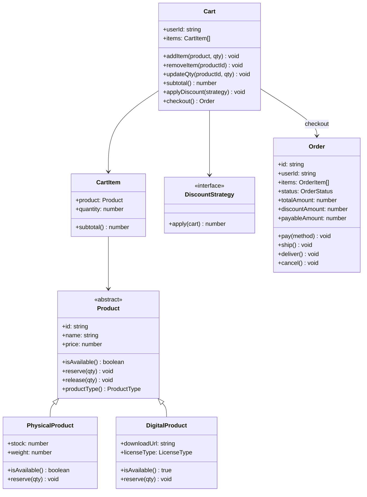
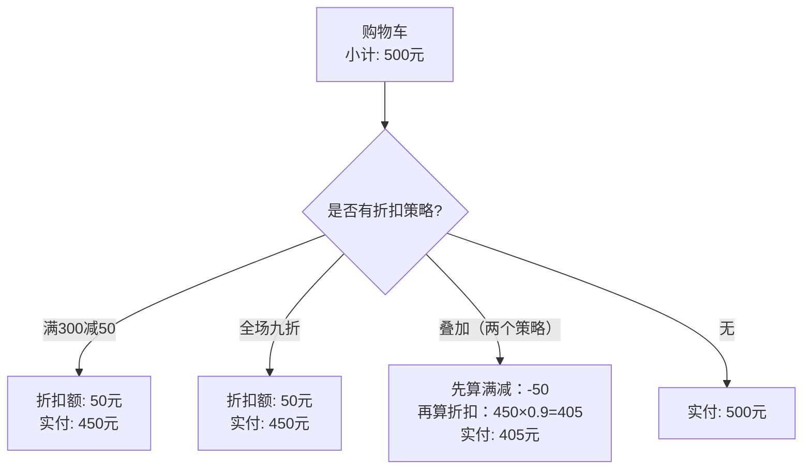

# OOD：购物车 / 电商系统（Shopping Cart）

## 核心考点

商品多态（实物 vs 虚拟商品）、折扣策略（Strategy）、Order 聚合根、库存防超卖。

---

## 类图



---

## 实现

```typescript
// ── 商品多态 ──────────────────────────────────────────
enum ProductType { PHYSICAL = 'PHYSICAL', DIGITAL = 'DIGITAL' }
enum LicenseType { SINGLE_USE = 'SINGLE_USE', SUBSCRIPTION = 'SUBSCRIPTION', PERPETUAL = 'PERPETUAL' }

abstract class Product {
  constructor(
    public readonly id:    string,
    public readonly name:  string,
    public readonly price: number  // 分
  ) {}

  abstract isAvailable(qty?: number): boolean;
  abstract reserve(qty: number): void;   // 锁定库存
  abstract release(qty: number): void;   // 释放库存
  abstract productType(): ProductType;
}

class PhysicalProduct extends Product {
  constructor(
    id: string, name: string, price: number,
    private stock: number,
    public readonly weight: number  // 克，用于运费计算
  ) { super(id, name, price); }

  productType() { return ProductType.PHYSICAL; }

  isAvailable(qty = 1): boolean { return this.stock >= qty; }

  reserve(qty: number): void {
    if (!this.isAvailable(qty)) throw new Error(`Insufficient stock for ${this.name}`);
    this.stock -= qty;
  }

  release(qty: number): void { this.stock += qty; }

  currentStock(): number { return this.stock; }
}

class DigitalProduct extends Product {
  constructor(
    id: string, name: string, price: number,
    public readonly downloadUrl: string,
    public readonly licenseType: LicenseType
  ) { super(id, name, price); }

  productType() { return ProductType.DIGITAL; }
  isAvailable(): true { return true; }  // 无库存限制
  reserve(): void {}   // 无需锁库存
  release(): void {}
}

// ── 折扣策略（Strategy） ────────────────────────────────
interface DiscountStrategy {
  apply(items: CartItem[]): number;  // 返回折扣金额（分）
  description(): string;
}

// 固定金额折扣（满300减50）
class ThresholdDiscount implements DiscountStrategy {
  constructor(
    private readonly threshold:  number,  // 起步金额（分）
    private readonly discountAmt: number  // 折扣金额（分）
  ) {}

  apply(items: CartItem[]): number {
    const subtotal = items.reduce((s, i) => s + i.subtotal(), 0);
    return subtotal >= this.threshold ? this.discountAmt : 0;
  }

  description(): string {
    return `满${this.threshold / 100}减${this.discountAmt / 100}`;
  }
}

// 百分比折扣（全场九折）
class PercentageDiscount implements DiscountStrategy {
  constructor(private readonly percent: number) {}  // 0.9 = 九折

  apply(items: CartItem[]): number {
    const subtotal = items.reduce((s, i) => s + i.subtotal(), 0);
    return Math.round(subtotal * (1 - this.percent));
  }

  description(): string { return `${Math.round((1 - this.percent) * 100)}% off`; }
}

// 指定商品折扣（某商品买一赠一）
class BuyOneGetOneDiscount implements DiscountStrategy {
  constructor(private readonly productId: string) {}

  apply(items: CartItem[]): number {
    const item = items.find(i => i.product.id === this.productId);
    if (!item || item.quantity < 2) return 0;
    return Math.floor(item.quantity / 2) * item.product.price;
  }

  description(): string { return `Buy 1 Get 1 Free on product ${this.productId}`; }
}

// ── 购物车条目 ─────────────────────────────────────────
class CartItem {
  constructor(
    public readonly product: Product,
    public quantity: number
  ) {}

  subtotal(): number { return this.product.price * this.quantity; }
}

// ── 购物车 ─────────────────────────────────────────────
class Cart {
  private items:           Map<string, CartItem> = new Map();
  private discountStrategy: DiscountStrategy | null = null;

  constructor(public readonly userId: string) {}

  addItem(product: Product, qty: number = 1): void {
    if (!product.isAvailable(qty)) throw new Error(`${product.name} out of stock`);
    const existing = this.items.get(product.id);
    if (existing) {
      existing.quantity += qty;
    } else {
      this.items.set(product.id, new CartItem(product, qty));
    }
  }

  removeItem(productId: string): void {
    this.items.delete(productId);
  }

  updateQty(productId: string, qty: number): void {
    const item = this.items.get(productId);
    if (!item) throw new Error(`Product ${productId} not in cart`);
    if (qty <= 0) { this.removeItem(productId); return; }
    if (!item.product.isAvailable(qty)) throw new Error('Insufficient stock');
    item.quantity = qty;
  }

  applyDiscount(strategy: DiscountStrategy): void {
    this.discountStrategy = strategy;
  }

  subtotal(): number {
    return [...this.items.values()].reduce((s, i) => s + i.subtotal(), 0);
  }

  discountAmount(): number {
    return this.discountStrategy
      ? this.discountStrategy.apply([...this.items.values()])
      : 0;
  }

  payableAmount(): number { return this.subtotal() - this.discountAmount(); }

  getItems(): CartItem[] { return [...this.items.values()]; }
  isEmpty(): boolean     { return this.items.size === 0; }
}

// ── 订单状态机 ─────────────────────────────────────────
enum OrderStatus {
  PENDING_PAYMENT = 'PENDING_PAYMENT',
  PAID            = 'PAID',
  PROCESSING      = 'PROCESSING',
  SHIPPED         = 'SHIPPED',
  DELIVERED       = 'DELIVERED',
  CANCELLED       = 'CANCELLED',
  REFUNDED        = 'REFUNDED',
}

class OrderItem {
  constructor(
    public readonly productId:   string,
    public readonly productName: string,
    public readonly price:       number,
    public readonly quantity:    number,
    public readonly productType: ProductType,
    public readonly downloadUrl?: string    // 仅数字商品
  ) {}

  subtotal(): number { return this.price * this.quantity; }
}

class Order {
  public status: OrderStatus = OrderStatus.PENDING_PAYMENT;

  constructor(
    public readonly id:             string,
    public readonly userId:         string,
    public readonly items:          OrderItem[],
    public readonly subtotal:       number,
    public readonly discountAmount: number
  ) {}

  get payableAmount(): number { return this.subtotal - this.discountAmount; }

  pay(): void {
    this.assert(OrderStatus.PENDING_PAYMENT);
    this.status = OrderStatus.PAID;
    // 实际：触发支付流程，成功后回调
  }

  process(): void { this.transition(OrderStatus.PAID, OrderStatus.PROCESSING); }
  ship():    void { this.transition(OrderStatus.PROCESSING, OrderStatus.SHIPPED); }
  deliver(): void { this.transition(OrderStatus.SHIPPED, OrderStatus.DELIVERED); }

  cancel(): void {
    const cancellable = [OrderStatus.PENDING_PAYMENT, OrderStatus.PAID];
    if (!cancellable.includes(this.status)) throw new Error('Cannot cancel');
    this.status = OrderStatus.CANCELLED;
  }

  private transition(from: OrderStatus, to: OrderStatus): void {
    this.assert(from);
    this.status = to;
  }

  private assert(expected: OrderStatus): void {
    if (this.status !== expected) throw new Error(`Expected ${expected}, got ${this.status}`);
  }
}

// ── 结账服务（Facade） ─────────────────────────────────
class CheckoutService {
  private idCounter = 0;

  checkout(cart: Cart): Order {
    if (cart.isEmpty()) throw new Error('Cart is empty');

    const cartItems = cart.getItems();

    // 1. 最终库存检查 + 锁定（防超卖）
    for (const item of cartItems) {
      if (!item.product.isAvailable(item.quantity)) {
        throw new Error(`${item.product.name} is out of stock`);
      }
    }
    // 2. 原子锁定库存（实际用 DB 事务或分布式锁）
    for (const item of cartItems) item.product.reserve(item.quantity);

    // 3. 创建订单
    const orderItems: OrderItem[] = cartItems.map(item => new OrderItem(
      item.product.id,
      item.product.name,
      item.product.price,
      item.quantity,
      item.product.productType(),
      item.product instanceof DigitalProduct ? item.product.downloadUrl : undefined
    ));

    const order = new Order(
      `ORD-${String(++this.idCounter).padStart(10, '0')}`,
      cart.userId,
      orderItems,
      cart.subtotal(),
      cart.discountAmount()
    );

    return order;
  }
}
```

---

## 折扣叠加流程



---

## 面试追问

**Q: 实物商品和数字商品的履约流程有何区别？**

实物：下单→支付→仓库拣货→物流→配送（有物流单号）  
数字：下单→支付→立即发送下载链接/激活码（无物流）  
订单状态机会不同：数字商品跳过 SHIPPED/DELIVERED，支付成功后直接 FULFILLED。

**Q: 如何处理部分商品下架导致的订单问题？**

下单时锁定商品快照（价格、名称）存入 `OrderItem`，而不是引用 `Product`。这样商品下架后历史订单不受影响，且价格不会因为商品调价而改变。

**Q: 购物车数据存在哪里？**

未登录用户：存在浏览器 localStorage（Cookie）  
已登录用户：存在 Redis（`cart:{userId}` → Hash，field=productId，value=qty），TTL=7天  
登录时合并：Cookie 购物车 merge 到 Redis 购物车（相同商品数量相加）
