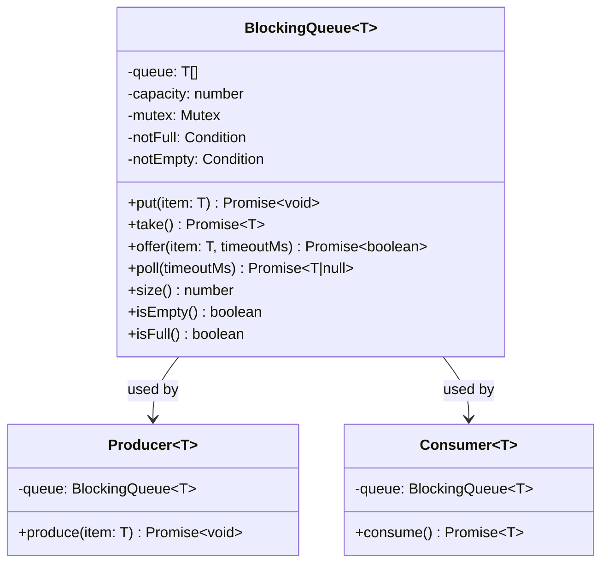
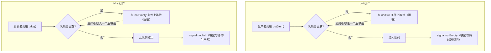

# OOD：线程安全阻塞队列（Blocking Queue）

## 核心考点

Producer-Consumer 模式、互斥锁、条件变量（等待/通知）、有界队列。这是并发编程的经典考题，即使在 TypeScript / Node.js 中（单线程，但可用于理解原理和面试讲解）。

---

## 类图



---

## Java / 多线程实现原理（面试讲解版）

```
核心数据结构：
  队列（数组或链表）+ 一把 ReentrantLock + 两个 Condition：
    notFull  → 生产者等待（队列满时）
    notEmpty → 消费者等待（队列空时）

put(item)：
  lock.lock()
  while (queue.size() == capacity) notFull.await()  // 等待有空位
  queue.add(item)
  notEmpty.signal()  // 通知消费者可以取了
  lock.unlock()

take()：
  lock.lock()
  while (queue.isEmpty()) notEmpty.await()  // 等待有数据
  item = queue.remove()
  notFull.signal()   // 通知生产者可以放了
  lock.unlock()
  return item
```

---

## TypeScript 实现（模拟 Mutex + Condition Variable）

```typescript
// Node.js 是单线程，这里用 Promise + 链式等待模拟多线程行为
// 面试中可以用这个版本展示理解，并说明真正多线程用 Java/Go 实现

class AsyncBlockingQueue<T> {
  private queue:    T[]                  = [];
  private waiters:  Array<() => void>    = [];  // 等待 take 的消费者
  private putters:  Array<() => void>    = [];  // 等待 put 的生产者

  constructor(private readonly capacity: number) {
    if (capacity <= 0) throw new Error('Capacity must be positive');
  }

  // 阻塞式放入：队列满时等待
  async put(item: T): Promise<void> {
    while (this.isFull()) {
      await new Promise<void>(resolve => this.putters.push(resolve));
    }
    this.queue.push(item);
    // 通知一个等待中的消费者
    const waiter = this.waiters.shift();
    waiter?.();
  }

  // 阻塞式取出：队列空时等待
  async take(): Promise<T> {
    while (this.isEmpty()) {
      await new Promise<void>(resolve => this.waiters.push(resolve));
    }
    const item = this.queue.shift()!;
    // 通知一个等待中的生产者
    const putter = this.putters.shift();
    putter?.();
    return item;
  }

  // 非阻塞放入（队列满则返回 false）
  offer(item: T): boolean {
    if (this.isFull()) return false;
    this.queue.push(item);
    const waiter = this.waiters.shift();
    waiter?.();
    return true;
  }

  // 带超时的放入
  async offerWithTimeout(item: T, timeoutMs: number): Promise<boolean> {
    if (!this.isFull()) {
      return this.offer(item);
    }
    return new Promise<boolean>(resolve => {
      const timer   = setTimeout(() => {
        const idx = this.putters.indexOf(callback);
        if (idx >= 0) this.putters.splice(idx, 1);
        resolve(false);
      }, timeoutMs);

      const callback = () => {
        clearTimeout(timer);
        this.queue.push(item);
        const waiter = this.waiters.shift();
        waiter?.();
        resolve(true);
      };
      this.putters.push(callback);
    });
  }

  // 带超时的取出
  async pollWithTimeout(timeoutMs: number): Promise<T | null> {
    if (!this.isEmpty()) {
      return this.take();
    }
    return new Promise<T | null>(resolve => {
      const timer   = setTimeout(() => {
        const idx = this.waiters.indexOf(callback);
        if (idx >= 0) this.waiters.splice(idx, 1);
        resolve(null);
      }, timeoutMs);

      const callback = () => {
        clearTimeout(timer);
        const item = this.queue.shift()!;
        const putter = this.putters.shift();
        putter?.();
        resolve(item);
      };
      this.waiters.push(callback);
    });
  }

  size():    number  { return this.queue.length; }
  isEmpty(): boolean { return this.queue.length === 0; }
  isFull():  boolean { return this.queue.length >= this.capacity; }
}
```

---

## 使用示例（Producer-Consumer 模式）

```typescript
async function demo(): Promise<void> {
  const queue = new AsyncBlockingQueue<number>(5);

  // 生产者：每 100ms 放一个数
  const producer = async () => {
    for (let i = 1; i <= 20; i++) {
      await queue.put(i);
      console.log(`Produced: ${i}, Queue size: ${queue.size()}`);
      await sleep(100);
    }
  };

  // 消费者：每 300ms 取一个数（比生产慢，队列会慢慢填满后生产者阻塞）
  const consumer = async () => {
    for (let i = 0; i < 20; i++) {
      const item = await queue.take();
      console.log(`Consumed: ${item}, Queue size: ${queue.size()}`);
      await sleep(300);
    }
  };

  // 并发运行
  await Promise.all([producer(), consumer()]);
}

const sleep = (ms: number) => new Promise(r => setTimeout(r, ms));
```

---

## Java 多线程版本（面试中要能写出）

```java
public class BoundedBlockingQueue<T> {
    private final Queue<T>         queue    = new LinkedList<>();
    private final int              capacity;
    private final ReentrantLock    lock     = new ReentrantLock();
    private final Condition        notFull  = lock.newCondition();
    private final Condition        notEmpty = lock.newCondition();

    public BoundedBlockingQueue(int capacity) { this.capacity = capacity; }

    public void put(T item) throws InterruptedException {
        lock.lock();
        try {
            while (queue.size() == capacity) notFull.await(); // 队列满，等待
            queue.add(item);
            notEmpty.signal(); // 通知消费者
        } finally {
            lock.unlock();
        }
    }

    public T take() throws InterruptedException {
        lock.lock();
        try {
            while (queue.isEmpty()) notEmpty.await(); // 队列空，等待
            T item = queue.poll();
            notFull.signal(); // 通知生产者
            return item;
        } finally {
            lock.unlock();
        }
    }

    public int size() {
        lock.lock();
        try { return queue.size(); }
        finally { lock.unlock(); }
    }
}
```

---

## 核心流程图



---

## 面试追问

**Q: 为什么要用 `while` 而不是 `if` 检查条件？**

"虚假唤醒"（Spurious Wakeup）：线程可能在没有被 `signal` 的情况下醒来。用 `while` 确保醒来后重新检查条件是否真的满足，而 `if` 只检查一次，可能导致数据竞争。

**Q: `signal` 和 `signalAll` 有什么区别？**

`signal`：只唤醒一个等待线程，效率高，适合"每次只能进一个"的场景（如 BlockingQueue）。  
`signalAll`：唤醒所有等待线程，每个线程重新竞争锁，适合"条件变化后所有等待者都需要检查"的场景。

**Q: 和 Java 的 `ArrayBlockingQueue` 有什么区别？**

`ArrayBlockingQueue`：公平锁（FIFO 分配），底层数组（固定容量，不扩容）。  
`LinkedBlockingQueue`：非公平锁，底层链表，可以指定容量（默认 `Integer.MAX_VALUE`），put/take 用两把锁（分别锁头尾），并发度更高。
