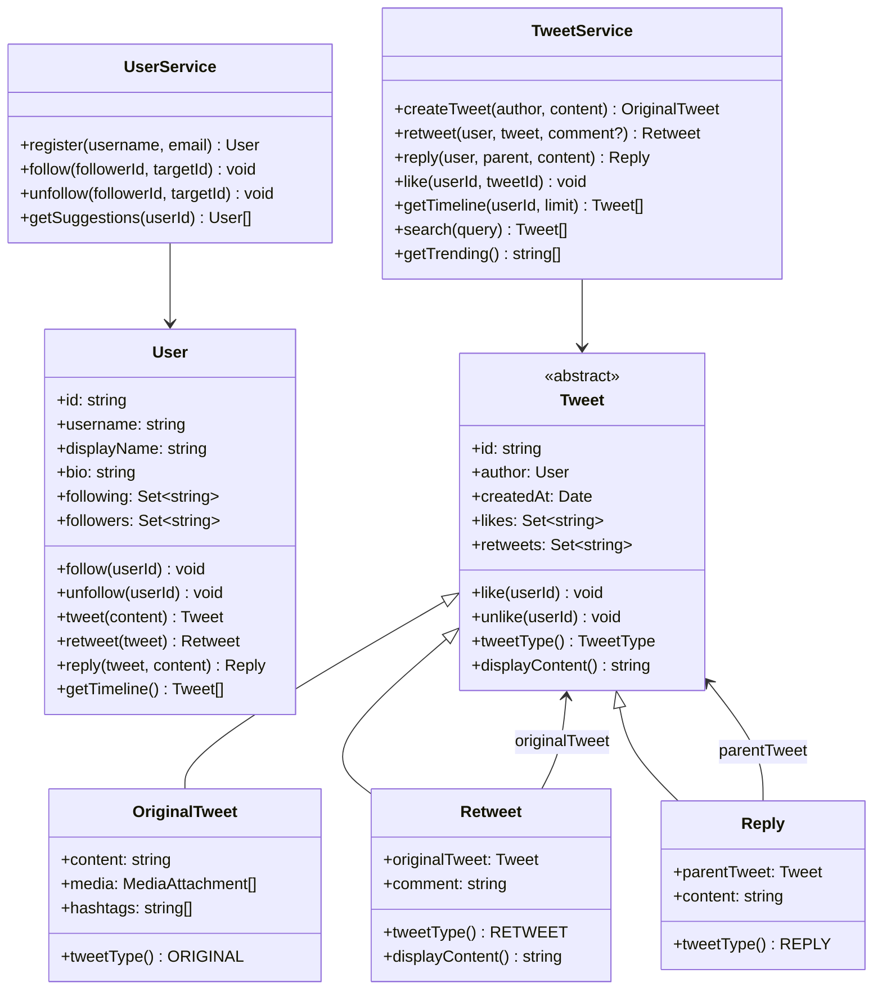

# OOD：设计 Twitter（简化版）

## 核心考点

Follow 关系图（有向图）、Timeline 生成（推 vs 拉）、Tweet 多态（普通/转推/回复）、User 聚合根。注意：这是 **OOD 层面**的设计（类和接口），不是系统设计层面的分布式架构。

---

## 类图



---

## 实现

```typescript
// ── 媒体附件 ──────────────────────────────────────────
enum MediaType { IMAGE = 'IMAGE', VIDEO = 'VIDEO', GIF = 'GIF' }

class MediaAttachment {
  constructor(
    public readonly url:       string,
    public readonly mediaType: MediaType,
    public readonly altText:   string = ''
  ) {}
}

// ── 推文（多态） ────────────────────────────────────────
enum TweetType { ORIGINAL = 'ORIGINAL', RETWEET = 'RETWEET', REPLY = 'REPLY' }

abstract class Tweet {
  public readonly likes:    Set<string> = new Set(); // userId
  public readonly retweets: Set<string> = new Set();
  public readonly replies:  Tweet[]     = [];

  constructor(
    public readonly id:        string,
    public readonly author:    User,
    public readonly createdAt: Date = new Date()
  ) {}

  abstract tweetType(): TweetType;
  abstract displayContent(): string;

  like(userId: string):   void { this.likes.add(userId); }
  unlike(userId: string): void { this.likes.delete(userId); }

  likeCount():    number { return this.likes.size; }
  retweetCount(): number { return this.retweets.size; }

  addReply(reply: Tweet): void { this.replies.push(reply); }
}

class OriginalTweet extends Tweet {
  public readonly hashtags: string[];

  constructor(
    id: string,
    author: User,
    public readonly content: string,
    public readonly media: MediaAttachment[] = []
  ) {
    super(id, author);
    // 解析 hashtag
    this.hashtags = (content.match(/#\w+/g) ?? []).map(h => h.toLowerCase());
  }

  tweetType()      { return TweetType.ORIGINAL; }
  displayContent() { return this.content; }
}

class Retweet extends Tweet {
  constructor(
    id: string,
    author: User,
    public readonly originalTweet: Tweet,
    public readonly comment: string = ''  // 带评论的转发（Quote Tweet）
  ) { super(id, author); }

  tweetType()      { return TweetType.RETWEET; }
  displayContent() {
    const header = this.comment ? `${this.comment}\n` : '';
    return `${header}RT @${this.originalTweet.author.username}: ${this.originalTweet.displayContent()}`;
  }
}

class Reply extends Tweet {
  constructor(
    id: string,
    author: User,
    public readonly parentTweet: Tweet,
    public readonly content: string
  ) {
    super(id, author);
    parentTweet.addReply(this);
  }

  tweetType()      { return TweetType.REPLY; }
  displayContent() {
    return `@${this.parentTweet.author.username} ${this.content}`;
  }
}

// ── 用户 ──────────────────────────────────────────────
class User {
  public readonly following: Set<string> = new Set(); // userId
  public readonly followers: Set<string> = new Set();
  public bio: string = '';

  constructor(
    public readonly id:          string,
    public readonly username:    string,
    public readonly displayName: string,
    public readonly email:       string,
    public readonly createdAt:   Date = new Date()
  ) {}

  follow(userId: string): void {
    if (userId === this.id) throw new Error('Cannot follow yourself');
    this.following.add(userId);
  }

  unfollow(userId: string): void { this.following.delete(userId); }

  isFollowing(userId: string): boolean { return this.following.has(userId); }

  followingCount(): number { return this.following.size; }
  followerCount():  number { return this.followers.size; }
}

// ── Timeline 策略（拉模式简化实现） ─────────────────────
class TimelineFeed {
  // 拉取时从被关注者的推文中合并
  getTimeline(user: User, allTweets: Tweet[], limit = 20): Tweet[] {
    return allTweets
      .filter(t =>
        user.isFollowing(t.author.id) || t.author.id === user.id
      )
      .sort((a, b) => b.createdAt.getTime() - a.createdAt.getTime())
      .slice(0, limit);
  }
}

// ── TweetService（Facade） ─────────────────────────────
class TweetService {
  private tweets:   Map<string, Tweet> = new Map();
  private idCounter = 0;
  private timeline  = new TimelineFeed();

  private nextId(): string { return `tweet-${++this.idCounter}`; }

  createTweet(author: User, content: string, media: MediaAttachment[] = []): OriginalTweet {
    if (content.length > 280) throw new Error('Tweet exceeds 280 characters');
    const tweet = new OriginalTweet(this.nextId(), author, content, media);
    this.tweets.set(tweet.id, tweet);
    return tweet;
  }

  retweet(user: User, tweetId: string, comment = ''): Retweet {
    const original = this.getTweet(tweetId);
    const rt = new Retweet(this.nextId(), user, original, comment);
    original.retweets.add(user.id);
    this.tweets.set(rt.id, rt);
    return rt;
  }

  reply(user: User, parentId: string, content: string): Reply {
    const parent = this.getTweet(parentId);
    const reply  = new Reply(this.nextId(), user, parent, content);
    this.tweets.set(reply.id, reply);
    return reply;
  }

  like(userId: string, tweetId: string): void {
    this.getTweet(tweetId).like(userId);
  }

  getTimeline(user: User, limit = 20): Tweet[] {
    return this.timeline.getTimeline(user, [...this.tweets.values()], limit);
  }

  // 简单全文搜索（面试时可以提升为倒排索引）
  search(query: string): Tweet[] {
    const q = query.toLowerCase();
    return [...this.tweets.values()].filter(t =>
      t.displayContent().toLowerCase().includes(q)
    );
  }

  // Trending hashtags（最近24h出现次数最多的5个）
  getTrending(): Array<{ tag: string; count: number }> {
    const cutoff = new Date(Date.now() - 24 * 60 * 60 * 1000);
    const counts  = new Map<string, number>();

    for (const tweet of this.tweets.values()) {
      if (tweet.createdAt < cutoff) continue;
      if (tweet instanceof OriginalTweet) {
        for (const tag of tweet.hashtags) {
          counts.set(tag, (counts.get(tag) ?? 0) + 1);
        }
      }
    }

    return [...counts.entries()]
      .map(([tag, count]) => ({ tag, count }))
      .sort((a, b) => b.count - a.count)
      .slice(0, 5);
  }

  private getTweet(id: string): Tweet {
    const t = this.tweets.get(id);
    if (!t) throw new Error(`Tweet ${id} not found`);
    return t;
  }
}

// ── UserService ────────────────────────────────────────
class UserService {
  private users:     Map<string, User> = new Map();
  private byUsername: Map<string, User> = new Map();
  private idCounter = 0;

  register(username: string, email: string, displayName: string): User {
    if (this.byUsername.has(username)) throw new Error('Username taken');
    const user = new User(`user-${++this.idCounter}`, username, displayName, email);
    this.users.set(user.id, user);
    this.byUsername.set(username, user);
    return user;
  }

  follow(followerId: string, targetId: string): void {
    const follower = this.getUser(followerId);
    const target   = this.getUser(targetId);
    follower.follow(targetId);
    target.followers.add(followerId);
  }

  unfollow(followerId: string, targetId: string): void {
    const follower = this.getUser(followerId);
    const target   = this.getUser(targetId);
    follower.unfollow(targetId);
    target.followers.delete(followerId);
  }

  // 推荐关注（关注你关注的人也关注的人）
  getSuggestions(userId: string, limit = 5): User[] {
    const user      = this.getUser(userId);
    const candidates = new Map<string, number>(); // userId → mutual count

    for (const followingId of user.following) {
      const followingUser = this.users.get(followingId);
      if (!followingUser) continue;
      for (const theirFollowingId of followingUser.following) {
        if (theirFollowingId === userId) continue;
        if (user.isFollowing(theirFollowingId)) continue;
        candidates.set(theirFollowingId, (candidates.get(theirFollowingId) ?? 0) + 1);
      }
    }

    return [...candidates.entries()]
      .sort((a, b) => b[1] - a[1])
      .slice(0, limit)
      .map(([uid]) => this.users.get(uid)!)
      .filter(Boolean);
  }

  getUser(id: string): User {
    const u = this.users.get(id);
    if (!u) throw new Error(`User ${id} not found`);
    return u;
  }
}
```

---

## Timeline 推拉模式对比

```mermaid
flowchart LR
    subgraph 拉模式（Fan-out on Read）
        Read["查看 Timeline\n（用户 A）"] --> Fetch["从 A 关注的所有人\n各取最新推文"]
        Fetch --> Merge["合并排序\n取最新 N 条"]
        Note1["✅ 写入简单（只写自己）\n❌ 读时慢（关注1000人→1000次查询）"]
    end
    
    subgraph 推模式（Fan-out on Write）
        Write["用户 B 发推文"] --> Push["写入所有关注者的\n个人 Timeline 缓存"]
        Push --> Store["A 的 Timeline 缓存\nalready has B's tweet"]
        Note2["✅ 读取快（O(1)）\n❌ 大 V 发推文→扇出巨大\n（1亿粉丝→写1亿次）"]
    end
```

---

## 面试追问

**Q: 大 V（千万粉丝）发推文，推模式下如何避免巨量写入？**

混合模式：普通用户用推模式（写入粉丝 Timeline），大 V 用拉模式（读 Timeline 时实时拉取大 V 最新推文）。阈值一般是粉丝数 > 100 万切换到拉模式。

**Q: 如何实现 "已读到哪里" 的游标翻页？**

Timeline 用 `cursor`（最后一条 tweet 的 ID 或时间戳）替代 `page`，避免深分页问题（`OFFSET N` 性能差）。下次请求传入 cursor，查询 `createdAt < cursor` 的数据。

**Q: 转推和引用转发（Quote Tweet）有什么区别？**

转推（Retweet）：直接分享，无额外评论，`comment = ""`  
引用转发（Quote Tweet）：附带自己的评论，`comment = "我的评论"` + 显示原推内容。两者在 `Retweet` 类中用 `comment` 字段区分。
