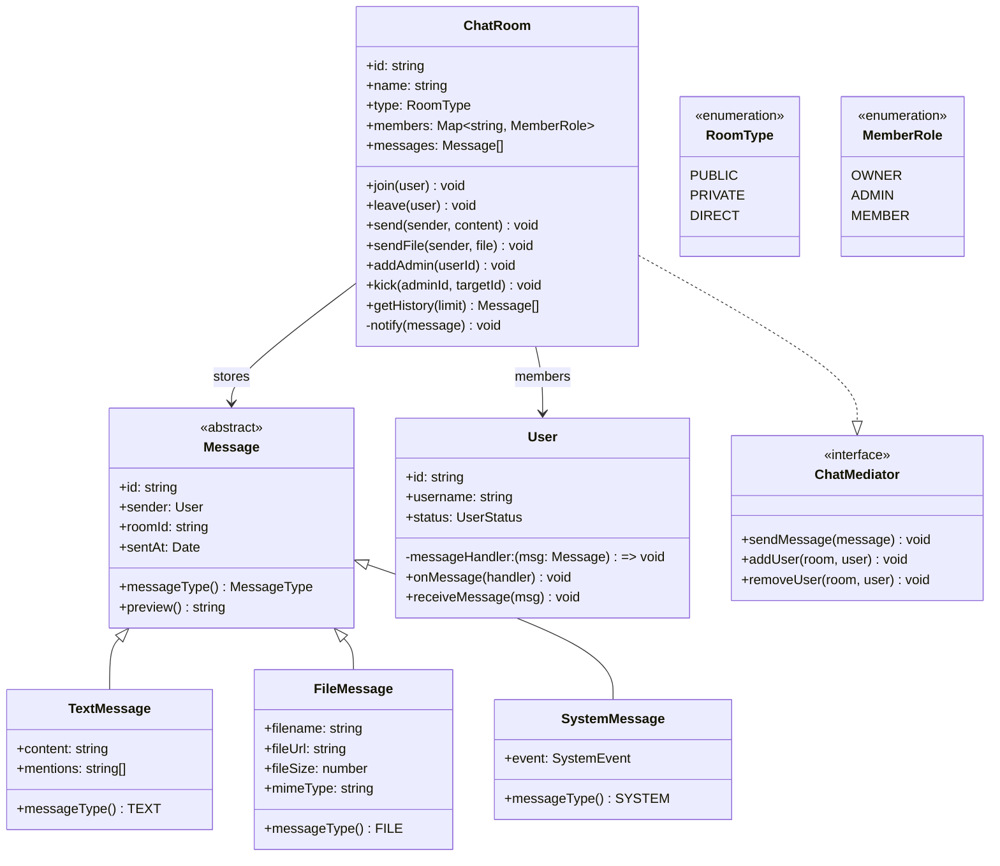
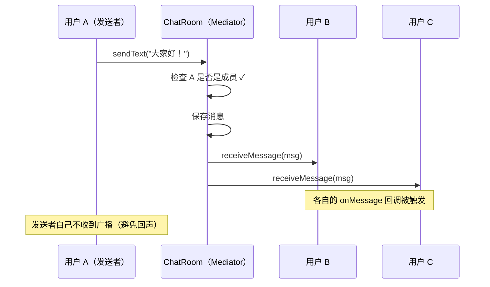

# OOD：聊天室（Chat Room）

## 核心考点

**Mediator 模式**（ChatRoom 作为中介，用户不直接通信）+ **Observer 模式**（用户订阅房间消息）、消息类型多态、用户权限（房主 / 管理员 / 普通成员）。

---

## 类图



---

## 实现

```typescript
// ── 枚举 ─────────────────────────────────────────────
enum RoomType   { PUBLIC = 'PUBLIC', PRIVATE = 'PRIVATE', DIRECT = 'DIRECT' }
enum MemberRole { OWNER = 'OWNER', ADMIN = 'ADMIN', MEMBER = 'MEMBER' }
enum UserStatus { ONLINE = 'ONLINE', AWAY = 'AWAY', OFFLINE = 'OFFLINE' }
enum MessageType { TEXT = 'TEXT', FILE = 'FILE', SYSTEM = 'SYSTEM' }
enum SystemEvent {
  USER_JOINED   = 'USER_JOINED',
  USER_LEFT     = 'USER_LEFT',
  USER_KICKED   = 'USER_KICKED',
  ROLE_CHANGED  = 'ROLE_CHANGED',
}

// ── 消息多态 ─────────────────────────────────────────
let msgIdCounter = 0;

abstract class Message {
  public readonly id:     string;
  public readonly sentAt: Date = new Date();

  constructor(
    public readonly sender: User,
    public readonly roomId: string
  ) {
    this.id = `msg-${++msgIdCounter}`;
  }

  abstract messageType(): MessageType;
  abstract preview(): string;  // 用于通知推送的消息预览
}

class TextMessage extends Message {
  public readonly mentions: string[]; // @username 列表

  constructor(sender: User, roomId: string, public readonly content: string) {
    super(sender, roomId);
    this.mentions = (content.match(/@\w+/g) ?? []).map(m => m.slice(1));
  }

  messageType() { return MessageType.TEXT; }
  preview()     { return this.content.slice(0, 50) + (this.content.length > 50 ? '...' : ''); }
}

class FileMessage extends Message {
  constructor(
    sender: User, roomId: string,
    public readonly filename: string,
    public readonly fileUrl:  string,
    public readonly fileSize: number,  // bytes
    public readonly mimeType: string
  ) { super(sender, roomId); }

  messageType() { return MessageType.FILE; }
  preview()     {
    const kb = Math.round(this.fileSize / 1024);
    return `[文件] ${this.filename} (${kb}KB)`;
  }
}

class SystemMessage extends Message {
  constructor(
    roomId: string,
    public readonly event:   SystemEvent,
    public readonly payload: string   // 描述，如"Alice 加入了房间"
  ) {
    // 系统消息没有真正的发送者，用 null object 模拟
    super({ id: 'system', username: 'System', status: UserStatus.ONLINE } as any, roomId);
  }

  messageType() { return MessageType.SYSTEM; }
  preview()     { return this.payload; }
}

// ── 用户（Observer 角色） ─────────────────────────────
class User {
  public status: UserStatus = UserStatus.ONLINE;
  private messageHandler: ((msg: Message) => void) | null = null;

  constructor(
    public readonly id:       string,
    public readonly username: string
  ) {}

  // 注册消息接收回调（Observer 回调）
  onMessage(handler: (msg: Message) => void): void {
    this.messageHandler = handler;
  }

  // 由 ChatRoom 调用（分发通知）
  receiveMessage(msg: Message): void {
    if (this.status === UserStatus.OFFLINE) return;
    this.messageHandler?.(msg);
  }
}

// ── 聊天室（Mediator） ────────────────────────────────
interface ChatMediator {
  sendMessage(message: Message): void;
  addUser(user: User, role?: MemberRole): void;
  removeUser(userId: string): void;
}

class ChatRoom implements ChatMediator {
  private members:  Map<string, MemberRole> = new Map(); // userId → role
  private users:    Map<string, User>       = new Map(); // userId → User
  private messages: Message[] = [];
  private readonly MAX_HISTORY = 1000;

  constructor(
    public readonly id:   string,
    public readonly name: string,
    public readonly type: RoomType,
    owner: User
  ) {
    this.addUser(owner, MemberRole.OWNER);
  }

  addUser(user: User, role: MemberRole = MemberRole.MEMBER): void {
    if (this.members.has(user.id)) return; // 已在房间内

    this.members.set(user.id, role);
    this.users.set(user.id, user);

    const sysMsg = new SystemMessage(
      this.id, SystemEvent.USER_JOINED, `${user.username} 加入了房间`
    );
    this.broadcast(sysMsg);
    this.messages.push(sysMsg);
  }

  removeUser(userId: string): void {
    const user = this.users.get(userId);
    if (!user || !this.members.has(userId)) return;

    this.members.delete(userId);
    this.users.delete(userId);

    const sysMsg = new SystemMessage(
      this.id, SystemEvent.USER_LEFT, `${user.username} 离开了房间`
    );
    this.broadcast(sysMsg);
    this.messages.push(sysMsg);
  }

  sendMessage(message: Message): void {
    if (!this.members.has(message.sender.id)) {
      throw new Error('Sender is not a member of this room');
    }
    this.messages.push(message);
    if (this.messages.length > this.MAX_HISTORY) {
      this.messages.shift(); // 简单环形缓冲（生产中用 DB + 分页）
    }
    this.broadcast(message);
  }

  // 快捷方法：发文本消息
  sendText(sender: User, content: string): TextMessage {
    const msg = new TextMessage(sender, this.id, content);
    this.sendMessage(msg);
    return msg;
  }

  // 快捷方法：发文件
  sendFile(sender: User, filename: string, url: string, size: number, mime: string): FileMessage {
    const msg = new FileMessage(sender, this.id, filename, url, size, mime);
    this.sendMessage(msg);
    return msg;
  }

  // 管理员踢人
  kick(adminId: string, targetId: string): void {
    const adminRole = this.members.get(adminId);
    if (!adminRole || adminRole === MemberRole.MEMBER) {
      throw new Error('Insufficient permissions to kick');
    }
    const targetRole = this.members.get(targetId);
    if (targetRole === MemberRole.OWNER) throw new Error('Cannot kick the owner');

    const target = this.users.get(targetId);
    this.members.delete(targetId);
    this.users.delete(targetId);

    const sysMsg = new SystemMessage(
      this.id, SystemEvent.USER_KICKED, `${target?.username ?? targetId} 被移出房间`
    );
    this.broadcast(sysMsg);
    this.messages.push(sysMsg);
  }

  // 提升为管理员
  addAdmin(ownerId: string, targetId: string): void {
    if (this.members.get(ownerId) !== MemberRole.OWNER) throw new Error('Only owner can add admins');
    if (!this.members.has(targetId)) throw new Error('User not in room');
    this.members.set(targetId, MemberRole.ADMIN);
  }

  getHistory(limit = 50): Message[] {
    return this.messages.slice(-limit);
  }

  memberCount(): number { return this.members.size; }

  getRole(userId: string): MemberRole | null {
    return this.members.get(userId) ?? null;
  }

  // Mediator 核心：向所有成员广播（不包括发送者）
  private broadcast(message: Message): void {
    for (const [userId, user] of this.users) {
      if (userId !== message.sender.id) {
        user.receiveMessage(message);
      }
    }
  }
}

// ── 聊天服务（全局协调） ──────────────────────────────
class ChatService {
  private rooms: Map<string, ChatRoom> = new Map();
  private idCounter = 0;

  createRoom(name: string, type: RoomType, owner: User): ChatRoom {
    const room = new ChatRoom(`room-${++this.idCounter}`, name, type, owner);
    this.rooms.set(room.id, room);
    return room;
  }

  // 私聊（Direct Message）：两人间唯一的 DIRECT 房间
  getOrCreateDM(userA: User, userB: User): ChatRoom {
    const dmKey = [userA.id, userB.id].sort().join(':');
    if (!this.rooms.has(dmKey)) {
      const room = new ChatRoom(dmKey, `DM:${userA.username}↔${userB.username}`, RoomType.DIRECT, userA);
      room.addUser(userB);
      this.rooms.set(dmKey, room);
    }
    return this.rooms.get(dmKey)!;
  }

  getRoom(id: string): ChatRoom | null { return this.rooms.get(id) ?? null; }
}
```

---

## 消息广播流程



---

## 面试追问

**Q: Mediator 模式解决了什么问题？**

没有 Mediator 时，用户 A 要发消息给房间里所有人，需要持有所有用户的引用（N 对 N 耦合）。ChatRoom 作为中介后，每个用户只和 ChatRoom 通信（N 对 1），耦合度大幅降低。

**Q: 如何支持消息已读回执？**

在 `Message` 上增加 `readBy: Map<string, Date>`，成员读取历史消息后调用 `markRead(userId)`。UI 根据 `readBy.size` 显示已读人数或已读/未读状态。

**Q: 如何实现消息撤回（5分钟内可撤）？**

`TextMessage` 增加 `isRevoked: boolean` 和 `revokedAt: Date`，撤回接口检查时间差，超过 5 分钟抛错。广播一条 SYSTEM 类型的 "消息已撤回" 通知，前端将对应消息替换为灰色"此消息已撤回"。
