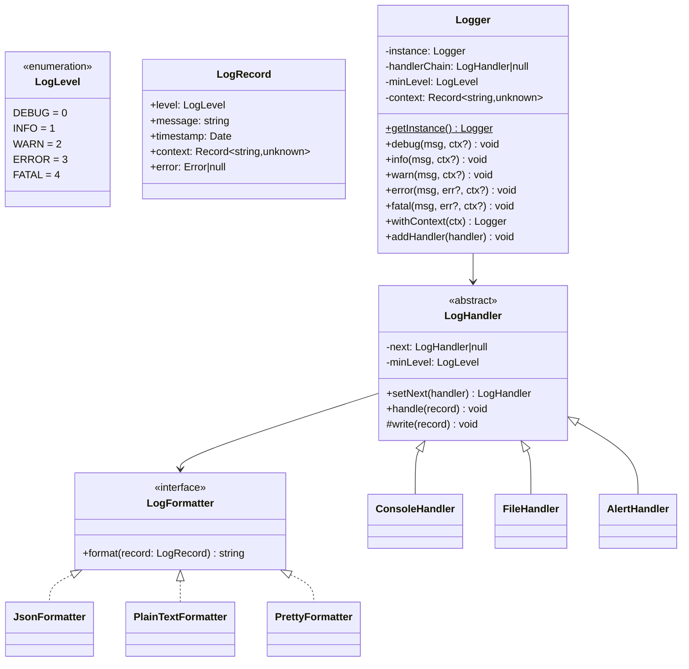
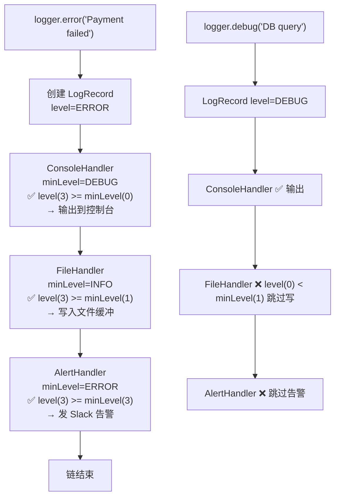

# OOD：日志聚合器（Logger）

## 核心考点

**Singleton**（全局唯一 Logger 实例）+ **责任链（Chain of Responsibility）**（不同 Level 的 Handler 链式处理）+ **策略模式**（格式化输出 JSON / Plain Text）。

---

## 类图



---

## 实现

```typescript
// ── 日志等级 ──────────────────────────────────────────
enum LogLevel { DEBUG = 0, INFO = 1, WARN = 2, ERROR = 3, FATAL = 4 }

const LEVEL_NAMES: Record<LogLevel, string> = {
  [LogLevel.DEBUG]: 'DEBUG',
  [LogLevel.INFO]:  'INFO',
  [LogLevel.WARN]:  'WARN',
  [LogLevel.ERROR]: 'ERROR',
  [LogLevel.FATAL]: 'FATAL',
};

// ── 日志记录 ─────────────────────────────────────────
interface LogRecord {
  level:     LogLevel;
  message:   string;
  timestamp: Date;
  context:   Record<string, unknown>;
  error:     Error | null;
}

// ── 格式化器（Strategy） ──────────────────────────────
interface LogFormatter {
  format(record: LogRecord): string;
}

class JsonFormatter implements LogFormatter {
  format(r: LogRecord): string {
    return JSON.stringify({
      timestamp: r.timestamp.toISOString(),
      level:     LEVEL_NAMES[r.level],
      message:   r.message,
      ...r.context,
      ...(r.error ? { error: { name: r.error.name, message: r.error.message, stack: r.error.stack } } : {}),
    });
  }
}

class PlainTextFormatter implements LogFormatter {
  format(r: LogRecord): string {
    const ts      = r.timestamp.toISOString();
    const level   = LEVEL_NAMES[r.level].padEnd(5);
    const ctx     = Object.keys(r.context).length
      ? ' | ' + JSON.stringify(r.context)
      : '';
    const errPart = r.error ? ` | Error: ${r.error.message}` : '';
    return `[${ts}] ${level} ${r.message}${ctx}${errPart}`;
  }
}

class PrettyFormatter implements LogFormatter {
  private colors: Record<LogLevel, string> = {
    [LogLevel.DEBUG]: '\x1b[37m', // white
    [LogLevel.INFO]:  '\x1b[32m', // green
    [LogLevel.WARN]:  '\x1b[33m', // yellow
    [LogLevel.ERROR]: '\x1b[31m', // red
    [LogLevel.FATAL]: '\x1b[35m', // magenta
  };
  private reset = '\x1b[0m';

  format(r: LogRecord): string {
    const color = this.colors[r.level];
    const time  = r.timestamp.toTimeString().slice(0, 8);
    return `${color}[${time}] [${LEVEL_NAMES[r.level]}]${this.reset} ${r.message}`;
  }
}

// ── Handler 链（责任链） ──────────────────────────────
abstract class LogHandler {
  private next: LogHandler | null = null;

  constructor(
    protected readonly minLevel:   LogLevel,
    protected readonly formatter:  LogFormatter
  ) {}

  // 链式设置下一个 handler
  setNext(handler: LogHandler): LogHandler {
    this.next = handler;
    return handler; // 支持链式调用
  }

  handle(record: LogRecord): void {
    if (record.level >= this.minLevel) {
      this.write(record);
    }
    // 无论是否处理，都传递给下一个 handler
    this.next?.handle(record);
  }

  protected abstract write(record: LogRecord): void;
}

class ConsoleHandler extends LogHandler {
  protected write(record: LogRecord): void {
    const output = this.formatter.format(record);
    if (record.level >= LogLevel.ERROR) {
      console.error(output);
    } else if (record.level >= LogLevel.WARN) {
      console.warn(output);
    } else {
      console.log(output);
    }
  }
}

class FileHandler extends LogHandler {
  private buffer: string[] = [];

  constructor(
    minLevel: LogLevel,
    formatter: LogFormatter,
    private readonly filePath: string,
    private readonly flushIntervalMs = 1000
  ) {
    super(minLevel, formatter);
    // 定期刷盘
    setInterval(() => this.flush(), this.flushIntervalMs);
  }

  protected write(record: LogRecord): void {
    this.buffer.push(this.formatter.format(record));
    if (this.buffer.length >= 100) this.flush(); // 批量写
  }

  private flush(): void {
    if (this.buffer.length === 0) return;
    const content = this.buffer.join('\n') + '\n';
    this.buffer = [];
    // 实际用 fs.appendFileSync(this.filePath, content)
    // 这里打印模拟
    process.stdout.write(`[FileHandler → ${this.filePath}] ${content}`);
  }
}

class AlertHandler extends LogHandler {
  constructor(
    minLevel: LogLevel,
    formatter: LogFormatter,
    private readonly webhookUrl: string
  ) { super(minLevel, formatter); }

  protected write(record: LogRecord): void {
    // 发送告警（Slack / PagerDuty）
    const payload = this.formatter.format(record);
    console.log(`[ALERT → ${this.webhookUrl}] ${payload}`);
    // 实际：fetch(this.webhookUrl, { method: 'POST', body: payload })
  }
}

// ── Logger（Singleton） ───────────────────────────────
class Logger {
  private static instance: Logger | null = null;
  private handlerChain:    LogHandler | null = null;
  private globalContext:   Record<string, unknown> = {};
  private currentMinLevel: LogLevel = LogLevel.DEBUG;

  // 私有构造函数（Singleton）
  private constructor() {}

  static getInstance(): Logger {
    if (!Logger.instance) Logger.instance = new Logger();
    return Logger.instance;
  }

  // 仅用于测试（重置单例）
  static resetForTesting(): void { Logger.instance = null; }

  setMinLevel(level: LogLevel): this {
    this.currentMinLevel = level;
    return this;
  }

  // 添加 handler 到链尾
  addHandler(handler: LogHandler): this {
    if (!this.handlerChain) {
      this.handlerChain = handler;
    } else {
      let curr = this.handlerChain;
      // 找到链尾
      while ((curr as any).next) curr = (curr as any).next;
      curr.setNext(handler);
    }
    return this;
  }

  // 创建携带附加上下文的子 Logger（不影响全局）
  withContext(ctx: Record<string, unknown>): ChildLogger {
    return new ChildLogger(this, { ...this.globalContext, ...ctx });
  }

  addGlobalContext(ctx: Record<string, unknown>): this {
    Object.assign(this.globalContext, ctx);
    return this;
  }

  debug(message: string, context?: Record<string, unknown>): void {
    this.log(LogLevel.DEBUG, message, null, context);
  }

  info(message: string, context?: Record<string, unknown>): void {
    this.log(LogLevel.INFO, message, null, context);
  }

  warn(message: string, context?: Record<string, unknown>): void {
    this.log(LogLevel.WARN, message, null, context);
  }

  error(message: string, error?: Error | null, context?: Record<string, unknown>): void {
    this.log(LogLevel.ERROR, message, error ?? null, context);
  }

  fatal(message: string, error?: Error | null, context?: Record<string, unknown>): void {
    this.log(LogLevel.FATAL, message, error ?? null, context);
  }

  log(
    level:    LogLevel,
    message:  string,
    error:    Error | null = null,
    context:  Record<string, unknown> = {}
  ): void {
    if (level < this.currentMinLevel) return;

    const record: LogRecord = {
      level,
      message,
      timestamp: new Date(),
      context:   { ...this.globalContext, ...context },
      error,
    };

    this.handlerChain?.handle(record);
  }
}

// ── 子 Logger（继承上下文，不是 Singleton） ────────────
class ChildLogger {
  constructor(
    private readonly parent: Logger,
    private readonly context: Record<string, unknown>
  ) {}

  debug(msg: string, ctx?: Record<string, unknown>): void {
    this.parent.log(LogLevel.DEBUG, msg, null, { ...this.context, ...ctx });
  }
  info(msg: string, ctx?: Record<string, unknown>): void {
    this.parent.log(LogLevel.INFO, msg, null, { ...this.context, ...ctx });
  }
  warn(msg: string, ctx?: Record<string, unknown>): void {
    this.parent.log(LogLevel.WARN, msg, null, { ...this.context, ...ctx });
  }
  error(msg: string, err?: Error, ctx?: Record<string, unknown>): void {
    this.parent.log(LogLevel.ERROR, msg, err ?? null, { ...this.context, ...ctx });
  }
}
```

---

## 使用示例

```typescript
// 初始化（应用启动时配置一次）
const logger = Logger.getInstance()
  .setMinLevel(LogLevel.DEBUG)
  .addGlobalContext({ service: 'order-service', env: 'production' });

// 控制台：漂亮格式，DEBUG+
logger.addHandler(new ConsoleHandler(LogLevel.DEBUG, new PrettyFormatter()));
// 文件：JSON 格式，INFO+（批量写盘）
logger.addHandler(new FileHandler(LogLevel.INFO, new JsonFormatter(), '/var/log/app.json'));
// 告警：ERROR+ 发 Slack
logger.addHandler(new AlertHandler(LogLevel.ERROR, new JsonFormatter(), 'https://slack.com/webhook/xxx'));

// 业务代码中使用
logger.info('Order created', { orderId: 'ORD-001', userId: 'U-123' });
logger.error('Payment failed', new Error('Card declined'), { orderId: 'ORD-001' });

// 携带请求级上下文（每个请求生成子 Logger）
const reqLogger = logger.withContext({ requestId: 'req-abc', userId: 'U-123' });
reqLogger.info('Processing request');
reqLogger.warn('Slow query detected', { queryTime: 850 });
```

---

## 责任链执行流程



---

## 面试追问

**Q: Singleton 在多线程环境下如何保证线程安全？**

TypeScript/Node.js 单线程，不存在并发问题。  
Java 中：双重检查锁定（DCL）：
```java
if (instance == null) {
  synchronized(Logger.class) {
    if (instance == null) instance = new Logger(); // 二次检查
  }
}
```
或直接用枚举（天然线程安全 + 防反序列化）。

**Q: 为什么用责任链而不是 if-else？**

责任链的优势：开闭原则——新增一个 Handler（如 DatabaseHandler、CloudWatchHandler）只需创建新类并插入链中，不修改 Logger 或其他 Handler 的代码。`if-else` 方式每次新增都要修改 `Logger.log()` 方法。

**Q: 如何实现日志采样（高流量时只记录 1% 的 DEBUG 日志）？**

新增 `SamplingHandler` 装饰器，包装任意 Handler，根据采样率随机决定是否传递给内层 Handler：
```typescript
class SamplingHandler extends LogHandler {
  constructor(private inner: LogHandler, private rate: number) { super(LogLevel.DEBUG, ...); }
  protected write(record: LogRecord): void {
    if (Math.random() < this.rate) this.inner.handle(record);
  }
}
```
