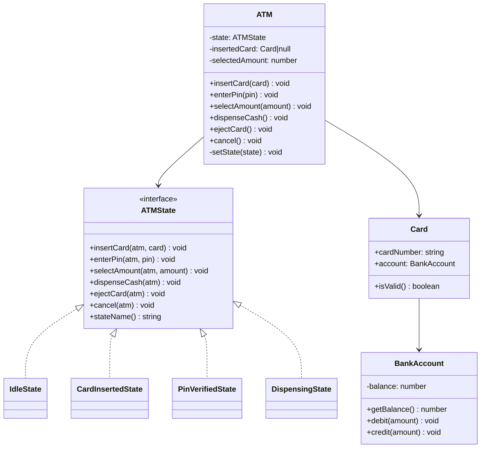
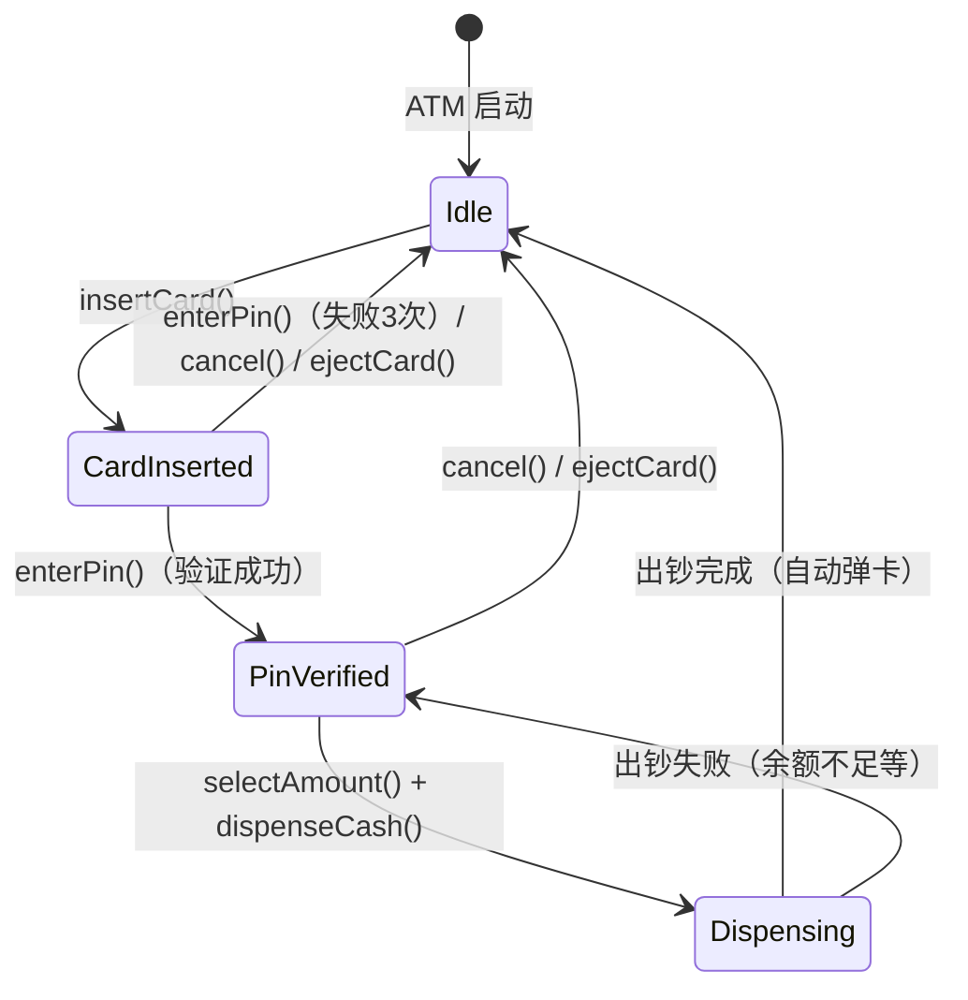

# OOD：ATM 机（ATM Machine）

## 核心考点

**State 模式**（ATM 的行为完全由当前状态决定）、账户操作的原子性、金额精度（整数分）、错误处理与状态回滚。

---

## 类图



---

## 状态机



---

## 实现

```typescript
// ── 账户 ──────────────────────────────────────────────
class BankAccount {
  private balanceCents: number; // 用整数分避免浮点问题

  constructor(
    public readonly accountId: string,
    initialBalanceCents: number,
    private correctPin: string
  ) {
    this.balanceCents = initialBalanceCents;
  }

  verifyPin(pin: string): boolean { return pin === this.correctPin; }

  getBalance(): number { return this.balanceCents; }

  debit(amountCents: number): void {
    if (amountCents > this.balanceCents) throw new Error('Insufficient funds');
    if (amountCents <= 0) throw new Error('Amount must be positive');
    this.balanceCents -= amountCents;
  }

  formatBalance(): string {
    return `$${(this.balanceCents / 100).toFixed(2)}`;
  }
}

class Card {
  constructor(
    public readonly cardNumber: string,
    public readonly account: BankAccount,
    private readonly expiryDate: Date
  ) {}

  isExpired(): boolean { return new Date() > this.expiryDate; }
  isValid():   boolean { return !this.isExpired(); }
}

// ── ATM 状态接口 ────────────────────────────────────────
interface ATMState {
  insertCard(atm: ATM, card: Card): void;
  enterPin(atm: ATM, pin: string): void;
  selectAmount(atm: ATM, amountCents: number): void;
  dispenseCash(atm: ATM): void;
  ejectCard(atm: ATM): void;
  cancel(atm: ATM): void;
  stateName(): string;
}

// ── 状态实现 ───────────────────────────────────────────
class IdleState implements ATMState {
  stateName() { return 'IDLE'; }

  insertCard(atm: ATM, card: Card): void {
    if (!card.isValid()) {
      console.log('Card is expired. Please use a valid card.');
      return;
    }
    atm.setCard(card);
    atm.setState(new CardInsertedState());
    console.log(`Card ${card.cardNumber} inserted. Please enter your PIN.`);
  }

  enterPin(atm: ATM, pin: string): void    { this.invalid('Please insert card first'); }
  selectAmount(atm: ATM, amt: number): void { this.invalid('Please insert card first'); }
  dispenseCash(atm: ATM): void              { this.invalid('Please insert card first'); }
  ejectCard(atm: ATM): void                 { console.log('No card inserted'); }
  cancel(atm: ATM): void                    { console.log('Nothing to cancel'); }

  private invalid(msg: string) { console.log(msg); }
}

class CardInsertedState implements ATMState {
  private pinAttempts = 0;
  private readonly MAX_ATTEMPTS = 3;

  stateName() { return 'CARD_INSERTED'; }

  insertCard(atm: ATM, card: Card): void { console.log('Card already inserted'); }

  enterPin(atm: ATM, pin: string): void {
    const card = atm.getCard()!;
    if (card.account.verifyPin(pin)) {
      atm.setState(new PinVerifiedState());
      console.log(`PIN verified. Balance: ${card.account.formatBalance()}. Select amount to withdraw.`);
    } else {
      this.pinAttempts++;
      const remaining = this.MAX_ATTEMPTS - this.pinAttempts;
      if (remaining > 0) {
        console.log(`Incorrect PIN. ${remaining} attempt(s) remaining.`);
      } else {
        console.log('Too many incorrect attempts. Card retained for security.');
        atm.setCard(null); // 吞卡
        atm.setState(new IdleState());
      }
    }
  }

  selectAmount(atm: ATM, amt: number): void { console.log('Please verify PIN first'); }
  dispenseCash(atm: ATM): void              { console.log('Please verify PIN first'); }

  ejectCard(atm: ATM): void {
    console.log(`Card ${atm.getCard()?.cardNumber} ejected.`);
    atm.setCard(null);
    atm.setState(new IdleState());
  }

  cancel(atm: ATM): void { this.ejectCard(atm); }
}

class PinVerifiedState implements ATMState {
  stateName() { return 'PIN_VERIFIED'; }

  insertCard(atm: ATM, card: Card): void    { console.log('Card already inserted'); }
  enterPin(atm: ATM, pin: string): void     { console.log('PIN already verified'); }

  selectAmount(atm: ATM, amountCents: number): void {
    const card = atm.getCard()!;
    if (amountCents <= 0) { console.log('Amount must be positive'); return; }
    if (amountCents > card.account.getBalance()) {
      console.log(`Insufficient funds. Balance: ${card.account.formatBalance()}`);
      return;
    }
    // 必须是 20 的整数倍（ATM 出钞面值）
    if (amountCents % 2000 !== 0) {
      console.log('Amount must be a multiple of $20');
      return;
    }
    atm.setSelectedAmount(amountCents);
    atm.setState(new DispensingState());
    console.log(`Amount $${amountCents / 100} selected. Dispensing cash...`);
    atm.getState().dispenseCash(atm); // 立即触发出钞
  }

  dispenseCash(atm: ATM): void { console.log('Please select amount first'); }

  ejectCard(atm: ATM): void {
    atm.setSelectedAmount(0);
    atm.setCard(null);
    atm.setState(new IdleState());
    console.log('Card ejected. Thank you.');
  }

  cancel(atm: ATM): void { this.ejectCard(atm); }
}

class DispensingState implements ATMState {
  stateName() { return 'DISPENSING'; }

  insertCard(): void    { console.log('Please wait, transaction in progress'); }
  enterPin(): void      { console.log('Please wait, transaction in progress'); }
  selectAmount(): void  { console.log('Please wait, transaction in progress'); }
  ejectCard(): void     { console.log('Please wait, transaction in progress'); }
  cancel(): void        { console.log('Cannot cancel during dispensing'); }

  dispenseCash(atm: ATM): void {
    const card   = atm.getCard()!;
    const amount = atm.getSelectedAmount();

    try {
      card.account.debit(amount);
      console.log(`✅ Dispensing $${amount / 100}. New balance: ${card.account.formatBalance()}`);
    } catch (err) {
      console.log(`❌ Dispense failed: ${(err as Error).message}`);
      atm.setState(new PinVerifiedState()); // 回退到选金额
      return;
    }

    // 出钞成功 → 自动弹卡，回到空闲
    console.log(`Card ${card.cardNumber} ejected. Thank you!`);
    atm.setCard(null);
    atm.setSelectedAmount(0);
    atm.setState(new IdleState());
  }
}

// ── ATM Context ────────────────────────────────────────
class ATM {
  private state:          ATMState = new IdleState();
  private insertedCard:   Card | null = null;
  private selectedAmount: number = 0;

  // 对外操作（委托给当前状态）
  insertCard(card: Card):          void { this.state.insertCard(this, card); }
  enterPin(pin: string):           void { this.state.enterPin(this, pin); }
  selectAmount(amountCents: number): void { this.state.selectAmount(this, amountCents); }
  ejectCard():                     void { this.state.ejectCard(this); }
  cancel():                        void { this.state.cancel(this); }

  // 供状态类使用的内部方法
  setState(s: ATMState):    void { this.state = s; console.log(`[State → ${s.stateName()}]`); }
  getState():     ATMState        { return this.state; }
  setCard(c: Card | null): void  { this.insertedCard = c; }
  getCard():      Card | null    { return this.insertedCard; }
  setSelectedAmount(a: number):  void { this.selectedAmount = a; }
  getSelectedAmount(): number   { return this.selectedAmount; }
  currentState():  string        { return this.state.stateName(); }
}
```

---

## 使用示例

```typescript
const alice = new BankAccount('ACC-001', 50000, '1234'); // $500.00, PIN=1234
const card  = new Card('4111-XXXX-XXXX-1234', alice, new Date('2027-12-31'));

const atm = new ATM();
atm.insertCard(card);          // → CARD_INSERTED
atm.enterPin('9999');          // 错误 PIN
atm.enterPin('1234');          // → PIN_VERIFIED
atm.selectAmount(10000);       // $100 → DISPENSING → 出钞 → IDLE

// 余额不足
atm.insertCard(card);
atm.enterPin('1234');
atm.selectAmount(100000);      // $1000 > $400 余额 → 拒绝
atm.cancel();                  // 弹卡 → IDLE
```

---

## 面试追问

**Q: 如果取款过程中网络断开（扣了钱但没出钞）怎么办？**

① `debit()` 和 `dispense()` 应在同一个事务/日志中记录  
② 出钞前先写 WAL（预写日志）：记录"准备出钞 $X"  
③ ATM 重启时检查日志：如果有"准备出钞"但无"出钞成功"，自动退款  
④ 出钞成功后再提交日志，标记为完成

**Q: 如何防止卡号盗刷（同一卡在多台 ATM 同时操作）？**

银行后端在 `verifyPin` 时对账户加分布式锁（Redis `SET card:{cardNumber} NX EX 60`），同一张卡同时只能有一个 ATM 会话。
