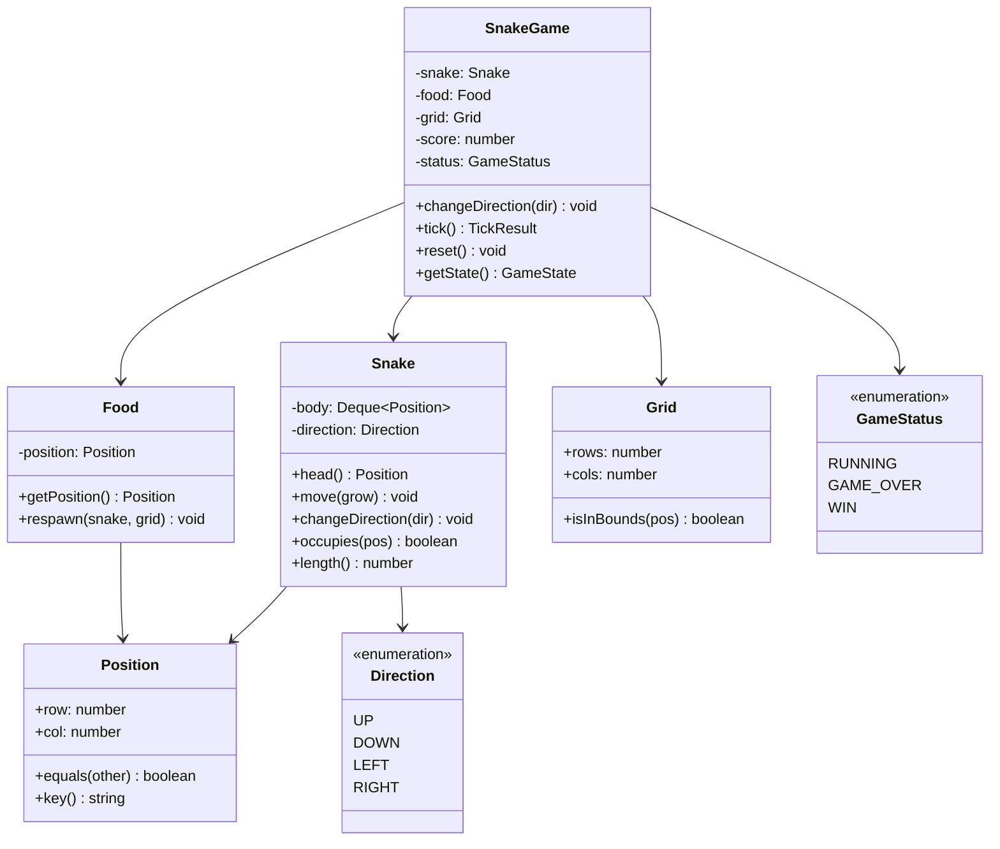
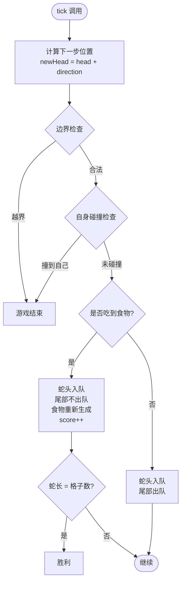

# OOD：贪吃蛇游戏（Snake Game）

## 核心考点

**Queue 模拟蛇身移动**（头部入队、尾部出队）、碰撞检测（3类：墙壁/自身/食物）、方向约束（不能 180° 掉头）、游戏状态管理。

---

## 类图



---

## 核心算法



---

## 实现

```typescript
// ── 基础数据结构 ───────────────────────────────────────
enum Direction { UP = 'UP', DOWN = 'DOWN', LEFT = 'LEFT', RIGHT = 'RIGHT' }
enum GameStatus { RUNNING = 'RUNNING', GAME_OVER = 'GAME_OVER', WIN = 'WIN' }

interface TickResult {
  status: GameStatus;
  score:  number;
  ateFood: boolean;
}

interface GameState {
  snakeBody: Position[];
  food:      Position;
  score:     number;
  status:    GameStatus;
  gridRows:  number;
  gridCols:  number;
}

class Position {
  constructor(public readonly row: number, public readonly col: number) {}

  equals(other: Position): boolean {
    return this.row === other.row && this.col === other.col;
  }

  key(): string { return `${this.row},${this.col}`; }

  // 按方向移动一步
  move(dir: Direction): Position {
    const delta: Record<Direction, [number, number]> = {
      [Direction.UP]:    [-1,  0],
      [Direction.DOWN]:  [ 1,  0],
      [Direction.LEFT]:  [ 0, -1],
      [Direction.RIGHT]: [ 0,  1],
    };
    const [dr, dc] = delta[dir];
    return new Position(this.row + dr, this.col + dc);
  }
}

// ── 双端队列（用数组模拟，面试可以简化）──────────────────
// 实际上用 JS Array 就够，push = 头入，shift = 尾出
class Deque<T> {
  private data: T[] = [];

  pushFront(item: T): void { this.data.unshift(item); }
  pushBack(item: T):  void { this.data.push(item); }
  popBack():   T | undefined { return this.data.pop(); }
  peekFront(): T | undefined { return this.data[0]; }
  toArray():   T[]           { return [...this.data]; }
  size():      number        { return this.data.length; }
}

// ── Grid ───────────────────────────────────────────────
class Grid {
  constructor(public readonly rows: number, public readonly cols: number) {}

  isInBounds(pos: Position): boolean {
    return pos.row >= 0 && pos.row < this.rows &&
           pos.col >= 0 && pos.col < this.cols;
  }

  totalCells(): number { return this.rows * this.cols; }

  // 在不被蛇占据的格子中随机选一个
  randomEmptyCell(occupied: Set<string>): Position | null {
    const candidates: Position[] = [];
    for (let r = 0; r < this.rows; r++) {
      for (let c = 0; c < this.cols; c++) {
        const pos = new Position(r, c);
        if (!occupied.has(pos.key())) candidates.push(pos);
      }
    }
    if (candidates.length === 0) return null;
    return candidates[Math.floor(Math.random() * candidates.length)];
  }
}

// ── Snake ──────────────────────────────────────────────
class Snake {
  private body:      Deque<Position>;
  private occupied:  Set<string>;   // O(1) 碰撞检测
  private direction: Direction;

  // 不能 180° 反向
  private static readonly OPPOSITES: Record<Direction, Direction> = {
    [Direction.UP]:    Direction.DOWN,
    [Direction.DOWN]:  Direction.UP,
    [Direction.LEFT]:  Direction.RIGHT,
    [Direction.RIGHT]: Direction.LEFT,
  };

  constructor(initialPos: Position, initialDir: Direction) {
    this.body      = new Deque<Position>();
    this.occupied  = new Set<string>();
    this.direction = initialDir;

    this.body.pushFront(initialPos);
    this.occupied.add(initialPos.key());
  }

  head(): Position { return this.body.peekFront()!; }

  length(): number { return this.body.size(); }

  getOccupied(): Set<string> { return this.occupied; }

  getBody(): Position[] { return this.body.toArray(); }

  changeDirection(dir: Direction): void {
    // 忽略反向操作（防止瞬间自杀）
    if (dir !== Snake.OPPOSITES[this.direction]) {
      this.direction = dir;
    }
  }

  currentDirection(): Direction { return this.direction; }

  // 计算下一步头部位置（不实际移动）
  nextHead(): Position {
    return this.head().move(this.direction);
  }

  // 移动蛇；grow=true 时不弹尾部（吃到食物）
  move(grow: boolean): void {
    const newHead = this.nextHead();

    // 先弹尾部（如果不增长），再添加头部
    // 注意：若增长，不弹尾，occupied 集合会保留尾部
    if (!grow) {
      const tail = this.body.popBack();
      if (tail) this.occupied.delete(tail.key());
    }

    this.body.pushFront(newHead);
    this.occupied.add(newHead.key());
  }

  // 是否占据某位置（用于碰撞检测）
  occupies(pos: Position): boolean {
    return this.occupied.has(pos.key());
  }

  // 检测移动后是否会撞到自身
  // 注意：要排除当前尾部（如果不增长，尾部会移走）
  wouldHitSelf(newHead: Position, grow: boolean): boolean {
    if (grow) {
      // 增长时，蛇身全部保留
      return this.occupied.has(newHead.key());
    } else {
      // 不增长时，尾部会移走，排除尾部
      const tail = this.body.toArray().at(-1);
      if (tail && newHead.key() === tail.key()) return false;
      return this.occupied.has(newHead.key());
    }
  }
}

// ── Food ───────────────────────────────────────────────
class Food {
  private position: Position;

  constructor(grid: Grid, snake: Snake) {
    this.position = grid.randomEmptyCell(snake.getOccupied())!;
  }

  getPosition(): Position { return this.position; }

  respawn(grid: Grid, snake: Snake): void {
    const newPos = grid.randomEmptyCell(snake.getOccupied());
    if (newPos) this.position = newPos;
  }
}

// ── SnakeGame（主控） ───────────────────────────────────
class SnakeGame {
  private snake:  Snake;
  private food:   Food;
  private grid:   Grid;
  private score:  number  = 0;
  private status: GameStatus = GameStatus.RUNNING;

  constructor(rows = 10, cols = 10) {
    this.grid  = new Grid(rows, cols);
    const start = new Position(Math.floor(rows / 2), Math.floor(cols / 2));
    this.snake = new Snake(start, Direction.RIGHT);
    this.food  = new Food(this.grid, this.snake);
  }

  changeDirection(dir: Direction): void {
    if (this.status !== GameStatus.RUNNING) return;
    this.snake.changeDirection(dir);
  }

  // 游戏主循环：每隔一段时间调用一次
  tick(): TickResult {
    if (this.status !== GameStatus.RUNNING) {
      return { status: this.status, score: this.score, ateFood: false };
    }

    const newHead = this.snake.nextHead();

    // 1. 边界碰撞
    if (!this.grid.isInBounds(newHead)) {
      this.status = GameStatus.GAME_OVER;
      return { status: this.status, score: this.score, ateFood: false };
    }

    const ateFood = newHead.equals(this.food.getPosition());

    // 2. 自身碰撞（如果吃到食物，蛇会增长，used set 不同）
    if (this.snake.wouldHitSelf(newHead, ateFood)) {
      this.status = GameStatus.GAME_OVER;
      return { status: this.status, score: this.score, ateFood: false };
    }

    // 3. 移动蛇
    this.snake.move(ateFood);

    if (ateFood) {
      this.score++;
      // 检查胜利条件（蛇占满所有格子）
      if (this.snake.length() === this.grid.totalCells()) {
        this.status = GameStatus.WIN;
        return { status: this.status, score: this.score, ateFood: true };
      }
      this.food.respawn(this.grid, this.snake);
    }

    return { status: this.status, score: this.score, ateFood };
  }

  reset(): void {
    const rows  = this.grid.rows;
    const cols  = this.grid.cols;
    const start = new Position(Math.floor(rows / 2), Math.floor(cols / 2));
    this.snake  = new Snake(start, Direction.RIGHT);
    this.food   = new Food(this.grid, this.snake);
    this.score  = 0;
    this.status = GameStatus.RUNNING;
  }

  getState(): GameState {
    return {
      snakeBody: this.snake.getBody(),
      food:      this.food.getPosition(),
      score:     this.score,
      status:    this.status,
      gridRows:  this.grid.rows,
      gridCols:  this.grid.cols,
    };
  }
}
```

---

## 使用示例

```typescript
const game = new SnakeGame(5, 5);

let result = game.tick(); // 蛇向右移动
console.log(result.status);   // RUNNING

game.changeDirection(Direction.DOWN);
result = game.tick();          // 蛇向下移动

if (result.ateFood) {
  console.log(`Score: ${result.score}`);
}

// 模拟游戏循环
// setInterval(() => { game.tick(); renderGame(game.getState()); }, 200);
```

---

## 面试追问

**Q: 为什么用 Queue（双端队列）而不是数组？**

蛇的移动本质是 FIFO：新头部加入队头，旧尾部从队尾移出，时间复杂度 O(1)。  
用普通数组的 `unshift()` 需要 O(n) 移动元素，在蛇很长时性能差。

**Q: 碰撞检测如何做到 O(1)？**

维护一个 `Set<string>` 存储蛇身坐标（`"row,col"` 格式），每次检测只需 `set.has(pos.key())`，O(1)。  
不能遍历蛇身数组（O(n)），在长蛇时会慢。

**Q: 为什么需要 `wouldHitSelf` 里排除尾部？**

蛇不增长时，头前进的同时尾部会移走。如果新头恰好是当前尾部位置，实际上不会碰撞（尾部先走，头再来）。  
不排除这个 case 会造成 false positive 碰撞判定。
