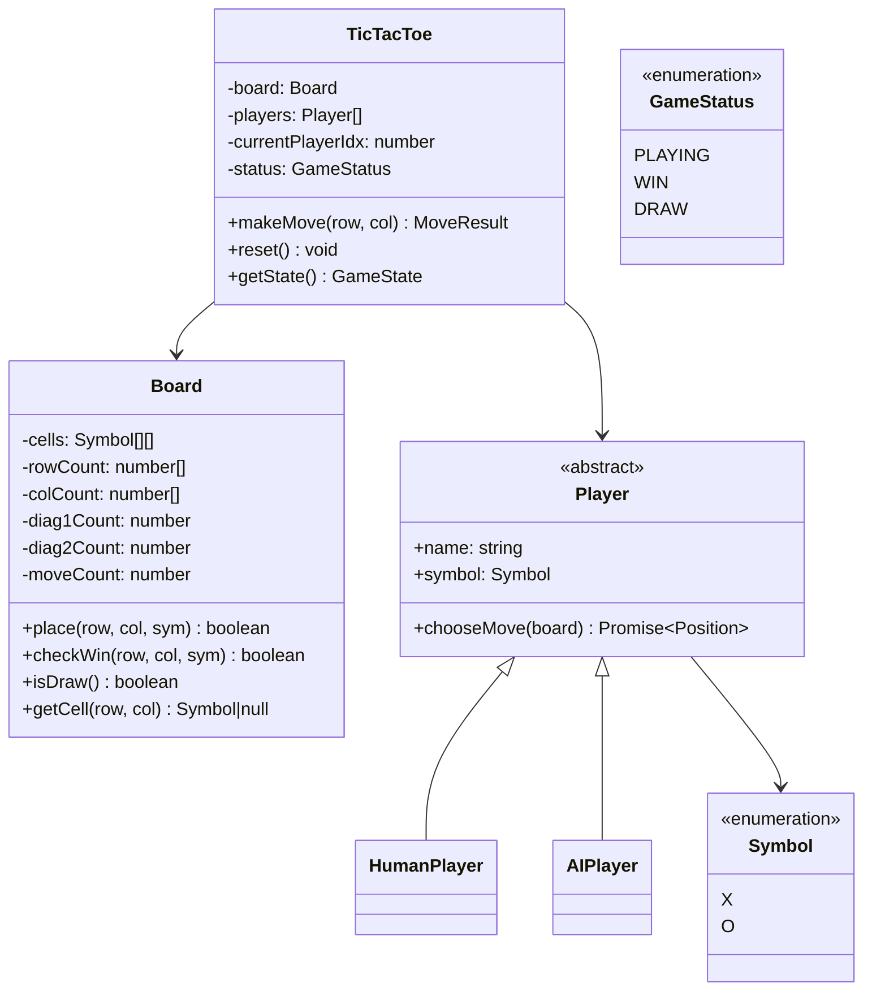
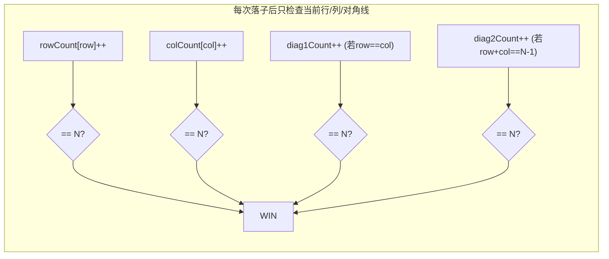

# OOD：井字棋（Tic-Tac-Toe / N×N Board）

## 核心考点

**棋盘抽象为 N×N**（能扩展到 Connect-N）、胜负检测的高效实现（行/列/对角线计数器）、玩家多态（Human vs AI）、游戏状态机。

---

## 类图



---

## 胜负检测算法



**关键**：不需要每次遍历全棋盘。每个玩家各维护一套计数器，每次落子 O(1) 判断胜负。

---

## 实现

```typescript
// ── Symbol & Position ──────────────────────────────────
enum PlayerSymbol { X = 'X', O = 'O' }
enum GameStatus   { PLAYING = 'PLAYING', WIN = 'WIN', DRAW = 'DRAW' }

interface Position { row: number; col: number; }

interface MoveResult {
  valid:   boolean;
  status:  GameStatus;
  winner?: string;
  reason?: string;
}

interface GameState {
  board:          (PlayerSymbol | null)[][];
  currentPlayer:  string;
  status:         GameStatus;
  winner?:        string;
}

// ── Board（支持 N×N，Connect-N）────────────────────────
class Board {
  private cells:    (PlayerSymbol | null)[][];
  // 每个玩家的行/列/对角线计数器（key = PlayerSymbol）
  private rowCount:   Record<PlayerSymbol, number[]>;
  private colCount:   Record<PlayerSymbol, number[]>;
  private diag1Count: Record<PlayerSymbol, number>; // 主对角线 (row==col)
  private diag2Count: Record<PlayerSymbol, number>; // 副对角线 (row+col==n-1)
  private _moveCount = 0;
  private readonly n: number;
  private readonly connectN: number; // 连几个赢

  constructor(n = 3, connectN?: number) {
    this.n        = n;
    this.connectN = connectN ?? n;

    this.cells = Array.from({ length: n }, () => Array(n).fill(null));

    const emptyRows  = () => Array(n).fill(0);
    this.rowCount   = { [PlayerSymbol.X]: emptyRows(), [PlayerSymbol.O]: emptyRows() };
    this.colCount   = { [PlayerSymbol.X]: emptyRows(), [PlayerSymbol.O]: emptyRows() };
    this.diag1Count = { [PlayerSymbol.X]: 0, [PlayerSymbol.O]: 0 };
    this.diag2Count = { [PlayerSymbol.X]: 0, [PlayerSymbol.O]: 0 };
  }

  getCell(row: number, col: number): PlayerSymbol | null {
    return this.cells[row][col];
  }

  moveCount(): number { return this._moveCount; }

  totalCells(): number { return this.n * this.n; }

  // 落子，返回是否成功
  place(row: number, col: number, sym: PlayerSymbol): boolean {
    if (row < 0 || row >= this.n || col < 0 || col >= this.n) return false;
    if (this.cells[row][col] !== null) return false;

    this.cells[row][col] = sym;
    this._moveCount++;

    // 更新计数器
    this.rowCount[sym][row]++;
    this.colCount[sym][col]++;
    if (row === col)                 this.diag1Count[sym]++;
    if (row + col === this.n - 1)    this.diag2Count[sym]++;

    return true;
  }

  // O(1) 胜负检测（只需检查落子所在的行/列/对角线）
  checkWin(row: number, col: number, sym: PlayerSymbol): boolean {
    const k = this.connectN;
    if (this.rowCount[sym][row] >= k)  return true;
    if (this.colCount[sym][col] >= k)  return true;
    if (row === col && this.diag1Count[sym] >= k) return true;
    if (row + col === this.n - 1 && this.diag2Count[sym] >= k) return true;
    return false;
  }

  isDraw(): boolean { return this._moveCount === this.n * this.n; }

  getGrid(): (PlayerSymbol | null)[][] {
    return this.cells.map(row => [...row]);
  }

  print(): void {
    console.log('  ' + Array.from({ length: this.n }, (_, i) => i).join(' '));
    this.cells.forEach((row, r) => {
      console.log(r + ' ' + row.map(c => c ?? '.').join(' '));
    });
  }
}

// ── Player 抽象 ────────────────────────────────────────
abstract class Player {
  constructor(
    public readonly name:   string,
    public readonly symbol: PlayerSymbol
  ) {}

  abstract chooseMove(board: Board): Promise<Position>;
}

// 人类玩家：通过回调接收输入（前端/CLI 都可接入）
class HumanPlayer extends Player {
  private inputResolver: ((pos: Position) => void) | null = null;

  async chooseMove(_board: Board): Promise<Position> {
    return new Promise<Position>(resolve => {
      this.inputResolver = resolve;
    });
  }

  // UI 层调用此方法传入用户点击的位置
  submitMove(row: number, col: number): void {
    this.inputResolver?.({ row, col });
    this.inputResolver = null;
  }
}

// AI 玩家：随机策略（面试可扩展为 Minimax）
class AIPlayer extends Player {
  async chooseMove(board: Board): Promise<Position> {
    const empty: Position[] = [];
    const grid = board.getGrid();

    for (let r = 0; r < grid.length; r++) {
      for (let c = 0; c < grid[r].length; c++) {
        if (grid[r][c] === null) empty.push({ row: r, col: c });
      }
    }

    if (empty.length === 0) throw new Error('No available moves');

    // 随机选择（面试追问：如何改为最优策略 → Minimax + Alpha-Beta 剪枝）
    return empty[Math.floor(Math.random() * empty.length)];
  }
}

// ── TicTacToe 游戏控制器 ────────────────────────────────
class TicTacToe {
  private board:            Board;
  private players:          Player[];
  private currentPlayerIdx: number = 0;
  private status:           GameStatus = GameStatus.PLAYING;
  private winner:           Player | null = null;

  constructor(
    players:   [Player, Player],
    boardSize: number = 3,
    connectN?: number
  ) {
    if (players[0].symbol === players[1].symbol) {
      throw new Error('Players must use different symbols');
    }
    this.players = players;
    this.board   = new Board(boardSize, connectN);
  }

  currentPlayer(): Player { return this.players[this.currentPlayerIdx]; }

  // 同步版本（供 AI 或已知输入使用）
  makeMove(row: number, col: number): MoveResult {
    if (this.status !== GameStatus.PLAYING) {
      return { valid: false, status: this.status, reason: 'Game already over' };
    }

    const player = this.currentPlayer();
    const placed = this.board.place(row, col, player.symbol);

    if (!placed) {
      return { valid: false, status: this.status, reason: 'Invalid position' };
    }

    if (this.board.checkWin(row, col, player.symbol)) {
      this.status = GameStatus.WIN;
      this.winner = player;
      return { valid: true, status: this.status, winner: player.name };
    }

    if (this.board.isDraw()) {
      this.status = GameStatus.DRAW;
      return { valid: true, status: this.status };
    }

    // 切换玩家
    this.currentPlayerIdx = 1 - this.currentPlayerIdx;
    return { valid: true, status: this.status };
  }

  reset(): void {
    this.board            = new Board();
    this.currentPlayerIdx = 0;
    this.status           = GameStatus.PLAYING;
    this.winner           = null;
  }

  getState(): GameState {
    return {
      board:         this.board.getGrid(),
      currentPlayer: this.currentPlayer().name,
      status:        this.status,
      winner:        this.winner?.name,
    };
  }

  printBoard(): void { this.board.print(); }
}
```

---

## 使用示例

```typescript
// 标准 3×3 井字棋
const x = new HumanPlayer('Alice', PlayerSymbol.X);
const o = new HumanPlayer('Bob',   PlayerSymbol.O);
const game = new TicTacToe([x, o]);

game.makeMove(0, 0); // X
game.makeMove(1, 1); // O
game.makeMove(0, 1); // X
game.makeMove(2, 0); // O
game.makeMove(0, 2); // X → 赢！

console.log(game.getState().status); // WIN
console.log(game.getState().winner); // Alice

// 5×5 棋盘，连 4 个赢
const bigGame = new TicTacToe([x, o], 5, 4);
```

---

## Minimax AI（扩展）

```typescript
class MinimaxAIPlayer extends Player {
  async chooseMove(board: Board): Promise<Position> {
    // 遍历所有空位，用 minimax 评分
    let bestScore = -Infinity;
    let bestMove: Position = { row: 0, col: 0 };

    const grid = board.getGrid();
    for (let r = 0; r < grid.length; r++) {
      for (let c = 0; c < grid[r].length; c++) {
        if (grid[r][c] === null) {
          // 模拟落子（需要 Board 支持 undo，或克隆 Board）
          // 此处仅展示接口，实际需要可回溯的 Board
          const score = this.minimax(board, r, c, false, 0);
          if (score > bestScore) { bestScore = score; bestMove = { row: r, col: c }; }
        }
      }
    }

    return bestMove;
  }

  private minimax(board: Board, row: number, col: number, isMaximizing: boolean, depth: number): number {
    // 简化示意：实际需要 Board 克隆和递归评估
    // 返回 +10-depth（快赢）、-10+depth（快输）、0（平局）
    return 0; // placeholder
  }
}
```

---

## 面试追问

**Q: 勝负检测如何做到 O(1)？**

维护每个 Symbol 的行/列/对角线计数器。每次落子只更新一行、一列、最多两条对角线的计数，然后只检查这几个值是否达到 N。不需要扫描整个棋盘。

**Q: N×N 棋盘 Connect-N，主副对角线计数器不够用怎么办？**

标准 3×3 中主/副对角线各只有一条。如果是 N×N Connect-N（如围棋变体），需要改为从每个落子点出发，分别统计 4 个方向（↑↓←→↖↗↙↘）的连续棋子数，取每对反方向之和。仍然是 O(1) 常数次操作。

**Q: AI 如何实现最优策略？**

Minimax 算法 + Alpha-Beta 剪枝。3×3 棋盘状态空间 ~255,168，可以完整搜索。对于更大棋盘，需要深度限制 + 启发式评估函数（棋型评分）。
