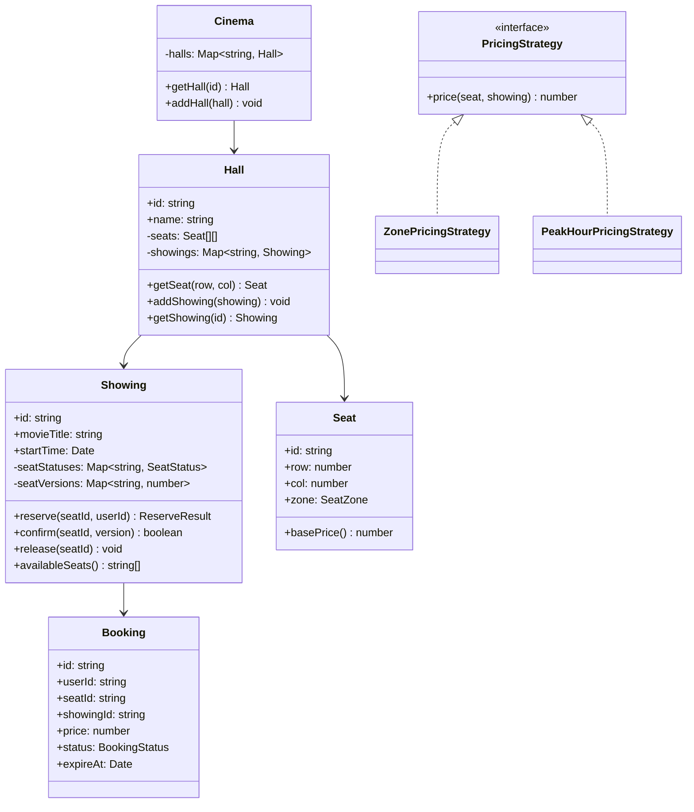
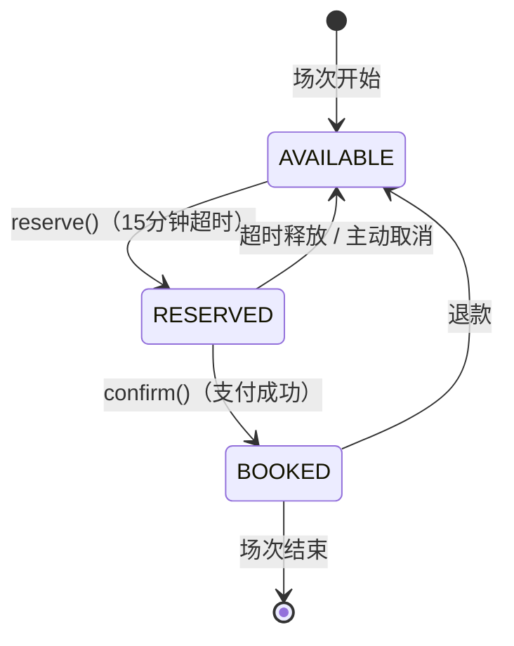

# OOD：电影院订票系统（Cinema Booking）

## 核心考点

**2D 座位图**、座位状态机、**并发预订防超卖**（乐观锁/CAS）、区域差异定价、订单生命周期管理。

---

## 类图



---

## 座位状态机



---

## 实现

```typescript
// ── 枚举 & 基础类型 ────────────────────────────────────
enum SeatZone    { STANDARD = 'STANDARD', PREMIUM = 'PREMIUM', VIP = 'VIP' }
enum SeatStatus  { AVAILABLE = 'AVAILABLE', RESERVED = 'RESERVED', BOOKED = 'BOOKED' }
enum BookingStatus { PENDING = 'PENDING', CONFIRMED = 'CONFIRMED', CANCELLED = 'CANCELLED' }

interface ReserveResult {
  success:  boolean;
  reason?:  string;
  booking?: Booking;
}

// ── Seat ──────────────────────────────────────────────
class Seat {
  public readonly id: string;

  constructor(
    public readonly row:  number,
    public readonly col:  number,
    public readonly zone: SeatZone
  ) {
    this.id = `R${row}C${col}`;
  }

  basePrice(): number {
    const prices: Record<SeatZone, number> = {
      [SeatZone.STANDARD]: 80_00,  // 整数分，单位：分
      [SeatZone.PREMIUM]:  120_00,
      [SeatZone.VIP]:      200_00,
    };
    return prices[this.zone];
  }
}

// ── Booking ──────────────────────────────────────────
class Booking {
  public readonly id:       string;
  public status:            BookingStatus = BookingStatus.PENDING;
  public readonly expireAt: Date;         // 15 分钟内完成支付

  constructor(
    public readonly userId:    string,
    public readonly seatId:    string,
    public readonly showingId: string,
    public readonly price:     number     // 单位：分
  ) {
    this.id       = `BK-${Date.now()}-${Math.random().toString(36).slice(2)}`;
    this.expireAt = new Date(Date.now() + 15 * 60 * 1000);
  }

  isExpired(): boolean { return new Date() > this.expireAt; }

  confirm(): void {
    if (this.status !== BookingStatus.PENDING) throw new Error('Cannot confirm');
    this.status = BookingStatus.CONFIRMED;
  }

  cancel(): void {
    if (this.status === BookingStatus.CONFIRMED) throw new Error('Cannot cancel confirmed booking directly, use refund');
    this.status = BookingStatus.CANCELLED;
  }
}

// ── Pricing Strategy ──────────────────────────────────
interface PricingStrategy {
  price(seat: Seat, showing: Showing): number; // 返回价格（分）
}

class ZonePricingStrategy implements PricingStrategy {
  price(seat: Seat, _showing: Showing): number {
    return seat.basePrice();
  }
}

class PeakHourPricingStrategy implements PricingStrategy {
  constructor(
    private baseStrategy: PricingStrategy,
    private multiplier: number = 1.3  // 高峰时段 130%
  ) {}

  price(seat: Seat, showing: Showing): number {
    const base = this.baseStrategy.price(seat, showing);
    const hour = showing.startTime.getHours();
    const isPeak = hour >= 18 && hour <= 22; // 18:00-22:00 高峰
    return isPeak ? Math.round(base * this.multiplier) : base;
  }
}

// ── Showing（场次） ────────────────────────────────────
class Showing {
  public readonly id: string;

  // 每个座位的状态（版本号用于乐观锁）
  private seatStatuses: Map<string, SeatStatus>  = new Map();
  private seatVersions: Map<string, number>       = new Map(); // CAS 版本号
  private bookings:     Map<string, Booking>      = new Map(); // seatId → Booking

  constructor(
    public readonly movieTitle: string,
    public readonly startTime:  Date,
    seats:                      Seat[],
    private pricingStrategy:    PricingStrategy = new ZonePricingStrategy()
  ) {
    this.id = `SH-${Date.now()}`;
    // 初始化所有座位为可用
    seats.forEach(seat => {
      this.seatStatuses.set(seat.id, SeatStatus.AVAILABLE);
      this.seatVersions.set(seat.id, 0);
    });
  }

  availableSeats(): string[] {
    const result: string[] = [];
    this.seatStatuses.forEach((status, id) => {
      if (status === SeatStatus.AVAILABLE) result.push(id);
    });
    return result;
  }

  // 预订（CAS 防止并发超卖）
  reserve(seat: Seat, userId: string): ReserveResult {
    const currentStatus  = this.seatStatuses.get(seat.id);
    const currentVersion = this.seatVersions.get(seat.id) ?? 0;

    if (currentStatus !== SeatStatus.AVAILABLE) {
      return { success: false, reason: `Seat ${seat.id} is not available` };
    }

    // CAS：只有当版本号未变时才能成功（模拟原子操作）
    // 真实场景中，这个操作需要在数据库事务中执行：
    // UPDATE seat_status SET status='RESERVED', version=version+1
    //   WHERE seat_id=? AND version=? AND status='AVAILABLE'
    const newVersion = currentVersion + 1;
    this.seatStatuses.set(seat.id, SeatStatus.RESERVED);
    this.seatVersions.set(seat.id, newVersion);

    const price   = this.pricingStrategy.price(seat, this);
    const booking = new Booking(userId, seat.id, this.id, price);
    this.bookings.set(seat.id, booking);

    // 启动超时释放（生产中应用 scheduled job，这里用 setTimeout 演示）
    setTimeout(() => this.releaseIfExpired(seat.id, booking.id), 15 * 60 * 1000);

    return { success: true, booking };
  }

  // 支付成功后确认
  confirm(seatId: string, bookingId: string): boolean {
    const booking = this.bookings.get(seatId);
    if (!booking || booking.id !== bookingId) return false;
    if (booking.isExpired()) {
      this.release(seatId);
      return false;
    }

    booking.confirm();
    this.seatStatuses.set(seatId, SeatStatus.BOOKED);
    return true;
  }

  // 释放座位（超时或取消）
  release(seatId: string): void {
    const booking = this.bookings.get(seatId);
    if (booking?.status === BookingStatus.PENDING) {
      booking.cancel();
    }
    this.seatStatuses.set(seatId, SeatStatus.AVAILABLE);
    this.seatVersions.set(seatId, (this.seatVersions.get(seatId) ?? 0) + 1);
    this.bookings.delete(seatId);
  }

  private releaseIfExpired(seatId: string, bookingId: string): void {
    const booking = this.bookings.get(seatId);
    if (booking?.id === bookingId && booking.status === BookingStatus.PENDING) {
      this.release(seatId);
      console.log(`Seat ${seatId} released due to payment timeout`);
    }
  }

  getBooking(seatId: string): Booking | undefined {
    return this.bookings.get(seatId);
  }
}

// ── Hall（影厅） ───────────────────────────────────────
class Hall {
  private seats:    Seat[][];
  private showings: Map<string, Showing> = new Map();

  constructor(
    public readonly id:   string,
    public readonly name: string,
    rows: number,
    cols: number
  ) {
    // 构建座位图：最后2行为 VIP，中间4行为 PREMIUM，其余 STANDARD
    this.seats = Array.from({ length: rows }, (_, r) =>
      Array.from({ length: cols }, (_, c) => {
        let zone = SeatZone.STANDARD;
        if (r >= rows - 2)                       zone = SeatZone.VIP;
        else if (r >= Math.floor(rows / 3) && r < rows - 2) zone = SeatZone.PREMIUM;
        return new Seat(r, c, zone);
      })
    );
  }

  getSeat(row: number, col: number): Seat {
    if (row < 0 || row >= this.seats.length || col < 0 || col >= this.seats[0].length) {
      throw new Error(`Invalid seat position (${row}, ${col})`);
    }
    return this.seats[row][col];
  }

  allSeats(): Seat[] { return this.seats.flat(); }

  addShowing(showing: Showing): void { this.showings.set(showing.id, showing); }

  getShowing(id: string): Showing | undefined { return this.showings.get(id); }
}

// ── BookingService（订票门面） ─────────────────────────
class BookingService {
  private halls: Map<string, Hall> = new Map();

  addHall(hall: Hall): void { this.halls.set(hall.id, hall); }

  createShowing(hallId: string, movie: string, time: Date, strategy?: PricingStrategy): Showing {
    const hall = this.halls.get(hallId);
    if (!hall) throw new Error(`Hall ${hallId} not found`);

    const showing = new Showing(movie, time, hall.allSeats(), strategy);
    hall.addShowing(showing);
    return showing;
  }

  // 批量预订多个座位（全部成功才提交，否则回滚）
  reserveSeats(hallId: string, showingId: string, seatIds: string[], userId: string): {
    success: boolean;
    bookings: Booking[];
    reason?:  string;
  } {
    const hall = this.halls.get(hallId);
    if (!hall) return { success: false, bookings: [], reason: 'Hall not found' };

    const showing = hall.getShowing(showingId);
    if (!showing) return { success: false, bookings: [], reason: 'Showing not found' };

    const bookings: Booking[] = [];
    const reserved: string[]  = [];

    for (const seatId of seatIds) {
      const [rowStr, colStr] = seatId.replace('R', '').split('C');
      const seat = hall.getSeat(parseInt(rowStr), parseInt(colStr));
      const result = showing.reserve(seat, userId);

      if (!result.success) {
        // 回滚已预订的座位
        reserved.forEach(id => showing.release(id));
        return { success: false, bookings: [], reason: `Seat ${seatId}: ${result.reason}` };
      }

      bookings.push(result.booking!);
      reserved.push(seatId);
    }

    return { success: true, bookings };
  }
}
```

---

## 使用示例

```typescript
const service = new BookingService();

// 设置影厅（8 行 × 12 列）
const hall = new Hall('H1', '1号厅', 8, 12);
service.addHall(hall);

// 创建场次（高峰定价）
const showing = service.createShowing(
  'H1',
  '奥本海默',
  new Date('2025-08-01T19:30:00'),
  new PeakHourPricingStrategy(new ZonePricingStrategy())
);

// 预订两个连排座位
const result = service.reserveSeats('H1', showing.id, ['R3C4', 'R3C5'], 'user-001');
console.log(result.success);              // true
console.log(result.bookings[0].price);   // 15600（分），即 ¥156

// 支付成功，确认订单
result.bookings.forEach(b => showing.confirm(b.seatId, b.id));
```

---

## 面试追问

**Q: 两个用户同时抢同一个座位如何防止超卖？**

数据库层：`UPDATE showings SET status='RESERVED', version=version+1 WHERE seat_id=? AND version=? AND status='AVAILABLE'`。  
检查受影响行数，为 0 则说明抢占失败（乐观锁）。应用层无需加锁，高并发下性能优于悲观锁。

**Q: 预订超时 15 分钟怎么释放？**

生产中不用 `setTimeout`，而是：① 数据库 `expire_at` 字段 + 定时扫描任务（每 1 分钟跑一次），② 或用消息队列延迟消息（预订时发 15 分钟延迟消息，消费时检查状态），③ Redis Key TTL + Keyspace Notifications。

**Q: 如何支持选座图（哪些座位是空的）？**

API 返回整个场次的座位状态快照（二维数组），前端渲染颜色。为防止并发状态不一致，加 ETag/Version 做乐观并发控制，状态变更时推送 WebSocket 更新。
