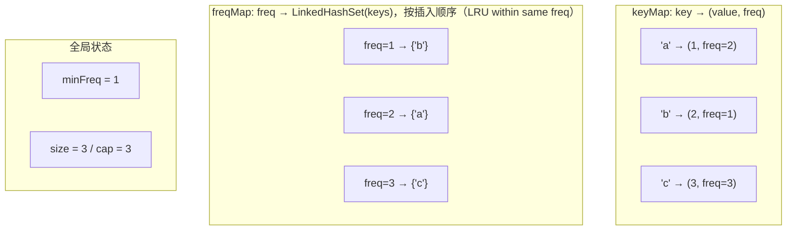
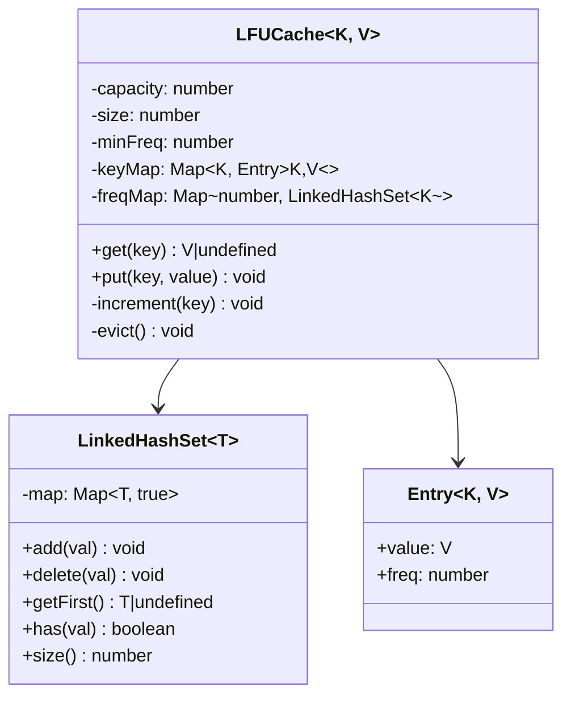
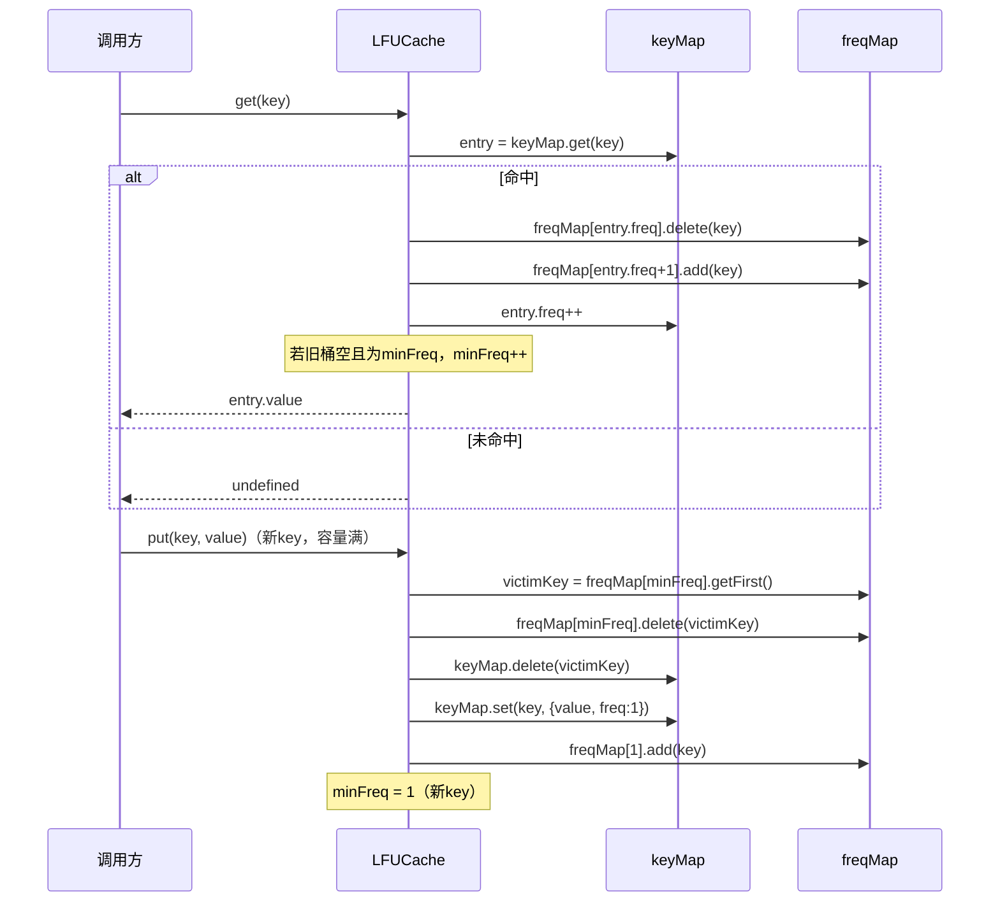

# OOD：LFU Cache（最不经常使用缓存）

## 核心考点

**O(1) get/put**（双 HashMap + 最小频率跟踪）、相同频率内用 LRU 排序（LinkedHashSet）、频率升级时维护 min-freq 不变式。

---

## 数据结构



**不变式**：`minFreq` 始终指向当前最小频率，且该频率桶非空。

---

## 类图



---

## 实现

```typescript
// ── LinkedHashSet（有序集合，O(1) 增删，O(1) 取第一个）────
// JS 的 Map 保持插入顺序，利用这个特性模拟 LinkedHashSet
class LinkedHashSet<T> {
  private map = new Map<T, true>();

  add(val: T): void    { this.map.set(val, true); }

  delete(val: T): void { this.map.delete(val); }

  has(val: T): boolean { return this.map.has(val); }

  // 取最早插入的元素（LRU 中最旧的）
  getFirst(): T | undefined {
    const iter = this.map.keys();
    return iter.next().value;
  }

  isEmpty(): boolean { return this.map.size === 0; }

  size(): number { return this.map.size; }
}

// ── 内部存储条目 ───────────────────────────────────────
interface Entry<V> {
  value: V;
  freq:  number;
}

// ── LFU Cache ──────────────────────────────────────────
class LFUCache<K, V> {
  private size   = 0;
  private minFreq = 0;

  // key → { value, freq }
  private keyMap: Map<K, Entry<V>> = new Map();

  // freq → LinkedHashSet of keys（同频率内按访问时间 LRU 排序）
  private freqMap: Map<number, LinkedHashSet<K>> = new Map();

  constructor(private readonly capacity: number) {
    if (capacity <= 0) throw new Error('Capacity must be positive');
  }

  // O(1) 查询
  get(key: K): V | undefined {
    const entry = this.keyMap.get(key);
    if (!entry) return undefined;

    this.increment(key, entry);
    return entry.value;
  }

  // O(1) 插入/更新
  put(key: K, value: V): void {
    if (this.capacity === 0) return;

    const existing = this.keyMap.get(key);

    if (existing) {
      // 更新已有 key
      existing.value = value;
      this.increment(key, existing);
      return;
    }

    // 插入新 key：先淘汰（如果满了）
    if (this.size >= this.capacity) {
      this.evict();
    }

    // 新 key 频率为 1
    const entry: Entry<V> = { value, freq: 1 };
    this.keyMap.set(key, entry);
    this.getOrCreateBucket(1).add(key);
    this.minFreq = 1; // 新 key 频率最小，一定是 1
    this.size++;
  }

  // 将 key 的频率 +1，并迁移到正确的频率桶
  private increment(key: K, entry: Entry<V>): void {
    const oldFreq = entry.freq;
    const newFreq = oldFreq + 1;
    entry.freq    = newFreq;

    // 从旧桶移除
    const oldBucket = this.freqMap.get(oldFreq)!;
    oldBucket.delete(key);

    // 如果旧桶空了，且是最小频率，更新 minFreq
    if (oldBucket.isEmpty() && oldFreq === this.minFreq) {
      this.minFreq = newFreq;
    }

    // 加入新桶
    this.getOrCreateBucket(newFreq).add(key);
  }

  // 淘汰：移除 minFreq 桶中最旧的 key（LRU within same freq）
  private evict(): void {
    const minBucket = this.freqMap.get(this.minFreq);
    if (!minBucket || minBucket.isEmpty()) return;

    const victimKey = minBucket.getFirst()!;
    minBucket.delete(victimKey);
    this.keyMap.delete(victimKey);
    this.size--;
  }

  private getOrCreateBucket(freq: number): LinkedHashSet<K> {
    if (!this.freqMap.has(freq)) {
      this.freqMap.set(freq, new LinkedHashSet<K>());
    }
    return this.freqMap.get(freq)!;
  }

  // 调试用：返回所有 key 及其频率
  dump(): Array<{ key: K; value: V; freq: number }> {
    return Array.from(this.keyMap.entries()).map(([k, e]) => ({
      key: k, value: e.value, freq: e.freq
    }));
  }
}
```

---

## 操作演示

```typescript
// capacity = 2
const cache = new LFUCache<number, string>(2);

cache.put(1, 'one');   // freq: {1→[1]}           minFreq=1
cache.put(2, 'two');   // freq: {1→[1,2]}          minFreq=1
cache.get(1);          // freq: {1→[2], 2→[1]}     minFreq=1（2 在 freq=1 最旧）
cache.put(3, 'three'); // 容量满，淘汰 minFreq=1 最旧的 key=2
                       // freq: {1→[3], 2→[1]}     minFreq=1
console.log(cache.get(2)); // undefined（已被淘汰）
console.log(cache.get(3)); // 'three'，freq: {2→[1], 2→[1,3]}…
console.log(cache.get(1)); // 'one'
```

---

## 关键操作时序



---

## 与 LRU 的对比

| 维度 | LRU Cache | LFU Cache |
|------|-----------|-----------|
| 淘汰策略 | 最近最少访问 | 访问频率最低（同频率内 LRU） |
| 适用场景 | 访问时间局部性强 | 访问频率局部性强（热门内容长期缓存）|
| 实现复杂度 | HashMap + 双向链表 | 双 HashMap + LinkedHashSet |
| 缺点 | 偶发性大量访问污染缓存 | 新进热点数据需要"预热"频率 |

---

## 面试追问

**Q: 为什么同频率内需要 LRU 排序（LinkedHashSet 而非 HashSet）？**

仅靠频率无法区分"同样访问 3 次但 A 最近刚访问"的情况。使用插入顺序 LinkedHashSet，同频率中越旧的越先淘汰，等价于 LRU 作为 tie-breaker。

**Q: 为什么 `put` 新 key 后 `minFreq` 一定等于 1？**

新 key 的初始频率为 1，是当前所有 key 中可能存在的最小频率，因为没有 key 的频率可以低于 1。所以直接置 `minFreq = 1` 是安全的，不需要遍历。

**Q: Java 实现中 freqMap 的 value 用什么数据结构？**

`LinkedHashSet<Integer>` 或 `LinkedList<Integer>` 配合 `HashMap<Integer, Node>` 快速定位节点位置（实现 O(1) 删除）。纯 Java 集合类的 `LinkedHashSet` 删除是 O(1) 的（Hash + 链接），正是我们需要的。
