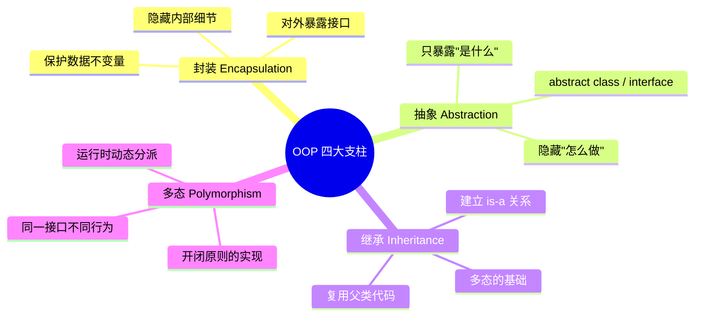
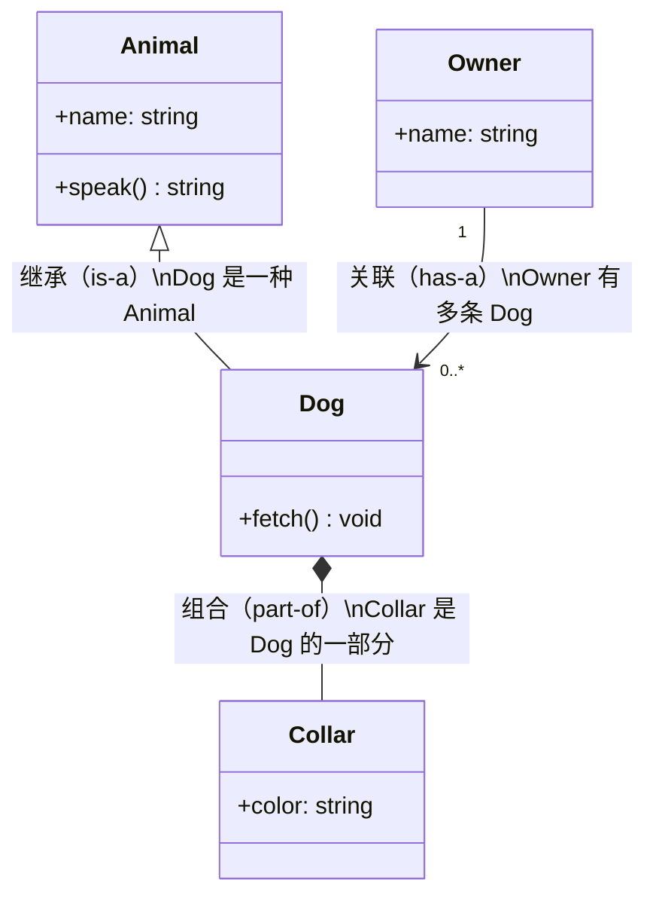
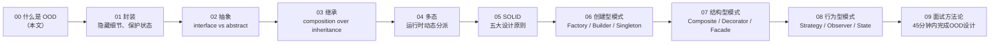

# OOD 入门：什么是面向对象设计？

## 为什么要学 OOD？

写代码有两个阶段：
1. **让代码跑起来**（功能正确）
2. **让代码好维护**（下周的你能看懂，能改动，能扩展）

OOD（Object-Oriented Design）解决的是第 2 个问题。它是一套**把现实世界映射成代码结构**的思维方式，目标是：

- **可读性**：代码能说明意图，而不只是机器指令
- **可扩展性**：加新功能不需要改旧代码
- **可维护性**：改一处不会引发其他地方崩溃

---

## 三个核心问题

在开始设计之前，先问自己：

```
1. 这个系统里有哪些"东西"（名词）？  → 类（Class）
2. 这些"东西"能做什么（动词）？       → 方法（Method）
3. 这些"东西"之间是什么关系？         → 关联/继承/组合
```

**例子：停车场系统**
```
名词：停车场、停车位、车辆、车票、收费规则
动词：进入、离开、计费、打印票据、查询空位
关系：停车场"有"停车位（组合）、车辆"有"车票（关联）
       SUV "是" 车辆（继承）
```

---

## 面向对象的四大支柱



---

## 类与对象

```typescript
// 类：定义（蓝图）
class BankAccount {
  private balance: number;  // 封装：外部无法直接访问

  constructor(
    private readonly accountId: string,
    initialBalance: number
  ) {
    if (initialBalance < 0) throw new Error('Initial balance cannot be negative');
    this.balance = initialBalance;
  }

  // 行为（方法）
  deposit(amount: number): void {
    if (amount <= 0) throw new Error('Deposit amount must be positive');
    this.balance += amount;
  }

  withdraw(amount: number): void {
    if (amount > this.balance) throw new Error('Insufficient funds');
    this.balance -= amount;
  }

  getBalance(): number { return this.balance; }
  getAccountId(): string { return this.accountId; }
}

// 对象：实例（使用蓝图创建的具体实体）
const alice = new BankAccount('ACC-001', 1000);
const bob   = new BankAccount('ACC-002', 500);

alice.deposit(200);
alice.withdraw(100);
console.log(alice.getBalance()); // 1100
// alice.balance = -9999; // ❌ 编译错误：private，封装保护了不变量
```

---

## 类之间的三种核心关系



| 关系 | 关键词 | 生命周期 | TypeScript 写法 |
|------|--------|---------|----------------|
| **继承** `is-a` | `extends` | 子类依赖父类 | `class Dog extends Animal` |
| **组合** `has-a (强)` | 整体拥有部分 | 部分随整体销毁 | `class Dog { private collar: Collar }` |
| **聚合** `has-a (弱)` | 整体包含部分 | 部分可独立存在 | `class Team { members: Employee[] }` |
| **关联** `uses-a` | 临时使用 | 独立存在 | 方法参数/返回值 |

---

## 接口（Interface）是什么

接口是**一份契约**：只说明"能做什么"，不说明"怎么做"。

```typescript
// 契约：任何实现了 Printable 的类，都能被打印
interface Printable {
  print(): string;
}

// 多个不相关的类，都可以履行同一份契约
class Invoice implements Printable {
  constructor(private amount: number) {}
  print() { return `Invoice: $${this.amount}`; }
}

class Report implements Printable {
  constructor(private title: string) {}
  print() { return `Report: ${this.title}`; }
}

// 使用者只依赖契约，不依赖具体实现
function printAll(items: Printable[]): void {
  items.forEach(item => console.log(item.print()));
}

printAll([new Invoice(500), new Report('Q4 Summary')]);
// → Invoice: $500
// → Report: Q4 Summary
```

---

## 类 vs 抽象类 vs 接口：一张决策表

| | 普通类 | 抽象类 | 接口 |
|--|--------|--------|------|
| 能实例化？ | ✅ | ❌ | ❌ |
| 可以有实现的方法？ | ✅ | ✅（部分）| ✅（default，TS 不支持）|
| 可以有状态（字段）？ | ✅ | ✅ | ❌（只有类型）|
| 一个类能继承多少个？ | 1个 | 1个 | 多个 |
| 用途 | 具体逻辑 | 共享骨架代码 | 定义能力/契约 |

**经验法则：**
- 有共同的**状态**（字段）+ 部分共同实现 → **抽象类**
- 只定义**能做什么**（无状态）→ **接口**
- 两者兼需 → 接口 + 抽象类配合使用

---

## 一个完整的小例子：形状计算

```typescript
// 接口：定义"能计算面积"的契约
interface Shape {
  area(): number;
  perimeter(): number;
  describe(): string;
}

// 抽象类：提供共用骨架（describe 方法）
abstract class AbstractShape implements Shape {
  abstract area(): number;
  abstract perimeter(): number;

  describe(): string {
    return `${this.constructor.name}: area=${this.area().toFixed(2)}, perimeter=${this.perimeter().toFixed(2)}`;
  }
}

// 具体类
class Circle extends AbstractShape {
  constructor(private radius: number) { super(); }
  area()      { return Math.PI * this.radius ** 2; }
  perimeter() { return 2 * Math.PI * this.radius; }
}

class Rectangle extends AbstractShape {
  constructor(private width: number, private height: number) { super(); }
  area()      { return this.width * this.height; }
  perimeter() { return 2 * (this.width + this.height); }
}

// 多态：统一处理不同形状
const shapes: Shape[] = [new Circle(5), new Rectangle(4, 6)];
shapes.forEach(s => console.log(s.describe()));
// → Circle: area=78.54, perimeter=31.42
// → Rectangle: area=24.00, perimeter=20.00
```

---

## 接下来学什么？



**学习顺序建议**：
- 有编程基础但 OOD 薄弱 → 从 01 开始，按顺序读
- 理解 OOP 但设计模式弱 → 直接跳到 06-08
- 准备面试 → 先读 09（方法论），再按题目反向查对应模式
