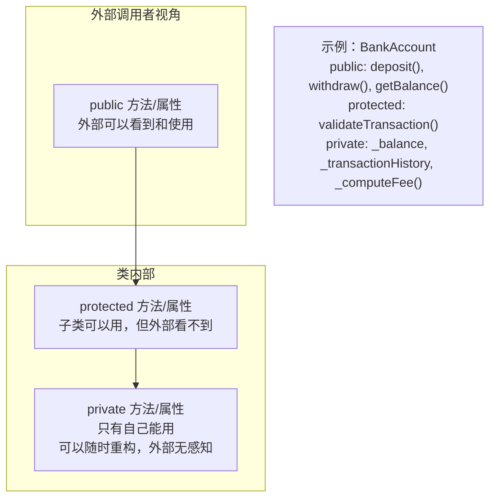

# 封装（Encapsulation）

## 核心思想

封装 = **隐藏内部实现，只暴露必要的接口**。

就像汽车方向盘：你只需要知道"转方向盘可以转弯"，不需要知道转向机构怎么工作。封装的目的不是"保密"，而是：
1. **保护不变量**（invariants）：对象的内部状态始终合法
2. **降低耦合**：调用者不依赖内部实现，内部改了不影响调用者
3. **简化接口**：只暴露"有意义的操作"

---

## TypeScript 访问修饰符

```typescript
class BankAccount {
  public    readonly id:      string;    // 任何地方可读，不可写
  private           balance:  number;    // 只有类内部可访问
  protected         owner:    string;    // 类内部 + 子类可访问
  private readonly  createdAt: Date;     // 只读且私有（常量字段）

  // 构造函数参数简写：自动创建 private 字段
  constructor(
    id: string,
    private readonly bankCode: string,  // ← 自动创建 private readonly bankCode
    initialBalance: number
  ) {
    this.id        = id;
    this.balance   = initialBalance;
    this.createdAt = new Date();
    this.owner     = 'unknown';
  }
}
```

| 修饰符 | 类内部 | 子类 | 外部 |
|--------|--------|------|------|
| `public`（默认）| ✅ | ✅ | ✅ |
| `protected` | ✅ | ✅ | ❌ |
| `private` | ✅ | ❌ | ❌ |
| `readonly` | 可读不可写 | — | — |

---

## 不变量（Invariant）保护

不变量是**对象任何时候都必须满足的条件**。封装的核心价值就是保护这些条件。

### 反例：没有封装

```typescript
// ❌ 完全暴露内部状态，没有任何保护
class Temperature {
  celsius: number = 0; // public 字段
}

const t = new Temperature();
t.celsius = -999; // 物理上不可能！没有任何保护
```

### 正例：封装保护不变量

```typescript
// ✅ 封装：外部只能通过受控接口修改状态
class Temperature {
  private _celsius: number;

  // 绝对零度是物理下限：-273.15°C
  static readonly ABSOLUTE_ZERO = -273.15;

  constructor(celsius: number) {
    this._celsius = this.validate(celsius);
  }

  get celsius(): number  { return this._celsius; }
  get fahrenheit(): number { return this._celsius * 9/5 + 32; }
  get kelvin(): number   { return this._celsius - Temperature.ABSOLUTE_ZERO; }

  set celsius(value: number) {
    this._celsius = this.validate(value);
  }

  private validate(value: number): number {
    if (value < Temperature.ABSOLUTE_ZERO) {
      throw new RangeError(`Temperature cannot be below absolute zero (${Temperature.ABSOLUTE_ZERO}°C)`);
    }
    return value;
  }

  toString() { return `${this._celsius}°C / ${this.fahrenheit}°F`; }
}

const t = new Temperature(20);
console.log(t.fahrenheit); // 68
// t.celsius = -999; // ❌ 抛出 RangeError：保护了不变量
```

---

## Getter / Setter 的正确用法

很多人认为"有 `private` 字段 + `get/set` 就是封装"，这是误解。如果 setter 只是简单赋值，那和 `public` 字段没什么区别。

### Getter 的三个合理用途

```typescript
class Circle {
  constructor(private _radius: number) {
    if (_radius <= 0) throw new Error('Radius must be positive');
  }

  // 用途1：暴露只读（不提供 setter）
  get radius() { return this._radius; }

  // 用途2：计算派生值（不需要存储）
  get area()        { return Math.PI * this._radius ** 2; }
  get circumference() { return 2 * Math.PI * this._radius; }

  // 用途3：格式化输出
  get description() { return `Circle with radius ${this._radius.toFixed(2)}`; }
}

// 用途4（反例）：没意义的 setter，和 public 等价
class BadExample {
  private _name: string = '';
  get name() { return this._name; }
  set name(v: string) { this._name = v; } // ❌ 没有任何验证，形同虚设
}
```

### Setter 的正确用法：包含验证逻辑

```typescript
class Username {
  private _value: string;

  constructor(value: string) { this._value = this.validate(value); }

  get value() { return this._value; }

  set value(v: string) {
    this._value = this.validate(v); // ✅ setter 包含业务规则
  }

  private validate(v: string): string {
    if (v.length < 3)  throw new Error('Username must be at least 3 characters');
    if (v.length > 20) throw new Error('Username must be at most 20 characters');
    if (!/^[a-zA-Z0-9_]+$/.test(v)) throw new Error('Username can only contain letters, numbers, and underscores');
    return v.toLowerCase();
  }
}
```

---

## 信息隐藏的层次



---

## 实战：设计一个封装良好的 Stack

```typescript
class Stack<T> {
  private items: T[] = [];
  private readonly maxSize: number;

  constructor(maxSize = Infinity) {
    this.maxSize = maxSize;
  }

  push(item: T): void {
    if (this.isFull()) throw new Error('Stack overflow');
    this.items.push(item);
  }

  pop(): T {
    if (this.isEmpty()) throw new Error('Stack underflow');
    return this.items.pop()!;
  }

  peek(): T {
    if (this.isEmpty()) throw new Error('Stack is empty');
    return this.items[this.items.length - 1];
  }

  isEmpty(): boolean { return this.items.length === 0; }
  isFull():  boolean { return this.items.length >= this.maxSize; }
  size():    number  { return this.items.length; }

  // 迭代器：让外部能遍历，但不能直接修改内部数组
  [Symbol.iterator](): Iterator<T> {
    let index = this.items.length - 1; // 栈顶到栈底
    const items = this.items;
    return {
      next(): IteratorResult<T> {
        if (index >= 0) return { value: items[index--], done: false };
        return { value: undefined as any, done: true };
      }
    };
  }

  // toString 不暴露内部数组引用
  toString(): string {
    return `Stack[${[...this.items].reverse().join(' → ')}]`;
  }
}

const stack = new Stack<number>(3);
stack.push(1);
stack.push(2);
stack.push(3);
// stack.push(4); // ❌ Stack overflow

for (const item of stack) {
  console.log(item); // 3, 2, 1（栈顶到栈底）
}
// stack.items.push(999); // ❌ 编译错误：items 是 private
```

---

## 常见错误

### 错误1：暴露可变的内部集合

```typescript
class Library {
  private books: string[] = [];

  // ❌ 返回内部数组的引用：外部可以修改！
  getBooks(): string[] { return this.books; }

  // ✅ 返回副本（或只读视图）
  getBooks(): readonly string[] { return [...this.books]; }
  // 或
  getBooks(): ReadonlyArray<string> { return this.books; }
}

const lib = new Library();
const books = lib.getBooks();
books.push('Evil Book'); // 如果返回的是副本，这不影响内部状态
```

### 错误2：过度封装（封装一切）

```typescript
// ❌ 过度封装：简单的值对象，没必要用 getter/setter
class Point {
  private _x: number;
  private _y: number;
  constructor(x: number, y: number) { this._x = x; this._y = y; }
  get x() { return this._x; }
  get y() { return this._y; }
  // 这些 getter 没有任何附加价值，不如直接用 public readonly
}

// ✅ 简单值对象用 public readonly（不可变）
class Point {
  constructor(
    public readonly x: number,
    public readonly y: number
  ) {}
  
  distanceTo(other: Point): number {
    return Math.sqrt((this.x - other.x) ** 2 + (this.y - other.y) ** 2);
  }
}
```

---

## 本章小结

| 原则 | 做法 |
|------|------|
| 默认私有 | 字段默认 `private`，只在需要时才暴露 |
| 不变量保护 | 所有状态改变通过方法（设 `private` 字段，用方法修改）|
| 不泄露内部结构 | 集合字段返回副本或 `readonly` 视图 |
| Setter 要有价值 | 只在需要验证/转换时才写 setter |
| 值对象可以用 `public readonly` | 不可变的简单数据不需要 getter |
