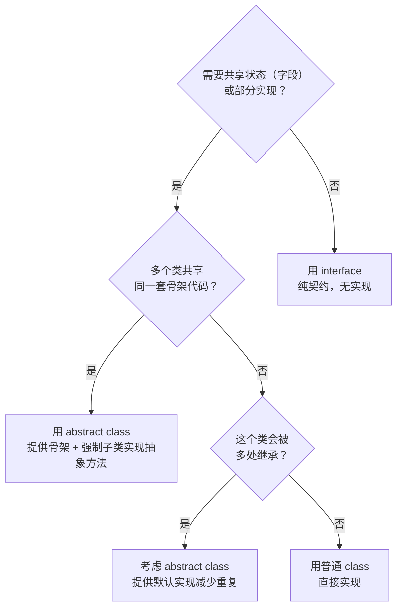

# 抽象（Abstraction）

## 核心思想

抽象 = **只暴露"是什么"，隐藏"怎么做"**。

类比：你知道"按下电源键电脑会启动"，但你不需要知道 BIOS 初始化、操作系统加载的每一个步骤。抽象让你**用高层语言思考**，而不是陷入底层细节。

```
高层：payment.process()           ← 你关心的
低层：TCP 连接 → TLS 握手 → HTTP POST → JSON 解析 → 数据库写入  ← 被隐藏的
```

---

## abstract class：有部分实现的抽象

`abstract class` 是一个**不完整的类**：它提供了部分实现（共用代码），但留下一些"空白"（abstract 方法）给子类填写。

```typescript
abstract class Report {
  // ── 已实现的方法（共用逻辑）────────────────────────
  generate(): string {
    const header = this.buildHeader();  // 调用抽象方法（子类实现）
    const body   = this.buildBody();
    const footer = this.buildFooter();
    return [header, body, footer].join('\n');
  }

  protected buildHeader(): string {
    return `=== ${this.title()} ===\nGenerated: ${new Date().toISOString()}`;
  }

  protected buildFooter(): string {
    return '=== End of Report ===';
  }

  // ── 抽象方法（强制子类实现）─────────────────────────
  abstract title(): string;
  abstract buildBody(): string;
}

// 子类只需要填写"空白"，不需要关心 header/footer 格式
class SalesReport extends Report {
  constructor(private data: { month: string; revenue: number }) { super(); }
  title()     { return `Sales Report - ${this.data.month}`; }
  buildBody() { return `Total Revenue: $${this.data.revenue.toLocaleString()}`; }
}

class InventoryReport extends Report {
  constructor(private items: number) { super(); }
  title()     { return 'Inventory Report'; }
  buildBody() { return `Total Items in Stock: ${this.items}`; }
}

const report = new SalesReport({ month: 'Q4 2024', revenue: 1_500_000 });
console.log(report.generate());
// === Sales Report - Q4 2024 ===
// Generated: 2024-01-15T00:00:00.000Z
// Total Revenue: $1,500,000
// === End of Report ===
```

---

## interface：纯契约，无实现

`interface` 只描述"能做什么"，不包含任何实现。

```typescript
interface Serializable {
  serialize(): string;
  deserialize(data: string): void;
}

interface Comparable<T> {
  compareTo(other: T): number;  // 负数=小于，0=等于，正数=大于
}

// 一个类可以实现多个接口（TypeScript 支持）
class Temperature implements Serializable, Comparable<Temperature> {
  constructor(private celsius: number) {}

  serialize(): string {
    return JSON.stringify({ celsius: this.celsius });
  }

  deserialize(data: string): void {
    this.celsius = JSON.parse(data).celsius;
  }

  compareTo(other: Temperature): number {
    return this.celsius - other.celsius;
  }
}
```

---

## 关键决策：interface vs abstract class？



**经验法则（记住这两句话）：**
- `interface` → 定义**能力**（Printable, Serializable, Comparable）
- `abstract class` → 定义**骨架**（Template Method 模式的基础）

---

## 接口的高级用法

### 1. 接口继承接口

```typescript
interface Animal {
  name: string;
  eat(): void;
}

interface Pet extends Animal {
  owner: string;
  respond(): void;  // 宠物会响应主人
}

interface ServiceAnimal extends Pet {
  task: string;     // 导盲犬、警犬等有特定任务
  certificationId: string;
}
```

### 2. 用接口描述函数类型

```typescript
// 描述一个"策略函数"的签名
interface SortStrategy<T> {
  (items: T[], comparator: (a: T, b: T) => number): T[];
}

const bubbleSort: SortStrategy<number> = (items, cmp) => {
  const arr = [...items];
  for (let i = 0; i < arr.length; i++) {
    for (let j = 0; j < arr.length - i - 1; j++) {
      if (cmp(arr[j], arr[j + 1]) > 0) {
        [arr[j], arr[j + 1]] = [arr[j + 1], arr[j]];
      }
    }
  }
  return arr;
};
```

### 3. 接口作为依赖注入的边界

```typescript
// 高层模块依赖接口，而不是具体实现
interface Logger {
  info(msg: string): void;
  error(msg: string, err?: Error): void;
}

// 生产环境：写文件
class FileLogger implements Logger {
  info(msg: string)               { /* 写文件 */ }
  error(msg: string, err?: Error) { /* 写文件 */ }
}

// 测试环境：记录调用（方便断言）
class MockLogger implements Logger {
  calls: Array<{ level: string; msg: string }> = [];
  info(msg: string)  { this.calls.push({ level: 'info', msg }); }
  error(msg: string) { this.calls.push({ level: 'error', msg }); }
}

class OrderService {
  constructor(private logger: Logger) {}  // 依赖接口，不依赖具体实现

  placeOrder(orderId: string): void {
    this.logger.info(`Order ${orderId} placed`);
    // ...
  }
}

// 生产
const service = new OrderService(new FileLogger());
// 测试
const mock    = new MockLogger();
const testSvc = new OrderService(mock);
testSvc.placeOrder('ORD-001');
console.log(mock.calls); // [{ level: 'info', msg: 'Order ORD-001 placed' }]
```

---

## abstract class 的三种使用场景

### 场景1：Template Method 模式（骨架算法）

```typescript
abstract class DataMigration {
  // 模板方法：定义步骤顺序（final，不允许子类重写）
  async run(): Promise<void> {
    await this.connect();
    const data = await this.extract();
    const transformed = this.transform(data);
    await this.load(transformed);
    await this.disconnect();
  }

  protected abstract connect(): Promise<void>;
  protected abstract extract(): Promise<unknown[]>;
  protected abstract transform(data: unknown[]): unknown[];
  protected abstract load(data: unknown[]): Promise<void>;

  // 默认实现（子类可以覆盖）
  protected async disconnect(): Promise<void> {
    console.log('Disconnected');
  }
}

class MySQLToPostgresMigration extends DataMigration {
  protected async connect()      { /* 连接两个数据库 */ return; }
  protected async extract()      { return [/* 从 MySQL 读数据 */]; }
  protected transform(data: any[]){ return data.map(/* 格式转换 */); }
  protected async load(data: any[]){ /* 写入 PostgreSQL */ return; }
}
```

### 场景2：提供合理的默认实现

```typescript
abstract class HttpHandler {
  // 大部分 handler 都用这个默认错误处理，少数才需要覆盖
  protected handleError(err: Error): Response {
    return { status: 500, body: 'Internal Server Error' };
  }

  // 大部分 handler 需要自定义的核心逻辑
  abstract handle(request: Request): Response;
}

type Request  = { path: string; method: string };
type Response = { status: number; body: string };
```

### 场景3：强制约束子类必须实现某些方法

```typescript
abstract class PaymentGateway {
  // 强制所有支付网关都必须实现这三个方法
  abstract charge(amount: number, token: string): Promise<string>;  // 返回 transactionId
  abstract refund(transactionId: string, amount: number): Promise<void>;
  abstract getStatus(transactionId: string): Promise<'pending' | 'success' | 'failed'>;
}

// 如果子类漏写了任何一个 → TypeScript 编译报错
class StripeGateway extends PaymentGateway {
  async charge(amount: number, token: string) { return 'stripe-txn-001'; }
  async refund(txnId: string, amount: number) { /* ... */ }
  async getStatus(txnId: string) { return 'success' as const; }
}
```

---

## 抽象层次（Levels of Abstraction）

好的代码，每一层只处理同一层次的抽象，不混用。

```typescript
// ❌ 混用高低层抽象（同一方法里既有业务逻辑，又有 SQL）
async function processOrder(orderId: string) {
  const conn = await db.connect('mysql://...');  // 低层：数据库连接
  const [rows] = await conn.query('SELECT * FROM orders WHERE id = ?', [orderId]);
  if (rows[0].status === 'pending') {            // 高层：业务逻辑
    await conn.query('UPDATE orders SET status=? WHERE id=?', ['processing', orderId]);
    await sendEmail(rows[0].userId, 'Order confirmed');
  }
}

// ✅ 抽象层次一致：processOrder 只包含高层业务逻辑
async function processOrder(orderId: string) {
  const order = await orderRepo.findById(orderId);   // 高层
  if (order.isPending()) {                            // 高层
    await order.startProcessing();                    // 高层
    await notificationSvc.notifyOrderConfirmed(order.userId); // 高层
  }
}
// 数据库细节在 orderRepo 内部处理（低层，被封装了）
```

---

## 本章小结

| 概念 | 关键词 | 用途 |
|------|--------|------|
| `interface` | 纯契约 | 定义能力，依赖注入边界，多实现 |
| `abstract class` | 骨架 + 强制 | 共享代码，Template Method，约束子类 |
| 抽象层次 | 一致性 | 每个方法只处理同一层次的概念 |
