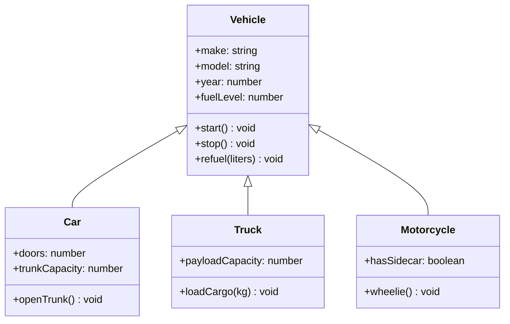
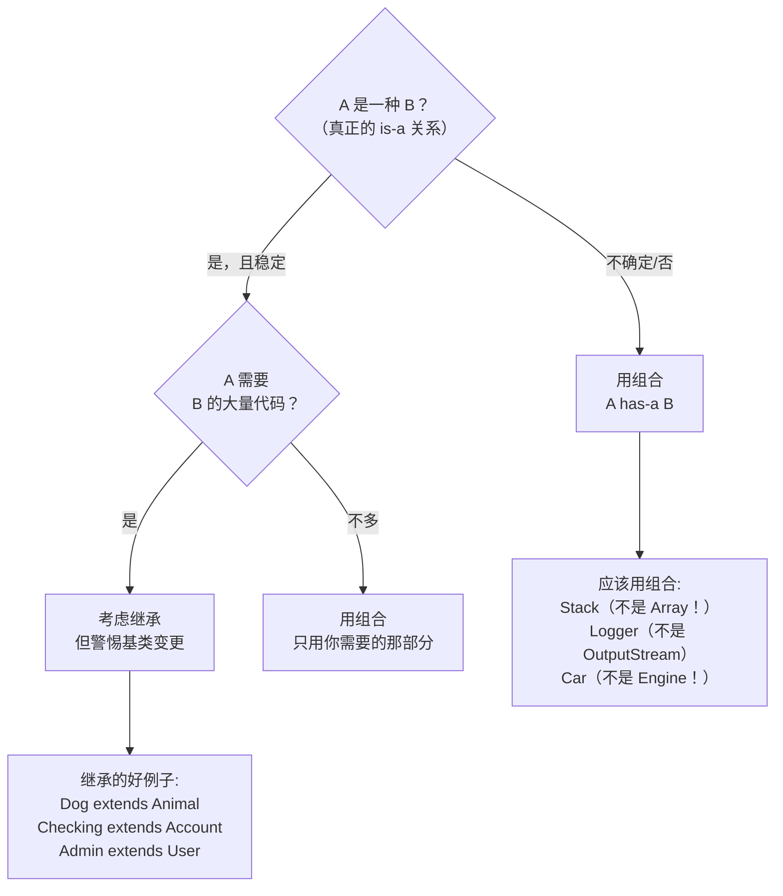

# 继承与组合（Inheritance & Composition）

## 核心思想

继承（Inheritance）是 OOP 最著名的特性，也是**最容易被滥用**的特性。

现代 OOD 的黄金原则：**优先组合，而不是继承（Composition over Inheritance）**。

---

## 继承基础

```typescript
class Animal {
  constructor(
    protected name: string,
    protected age: number
  ) {}

  eat(): void { console.log(`${this.name} is eating`); }
  sleep(): void { console.log(`${this.name} is sleeping`); }

  toString(): string { return `${this.constructor.name}(${this.name}, ${this.age}yo)`; }
}

class Dog extends Animal {
  constructor(name: string, age: number, private breed: string) {
    super(name, age); // 必须调用父类构造函数
  }

  bark(): void { console.log(`${this.name}: Woof!`); }

  // 重写（Override）：覆盖父类方法
  override toString(): string {
    return `${super.toString()} [${this.breed}]`; // 可以调用 super
  }
}

const dog = new Dog('Rex', 3, 'Labrador');
dog.eat();   // Animal 方法，Dog 继承了
dog.bark();  // Dog 自己的方法
console.log(dog.toString()); // Dog(Rex, 3yo) [Labrador]
console.log(dog instanceof Animal); // true
console.log(dog instanceof Dog);    // true
```

---

## 继承解决的问题：代码复用



`start()`、`stop()`、`refuel()` 的实现在 `Vehicle` 里写一次，所有子类都能用。这是继承的正当理由：**真正的 is-a 关系 + 有实质性的共用代码**。

---

## 继承的陷阱：脆弱的基类（Fragile Base Class）

```typescript
class CountingList<T> extends Array<T> {
  private count = 0;

  override push(...items: T[]): number {
    this.count += items.length;
    return super.push(...items);
  }

  override unshift(...items: T[]): number {
    this.count += items.length;
    return super.unshift(...items);
  }

  getCount(): number { return this.count; }
}

const list = new CountingList<number>();
list.push(1, 2, 3);      // count += 3 ✓
list.unshift(0);         // count += 1 ✓
console.log(list.getCount()); // 4 ✓

// 但是：
list.splice(0, 2);       // count 没有更新！splice 不知道要维护 count
console.log(list.getCount()); // 仍然是 4，实际长度是 2 ❌
// 继承了 Array 的内部实现，但无法控制所有修改路径
```

**问题根源**：基类（`Array`）的内部方法可能互相调用，子类只重写了部分，导致不一致。

---

## Composition over Inheritance

**组合**：持有另一个对象的引用，通过委托（delegation）使用其功能。

```typescript
// ❌ 继承方式（脆弱）
class LoggingList<T> extends Array<T> {
  override push(...items: T[]) {
    console.log(`Adding: ${items}`);
    return super.push(...items);
  }
}

// ✅ 组合方式（稳健）
class LoggingList<T> {
  private inner: T[] = [];           // 组合：持有数组引用

  push(...items: T[]): number {
    console.log(`Adding: ${items}`);
    return this.inner.push(...items); // 委托给内部数组
  }

  pop(): T | undefined {
    const item = this.inner.pop();
    if (item !== undefined) console.log(`Removed: ${item}`);
    return item;
  }

  get length() { return this.inner.length; }

  [Symbol.iterator]() { return this.inner[Symbol.iterator](); }
}
```

---

## 何时选继承，何时选组合？



**判断标准**：问自己"A IS-A B"还是"A HAS-A B"？

```
Dog IS-A Animal           → 继承 ✓
Stack IS-A Array?         → 不是，Stack IS-NOT-A Array → 组合
Stack HAS-A 内部存储       → 组合 ✓

Car IS-A Vehicle          → 继承 ✓
Car IS-A Engine?          → 不是，Car HAS-A Engine → 组合
```

---

## 经典陷阱：Square extends Rectangle

```typescript
// 数学上：正方形是特殊的长方形（is-a 关系）
class Rectangle {
  constructor(protected width: number, protected height: number) {}

  setWidth(w: number)  { this.width = w; }
  setHeight(h: number) { this.height = h; }
  area() { return this.width * this.height; }
}

class Square extends Rectangle {
  constructor(side: number) { super(side, side); }

  // 正方形要求宽高相等，所以覆盖 setter
  override setWidth(w: number) {
    this.width  = w;
    this.height = w; // 正方形：宽高必须相等
  }

  override setHeight(h: number) {
    this.width  = h;
    this.height = h;
  }
}

// 这段代码对 Rectangle 成立，但对 Square 不成立！
function testRectangle(rect: Rectangle): void {
  rect.setWidth(4);
  rect.setHeight(5);
  console.log(rect.area()); // 期望：20
}

testRectangle(new Rectangle(0, 0)); // 20 ✓
testRectangle(new Square(0));       // 25 ❌！违反了 Liskov 替换原则
```

**结论**：数学上的 is-a 不等于代码上的 is-a。如果子类改变了父类的行为契约，就不该用继承。Square 和 Rectangle 应该都实现 `Shape` 接口，而不是继承关系。

---

## Mixin：组合多个来源的能力（TypeScript 特有）

当你需要"多继承"时，TypeScript 推荐用 Mixin 模式：

```typescript
// 定义能力（Mixin）
type Constructor<T = {}> = new (...args: any[]) => T;

function Timestamped<TBase extends Constructor>(Base: TBase) {
  return class extends Base {
    createdAt: Date = new Date();
    updatedAt: Date = new Date();

    touch(): void { this.updatedAt = new Date(); }
  };
}

function Activatable<TBase extends Constructor>(Base: TBase) {
  return class extends Base {
    isActive: boolean = true;

    activate():   void { this.isActive = true; }
    deactivate(): void { this.isActive = false; }
  };
}

// 基础类
class User {
  constructor(public name: string) {}
}

// 组合多种能力（伪多继承）
const TimestampedActivatableUser = Activatable(Timestamped(User));

class AdminUser extends TimestampedActivatableUser {
  constructor(name: string, public role: string) { super(name); }
}

const admin = new AdminUser('Alice', 'superadmin');
console.log(admin.createdAt);  // Date
console.log(admin.isActive);   // true
admin.deactivate();
admin.touch();
```

---

## 组合的三种形式

```typescript
class Engine {
  start() { return 'Engine started'; }
  stop()  { return 'Engine stopped'; }
}

class GPS {
  getLocation() { return { lat: 0, lng: 0 }; }
}

// 形式1：强组合（Car 拥有 Engine，Engine 随 Car 销毁）
class Car {
  private engine = new Engine();          // 在构造时创建，生命周期绑定
  start() { return this.engine.start(); } // 委托
}

// 形式2：聚合（Car 使用 GPS，GPS 可独立存在）
class SmartCar {
  constructor(private gps: GPS) {}        // 外部传入，可共享
  getLocation() { return this.gps.getLocation(); }
}

// 形式3：依赖注入（通过接口组合，最灵活）
interface IEngine {
  start(): string;
  stop(): string;
}

class ElectricCar {
  constructor(private engine: IEngine) {} // 接口，不依赖具体实现
  start() { return this.engine.start(); }
}

// 可以注入不同的引擎实现
const gasEngine     = new Engine();
const electricMock  = { start: () => 'Silent start', stop: () => 'Silent stop' };
const car1 = new ElectricCar(gasEngine);
const car2 = new ElectricCar(electricMock);
```

---

## 本章小结

| 特性 | 继承 | 组合 |
|------|------|------|
| 关系 | is-a | has-a |
| 耦合度 | 高（与父类绑定）| 低（依赖接口）|
| 灵活性 | 低（编译时确定）| 高（运行时可替换）|
| 代码复用 | 自动继承所有方法 | 只用需要的方法 |
| 多来源 | TypeScript 不支持多继承 | 可以组合多个对象 |
| 适用 | 真正 is-a + 大量共用代码 | 大多数情况 |

**黄金原则**：如果你不确定用继承还是组合，**默认选组合**。
