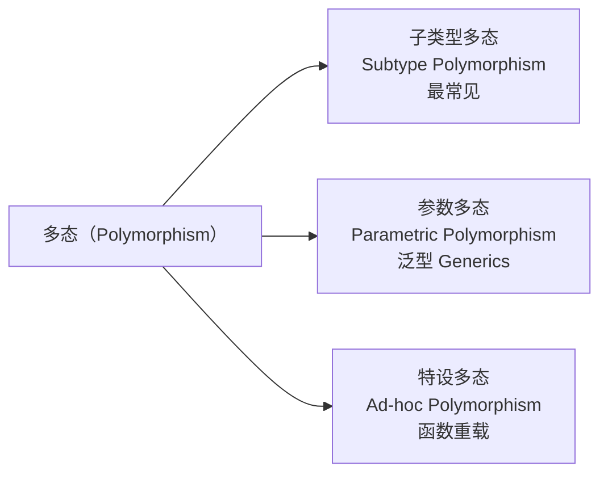

# 多态（Polymorphism）

## 核心思想

多态 = **同一接口，不同行为**。

`poly`（多）+ `morph`（形态）：同一个操作，作用在不同类型的对象上，产生不同的结果。

---

## 多态的三种类型



---

## 1. 子类型多态（最重要）

子类覆盖父类方法，通过父类引用调用时，执行的是子类的实现。

```typescript
abstract class Shape {
  abstract area(): number;
  abstract color: string;

  describe(): string {
    return `${this.constructor.name}[color=${this.color}, area=${this.area().toFixed(2)}]`;
  }
}

class Circle extends Shape {
  color = 'red';
  constructor(private radius: number) { super(); }
  area() { return Math.PI * this.radius ** 2; }
}

class Rectangle extends Shape {
  color = 'blue';
  constructor(private w: number, private h: number) { super(); }
  area() { return this.w * this.h; }
}

class Triangle extends Shape {
  color = 'green';
  constructor(private base: number, private height: number) { super(); }
  area() { return 0.5 * this.base * this.height; }
}

// 多态的核心：统一用 Shape[] 处理，不需要 if-else 判断类型
const shapes: Shape[] = [
  new Circle(5),
  new Rectangle(4, 6),
  new Triangle(3, 8),
];

// 运行时动态分派：调用哪个 area() 取决于对象的实际类型
const totalArea = shapes.reduce((sum, s) => sum + s.area(), 0);
console.log(`Total area: ${totalArea.toFixed(2)}`); // 103.54

shapes.forEach(s => console.log(s.describe()));
// Circle[color=red, area=78.54]
// Rectangle[color=blue, area=24.00]
// Triangle[color=green, area=12.00]
```

**多态的价值**：新增一个 `Hexagon` 类，不需要修改任何处理 `shapes` 的代码。

---

## 多态 vs if-else

多态是消灭 `instanceof` / `if-else` 型类型检查的工具。

```typescript
// ❌ 没有多态：每次新增类型都要修改这段代码（违反开闭原则）
function calculateArea(shape: any): number {
  if (shape instanceof Circle) {
    return Math.PI * shape.radius ** 2;
  } else if (shape instanceof Rectangle) {
    return shape.width * shape.height;
  } else if (shape instanceof Triangle) {
    return 0.5 * shape.base * shape.height;
  }
  // 每加一个新形状，这里就要加一个 else if...
  throw new Error('Unknown shape');
}

// ✅ 有多态：不需要 if-else，新增类型无需修改此函数
function calculateArea(shape: Shape): number {
  return shape.area(); // 多态分派，自动调用正确的实现
}
```

---

## 2. 参数多态（泛型）

泛型让你写出**对多种类型都有效的代码**，而不需要重复实现。

```typescript
// 没有泛型：为每种类型写一遍
class NumberStack {
  private items: number[] = [];
  push(item: number): void { this.items.push(item); }
  pop(): number | undefined { return this.items.pop(); }
}

class StringStack {
  private items: string[] = [];
  push(item: string): void { this.items.push(item); }
  pop(): string | undefined { return this.items.pop(); }
}

// ✅ 泛型：一次编写，对所有类型有效
class Stack<T> {
  private items: T[] = [];
  push(item: T): void { this.items.push(item); }
  pop(): T | undefined { return this.items.pop(); }
  peek(): T | undefined { return this.items[this.items.length - 1]; }
  isEmpty(): boolean { return this.items.length === 0; }
}

const nums    = new Stack<number>();
const strings = new Stack<string>();
const users   = new Stack<{ id: string; name: string }>();

nums.push(42);
strings.push('hello');
users.push({ id: '1', name: 'Alice' });
```

### 泛型约束（Bounded Generics）

```typescript
interface HasId {
  id: string;
}

// T 必须有 id 字段（约束）
class Repository<T extends HasId> {
  private store: Map<string, T> = new Map();

  save(entity: T): void {
    this.store.set(entity.id, entity); // 可以安全访问 entity.id
  }

  findById(id: string): T | undefined {
    return this.store.get(id);
  }

  findAll(): T[] {
    return [...this.store.values()];
  }
}

// 使用
interface User extends HasId { name: string; email: string; }
interface Product extends HasId { name: string; price: number; }

const userRepo    = new Repository<User>();
const productRepo = new Repository<Product>();

userRepo.save({ id: 'u1', name: 'Alice', email: 'alice@example.com' });
productRepo.save({ id: 'p1', name: 'Widget', price: 9.99 });
```

---

## 3. 特设多态（函数重载）

同一函数名，根据参数类型/数量执行不同逻辑。

```typescript
class DateFormatter {
  // TypeScript 重载签名（只是类型声明）
  format(date: Date): string;
  format(timestamp: number): string;
  format(year: number, month: number, day: number): string;

  // 实现签名（包含实际逻辑）
  format(dateOrTimestamp: Date | number, month?: number, day?: number): string {
    if (dateOrTimestamp instanceof Date) {
      return dateOrTimestamp.toLocaleDateString();
    }
    if (month !== undefined && day !== undefined) {
      return new Date(dateOrTimestamp, month - 1, day).toLocaleDateString();
    }
    return new Date(dateOrTimestamp).toLocaleDateString();
  }
}

const fmt = new DateFormatter();
fmt.format(new Date());           // 使用第一个重载
fmt.format(1700000000000);        // 使用第二个重载
fmt.format(2024, 12, 25);         // 使用第三个重载
```

---

## 运行时多态：动态分派机制

```mermaid
sequenceDiagram
    participant Code as 调用代码
    participant VTable as 虚函数表（VTable）
    participant Circle as Circle.area()
    participant Rect as Rectangle.area()

    Code->>VTable: shape.area()（shape 是 Shape 类型引用）
    Note over VTable: 运行时查找 shape 对象的实际类型\n→ Circle
    VTable->>Circle: 调用 Circle.area()
    Circle-->>Code: 返回 78.54

    Code->>VTable: shape.area()（同一行代码！）
    Note over VTable: 运行时查找 shape 对象的实际类型\n→ Rectangle
    VTable->>Rect: 调用 Rectangle.area()
    Rect-->>Code: 返回 24.00
```

---

## 接口多态：鸭子类型（Duck Typing）

TypeScript 是结构类型系统（Structural Typing）：只要形状匹配，就认为类型兼容——即使没有显式 `implements`。

```typescript
interface Drawable {
  draw(): void;
}

// 没有写 implements Drawable，但结构匹配
class Circle {
  draw(): void { console.log('Drawing circle'); }
}

class Image {
  draw(): void { console.log('Rendering image'); }
}

class Button {
  draw(): void { console.log('Rendering button'); }
  click(): void { console.log('Button clicked'); }
}

// TypeScript 允许：结构兼容即可
function renderAll(drawables: Drawable[]): void {
  drawables.forEach(d => d.draw());
}

// Circle、Image、Button 都有 draw()，都可以传入
renderAll([new Circle(), new Image(), new Button()]);
```

---

## 多态的实战：支付系统

```typescript
interface PaymentMethod {
  pay(amount: number): Promise<PaymentResult>;
  refund(transactionId: string, amount: number): Promise<void>;
  supports(currency: string): boolean;
}

interface PaymentResult {
  success: boolean;
  transactionId: string;
  message: string;
}

class CreditCard implements PaymentMethod {
  constructor(private cardToken: string) {}

  async pay(amount: number): Promise<PaymentResult> {
    // 调用 Stripe API
    return { success: true, transactionId: 'stripe-001', message: 'Charged' };
  }

  async refund(txnId: string, amount: number): Promise<void> {
    // 退款逻辑
  }

  supports(currency: string): boolean {
    return ['USD', 'EUR', 'GBP'].includes(currency);
  }
}

class Alipay implements PaymentMethod {
  async pay(amount: number): Promise<PaymentResult> {
    return { success: true, transactionId: 'alipay-001', message: '支付成功' };
  }

  async refund(txnId: string, amount: number): Promise<void> {
    // 支付宝退款
  }

  supports(currency: string): boolean {
    return currency === 'CNY';
  }
}

class Crypto implements PaymentMethod {
  constructor(private walletAddress: string) {}

  async pay(amount: number): Promise<PaymentResult> {
    return { success: true, transactionId: '0x' + Math.random().toString(16).slice(2), message: 'On-chain confirmed' };
  }

  async refund(): Promise<void> {
    throw new Error('Crypto payments are non-refundable');
  }

  supports(currency: string): boolean {
    return ['BTC', 'ETH', 'USDT'].includes(currency);
  }
}

// 多态：同一接口处理所有支付方式
class PaymentProcessor {
  constructor(private methods: PaymentMethod[]) {}

  async processPayment(amount: number, currency: string): Promise<PaymentResult> {
    const method = this.methods.find(m => m.supports(currency));
    if (!method) throw new Error(`No payment method supports ${currency}`);
    return method.pay(amount);  // 多态调用
  }
}

const processor = new PaymentProcessor([
  new CreditCard('tok_xxx'),
  new Alipay(),
  new Crypto('0xABC...'),
]);

// 运行时根据货币选择支付方式，调用者不需要关心具体实现
await processor.processPayment(100, 'CNY');  // → Alipay.pay()
await processor.processPayment(100, 'USD');  // → CreditCard.pay()
await processor.processPayment(0.1, 'ETH');  // → Crypto.pay()
```

---

## 多态的反模式：条件分派

```typescript
// ❌ 用类型判断替代多态（每加一种支付方式都要改这里）
async function processPayment(method: string, amount: number) {
  if (method === 'credit_card') {
    // 信用卡逻辑
  } else if (method === 'alipay') {
    // 支付宝逻辑
  } else if (method === 'crypto') {
    // 加密货币逻辑
  }
  // 要加 PayPal？这里又要加 else if...
}

// ✅ 多态分派（新增支付方式只需新增一个类）
async function processPayment(method: PaymentMethod, amount: number) {
  return method.pay(amount); // 干净，封闭，可扩展
}
```

---

## 本章小结

| 多态类型 | TypeScript 实现 | 用途 |
|---------|----------------|------|
| 子类型多态 | `extends` / `implements` + 方法重写 | 消灭 if-else，统一处理不同类型 |
| 参数多态（泛型）| `<T>` / `<T extends Constraint>` | 复用逻辑，类型安全 |
| 特设多态（重载）| 函数重载签名 | 同名函数处理不同参数类型 |
| 鸭子类型 | TypeScript 结构类型系统 | 无需显式声明，结构匹配即可 |

**多态的本质**：让调用者写出对**未来新类型**也有效的代码，而不需要修改调用者。
