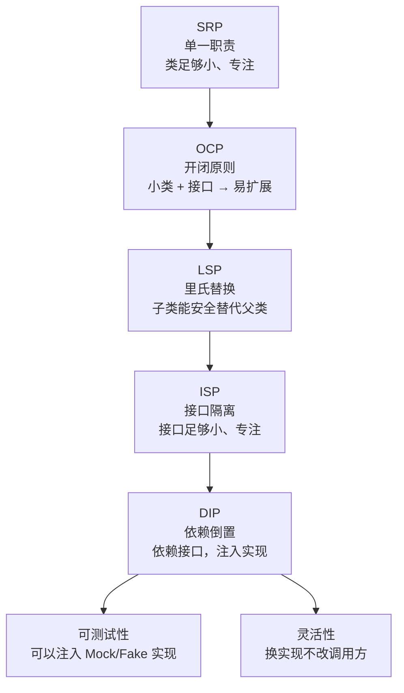

# SOLID 五大原则

## 什么是 SOLID？

SOLID 是 5 个设计原则的首字母缩写，由 Robert C. Martin（Uncle Bob）提出。它们是面向对象设计的**实践指南**，目标是写出**低耦合、易扩展、易测试**的代码。

```
S — Single Responsibility Principle  单一职责原则
O — Open/Closed Principle            开闭原则
L — Liskov Substitution Principle    里氏替换原则
I — Interface Segregation Principle  接口隔离原则
D — Dependency Inversion Principle   依赖倒置原则
```

---

## S：单一职责原则（SRP）

**一个类只有一个变化的原因**（只做一件事）。

不是说"一个类只有一个方法"，而是说这个类**只负责一个业务关注点**。

```typescript
// ❌ 违反 SRP：User 同时负责"用户数据"和"数据库操作"和"邮件发送"
class User {
  constructor(public name: string, public email: string) {}

  // 职责1：用户数据
  validate(): boolean { return this.email.includes('@'); }

  // 职责2：数据库操作（User 不该知道 SQL！）
  save(): void {
    db.query(`INSERT INTO users (name, email) VALUES (?, ?)`, [this.name, this.email]);
  }

  // 职责3：邮件发送（User 不该知道邮件！）
  sendWelcomeEmail(): void {
    emailService.send(this.email, 'Welcome!', `Hello ${this.name}`);
  }
}

// ✅ SRP：每个类只有一个职责
class User {
  constructor(
    public readonly name: string,
    public readonly email: string
  ) {}

  isValid(): boolean { return this.email.includes('@') && this.name.length > 0; }
}

class UserRepository {
  save(user: User): void {
    db.query('INSERT INTO users (name, email) VALUES (?, ?)', [user.name, user.email]);
  }
  findByEmail(email: string): User | null { /* ... */ return null; }
}

class UserEmailService {
  sendWelcome(user: User): void {
    emailService.send(user.email, 'Welcome!', `Hello ${user.name}`);
  }
}
```

**如何判断是否违反 SRP？**  
问自己：这个类有几个不同的**业务原因**需要修改？超过一个就违反了。

---

## O：开闭原则（OCP）

**对扩展开放，对修改关闭**。增加新功能时，应该新增代码（新类），而不是修改已有代码。

```typescript
// ❌ 违反 OCP：每次新增优惠类型，都要修改 calculateDiscount
function calculateDiscount(user: User, orderAmount: number): number {
  if (user.type === 'vip') {
    return orderAmount * 0.1;
  } else if (user.type === 'member') {
    return orderAmount * 0.05;
  } else if (user.type === 'student') {    // 又加了一种
    return orderAmount * 0.15;
  }
  return 0;
}

// ✅ OCP：新增优惠类型只需新增一个类，不修改已有代码
interface DiscountStrategy {
  calculate(orderAmount: number): number;
}

class VIPDiscount implements DiscountStrategy {
  calculate(amount: number) { return amount * 0.1; }
}

class MemberDiscount implements DiscountStrategy {
  calculate(amount: number) { return amount * 0.05; }
}

class StudentDiscount implements DiscountStrategy {
  calculate(amount: number) { return amount * 0.15; }
}

// 新增"员工折扣"：只需加这一个类，其他代码不变
class EmployeeDiscount implements DiscountStrategy {
  calculate(amount: number) { return amount * 0.3; }
}

function calculateDiscount(strategy: DiscountStrategy, amount: number): number {
  return strategy.calculate(amount); // 不需要修改
}
```

---

## L：里氏替换原则（LSP）

**子类必须能完全替代父类**，不能改变父类的行为契约。

简单说：如果一段代码用了 `Animal`，把 `Animal` 换成 `Dog`（Animal 的子类），程序应该仍然正常运行。

```typescript
class Rectangle {
  constructor(protected width: number, protected height: number) {}

  setWidth(w: number)  { this.width = w; }
  setHeight(h: number) { this.height = h; }

  area(): number { return this.width * this.height; }
}

// ❌ 违反 LSP：Square 改变了父类的行为契约
class Square extends Rectangle {
  setWidth(w: number) {
    this.width  = w;
    this.height = w; // 改变了父类约定：设置宽不影响高
  }
  setHeight(h: number) {
    this.width  = h;
    this.height = h;
  }
}

function testArea(rect: Rectangle): void {
  rect.setWidth(4);
  rect.setHeight(5);
  // 对 Rectangle：期望 20
  // 对 Square：得到 25（违反了调用者的期望！）
  console.assert(rect.area() === 20, `Expected 20, got ${rect.area()}`);
}

testArea(new Rectangle(0, 0)); // ✓
testArea(new Square(0));       // ❌ 断言失败

// ✅ 符合 LSP：不用继承，都实现 Shape 接口
interface Shape {
  area(): number;
}

class Rectangle implements Shape {
  constructor(private width: number, private height: number) {}
  setWidth(w: number)  { this.width = w; }
  setHeight(h: number) { this.height = h; }
  area() { return this.width * this.height; }
}

class Square implements Shape {
  constructor(private side: number) {}
  setSide(s: number) { this.side = s; }
  area() { return this.side ** 2; }
}
```

**LSP 的检验方法**：  
子类是否满足父类的所有"前置条件"和"后置条件"？子类能否抛出父类不曾抛出的异常？如果是，就违反了 LSP。

---

## I：接口隔离原则（ISP）

**不应该强迫客户端依赖它不使用的方法**。一个大接口拆成多个小接口，比一个"胖接口"更好。

```typescript
// ❌ 违反 ISP："胖接口"，不是每个动物都会游泳和飞
interface Animal {
  eat(): void;
  sleep(): void;
  swim(): void;  // 猫不会游泳！
  fly(): void;   // 狗不会飞！
}

class Cat implements Animal {
  eat()   { console.log('Cat eating'); }
  sleep() { console.log('Cat sleeping'); }
  swim()  { throw new Error('Cats cannot swim!'); } // ❌ 被迫实现
  fly()   { throw new Error('Cats cannot fly!'); }  // ❌ 被迫实现
}

// ✅ ISP：按能力拆分接口
interface Eatable  { eat(): void; }
interface Sleepable { sleep(): void; }
interface Swimmable { swim(): void; }
interface Flyable   { fly(): void; }

// 每个类只实现它有的能力
class Cat implements Eatable, Sleepable {
  eat()   { console.log('Cat eating'); }
  sleep() { console.log('Cat sleeping'); }
}

class Duck implements Eatable, Sleepable, Swimmable, Flyable {
  eat()   { console.log('Duck eating'); }
  sleep() { console.log('Duck sleeping'); }
  swim()  { console.log('Duck swimming'); }
  fly()   { console.log('Duck flying'); }
}

class Fish implements Eatable, Swimmable {
  eat()  { console.log('Fish eating'); }
  swim() { console.log('Fish swimming'); }
}

// 函数只依赖它需要的接口
function makeSwim(animal: Swimmable): void {
  animal.swim();
}

makeSwim(new Duck()); // ✓
makeSwim(new Fish()); // ✓
// makeSwim(new Cat()); // ❌ 编译错误：Cat 不实现 Swimmable（正确！）
```

---

## D：依赖倒置原则（DIP）

**高层模块不应该依赖低层模块，两者都应该依赖抽象**。

```
传统（违反 DIP）：
  高层 OrderService → 低层 MySQLDatabase
  
依赖倒置：
  高层 OrderService → 抽象 IDatabase ← 低层 MySQLDatabase
                                       ← 低层 MongoDatabase（可替换！）
```

```typescript
// ❌ 违反 DIP：OrderService 直接依赖 MySQLDatabase
class MySQLDatabase {
  query(sql: string): any[] { /* MySQL 实现 */ return []; }
}

class OrderService {
  private db = new MySQLDatabase(); // 高层直接依赖低层

  getOrder(id: string) {
    return this.db.query(`SELECT * FROM orders WHERE id = '${id}'`);
  }
}
// 要换 MongoDB？需要修改 OrderService 的源代码！

// ✅ DIP：高层依赖接口，低层实现接口
interface IOrderRepository {
  findById(id: string): Order | null;
  save(order: Order): void;
  delete(id: string): void;
}

// 低层：具体实现
class MySQLOrderRepository implements IOrderRepository {
  findById(id: string) { /* MySQL 查询 */ return null; }
  save(order: Order)   { /* MySQL 写入 */ }
  delete(id: string)   { /* MySQL 删除 */ }
}

class MongoOrderRepository implements IOrderRepository {
  findById(id: string) { /* MongoDB 查询 */ return null; }
  save(order: Order)   { /* MongoDB 写入 */ }
  delete(id: string)   { /* MongoDB 删除 */ }
}

class InMemoryOrderRepository implements IOrderRepository {
  private store = new Map<string, Order>();
  findById(id: string) { return this.store.get(id) ?? null; }
  save(order: Order)   { this.store.set(order.id, order); }
  delete(id: string)   { this.store.delete(id); }
}

// 高层：依赖接口（通过构造函数注入）
class OrderService {
  constructor(private repo: IOrderRepository) {} // ← 依赖抽象，不依赖实现

  getOrder(id: string): Order | null {
    return this.repo.findById(id);
  }
}

interface Order { id: string; amount: number; }

// 生产环境
const prodService = new OrderService(new MySQLOrderRepository());
// 测试环境（不需要真实数据库）
const testService = new OrderService(new InMemoryOrderRepository());
// 切换到 MongoDB：只换注入的实现，OrderService 代码不变
const mongoService = new OrderService(new MongoOrderRepository());
```

---

## SOLID 的关系



---

## 综合示例：用 SOLID 设计通知系统

```typescript
// SRP：每个类只做一件事
class Notification {
  constructor(
    public readonly id:        string,
    public readonly recipient: string,
    public readonly subject:   string,
    public readonly body:      string,
    public readonly channel:   'email' | 'sms' | 'push'
  ) {}
}

// ISP：按渠道拆接口，而不是一个大接口
interface EmailSender { sendEmail(to: string, subject: string, body: string): Promise<void>; }
interface SmsSender   { sendSms(to: string, body: string): Promise<void>; }
interface PushSender  { sendPush(deviceToken: string, title: string, body: string): Promise<void>; }

// OCP + LSP：新增渠道只需实现对应接口，不改现有代码
class SendgridEmailSender implements EmailSender {
  async sendEmail(to: string, subject: string, body: string): Promise<void> {
    console.log(`[SendGrid] → ${to}: ${subject}`);
  }
}

class TwilioSmsSender implements SmsSender {
  async sendSms(to: string, body: string): Promise<void> {
    console.log(`[Twilio SMS] → ${to}: ${body}`);
  }
}

class FirebasePushSender implements PushSender {
  async sendPush(token: string, title: string, body: string): Promise<void> {
    console.log(`[Firebase] → ${token}: ${title}`);
  }
}

// DIP：NotificationService 依赖接口，不依赖具体实现
class NotificationService {
  constructor(
    private emailSender: EmailSender,  // 接口
    private smsSender:   SmsSender,    // 接口
    private pushSender:  PushSender    // 接口
  ) {}

  async send(notification: Notification): Promise<void> {
    switch (notification.channel) {
      case 'email':
        return this.emailSender.sendEmail(notification.recipient, notification.subject, notification.body);
      case 'sms':
        return this.smsSender.sendSms(notification.recipient, notification.body);
      case 'push':
        return this.pushSender.sendPush(notification.recipient, notification.subject, notification.body);
    }
  }
}

// 生产
const svc = new NotificationService(
  new SendgridEmailSender(),
  new TwilioSmsSender(),
  new FirebasePushSender()
);

// 测试（注入 Mock，不发真实请求）
class MockEmailSender implements EmailSender {
  sent: Array<{ to: string; subject: string }> = [];
  async sendEmail(to: string, subject: string) {
    this.sent.push({ to, subject });
  }
}
```

---

## 速查表

| 原则 | 一句话 | 违反时的症状 |
|------|--------|------------|
| SRP | 一个类一个变化原因 | 改一个功能，意外影响另一个功能 |
| OCP | 新增功能加代码，不改旧代码 | 新需求每次都要改核心逻辑 |
| LSP | 子类能完全替代父类 | 子类方法抛出父类不曾抛的异常 |
| ISP | 接口只包含使用者需要的方法 | 实现类里有 `throw new Error('Not supported')` |
| DIP | 依赖接口，不依赖实现 | `new ConcreteClass()` 在高层模块里出现 |
