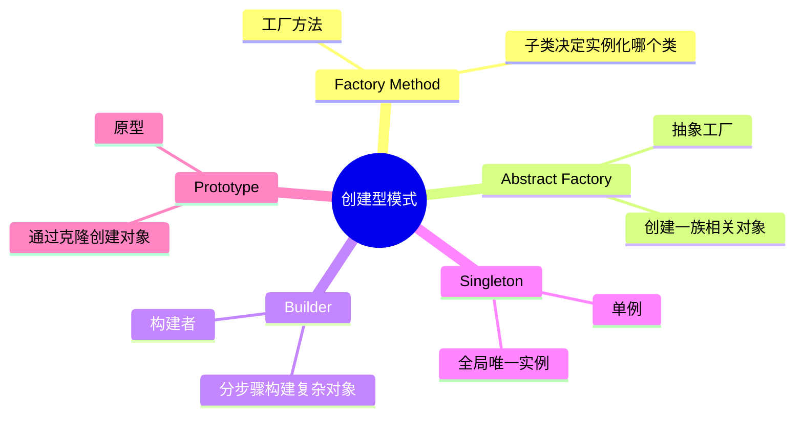
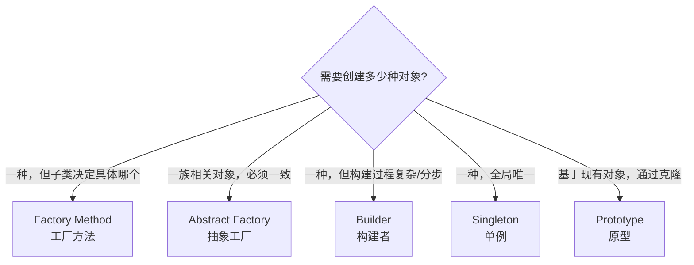

# 创建型模式（Creational Patterns）

## 概述

创建型模式解决**"怎么创建对象"**的问题。直接 `new` 一个对象会造成硬耦合——调用者需要知道具体类名、构造参数、复杂的初始化逻辑。创建型模式把这些细节封装起来。



---

## 1. Factory Method（工厂方法）

**问题**：创建对象时不想依赖具体类，让子类决定实例化哪个类。

```typescript
// 产品接口
interface Button {
  render(): string;
  onClick(): void;
}

// 具体产品
class WindowsButton implements Button {
  render()  { return '<button style="windows">Click</button>'; }
  onClick() { console.log('Windows button clicked'); }
}

class MacButton implements Button {
  render()  { return '<button style="mac">Click</button>'; }
  onClick() { console.log('Mac button clicked'); }
}

// 工厂（Creator）：定义工厂方法
abstract class UIFactory {
  // 工厂方法：子类实现
  abstract createButton(): Button;

  // 使用工厂方法的模板逻辑
  renderPage(): string {
    const button = this.createButton(); // 多态调用
    return `<page>${button.render()}</page>`;
  }
}

// 具体工厂：只需实现 createButton
class WindowsFactory extends UIFactory {
  createButton(): Button { return new WindowsButton(); }
}

class MacFactory extends UIFactory {
  createButton(): Button { return new MacButton(); }
}

// 使用
const factory: UIFactory = process.platform === 'darwin'
  ? new MacFactory()
  : new WindowsFactory();

console.log(factory.renderPage());
```

---

## 2. Abstract Factory（抽象工厂）

**问题**：需要创建**一族相关对象**（同一风格/平台），确保它们一起用不会风格冲突。

```typescript
// 一族产品的接口
interface Button    { render(): string; }
interface Checkbox  { check(): string; }
interface TextField { focus(): string; }

// Windows 风格的一族产品
class WinButton    implements Button   { render() { return '[Win Button]'; } }
class WinCheckbox  implements Checkbox { check()  { return '[Win Checkbox ✓]'; } }
class WinTextField implements TextField { focus()  { return '[Win TextField]'; } }

// Mac 风格的一族产品
class MacButton    implements Button   { render() { return '(Mac Button)'; } }
class MacCheckbox  implements Checkbox { check()  { return '(Mac Checkbox ✓)'; } }
class MacTextField implements TextField { focus()  { return '(Mac TextField)'; } }

// 抽象工厂：定义创建一族对象的接口
interface GUIFactory {
  createButton(): Button;
  createCheckbox(): Checkbox;
  createTextField(): TextField;
}

// 具体工厂：创建同一风格的所有组件
class WindowsGUIFactory implements GUIFactory {
  createButton()    { return new WinButton(); }
  createCheckbox()  { return new WinCheckbox(); }
  createTextField() { return new WinTextField(); }
}

class MacGUIFactory implements GUIFactory {
  createButton()    { return new MacButton(); }
  createCheckbox()  { return new MacCheckbox(); }
  createTextField() { return new MacTextField(); }
}

// 应用：只依赖工厂接口，不知道具体是 Win 还是 Mac
class Application {
  private button:    Button;
  private checkbox:  Checkbox;
  private textField: TextField;

  constructor(factory: GUIFactory) {
    this.button    = factory.createButton();
    this.checkbox  = factory.createCheckbox();
    this.textField = factory.createTextField();
  }

  render(): void {
    console.log(this.button.render());
    console.log(this.checkbox.check());
    console.log(this.textField.focus());
  }
}

const factory: GUIFactory = process.platform === 'darwin'
  ? new MacGUIFactory()
  : new WindowsGUIFactory();

new Application(factory).render();
```

**工厂方法 vs 抽象工厂：**

| | 工厂方法 | 抽象工厂 |
|--|--------|--------|
| 创建 | 一种产品 | 一族产品 |
| 扩展 | 加子类（工厂） | 加具体工厂 |
| 适用 | 单个对象的创建逻辑变化 | 多个相关对象需要保持一致风格 |

---

## 3. Builder（构建者）

**问题**：对象有很多可选参数，构造函数变成"Telescoping Constructor"（参数越来越多）。Builder 让你一步步构建，最后调用 `build()`。

```typescript
// 复杂对象：HTTP 请求（有很多可选配置）
class HttpRequest {
  readonly method:  string;
  readonly url:     string;
  readonly headers: Record<string, string>;
  readonly body:    string | undefined;
  readonly timeout: number;
  readonly retries: number;
  readonly auth:    string | undefined;

  // 私有构造函数，强制使用 Builder
  private constructor(config: {
    method:  string;
    url:     string;
    headers: Record<string, string>;
    body?:   string;
    timeout: number;
    retries: number;
    auth?:   string;
  }) {
    this.method  = config.method;
    this.url     = config.url;
    this.headers = config.headers;
    this.body    = config.body;
    this.timeout = config.timeout;
    this.retries = config.retries;
    this.auth    = config.auth;
  }

  static builder(method: string, url: string): HttpRequestBuilder {
    return new HttpRequestBuilder(method, url);
  }
}

class HttpRequestBuilder {
  private _headers: Record<string, string> = {};
  private _body:    string | undefined;
  private _timeout = 5000;
  private _retries = 0;
  private _auth:   string | undefined;

  constructor(
    private readonly method: string,
    private readonly url:    string
  ) {}

  // 链式调用（Fluent Interface）
  header(key: string, value: string): this {
    this._headers[key] = value;
    return this;
  }

  json(body: object): this {
    this._body    = JSON.stringify(body);
    this._headers['Content-Type'] = 'application/json';
    return this;
  }

  timeout(ms: number): this {
    if (ms <= 0) throw new Error('Timeout must be positive');
    this._timeout = ms;
    return this;
  }

  retry(count: number): this {
    this._retries = count;
    return this;
  }

  bearerToken(token: string): this {
    this._auth = `Bearer ${token}`;
    return this;
  }

  build(): HttpRequest {
    // 构建前验证
    if (!this.url.startsWith('http')) throw new Error('Invalid URL');
    return (HttpRequest as any).prototype.constructor.call(
      Object.create(HttpRequest.prototype), {
        method:  this.method,
        url:     this.url,
        headers: this._headers,
        body:    this._body,
        timeout: this._timeout,
        retries: this._retries,
        auth:    this._auth,
      }
    );
  }
}

// 使用：清晰、可读、每个参数都有名字
const request = HttpRequest.builder('POST', 'https://api.example.com/orders')
  .header('Accept', 'application/json')
  .json({ productId: 'P001', quantity: 2 })
  .timeout(3000)
  .retry(2)
  .bearerToken('my-secret-token')
  .build();
```

**Builder vs 直接构造函数：**

```typescript
// ❌ 可读性差：第几个参数是什么？
new HttpRequest('POST', 'https://...', {'Accept': 'application/json'}, '{"qty":2}', 3000, 2, 'Bearer xxx');

// ✅ 可读性好：每一步都清晰
HttpRequest.builder('POST', 'https://...')
  .json({ qty: 2 })
  .timeout(3000)
  .retry(2)
  .bearerToken('xxx')
  .build();
```

---

## 4. Singleton（单例）

**问题**：某些对象全局只应该存在一个（数据库连接池、配置、日志）。

```typescript
class DatabasePool {
  private static instance: DatabasePool | null = null;
  private connections: string[] = [];  // 模拟连接池

  // 私有构造函数：禁止外部 new
  private constructor(private readonly maxSize: number) {
    // 初始化连接
    for (let i = 0; i < maxSize; i++) {
      this.connections.push(`conn-${i}`);
    }
    console.log(`DB pool initialized with ${maxSize} connections`);
  }

  // 全局访问点（懒加载：第一次调用时才创建）
  static getInstance(maxSize = 10): DatabasePool {
    if (!DatabasePool.instance) {
      DatabasePool.instance = new DatabasePool(maxSize);
    }
    return DatabasePool.instance;
  }

  acquire(): string {
    const conn = this.connections.pop();
    if (!conn) throw new Error('No connections available');
    return conn;
  }

  release(conn: string): void {
    this.connections.push(conn);
  }

  static resetForTesting(): void {
    DatabasePool.instance = null;
  }
}

// 无论在哪里获取，都是同一个实例
const pool1 = DatabasePool.getInstance();
const pool2 = DatabasePool.getInstance();
console.log(pool1 === pool2); // true

const conn = pool1.acquire();
pool1.release(conn);
```

**Singleton 的争议**：

```
✅ 适合用 Singleton：
  - 配置（Config）：全局一份配置
  - 连接池（DB Pool）：复用昂贵的连接
  - 日志（Logger）：全局单一写入点

❌ 不适合用 Singleton：
  - 业务对象（User、Order）
  - 任何需要测试隔离的地方（Singleton 难以 Mock）
  
最佳实践：
  Singleton 用于"基础设施"对象（DB、Logger、Config）
  业务对象用依赖注入（DI Container 管理生命周期）
```

---

## 5. Prototype（原型）

**问题**：克隆一个复杂对象，避免重新初始化（初始化代价高）或避免依赖被克隆对象的类。

```typescript
interface Cloneable<T> {
  clone(): T;
}

class GameCharacter implements Cloneable<GameCharacter> {
  public skills: string[] = [];
  public equipment: Record<string, string> = {};

  constructor(
    public name:   string,
    public level:  number,
    public health: number
  ) {}

  addSkill(skill: string): void { this.skills.push(skill); }

  equipItem(slot: string, item: string): void {
    this.equipment[slot] = item;
  }

  // 深克隆：复制所有嵌套结构
  clone(): GameCharacter {
    const copy = new GameCharacter(this.name, this.level, this.health);
    copy.skills    = [...this.skills];          // 数组深拷贝
    copy.equipment = { ...this.equipment };      // 对象深拷贝
    return copy;
  }
}

// 创建一个"模板"角色，需要时克隆（不需要重新配置）
const template = new GameCharacter('Warrior Template', 10, 1000);
template.addSkill('Slash');
template.addSkill('Block');
template.equipItem('weapon', 'Iron Sword');
template.equipItem('armor', 'Chain Mail');

// 克隆两个玩家角色（各自独立，互不干扰）
const player1 = template.clone();
player1.name = 'Alice';
player1.addSkill('Power Strike'); // 只影响 player1

const player2 = template.clone();
player2.name = 'Bob';
player2.equipItem('weapon', 'Battle Axe'); // 只影响 player2

console.log(player1.skills);   // ['Slash', 'Block', 'Power Strike']
console.log(player2.skills);   // ['Slash', 'Block']
console.log(player2.equipment.weapon); // 'Battle Axe'
console.log(player1.equipment.weapon); // 'Iron Sword'
```

---

## 创建型模式选择指南



| 模式 | 记忆关键词 | 典型使用场景 |
|------|----------|------------|
| Factory Method | 子类决定 | 日志框架（不同环境不同输出）|
| Abstract Factory | 风格一致 | 跨平台 UI 组件库 |
| Builder | 链式可选参数 | HTTP 客户端、SQL 查询构建器 |
| Singleton | 全局唯一 | DB 连接池、配置、日志 |
| Prototype | 克隆 | 游戏对象、撤销功能（快照）|
