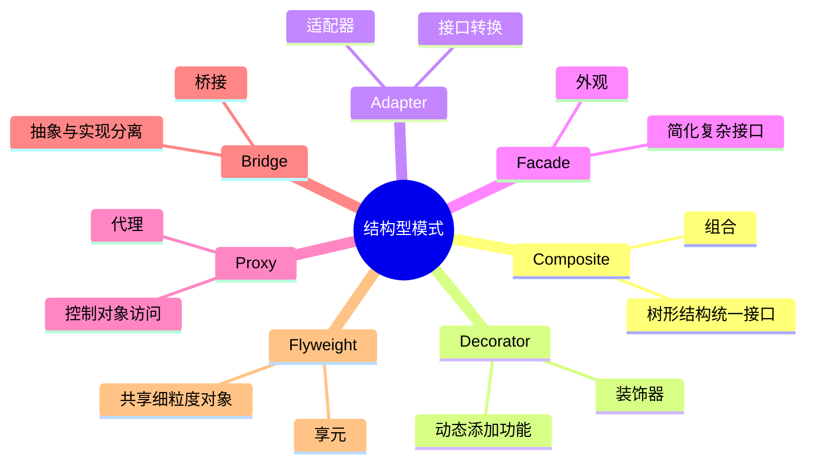
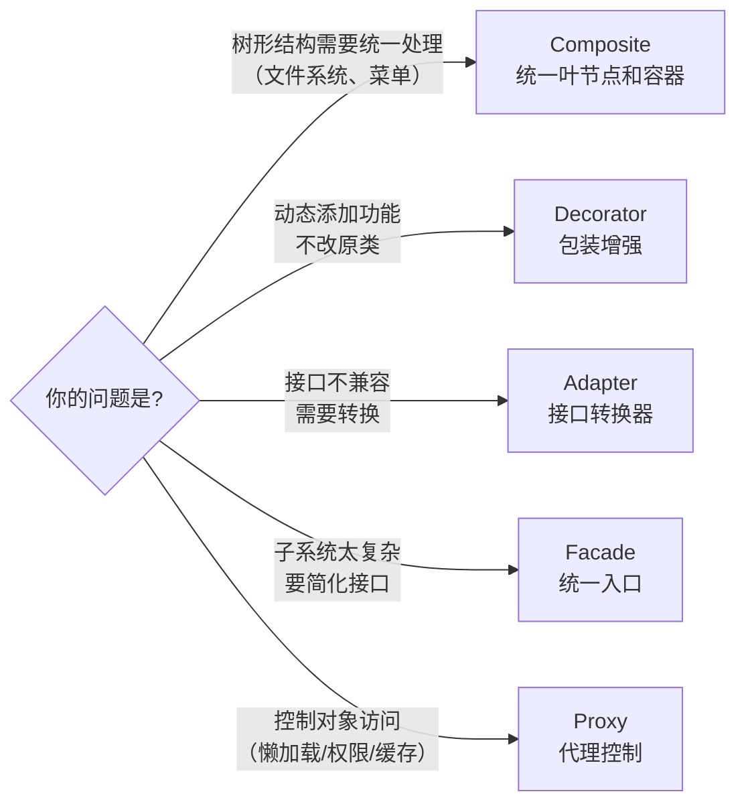

# 结构型模式（Structural Patterns）

## 概述

结构型模式解决**"如何组合类和对象"**的问题——把简单的类组合成更复杂的结构，同时保持结构灵活、可替换。



本章重点讲面试最常考的 5 个：**Composite、Decorator、Adapter、Facade、Proxy**。

---

## 1. Composite（组合）

**问题**：树形结构，叶节点和容器节点需要统一处理（文件系统、菜单、组织架构）。

**关键**：`Leaf` 和 `Composite` 都实现同一个接口，调用者不需要区分。

```typescript
// 统一接口
interface Employee {
  getName(): string;
  getSalary(): number;
  print(indent?: string): void;
}

// Leaf（叶节点）：没有下属的员工
class IndividualContributor implements Employee {
  constructor(
    private name:   string,
    private salary: number,
    private role:   string
  ) {}

  getName()   { return this.name; }
  getSalary() { return this.salary; }

  print(indent = ''): void {
    console.log(`${indent}${this.role}: ${this.name} ($${this.salary})`);
  }
}

// Composite（容器节点）：有下属的管理者
class Manager implements Employee {
  private reports: Employee[] = [];

  constructor(private name: string, private role: string) {}

  getName()   { return this.name; }

  // 递归求和：自己的薪资 + 所有下属的薪资
  getSalary(): number {
    // 假设 Manager 自己的薪资是 0，只统计团队总薪资
    return this.reports.reduce((sum, e) => sum + e.getSalary(), 0);
  }

  addReport(e: Employee): void   { this.reports.push(e); }
  removeReport(e: Employee): void {
    const i = this.reports.indexOf(e);
    if (i >= 0) this.reports.splice(i, 1);
  }

  // 递归打印：统一处理叶节点和容器节点
  print(indent = ''): void {
    console.log(`${indent}[${this.role}] ${this.name}`);
    this.reports.forEach(r => r.print(indent + '  '));
  }
}

// 构建组织树
const ceo   = new Manager('Alice', 'CEO');
const cto   = new Manager('Bob', 'CTO');
const cmo   = new Manager('Carol', 'CMO');
const dev1  = new IndividualContributor('Dave', 120_000, 'Senior Engineer');
const dev2  = new IndividualContributor('Eve', 100_000, 'Engineer');
const mktg1 = new IndividualContributor('Frank', 90_000, 'Marketing Manager');

cto.addReport(dev1);
cto.addReport(dev2);
cmo.addReport(mktg1);
ceo.addReport(cto);
ceo.addReport(cmo);

// 统一接口调用，不需要区分 Manager 还是 IndividualContributor
ceo.print();
console.log(`Total payroll: $${ceo.getSalary().toLocaleString()}`);
// [CEO] Alice
//   [CTO] Bob
//     Senior Engineer: Dave ($120000)
//     Engineer: Eve ($100000)
//   [CMO] Carol
//     Marketing Manager: Frank ($90000)
// Total payroll: $310,000
```

---

## 2. Decorator（装饰器）

**问题**：动态地给对象添加功能，不修改原类，不创建大量子类。

**关键**：装饰器包装目标对象，实现同一接口，增强行为后再委托给被包装对象。

```typescript
// 核心接口
interface TextProcessor {
  process(text: string): string;
}

// 基础实现（什么都不做）
class PlainText implements TextProcessor {
  process(text: string): string { return text; }
}

// 装饰器基类（可选，方便复用）
abstract class TextDecorator implements TextProcessor {
  constructor(protected wrapped: TextProcessor) {}
  abstract process(text: string): string;
}

// 具体装饰器
class TrimDecorator extends TextDecorator {
  process(text: string): string {
    return this.wrapped.process(text.trim()); // 先处理，再委托
  }
}

class UpperCaseDecorator extends TextDecorator {
  process(text: string): string {
    return this.wrapped.process(text).toUpperCase(); // 委托后再处理
  }
}

class CensorDecorator extends TextDecorator {
  private badWords = ['spam', 'hack'];

  process(text: string): string {
    let result = this.wrapped.process(text);
    this.badWords.forEach(word => {
      result = result.replaceAll(word, '****');
    });
    return result;
  }
}

class LoggingDecorator extends TextDecorator {
  process(text: string): string {
    console.log(`Input:  "${text}"`);
    const result = this.wrapped.process(text);
    console.log(`Output: "${result}"`);
    return result;
  }
}

// 组合装饰器：顺序很重要！
const processor = new LoggingDecorator(
  new CensorDecorator(
    new UpperCaseDecorator(
      new TrimDecorator(
        new PlainText()
      )
    )
  )
);

processor.process('  hello spam world  ');
// Input:  "  hello spam world  "
// Output: "HELLO **** WORLD"
```

**Decorator vs 继承的区别：**

```typescript
// 继承方式：需要为每种组合写一个子类（组合爆炸）
class TrimAndUpperText  { /* 重复代码 */ }
class TrimAndCensorText { /* 重复代码 */ }
class UpperAndCensorText{ /* 重复代码 */ }
class AllThreeText      { /* 重复代码 */ }

// Decorator 方式：随意组合，N 个装饰器可以有 N! 种组合，不需要任何新类
```

---

## 3. Adapter（适配器）

**问题**：两个接口不兼容，需要让它们一起工作，但又不想修改源代码（可能是第三方库）。

```typescript
// 你的系统用的接口
interface Logger {
  log(level: 'info' | 'warn' | 'error', message: string): void;
}

// 第三方库（不能修改）
class LegacyLogSystem {
  writeInfo(msg: string):  void { console.log(`[INFO]  ${msg}`); }
  writeWarn(msg: string):  void { console.warn(`[WARN]  ${msg}`); }
  writeError(msg: string): void { console.error(`[ERROR] ${msg}`); }
}

// 适配器：把 LegacyLogSystem 包装成 Logger 接口
class LegacyLogAdapter implements Logger {
  constructor(private legacy: LegacyLogSystem) {}

  log(level: 'info' | 'warn' | 'error', message: string): void {
    switch (level) {
      case 'info':  return this.legacy.writeInfo(message);
      case 'warn':  return this.legacy.writeWarn(message);
      case 'error': return this.legacy.writeError(message);
    }
  }
}

// 你的代码只依赖 Logger 接口
class OrderService {
  constructor(private logger: Logger) {}

  placeOrder(id: string): void {
    this.logger.log('info', `Order ${id} placed`);
  }
}

// 无缝接入第三方库
const legacySystem = new LegacyLogSystem();
const service = new OrderService(new LegacyLogAdapter(legacySystem));
service.placeOrder('ORD-001');
```

**另一个例子：数据格式适配**

```typescript
// 系统内部用的格式
interface UserProfile { id: string; fullName: string; emailAddress: string; }

// 外部 API 返回的格式（字段名不同）
interface ApiUserResponse { user_id: number; first_name: string; last_name: string; email: string; }

// 适配器：把 API 格式转换为内部格式
class ApiUserAdapter {
  static adapt(apiUser: ApiUserResponse): UserProfile {
    return {
      id:           String(apiUser.user_id),
      fullName:     `${apiUser.first_name} ${apiUser.last_name}`,
      emailAddress: apiUser.email,
    };
  }
}
```

---

## 4. Facade（外观）

**问题**：子系统复杂，对外暴露简单接口（就像遥控器是电视内部电路的外观）。

```typescript
// 复杂的子系统（各自有自己的接口）
class VideoDecoder {
  decode(file: string): Buffer {
    console.log(`Decoding ${file}...`);
    return Buffer.from('video-data');
  }
}

class AudioDecoder {
  decode(file: string): Buffer {
    console.log(`Decoding audio from ${file}...`);
    return Buffer.from('audio-data');
  }
}

class VideoRenderer {
  render(videoData: Buffer, audioData: Buffer): void {
    console.log('Rendering video + audio...');
  }
}

class SubtitleLoader {
  load(file: string): string[] {
    console.log(`Loading subtitles from ${file}...`);
    return ['Hello', 'World'];
  }
}

class AudioAmplifier {
  setVolume(level: number): void { console.log(`Volume: ${level}`); }
}

// Facade：简化接口，隐藏子系统复杂性
class VideoPlayerFacade {
  private videoDecoder  = new VideoDecoder();
  private audioDecoder  = new AudioDecoder();
  private videoRenderer = new VideoRenderer();
  private subtitleLoader = new SubtitleLoader();
  private amplifier     = new AudioAmplifier();

  // 简单接口：调用者只需要这一个方法
  play(videoFile: string, subtitleFile?: string): void {
    const videoData = this.videoDecoder.decode(videoFile);
    const audioData = this.audioDecoder.decode(videoFile);
    
    if (subtitleFile) this.subtitleLoader.load(subtitleFile);
    
    this.amplifier.setVolume(80);
    this.videoRenderer.render(videoData, audioData);
    console.log('Playing!');
  }

  setVolume(level: number): void {
    this.amplifier.setVolume(level);
  }
}

// 调用者只需要知道 Facade
const player = new VideoPlayerFacade();
player.play('movie.mp4', 'subs.srt'); // 不需要知道内部有多少个子系统
```

---

## 5. Proxy（代理）

**问题**：控制对另一个对象的访问——可以是懒加载、权限检查、缓存、日志等。

代理实现与被代理对象**相同的接口**，调用者不感知是在和代理还是真实对象通信。

```typescript
interface ImageLoader {
  load(): string;  // 返回图片 base64
  display(): void;
}

// 真实对象（加载慢）
class RealImage implements ImageLoader {
  private data: string | null = null;

  constructor(private readonly url: string) {
    console.log(`Created RealImage for ${url}`);
  }

  load(): string {
    if (!this.data) {
      console.log(`Loading image from ${this.url}... (expensive!)`);
      this.data = `<image-data-from-${this.url}>`;
    }
    return this.data;
  }

  display(): void { console.log(`Displaying: ${this.load()}`); }
}

// 1. 虚拟代理（Lazy Loading）：延迟创建真实对象
class LazyImageProxy implements ImageLoader {
  private real: RealImage | null = null;

  constructor(private readonly url: string) {
    console.log(`Created LazyImageProxy for ${url} (no loading yet)`);
  }

  load(): string {
    if (!this.real) this.real = new RealImage(this.url); // 第一次访问时才创建
    return this.real.load();
  }

  display(): void { this.load(); }
}

// 2. 保护代理（Access Control）：权限检查
class ProtectedImageProxy implements ImageLoader {
  constructor(
    private real: RealImage,
    private userRole: 'admin' | 'user' | 'guest'
  ) {}

  load(): string {
    if (this.userRole === 'guest') throw new Error('Guests cannot load images');
    return this.real.load();
  }

  display(): void {
    if (this.userRole === 'guest') {
      console.log('[Blurred placeholder]');
      return;
    }
    this.real.display();
  }
}

// 3. 缓存代理（Caching Proxy）
class CachingImageProxy implements ImageLoader {
  private cache = new Map<string, string>();
  private real: RealImage;

  constructor(url: string) {
    this.real = new RealImage(url);
  }

  load(): string {
    const url = (this.real as any).url;
    if (!this.cache.has(url)) {
      this.cache.set(url, this.real.load()); // 第一次加载后缓存
    }
    return this.cache.get(url)!;
  }

  display(): void { console.log(this.load()); }
}

// 使用：调用者不知道自己在用代理
const image1: ImageLoader = new LazyImageProxy('https://example.com/photo.jpg');
console.log('Proxy created, image not loaded yet');
image1.display(); // 第一次访问，触发加载
image1.display(); // 第二次访问，图片已在内存中
```

---

## 结构型模式速查



| 模式 | 记忆关键词 | 典型例子 |
|------|----------|--------|
| Composite | 树形统一 | 文件系统、菜单、组织架构 |
| Decorator | 包装增强 | I/O 流（BufferedReader 包 FileReader）|
| Adapter | 接口转换 | 第三方库集成、格式转换 |
| Facade | 简化接口 | SDK 的 `createClient()`，遥控器 |
| Proxy | 访问控制 | 懒加载、缓存、权限、日志 |
