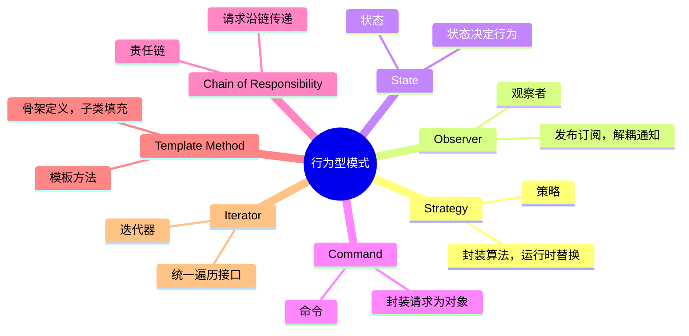
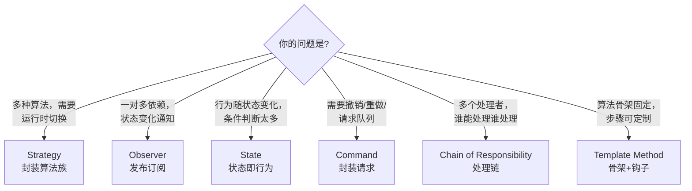

# 行为型模式（Behavioral Patterns）

## 概述

行为型模式解决**"对象之间如何通信和分配职责"**的问题。



本章重点讲面试最常考的 6 个：**Strategy、Observer、State、Command、Chain of Responsibility、Template Method**。

---

## 1. Strategy（策略）

**问题**：同一操作有多种算法/实现，需要在运行时动态切换。

**关键**：把每个算法封装成独立的类，通过接口使用。

```typescript
// 排序策略
interface SortStrategy<T> {
  sort(data: T[], comparator: (a: T, b: T) => number): T[];
}

class BubbleSort<T> implements SortStrategy<T> {
  sort(data: T[], cmp: (a: T, b: T) => number): T[] {
    const arr = [...data];
    for (let i = 0; i < arr.length; i++) {
      for (let j = 0; j < arr.length - i - 1; j++) {
        if (cmp(arr[j], arr[j+1]) > 0) [arr[j], arr[j+1]] = [arr[j+1], arr[j]];
      }
    }
    return arr;
  }
}

class QuickSort<T> implements SortStrategy<T> {
  sort(data: T[], cmp: (a: T, b: T) => number): T[] {
    if (data.length <= 1) return data;
    const pivot = data[Math.floor(data.length / 2)];
    const left  = data.filter(x => cmp(x, pivot) < 0);
    const mid   = data.filter(x => cmp(x, pivot) === 0);
    const right = data.filter(x => cmp(x, pivot) > 0);
    return [...this.sort(left, cmp), ...mid, ...this.sort(right, cmp)];
  }
}

// Context：持有策略引用，运行时可替换
class Sorter<T> {
  constructor(private strategy: SortStrategy<T>) {}

  setStrategy(s: SortStrategy<T>): void { this.strategy = s; }

  sort(data: T[], comparator: (a: T, b: T) => number): T[] {
    return this.strategy.sort(data, comparator);
  }
}

const sorter = new Sorter<number>(new QuickSort());
const nums = [3, 1, 4, 1, 5, 9, 2, 6];
console.log(sorter.sort(nums, (a, b) => a - b)); // [1,1,2,3,4,5,6,9]

// 运行时切换算法
sorter.setStrategy(new BubbleSort());
console.log(sorter.sort(nums, (a, b) => b - a)); // [9,6,5,4,3,2,1,1]
```

**Strategy vs if-else：**

```typescript
// ❌ 新增压缩格式需要修改 compress 方法
function compress(data: Buffer, format: string): Buffer {
  if      (format === 'gzip') { /* gzip 逻辑 */ }
  else if (format === 'zstd') { /* zstd 逻辑 */ }
  else if (format === 'brotli') { /* brotli 逻辑 */ } // 每次新增都要改这里
  return data;
}

// ✅ 新增格式只需加一个类
interface CompressionStrategy { compress(data: Buffer): Buffer; }
class GzipStrategy   implements CompressionStrategy { compress(d: Buffer) { return d; /* gzip */ } }
class ZstdStrategy   implements CompressionStrategy { compress(d: Buffer) { return d; /* zstd */ } }
class BrotliStrategy implements CompressionStrategy { compress(d: Buffer) { return d; /* brotli */ } }
```

---

## 2. Observer（观察者）

**问题**：一个对象（Subject）状态变化时，通知所有依赖它的对象（Observers），但 Subject 不需要知道 Observer 的具体类型。

```typescript
// 观察者接口
interface Observer<T> {
  update(event: string, data: T): void;
}

// Subject（被观察者）基类
class EventEmitter<T> {
  private observers: Map<string, Observer<T>[]> = new Map();

  subscribe(event: string, observer: Observer<T>): void {
    if (!this.observers.has(event)) this.observers.set(event, []);
    this.observers.get(event)!.push(observer);
  }

  unsubscribe(event: string, observer: Observer<T>): void {
    const list = this.observers.get(event) ?? [];
    const idx  = list.indexOf(observer);
    if (idx >= 0) list.splice(idx, 1);
  }

  protected emit(event: string, data: T): void {
    const list = this.observers.get(event) ?? [];
    list.forEach(obs => obs.update(event, data));
  }
}

// 具体 Subject
interface OrderEvent {
  orderId: string;
  status:  string;
  userId:  string;
  amount?: number;
}

class Order extends EventEmitter<OrderEvent> {
  private _status: string = 'PENDING';

  constructor(
    public readonly id:     string,
    public readonly userId: string,
    public readonly amount: number
  ) { super(); }

  confirm(): void {
    this._status = 'CONFIRMED';
    this.emit('status_changed', { orderId: this.id, status: this._status, userId: this.userId });
  }

  ship(): void {
    this._status = 'SHIPPED';
    this.emit('status_changed', { orderId: this.id, status: this._status, userId: this.userId });
  }

  complete(): void {
    this._status = 'COMPLETED';
    this.emit('status_changed', { orderId: this.id, status: this._status, userId: this.userId });
    this.emit('completed',      { orderId: this.id, status: this._status, userId: this.userId, amount: this.amount });
  }
}

// 具体观察者
class EmailNotifier implements Observer<OrderEvent> {
  update(event: string, data: OrderEvent): void {
    console.log(`[Email → ${data.userId}] Order ${data.orderId} is now ${data.status}`);
  }
}

class InventoryService implements Observer<OrderEvent> {
  update(event: string, data: OrderEvent): void {
    if (event === 'completed') {
      console.log(`[Inventory] Deducting stock for order ${data.orderId}`);
    }
  }
}

class AnalyticsService implements Observer<OrderEvent> {
  update(event: string, data: OrderEvent): void {
    if (event === 'completed') {
      console.log(`[Analytics] Recording revenue: $${data.amount} for order ${data.orderId}`);
    }
  }
}

// 装配
const order    = new Order('ORD-001', 'user-123', 199.99);
const email    = new EmailNotifier();
const inventory = new InventoryService();
const analytics = new AnalyticsService();

order.subscribe('status_changed', email);
order.subscribe('completed', inventory);
order.subscribe('completed', analytics);

order.confirm();  // → Email 收到通知
order.ship();     // → Email 收到通知
order.complete(); // → Email + Inventory + Analytics 都收到通知
```

---

## 3. State（状态）

**问题**：对象的行为随状态变化而变化，用条件判断写出来会很乱。State 模式把每个状态封装成一个类。

```typescript
// 状态接口
interface TrafficLightState {
  name():   string;
  next():   TrafficLightState;
  canGo(): boolean;
}

// 具体状态（预建单例，避免重复创建）
class GreenLight implements TrafficLightState {
  private static instance = new GreenLight();
  private constructor() {}
  static get() { return GreenLight.instance; }

  name()   { return 'GREEN'; }
  next()   { return YellowLight.get(); }
  canGo()  { return true; }
}

class YellowLight implements TrafficLightState {
  private static instance = new YellowLight();
  private constructor() {}
  static get() { return YellowLight.instance; }

  name()   { return 'YELLOW'; }
  next()   { return RedLight.get(); }
  canGo()  { return false; }
}

class RedLight implements TrafficLightState {
  private static instance = new RedLight();
  private constructor() {}
  static get() { return RedLight.instance; }

  name()   { return 'RED'; }
  next()   { return GreenLight.get(); }
  canGo()  { return false; }
}

// Context：使用状态
class TrafficLight {
  private state: TrafficLightState = RedLight.get();

  transition(): void {
    this.state = this.state.next();
    console.log(`Traffic light → ${this.state.name()}`);
  }

  canGo(): boolean  { return this.state.canGo(); }
  current(): string { return this.state.name(); }
}

const light = new TrafficLight();
for (let i = 0; i < 5; i++) {
  console.log(`Cars can go: ${light.canGo()}`);
  light.transition();
}
```

**State vs switch-case：**

```typescript
// ❌ switch-case：新增状态需要修改 switch，且逻辑分散
transition(): void {
  switch (this.state) {
    case 'RED':    this.state = 'GREEN';  break;
    case 'GREEN':  this.state = 'YELLOW'; break;
    case 'YELLOW': this.state = 'RED';    break;
  }
}

// ✅ State 模式：每个状态的逻辑都在自己的类里，新增状态只加一个类
```

---

## 4. Command（命令）

**问题**：把请求封装成对象，支持撤销（Undo）、重做（Redo）、队列、日志记录。

```typescript
// 命令接口
interface Command {
  execute(): void;
  undo(): void;
  description(): string;
}

// 文本编辑器（接受命令操作）
class TextEditor {
  private text = '';

  insert(pos: number, str: string): void {
    this.text = this.text.slice(0, pos) + str + this.text.slice(pos);
  }

  delete(pos: number, len: number): void {
    this.text = this.text.slice(0, pos) + this.text.slice(pos + len);
  }

  getChar(pos: number, len: number): string {
    return this.text.slice(pos, pos + len);
  }

  getText(): string { return this.text; }
}

// 具体命令：插入文本
class InsertCommand implements Command {
  constructor(
    private editor: TextEditor,
    private pos:    number,
    private text:   string
  ) {}

  execute(): void { this.editor.insert(this.pos, this.text); }
  undo():    void { this.editor.delete(this.pos, this.text.length); }
  description() { return `Insert "${this.text}" at ${this.pos}`; }
}

// 具体命令：删除文本
class DeleteCommand implements Command {
  private deletedText = '';

  constructor(
    private editor: TextEditor,
    private pos:    number,
    private len:    number
  ) {}

  execute(): void {
    this.deletedText = this.editor.getChar(this.pos, this.len); // 保存以便撤销
    this.editor.delete(this.pos, this.len);
  }

  undo(): void { this.editor.insert(this.pos, this.deletedText); }
  description() { return `Delete ${this.len} chars at ${this.pos}`; }
}

// 命令管理器（支持 undo/redo）
class CommandManager {
  private history: Command[] = [];
  private pointer = -1;

  execute(command: Command): void {
    // 如果中间撤销后又执行新命令，丢弃后面的 redo 历史
    this.history = this.history.slice(0, this.pointer + 1);
    command.execute();
    this.history.push(command);
    this.pointer++;
    console.log(`✓ Executed: ${command.description()}`);
  }

  undo(): void {
    if (this.pointer < 0) { console.log('Nothing to undo'); return; }
    const command = this.history[this.pointer];
    command.undo();
    this.pointer--;
    console.log(`↩ Undone: ${command.description()}`);
  }

  redo(): void {
    if (this.pointer >= this.history.length - 1) { console.log('Nothing to redo'); return; }
    this.pointer++;
    const command = this.history[this.pointer];
    command.execute();
    console.log(`↪ Redone: ${command.description()}`);
  }
}

// 使用
const editor  = new TextEditor();
const manager = new CommandManager();

manager.execute(new InsertCommand(editor, 0, 'Hello'));   // "Hello"
manager.execute(new InsertCommand(editor, 5, ' World'));  // "Hello World"
manager.execute(new DeleteCommand(editor, 5, 6));         // "Hello"
console.log(editor.getText()); // "Hello"

manager.undo();  // 撤销 delete → "Hello World"
console.log(editor.getText()); // "Hello World"

manager.undo();  // 撤销 " World" 插入 → "Hello"
manager.redo();  // 重做 " World" 插入 → "Hello World"
```

---

## 5. Chain of Responsibility（责任链）

**问题**：请求沿着一条处理链传递，直到有人处理它。调用者不需要知道谁会处理。

```typescript
interface Request {
  type:   'LEAVE' | 'EXPENSE' | 'PURCHASE';
  amount: number;
  reason: string;
}

// Handler 基类
abstract class ApprovalHandler {
  private next: ApprovalHandler | null = null;

  setNext(handler: ApprovalHandler): ApprovalHandler {
    this.next = handler;
    return handler; // 链式设置
  }

  handle(request: Request): void {
    if (this.canHandle(request)) {
      this.approve(request);
    } else if (this.next) {
      this.next.handle(request);
    } else {
      console.log(`Request rejected: no one can approve $${request.amount}`);
    }
  }

  protected abstract canHandle(req: Request): boolean;
  protected abstract approve(req: Request):   void;
}

// 具体处理者
class TeamLead extends ApprovalHandler {
  protected canHandle(req: Request): boolean { return req.amount <= 1000; }
  protected approve(req: Request): void {
    console.log(`Team Lead approved: ${req.reason} ($${req.amount})`);
  }
}

class Manager extends ApprovalHandler {
  protected canHandle(req: Request): boolean { return req.amount <= 10_000; }
  protected approve(req: Request): void {
    console.log(`Manager approved: ${req.reason} ($${req.amount})`);
  }
}

class Director extends ApprovalHandler {
  protected canHandle(req: Request): boolean { return req.amount <= 100_000; }
  protected approve(req: Request): void {
    console.log(`Director approved: ${req.reason} ($${req.amount})`);
  }
}

class CEO extends ApprovalHandler {
  protected canHandle(req: Request): boolean { return true; } // 处理所有
  protected approve(req: Request): void {
    console.log(`CEO approved: ${req.reason} ($${req.amount})`);
  }
}

// 构建处理链
const teamLead = new TeamLead();
const manager  = new Manager();
const director = new Director();
const ceo      = new CEO();

teamLead.setNext(manager).setNext(director).setNext(ceo);

teamLead.handle({ type: 'EXPENSE', amount: 500,    reason: 'Team lunch' });       // Team Lead
teamLead.handle({ type: 'PURCHASE', amount: 5000,  reason: 'New monitor' });      // Manager
teamLead.handle({ type: 'PURCHASE', amount: 50000, reason: 'Server upgrade' });   // Director
teamLead.handle({ type: 'PURCHASE', amount: 500000, reason: 'Office renovation'}); // CEO
```

---

## 6. Template Method（模板方法）

**问题**：算法的骨架固定，但某些步骤需要子类自定义。

```typescript
abstract class DataExporter {
  // 模板方法：定义固定流程（final 语义——不建议子类覆盖）
  export(filename: string): void {
    const data    = this.fetchData();          // 子类实现
    const formatted = this.format(data);       // 子类实现
    const validated = this.validate(formatted); // 可选覆盖
    this.write(filename, validated);
    this.notify(filename);                      // 默认实现
    console.log(`Exported to ${filename}`);
  }

  protected abstract fetchData(): unknown[];
  protected abstract format(data: unknown[]): string;

  // Hook：子类可以覆盖，但有默认实现
  protected validate(data: string): string {
    if (data.length === 0) throw new Error('Empty export');
    return data;
  }

  protected notify(filename: string): void {
    console.log(`[Notification] Export complete: ${filename}`);
  }

  private write(filename: string, data: string): void {
    // 真实实现：写文件
    console.log(`Writing ${data.length} bytes to ${filename}`);
  }
}

class CsvExporter extends DataExporter {
  protected fetchData(): unknown[] {
    return [{ id: 1, name: 'Alice' }, { id: 2, name: 'Bob' }];
  }

  protected format(data: unknown[]): string {
    const headers = 'id,name';
    const rows    = (data as any[]).map(r => `${r.id},${r.name}`);
    return [headers, ...rows].join('\n');
  }
}

class JsonExporter extends DataExporter {
  protected fetchData(): unknown[] {
    return [{ id: 1, name: 'Alice' }];
  }

  protected format(data: unknown[]): string {
    return JSON.stringify(data, null, 2);
  }

  // 覆盖 Hook：JSON 不需要通知
  protected override notify(filename: string): void {
    // 静默
  }
}

new CsvExporter().export('users.csv');
new JsonExporter().export('users.json');
```

---

## 行为型模式速查



| 模式 | 记忆关键词 | 典型例子 |
|------|----------|--------|
| Strategy | 算法族，可替换 | 排序算法、支付方式、压缩格式 |
| Observer | 发布-订阅 | 事件系统、MVC 的 M→V 通知 |
| State | 状态即行为 | 订单状态机、交通灯、游戏状态 |
| Command | 请求对象化 | 文本编辑器 Undo/Redo、任务队列 |
| CoR | 请求传递链 | 审批流程、日志 Handler、中间件 |
| Template Method | 骨架+填空 | 数据导出、测试框架的 setUp/tearDown |
