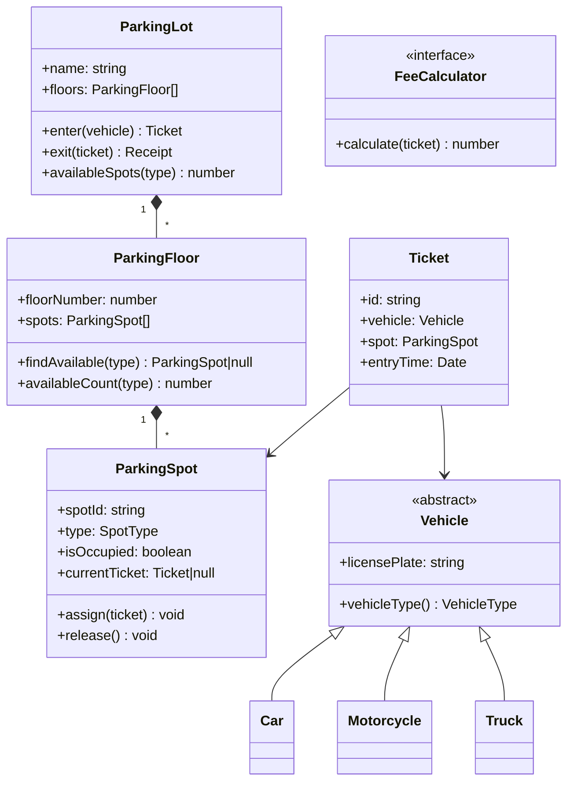
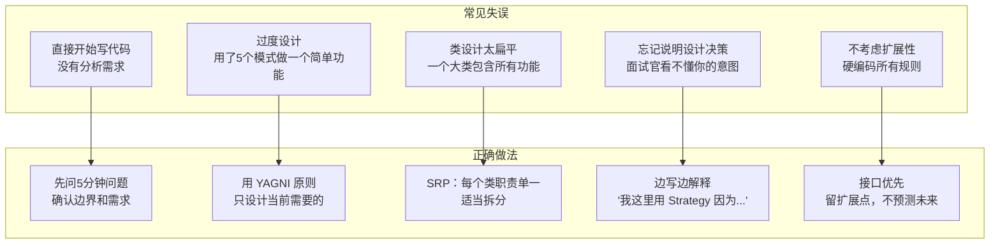
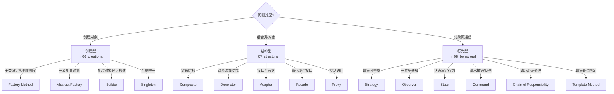

# OOD 面试方法论：45 分钟内完成设计

## 面试官在考什么？

OOD 面试不是考你背了多少模式，而是考：

1. **需求分析能力**：能把模糊需求转化为明确的类和关系
2. **抽象建模能力**：识别出合适的抽象层次，不过度设计也不欠设计
3. **设计原则**：SOLID 的运用是否自然
4. **扩展性意识**：能指出"如果要加功能X，我需要改哪里"
5. **沟通能力**：能清晰地解释每个设计决策

---

## 45 分钟时间分配

```mermaid
gantt
    title OOD 面试时间分配
    dateFormat mm
    axisFormat %M分钟
    section 分析阶段
    需求澄清 & 用例分析       :a1, 00, 8m
    识别核心类（名词提取）    :a2, 08, 5m
    section 设计阶段
    定义接口和类关系          :b1, 13, 10m
    添加方法和属性            :b2, 23, 8m
    section 深化阶段
    设计模式应用              :c1, 31, 7m
    扩展性讨论                :c2, 38, 7m
```



---

## 第一步：需求澄清（8 分钟）

**永远不要直接开始画类图！** 先问问题，明确边界。

```
面试题：设计一个停车场系统

你应该问的问题：
  "系统需要支持哪些功能？我猜应该有：进场、出场、计费、查询空位，还有其他的吗？"
  "需要支持几种车型？（小轿车、摩托车、货车）"
  "计费规则是怎样的？按时间？按车型不同价格？"
  "需要多个出入口吗？"
  "需要预约功能吗？"
  "我们假设不需要分布式，单机运行就好，对吗？"
```

**明确后，主动陈述你的理解：**

```
"好的，我的理解是：
  - 支持3种车型：小轿车、摩托车、货车
  - 停车场有多层，每层有不同类型的车位
  - 计费按时间，不同车型单价不同
  - 需要查询当前空位数量
  我先按这个设计，如果需要调整我们再讨论。"
```

---

## 第二步：用例分析（5 分钟）

写出主要使用场景（用例），用来指导类的设计：

```
停车场系统用例：
  1. 车辆进场 → 扫描车牌 → 找空位 → 发票据
  2. 车辆出场 → 扫描票据 → 计算费用 → 收款 → 释放车位
  3. 查询空位 → 返回各类型剩余空位数
  4. 管理员添加/删除车位

主要名词（候选类）：
  停车场、楼层、车位、车辆、小轿车、摩托车、货车
  票据、费用、收费规则

主要动词（候选方法）：
  进场、出场、分配车位、计算费用、释放车位
```

---

## 第三步：核心类设计（10 分钟）

从名词中识别类，确定关系：



---

## 第四步：添加方法和关键代码（8 分钟）

面试中不需要写完整实现，选**最能展示设计思路的核心代码**写出来：

```typescript
// 展示多态：车型决定匹配哪种车位
enum VehicleType { MOTORCYCLE, CAR, TRUCK }
enum SpotType    { SMALL, MEDIUM, LARGE }

abstract class Vehicle {
  constructor(public readonly licensePlate: string) {}
  abstract vehicleType(): VehicleType;
  abstract compatibleSpotTypes(): SpotType[]; // 多态：不同车型匹配不同车位类型
}

class Car extends Vehicle {
  vehicleType()         { return VehicleType.CAR; }
  compatibleSpotTypes() { return [SpotType.MEDIUM, SpotType.LARGE]; }
}

class Motorcycle extends Vehicle {
  vehicleType()         { return VehicleType.MOTORCYCLE; }
  compatibleSpotTypes() { return [SpotType.SMALL, SpotType.MEDIUM]; }
}

// 展示 Strategy：计费策略可替换
interface FeeCalculator {
  calculate(entryTime: Date, exitTime: Date, vehicleType: VehicleType): number;
}

class HourlyFeeCalculator implements FeeCalculator {
  private rates: Record<VehicleType, number> = {
    [VehicleType.MOTORCYCLE]: 5,
    [VehicleType.CAR]:        10,
    [VehicleType.TRUCK]:      20,
  };

  calculate(entry: Date, exit: Date, type: VehicleType): number {
    const hours = Math.ceil((exit.getTime() - entry.getTime()) / 3_600_000);
    return hours * this.rates[type];
  }
}

// 展示核心逻辑：进场
class ParkingLot {
  constructor(
    private floors: ParkingFloor[],
    private feeCalc: FeeCalculator  // 依赖注入（DIP）
  ) {}

  enter(vehicle: Vehicle): Ticket {
    const spot = this.findAvailableSpot(vehicle);
    if (!spot) throw new Error('Parking lot is full');
    
    const ticket = new Ticket(generateId(), vehicle, spot, new Date());
    spot.assign(ticket);
    return ticket;
  }

  exit(ticket: Ticket): Receipt {
    const exitTime = new Date();
    const fee      = this.feeCalc.calculate(
      ticket.entryTime, exitTime, ticket.vehicle.vehicleType()
    );
    ticket.spot.release();
    return new Receipt(ticket, exitTime, fee);
  }

  private findAvailableSpot(vehicle: Vehicle): ParkingSpot | null {
    for (const floor of this.floors) {
      const spot = floor.findAvailable(vehicle.compatibleSpotTypes());
      if (spot) return spot;
    }
    return null;
  }
}
```

---

## 第五步：设计模式应用（7 分钟）

主动指出你用了哪些模式，以及为什么：

```
"我在这里用了几个设计模式：

1. Strategy（计费策略）：
   FeeCalculator 是一个接口，可以有 HourlyFeeCalculator、
   DailyMaxFeeCalculator 等不同实现。
   要加新的计费规则，只需要新增一个类，不改 ParkingLot。

2. 多态（车型匹配）：
   Vehicle 的 compatibleSpotTypes() 是多态方法，
   避免了 if-else 判断车型，新增车型只要加一个子类。

3. 依赖倒置：
   ParkingLot 依赖 FeeCalculator 接口，而不是具体实现，
   方便测试时注入 MockFeeCalculator。"
```

---

## 第六步：扩展性讨论（7 分钟）

面试官经常追问"如果要加 X 功能怎么办"，你要能快速回答：

```
Q: 如果要加预约功能？
A: 加 Reservation 类，关联 Vehicle 和 ParkingSpot 和时间范围。
   enter() 时先检查是否有预约，有则直接分配预约的车位。
   ParkingSpot 增加 reservedUntil 字段。

Q: 如果计费规则很复杂（首小时免费、节假日涨价）？
A: FeeCalculator 接口不变，新增 
   ComplexFeeCalculator（装饰器组合多种规则），
   或用 Chain of Responsibility（规则链，逐条应用）。

Q: 如果要支持多个停车场？
A: 加 ParkingNetwork 类，管理多个 ParkingLot，
   findAvailableSpot() 时可以跨停车场寻找。

Q: 如果需要持久化（数据库）？
A: 加 Repository 接口（ITicketRepository、ISpotRepository），
   当前内存实现不变，生产环境注入 MySQLRepository。
   这已经在 DIP 的框架下，修改量很小。
```

---

## 常见陷阱和应对



---

## 面试话术模板

**开场（需求澄清）：**
```
"在开始设计之前，我想确认几个问题……
好的，我的理解是这些核心功能：[列举]。
我先按这个设计，如果漏了什么我们可以随时调整。"
```

**说明设计决策：**
```
"我把 X 设计成接口而不是类，是因为 [将来可能有多种实现 / 便于测试替换]。"
"我用了 Strategy 模式在这里，这样如果要加新的 [算法/规则]，
 只需要加一个新类，不需要修改现有代码。"
```

**主动展示扩展性：**
```
"如果将来要加 [功能X]，我只需要 [具体描述改动]，
 现有代码不需要改，因为我在这里留了 [接口/扩展点]。"
```

**遇到不确定的地方：**
```
"这里我有两种方案：A 是 [简单但有X限制]，B 是 [复杂但可扩展]。
 你更倾向于哪个方向？或者我先用 A，之后可以替换成 B？"
```

---

## OOD 面试题清单（按难度）

### 入门（30 分钟能完成）
- [停车场](../08_ood/01_parking_lot.md) — 多态车型、Strategy 计费
- [LRU Cache](../08_ood/02_lru_cache.md) — HashMap + 双向链表
- [自动贩卖机](../08_ood/05_vending_machine.md) — State 模式
- [图书馆系统](../08_ood/06_library_system.md) — 预约、逾期

### 进阶（45 分钟）
- [电梯系统](../08_ood/03_elevator.md) — 调度 Strategy、状态机
- [扑克牌游戏](../08_ood/04_card_game.md) — Template Method
- [国际象棋](../08_ood/07_chess_game.md) — 棋子多态、规则校验
- [文件系统](../08_ood/09_file_system.md) — Composite 模式

### 挑战（需要系统设计知识）
- [网约车](../08_ood/10_ride_sharing_ood.md) — 状态机、Strategy、Observer
- [酒店预订](../08_ood/11_hotel_booking.md) — 防超卖、策略计价
- [外卖系统](../08_ood/12_food_delivery.md) — Observer 通知、状态机
- [购物车](../08_ood/13_shopping_cart.md) — 多态商品、折扣 Strategy
- [Twitter OOD](../08_ood/15_twitter_ood.md) — 多态推文、Timeline

---

## 速查：模式选择决策树


