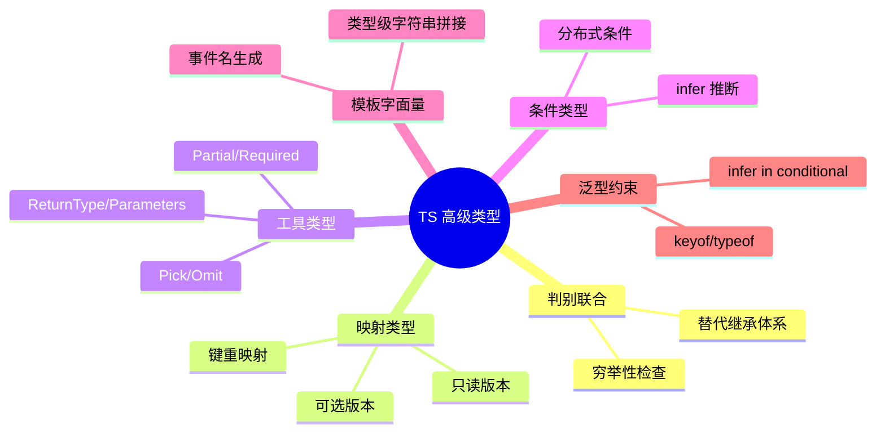

# TypeScript 高级特性在 OOD 中的应用

## 概述

TypeScript 提供了远超 Java/C++ 的类型系统工具。这些特性能让 OOD 代码更安全、更简洁、更自文档化。



---

## 1. 判别联合（Discriminated Union）

**使用场景**：替代继承体系，表达"要么是 A 要么是 B"的类型，并强制穷举所有情况。

```typescript
// 传统继承：需要 instanceof 检查，扩展性差
// abstract class Shape { abstract area(): number }
// class Circle extends Shape { ... }

// 判别联合：更简洁，编译器帮你穷举
type Shape =
  | { kind: 'circle';    radius: number }
  | { kind: 'rectangle'; width: number; height: number }
  | { kind: 'triangle';  base: number;  height: number };

function area(shape: Shape): number {
  switch (shape.kind) {
    case 'circle':    return Math.PI * shape.radius ** 2;
    case 'rectangle': return shape.width * shape.height;
    case 'triangle':  return 0.5 * shape.base * shape.height;
    // 如果漏了某个 case，下面的 never 检查会报错
    default:          return assertNever(shape);
  }
}

// 穷举性检查的技巧：用 never 类型
function assertNever(x: never): never {
  throw new Error(`Unhandled case: ${JSON.stringify(x)}`);
}

// 添加新 shape 时，所有 switch 语句会自动报错提示你更新
```

**判别联合 vs 继承的选择准则：**

```typescript
// 用判别联合：
//   - 类型固定，不会被外部扩展
//   - 需要穷举处理每种情况
//   - 数据结构为主，行为为辅

// 用继承（接口/抽象类）：
//   - 允许外部扩展新类型（OCP）
//   - 行为为主（多态方法）
//   - 需要运行时多态分发

// 混合用法：用联合类型做状态，用方法做行为
type OrderStatus = 'pending' | 'confirmed' | 'shipped' | 'delivered' | 'cancelled';

class Order {
  constructor(public status: OrderStatus) {}

  canCancel(): boolean {
    return this.status === 'pending' || this.status === 'confirmed';
  }

  transition(event: 'confirm' | 'ship' | 'deliver' | 'cancel'): void {
    // 状态机：哪些转换是合法的
    const transitions: Partial<Record<OrderStatus, Partial<Record<typeof event, OrderStatus>>>> = {
      pending:   { confirm: 'confirmed', cancel: 'cancelled' },
      confirmed: { ship: 'shipped',      cancel: 'cancelled' },
      shipped:   { deliver: 'delivered' },
    };

    const next = transitions[this.status]?.[event];
    if (!next) throw new Error(`Cannot ${event} from ${this.status}`);
    this.status = next;
  }
}
```

---

## 2. 映射类型（Mapped Types）

**使用场景**：基于现有类型生成变体版本，不重复定义。

```typescript
// 已有的领域模型
interface UserProfile {
  id:       number;
  name:     string;
  email:    string;
  age:      number;
  address:  string;
}

// ── 内置工具类型（都基于映射类型实现）──────────────────

// 全部字段可选（用于 PATCH 请求/更新操作）
type UpdateUserDTO = Partial<UserProfile>;

// 全部字段必填（用于创建操作，排除可选字段的意外遗漏）
type CreateUserDTO = Required<Omit<UserProfile, 'id'>>; // id 由服务器生成，不需要

// 只取部分字段（用于列表展示）
type UserSummary = Pick<UserProfile, 'id' | 'name' | 'email'>;

// 排除某些字段（用于安全返回，去掉敏感信息）
type PublicProfile = Omit<UserProfile, 'email' | 'address'>;

// ── 自定义映射类型 ──────────────────────────────────────

// 所有字段变为只读（不可变对象，适合 Value Object）
type Immutable<T> = { readonly [K in keyof T]: T[K] };

// 所有字段变为可为 null（数据库查询结果）
type Nullable<T> = { [K in keyof T]: T[K] | null };

// 所有方法变为异步版本（用于适配器模式）
type AsyncVersion<T> = {
  [K in keyof T]: T[K] extends (...args: infer A) => infer R
    ? (...args: A) => Promise<R>
    : T[K];
};

// 示例：把同步仓库接口转为异步版本
interface SyncUserRepo {
  findById(id: number): UserProfile | null;
  save(user: UserProfile): void;
  delete(id: number): boolean;
}

type AsyncUserRepo = AsyncVersion<SyncUserRepo>;
// 等价于：
// {
//   findById(id: number): Promise<UserProfile | null>;
//   save(user: UserProfile): Promise<void>;
//   delete(id: number): Promise<boolean>;
// }
```

---

## 3. 条件类型与 infer

**使用场景**：根据类型关系推导出新类型，常用于提取嵌套类型。

```typescript
// 提取 Promise 的解析类型
type Awaited<T> = T extends Promise<infer R> ? R : T;

type A = Awaited<Promise<string>>;  // string
type B = Awaited<number>;           // number

// 提取函数返回类型（TS 内置 ReturnType 的实现原理）
type MyReturnType<T extends (...args: any[]) => any> =
  T extends (...args: any[]) => infer R ? R : never;

// 提取函数参数类型（TS 内置 Parameters 的实现原理）
type MyParameters<T extends (...args: any[]) => any> =
  T extends (...args: infer P) => any ? P : never;

// 实用：从 Repository 工厂函数推导返回类型，避免重复类型定义
function createUserRepository(db: Database) {
  return {
    findById: (id: number) => db.query<UserProfile>(`SELECT * FROM users WHERE id=?`, [id]),
    save:     (user: UserProfile) => db.execute('INSERT INTO users ...', user),
  };
}

type UserRepository = ReturnType<typeof createUserRepository>;
// UserRepository 自动推导，不需要手写接口

// ── 条件类型分发 ────────────────────────────────────────
// 联合类型会"分发"进条件类型
type NonNullable<T> = T extends null | undefined ? never : T;

type X = NonNullable<string | null | undefined | number>;
// = string | number
// 等价于：
// (string extends null|undefined ? never : string)  → string
// | (null extends null|undefined ? never : null)    → never
// | (undefined extends null|undefined ? never : undefined) → never
// | (number extends null|undefined ? never : number) → number
// 最终：string | number
```

---

## 4. 模板字面量类型

**使用场景**：在类型层面拼接字符串，常用于事件系统和 API 路径生成。

```typescript
// 类型安全的事件系统
type Entity = 'order' | 'user' | 'product';
type Action = 'created' | 'updated' | 'deleted';

// 自动生成所有合法的事件名
type EventName = `${Entity}:${Action}`;
// = 'order:created' | 'order:updated' | 'order:deleted'
//   | 'user:created' | ...（9 种）

class TypedEventEmitter {
  private listeners = new Map<EventName, Set<Function>>();

  on(event: EventName, handler: () => void): void {
    if (!this.listeners.has(event)) this.listeners.set(event, new Set());
    this.listeners.get(event)!.add(handler);
  }

  emit(event: EventName): void {
    this.listeners.get(event)?.forEach(h => h());
  }
}

const emitter = new TypedEventEmitter();
emitter.on('order:created', () => console.log('Order created!'));
// emitter.on('order:approved', ...); // TS 报错：类型不符

// ── CSS-in-JS 风格属性名 ───────────────────────────────
type CSSProperty = 'margin' | 'padding' | 'border';
type CSSDirection = 'Top' | 'Right' | 'Bottom' | 'Left';
type CSSDetailedProperty = `${CSSProperty}${CSSDirection}`;
// 'marginTop' | 'marginRight' | 'paddingTop' | ...（12 种）

// ── REST API 路径验证 ──────────────────────────────────
type ApiVersion = 'v1' | 'v2';
type Resource   = 'users' | 'orders' | 'products';
type ApiPath    = `/api/${ApiVersion}/${Resource}`;

function fetchApi(path: ApiPath): Promise<unknown> {
  return fetch(path).then(r => r.json());
}

fetchApi('/api/v1/users');   // ✅
// fetchApi('/api/v3/users'); // ❌ TypeScript 报错
```

---

## 5. 泛型约束与 keyof/typeof

**使用场景**：写出真正可复用的泛型代码，同时保持类型安全。

```typescript
// ── keyof：从类型中提取所有键 ─────────────────────────
interface Config {
  host:    string;
  port:    number;
  debug:   boolean;
  timeout: number;
}

// 类型安全的配置读取：key 必须是 Config 的合法键
function getConfig<K extends keyof Config>(key: K): Config[K] {
  const defaults: Config = { host: 'localhost', port: 3000, debug: false, timeout: 5000 };
  return defaults[key];
}

const host: string  = getConfig('host');  // 返回类型自动推导为 string
const port: number  = getConfig('port');  // 返回类型自动推导为 number
// getConfig('invalid');  // TS 报错

// ── typeof：从值中提取类型 ────────────────────────────
const defaultUser = { name: '', email: '', role: 'user' as const };
type DefaultUser = typeof defaultUser;
// { name: string; email: string; role: 'user' }

// 从对象字面量中提取枚举值（比 enum 更灵活）
const HTTP_STATUS = {
  OK:           200,
  CREATED:      201,
  BAD_REQUEST:  400,
  UNAUTHORIZED: 401,
  NOT_FOUND:    404,
  SERVER_ERROR: 500,
} as const;

type HttpStatus = typeof HTTP_STATUS[keyof typeof HTTP_STATUS];
// = 200 | 201 | 400 | 401 | 404 | 500

// ── 泛型约束：Repository 基类 ─────────────────────────
interface HasId { id: string | number; }

class GenericRepository<T extends HasId> {
  protected items: Map<string | number, T> = new Map();

  findById(id: T['id']): T | undefined { return this.items.get(id); }

  save(item: T): void { this.items.set(item.id, item); }

  findAll(): T[] { return Array.from(this.items.values()); }

  // 根据任意字段筛选
  findBy<K extends keyof T>(field: K, value: T[K]): T[] {
    return this.findAll().filter(item => item[field] === value);
  }
}

interface Product extends HasId {
  id:       number;
  name:     string;
  category: string;
  price:    number;
}

class ProductRepository extends GenericRepository<Product> {
  findByCategory(category: string): Product[] {
    return this.findBy('category', category); // 类型安全
  }
}
```

---

## 实战：用高级类型构建类型安全的状态机

```typescript
// 状态机类型：不可能出现非法转换
type MachineConfig<S extends string, E extends string> = {
  [State in S]?: {
    on?: Partial<Record<E, S>>; // 当前状态 + 事件 → 下一个状态
  };
};

class StateMachine<S extends string, E extends string> {
  constructor(
    private state:  S,
    private config: MachineConfig<S, E>
  ) {}

  send(event: E): S {
    const next = this.config[this.state]?.on?.[event];
    if (!next) throw new Error(`No transition: ${this.state} + ${event}`);
    this.state = next;
    return this.state;
  }

  current(): S { return this.state; }
}

// 定义订单状态机（类型完全安全）
type OrderState = 'pending' | 'confirmed' | 'shipped' | 'delivered' | 'cancelled';
type OrderEvent = 'confirm' | 'ship' | 'deliver' | 'cancel';

const orderMachine = new StateMachine<OrderState, OrderEvent>('pending', {
  pending:   { on: { confirm: 'confirmed', cancel: 'cancelled' } },
  confirmed: { on: { ship:    'shipped',   cancel: 'cancelled' } },
  shipped:   { on: { deliver: 'delivered' } },
});

orderMachine.send('confirm'); // 'confirmed'
// orderMachine.send('deliver'); // 运行时报错（逻辑），TS 层面类型合法
```

---

## 速查表

| 特性 | 语法 | OOD 使用场景 |
|------|------|------------|
| 判别联合 | `type A = \| {kind:'x'} \| {kind:'y'}` | 替代继承、穷举状态 |
| `Partial<T>` | 内置 | PATCH DTO、可选配置 |
| `Pick<T, K>` | 内置 | DTO 投影、视图模型 |
| `Omit<T, K>` | 内置 | 排除敏感字段、排除 ID |
| `ReturnType<F>` | 内置 | 从工厂函数推导类型 |
| `keyof T` | 关键字 | 类型安全的属性访问 |
| `typeof x` | 关键字 | 从值推导类型 |
| `infer R` | 条件类型 | 提取嵌套类型 |
| 模板字面量 | `` `${A}${B}` `` | 事件名、API 路径 |
| `as const` | 断言 | 对象字面量枚举 |
