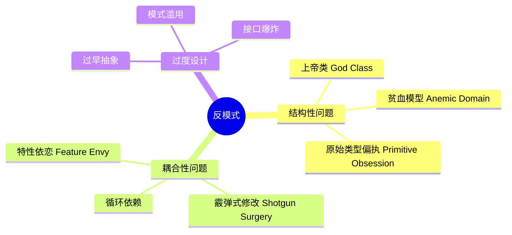
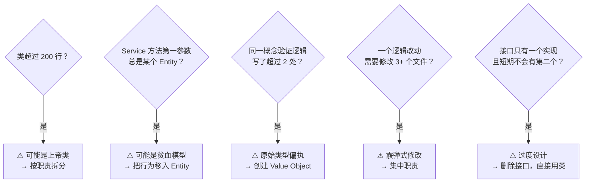

# OOD 反模式（Anti-Patterns）

## 概述

反模式是看起来合理、实际上有害的设计。识别并避免它们是高级 OOD 能力的体现。



---

## 1. 上帝类（God Class）

一个类承担了过多职责，知道太多、做太多。

```typescript
// ❌ 反模式：UserManager 什么都做
class UserManager {
  // 用户数据
  private users: Map<number, any> = new Map();

  // 认证逻辑
  login(email: string, password: string): string { /* JWT */ return ''; }
  logout(token: string): void {}
  validateToken(token: string): boolean { return true; }

  // 用户 CRUD
  createUser(email: string, password: string): void {}
  updateProfile(id: number, data: any): void {}
  deleteUser(id: number): void {}

  // 邮件发送
  sendWelcomeEmail(email: string): void {}
  sendPasswordResetEmail(email: string): void {}

  // 权限管理
  assignRole(userId: number, role: string): void {}
  checkPermission(userId: number, resource: string): boolean { return true; }

  // 报表生成
  generateUserReport(): string { return ''; }
  exportToCSV(): Buffer { return Buffer.from(''); }
}

// ✅ 按职责拆分（SRP）
class UserRepository {
  findById(id: number): User | null { return null; }
  save(user: User): void {}
  delete(id: number): void {}
}

class AuthService {
  constructor(private userRepo: UserRepository) {}
  login(email: string, password: string): string { return ''; }
  validateToken(token: string): boolean { return true; }
}

class EmailService {
  sendWelcome(email: string): void {}
  sendPasswordReset(email: string): void {}
}

class PermissionService {
  hasPermission(userId: number, resource: string): boolean { return true; }
}

class UserReportService {
  generate(): string { return ''; }
  exportCsv(): Buffer { return Buffer.from(''); }
}
```

**识别信号**：
- 类有 10+ 个方法
- 类的方法分属不同的概念（"和"连接：处理用户*和*发邮件*和*生成报表）
- 修改任何功能都要打开这个类

---

## 2. 贫血领域模型（Anemic Domain Model）

领域对象只有数据（getter/setter），业务逻辑全部在 Service 层。本质上是过程式编程用了 OOP 外壳。

```typescript
// ❌ 贫血模型：Order 只是数据容器
class Order {
  id!:     number;
  items!:  OrderItem[];
  status!: string;
  total!:  number;
  // 全是 getter/setter，没有任何业务逻辑
}

// 业务逻辑堆在 Service 里，导致 OrderService 膨胀成上帝类
class OrderService {
  calculateTotal(order: Order): number {
    return order.items.reduce((sum, i) => sum + i.price * i.quantity, 0);
  }

  canCancel(order: Order): boolean {
    return order.status === 'pending' || order.status === 'confirmed';
  }

  applyDiscount(order: Order, code: string): void {
    if (order.status !== 'pending') throw new Error('...');
    // ...
  }

  addItem(order: Order, item: OrderItem): void {
    if (order.status !== 'pending') throw new Error('...');
    order.items.push(item);
    order.total = this.calculateTotal(order);
  }
}

// ✅ 富领域模型：业务逻辑内聚在对象内
class Order {
  private items:  OrderItem[] = [];
  private status: OrderStatus = OrderStatus.PENDING;

  get total(): number {
    return this.items.reduce((sum, i) => sum + i.price * i.quantity, 0);
  }

  // 业务规则内聚在实体本身
  addItem(item: OrderItem): void {
    if (this.status !== OrderStatus.PENDING) {
      throw new Error('Cannot add items to a non-pending order');
    }
    this.items.push(item);
  }

  canCancel(): boolean {
    return this.status === OrderStatus.PENDING || this.status === OrderStatus.CONFIRMED;
  }

  cancel(): void {
    if (!this.canCancel()) throw new Error('Order cannot be cancelled');
    this.status = OrderStatus.CANCELLED;
    // 领域事件：this.emit('cancelled')
  }

  applyDiscount(discount: Discount): void {
    if (this.status !== OrderStatus.PENDING) throw new Error('...');
    discount.applyTo(this); // 委托给 Discount 对象
  }
}
```

**经验法则**：如果一个 Service 方法的第一个参数是某个 Entity，问自己：这段逻辑是否应该是那个 Entity 的方法？

---

## 3. 原始类型偏执（Primitive Obsession）

用 `string`/`number` 表示有业务含义的概念，导致类型不安全和逻辑分散。

```typescript
// ❌ 原始类型偏执
function transfer(fromAccountId: string, toAccountId: string, amount: number): void {
  // 谁能保证 amount > 0？
  // 谁能区分 fromAccountId 和 toAccountId 传反了？
  // amount 是分还是元？
}

transfer('ACC-123', 'ACC-456', 100); // 100 分？100 元？

// ❌ 电话号码当 string 用，验证逻辑散落各处
function sendSMS(phone: string, message: string): void {
  if (!/^\+?[1-9]\d{9,14}$/.test(phone)) throw new Error('Invalid phone');
  // ...
}
function createUser(phone: string, ...): void {
  if (!/^\+?[1-9]\d{9,14}$/.test(phone)) throw new Error('Invalid phone'); // 重复验证
}

// ✅ 用 Value Object 封装业务概念
class Money {
  constructor(
    private readonly amountCents: number, // 整数分
    public readonly currency: 'CNY' | 'USD' | 'EUR'
  ) {
    if (!Number.isInteger(amountCents) || amountCents < 0) {
      throw new Error('Amount must be a non-negative integer in cents');
    }
  }

  add(other: Money): Money {
    if (this.currency !== other.currency) throw new Error('Currency mismatch');
    return new Money(this.amountCents + other.amountCents, this.currency);
  }

  isZero(): boolean { return this.amountCents === 0; }

  format(): string { return `${(this.amountCents / 100).toFixed(2)} ${this.currency}`; }
}

class AccountId {
  private constructor(public readonly value: string) {}

  static of(raw: string): AccountId {
    if (!/^ACC-\d+$/.test(raw)) throw new Error(`Invalid account ID: ${raw}`);
    return new AccountId(raw);
  }

  equals(other: AccountId): boolean { return this.value === other.value; }
}

class PhoneNumber {
  private constructor(public readonly value: string) {}

  static of(raw: string): PhoneNumber {
    const cleaned = raw.replace(/\s|-/g, '');
    if (!/^\+?[1-9]\d{9,14}$/.test(cleaned)) throw new Error(`Invalid phone: ${raw}`);
    return new PhoneNumber(cleaned);
  }
}

// 现在调用签名自文档化，且类型安全
function transfer(from: AccountId, to: AccountId, amount: Money): void { /* ... */ }
```

---

## 4. 特性依恋（Feature Envy）

一个方法对另一个类的数据或方法的兴趣远超对自己所在类的兴趣。

```typescript
// ❌ OrderPrinter 对 Order 的内部了如指掌
class OrderPrinter {
  print(order: Order): string {
    // 这个方法更像是 Order 的方法，因为它只用了 Order 的数据
    const header = `Order #${order.id} - ${order.customer.name}`;
    const lines  = order.items.map(item =>
      `  ${item.product.name} × ${item.quantity} = ¥${item.product.price * item.quantity}`
    );
    const total  = order.items.reduce((s, i) => s + i.product.price * i.quantity, 0);
    return [header, ...lines, `Total: ¥${total}`].join('\n');
  }
}

// ✅ 把行为移到数据所在的类
class Order {
  format(): string {
    const header = `Order #${this.id} - ${this.customer.name}`;
    const lines  = this.items.map(item => item.format());
    return [header, ...lines, `Total: ${this.total.format()}`].join('\n');
  }
}

class OrderItem {
  format(): string {
    return `  ${this.product.name} × ${this.quantity} = ${this.subtotal.format()}`;
  }
}
```

---

## 5. 霰弹式修改（Shotgun Surgery）

一个逻辑变更需要同时修改多个类。是 Feature Envy 的反面——分散的职责。

```typescript
// ❌ 添加"会员折扣"需要改 4 个地方
class CartService {
  calculateTotal(cart: Cart, userId: string): number {
    const isMember = this.userService.isMember(userId); // 1. 这里改
    return cart.items.reduce((s, i) => s + i.price, 0) * (isMember ? 0.9 : 1);
  }
}

class OrderService {
  createOrder(cart: Cart, userId: string): Order {
    const isMember = this.userService.isMember(userId); // 2. 这里改
    const discount = isMember ? 0.9 : 1;
    // ...
  }
}

class InvoiceService {
  generate(order: Order): Invoice {
    const isMember = this.userService.isMember(order.userId); // 3. 这里改
    // ...
  }
}

// ✅ 把折扣逻辑集中到一个地方
interface DiscountPolicy {
  apply(amount: Money, context: DiscountContext): Money;
}

class MemberDiscountPolicy implements DiscountPolicy {
  apply(amount: Money, context: DiscountContext): Money {
    if (!context.user.isMember) return amount;
    return amount.multiply(0.9);
  }
}

// 所有涉及金额的地方都通过 DiscountPolicy 接口，只需改一处
```

---

## 6. 过度设计（Over-Engineering）

为了未来可能的需求引入不必要的抽象。

```typescript
// ❌ 为"可能将来支持多种格式"的日志添加 Factory + Strategy + Builder
interface ILogFormatter { format(msg: LogMessage): string; }
abstract class AbstractLogFactory { abstract createFormatter(): ILogFormatter; }
class JsonLogFormatterFactory extends AbstractLogFactory { /* ... */ }
class PlainLogFormatterFactory extends AbstractLogFactory { /* ... */ }
class LogMessageBuilder { /* ... */ }
// 实际上：项目只用过 console.log

// ✅ YAGNI（You Aren't Gonna Need It）
function log(level: 'info' | 'warn' | 'error', message: string): void {
  console.log(`[${level.toUpperCase()}] ${message}`);
}
// 等到真的需要多格式，再重构也不迟
```

**过度设计的信号**：
- 接口只有一个实现
- Factory 创建的类只有一种
- 抽象层比实际逻辑还多
- "以防万一"是最常见的理由

---

## 7. 循环依赖

两个或多个模块相互依赖，导致无法独立测试和部署。

```typescript
// ❌ User 和 Order 互相依赖
// user.ts
import { Order } from './order';
class User {
  getOrders(): Order[] { return []; }
}

// order.ts
import { User } from './user';
class Order {
  getCustomer(): User { return new User(); }
}

// ✅ 方案1：提取接口，依赖抽象而非具体
// types.ts（无依赖）
interface IUser { id: string; name: string; }
interface IOrder { id: string; customerId: string; }

// user.ts（不依赖 Order）
import { IOrder } from './types';
class User implements IUser {
  constructor(public id: string, public name: string) {}
  // 不直接持有 Order 对象
}

// ✅ 方案2：用 ID 替代对象引用
class Order {
  constructor(public customerId: string) {} // 只存 ID，不持有 User 对象
  // 需要 User 时通过 UserRepository 查
}
```

---

## 识别反模式的快速问卷


