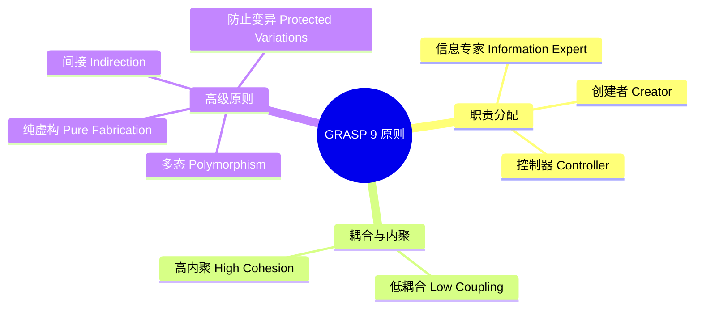

# GRASP 原则（General Responsibility Assignment Software Patterns）

## 概述

GRASP 是 Craig Larman 在《UML 和模式应用》中提出的 9 个**职责分配原则**。比 SOLID 更底层，回答"**谁应该负责做某件事？**"这个核心问题。



---

## 1. 信息专家（Information Expert）

**原则**：把职责分配给**拥有完成该职责所需信息**的类。

```typescript
// 问题：谁来计算订单总金额？
// 答：Order，因为它拥有 items（含 price 和 quantity）

class OrderItem {
  constructor(
    public readonly product:  Product,
    public readonly quantity: number
  ) {}

  subtotal(): Money {
    // OrderItem 是 subtotal 的信息专家（它有 product.price 和 quantity）
    return this.product.price.multiply(this.quantity);
  }
}

class Order {
  constructor(private readonly items: OrderItem[]) {}

  total(): Money {
    // Order 是 total 的信息专家（它有所有 items）
    return this.items.reduce((sum, item) => sum.add(item.subtotal()), Money.ZERO);
  }
}

// ❌ 违反信息专家：把 total() 放在 OrderService
class OrderService {
  calculateTotal(order: Order): Money {
    // OrderService 需要深入访问 order.items，违反封装
    return order.items.reduce(/* ... */, Money.ZERO);
  }
}
```

---

## 2. 创建者（Creator）

**原则**：如果 B 满足以下任意条件，就让 B 创建 A：
- B 包含或聚合 A
- B 记录 A
- B 密切使用 A
- B 拥有创建 A 所需的初始数据

```typescript
// Order 包含 OrderItem → Order 是 OrderItem 的创建者
class Order {
  private items: OrderItem[] = [];

  addProduct(product: Product, quantity: number): void {
    // Order 包含 OrderItem，且拥有创建所需的数据
    const item = new OrderItem(product, quantity);
    this.items.push(item);
  }
}

// ❌ 违反创建者：让外部代码创建 OrderItem 再传入
// const item = new OrderItem(product, quantity);
// order.addItem(item); // Order 和创建逻辑分离，外部可以创建非法状态的 item
```

---

## 3. 控制器（Controller）

**原则**：UI 层之外，第一个处理系统事件（用例请求）的对象称为控制器。  
两种类型：
- **门面控制器（Facade Controller）**：代表整个系统（适合小系统）
- **用例控制器**：代表一个用例或会话（适合大系统）

```typescript
// 用例控制器：每个用例一个控制器（推荐）
class PlaceOrderController {
  constructor(
    private orderService:   OrderService,
    private inventoryCheck: InventoryService,
    private paymentService: PaymentService
  ) {}

  // 处理"下订单"这个系统事件
  async placeOrder(request: PlaceOrderRequest): Promise<PlaceOrderResponse> {
    // 控制器协调多个服务，但不包含业务逻辑本身
    const order   = await this.orderService.create(request.items, request.userId);
    const payment = await this.paymentService.charge(order.total, request.paymentMethod);

    if (!payment.success) {
      await this.orderService.cancel(order.id);
      return { success: false, reason: payment.reason };
    }

    return { success: true, orderId: order.id };
  }
}

// ❌ 控制器里放业务逻辑（变成上帝类）
class PlaceOrderController {
  async placeOrder(request: PlaceOrderRequest): Promise<void> {
    // 直接访问数据库，计算价格，发邮件... → 违反 SRP
  }
}
```

---

## 4. 低耦合（Low Coupling）

**原则**：减少类之间的依赖，使每个类尽量独立，便于理解、复用和修改。

```typescript
// ❌ 高耦合：OrderService 直接依赖具体的 MySQLOrderRepository
class OrderService {
  private repo = new MySQLOrderRepository(); // 直接 new，高耦合
  // 测试时无法替换为内存实现
  // 换数据库需要改 OrderService
}

// ✅ 低耦合：依赖接口，不依赖实现（DIP）
interface OrderRepository {
  findById(id: string): Promise<Order | null>;
  save(order: Order): Promise<void>;
}

class OrderService {
  constructor(private repo: OrderRepository) {} // 依赖倒置，低耦合

  async getOrder(id: string): Promise<Order | null> {
    return this.repo.findById(id);
  }
}

// 测试时注入内存实现
class InMemoryOrderRepository implements OrderRepository { /* ... */ }
const service = new OrderService(new InMemoryOrderRepository());
```

**耦合度量**：  
- 一个类依赖的其他具体类数量（越少越好）
- 一个类接收或返回的其他类类型数量
- 继承关系（子类与父类高度耦合）

---

## 5. 高内聚（High Cohesion）

**原则**：一个类的职责应该高度相关，避免一个类承担太多不相关的工作。

```typescript
// ❌ 低内聚：NotificationService 做了太多不相关的事
class NotificationService {
  // 邮件逻辑
  sendEmail(to: string, subject: string, body: string): void {}
  validateEmailAddress(email: string): boolean { return true; }

  // SMS 逻辑
  sendSMS(phone: string, message: string): void {}
  formatPhoneNumber(phone: string): string { return phone; }

  // Push 通知逻辑
  sendPush(deviceId: string, payload: object): void {}
  getDeviceToken(userId: string): string { return ''; }

  // 用户偏好逻辑（完全不相关！）
  getUserNotificationPreferences(userId: string): object { return {}; }
}

// ✅ 高内聚：每个类只负责一种通知渠道
class EmailNotifier {
  send(to: string, subject: string, body: string): Promise<void> { return Promise.resolve(); }
  private validate(email: string): boolean { return true; }
}

class SMSNotifier {
  send(phone: string, message: string): Promise<void> { return Promise.resolve(); }
  private formatPhone(phone: string): string { return phone; }
}

class PushNotifier {
  send(userId: string, payload: object): Promise<void> { return Promise.resolve(); }
  private getToken(userId: string): Promise<string> { return Promise.resolve(''); }
}

// 上层编排器：只负责路由，不负责具体发送
class NotificationRouter {
  constructor(
    private email: EmailNotifier,
    private sms:   SMSNotifier,
    private push:  PushNotifier
  ) {}

  async notify(userId: string, event: string): Promise<void> {
    // 根据用户偏好选择渠道，委托给具体 Notifier
  }
}
```

---

## 6. 多态（Polymorphism）

**原则**：当行为随类型变化时，用多态（接口/虚方法）替代条件分支（if-else/switch）。

```typescript
// ❌ 用 type 判断的条件逻辑（每次加新类型都需要改这里）
function processPayment(payment: any): void {
  if (payment.type === 'credit_card') {
    // 信用卡逻辑
  } else if (payment.type === 'paypal') {
    // PayPal 逻辑
  } else if (payment.type === 'crypto') {
    // 加密货币逻辑
  }
}

// ✅ 多态：每种支付方式自己知道如何处理
interface PaymentMethod {
  charge(amount: Money): Promise<PaymentResult>;
  refund(transactionId: string, amount: Money): Promise<RefundResult>;
}

class CreditCardPayment implements PaymentMethod {
  async charge(amount: Money): Promise<PaymentResult> { /* Stripe API */ return {} as any; }
  async refund(txId: string, amount: Money): Promise<RefundResult> { return {} as any; }
}

class PayPalPayment implements PaymentMethod {
  async charge(amount: Money): Promise<PaymentResult> { /* PayPal API */ return {} as any; }
  async refund(txId: string, amount: Money): Promise<RefundResult> { return {} as any; }
}

// 处理函数不需要知道具体类型
async function processPayment(method: PaymentMethod, amount: Money): Promise<void> {
  const result = await method.charge(amount); // 多态调用
  // 统一处理结果
}
```

---

## 7. 纯虚构（Pure Fabrication）

**原则**：当没有任何领域类是某个职责的自然归属时，创建一个人工类来承载这个职责。

```typescript
// 问题：谁来负责把 Order 保存到数据库？
// Order 是领域类，不应该知道数据库细节（违反低耦合和高内聚）
// 但 OrderService 已经很忙了

// ✅ 纯虚构：OrderRepository 是人工创造的，不对应任何现实世界的概念
// 它存在的唯一理由是承载"数据持久化"这个技术职责
class OrderRepository {
  async save(order: Order): Promise<void> {
    // SQL/NoSQL 操作
  }

  async findById(id: string): Promise<Order | null> {
    // 查询逻辑
  }
}

// 类似的纯虚构例子：
// - EventEmitter（事件总线）
// - LoggingService（日志）
// - CacheManager（缓存管理）
// - HttpClient（HTTP 请求封装）
// 这些都不对应现实概念，但技术实现中不可缺少
```

---

## 8. 间接（Indirection）

**原则**：通过引入中间对象来解耦两个直接依赖的对象。

```typescript
// ❌ 直接依赖：OrderService 直接调用 EmailService
class OrderService {
  constructor(private emailService: EmailService) {} // 直接耦合

  async placeOrder(order: Order): Promise<void> {
    // ...
    await this.emailService.sendConfirmation(order); // 直接调用
  }
}

// ✅ 间接：通过事件总线解耦
class OrderService {
  constructor(private eventBus: EventBus) {} // 只依赖抽象的事件总线

  async placeOrder(order: Order): Promise<void> {
    // ...
    this.eventBus.publish('order:placed', { orderId: order.id }); // 不知道谁在监听
  }
}

// EmailService 订阅事件，不被 OrderService 知晓
class EmailService {
  constructor(eventBus: EventBus) {
    eventBus.subscribe('order:placed', this.sendConfirmation.bind(this));
  }

  private async sendConfirmation(event: { orderId: string }): Promise<void> { /* ... */ }
}
```

---

## 9. 防止变异（Protected Variations）

**原则**：识别可能变化的点，在其周围创建稳定的接口，防止变化影响其他部分。

```typescript
// 变化点：数据存储方式可能改变（MySQL → MongoDB → Redis）
// 防止变异：用 Repository 接口包裹

interface OrderRepository {
  save(order: Order): Promise<void>;
  findById(id: string): Promise<Order | null>;
}

// 具体实现随时可以替换，调用方不受影响
class MySQLOrderRepository    implements OrderRepository { /* ... */ }
class MongoDBOrderRepository  implements OrderRepository { /* ... */ }
class InMemoryOrderRepository implements OrderRepository { /* ... */ }

// 变化点：支付服务商可能切换（Stripe → Braintree）
interface PaymentGateway {
  charge(amount: Money, token: string): Promise<ChargeResult>;
}

class StripeGateway    implements PaymentGateway { /* ... */ }
class BraintreeGateway implements PaymentGateway { /* ... */ }

// 变化点：消息格式可能变（JSON → Protobuf → Avro）
interface MessageSerializer {
  serialize<T>(data: T): Buffer;
  deserialize<T>(buffer: Buffer): T;
}
```

---

## GRASP vs SOLID 对照表

| GRASP | 对应 SOLID | 核心问题 |
|-------|-----------|---------|
| 信息专家 | SRP | 谁最适合做这件事？ |
| 低耦合 | DIP | 如何减少依赖？ |
| 高内聚 | SRP | 类的职责是否聚焦？ |
| 多态 | OCP | 如何应对类型变化？ |
| 防止变异 | OCP + DIP | 如何隔离变化点？ |
| 纯虚构 | SRP | 技术职责归谁？ |
| 控制器 | — | 谁处理用例入口？ |
| 创建者 | — | 谁来创建对象？ |
| 间接 | DIP | 如何解耦两者？ |

> **面试建议**：能说出 GRASP 会让面试官眼前一亮，因为大多数候选人只知道 SOLID。关键是用真实设计决策举例，而不是背定义。
