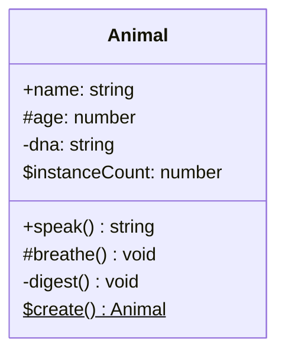
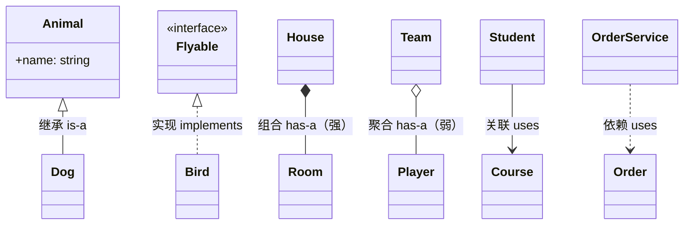
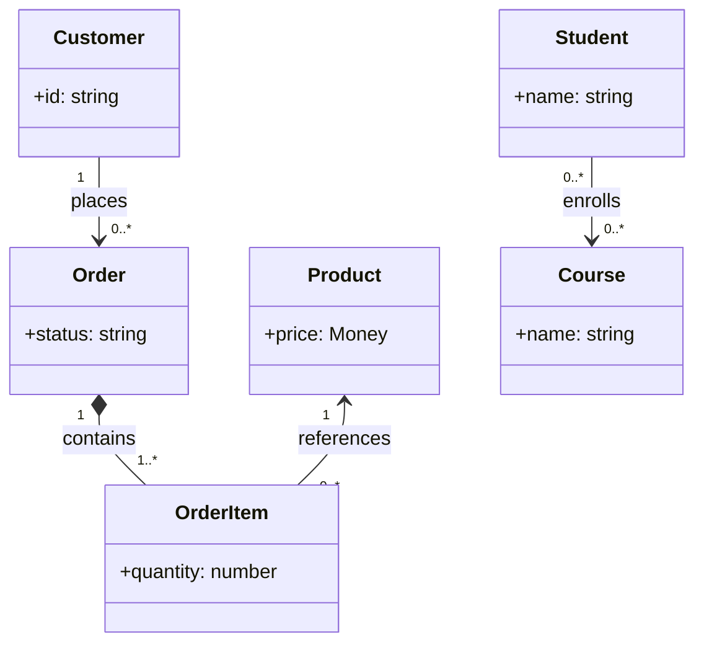
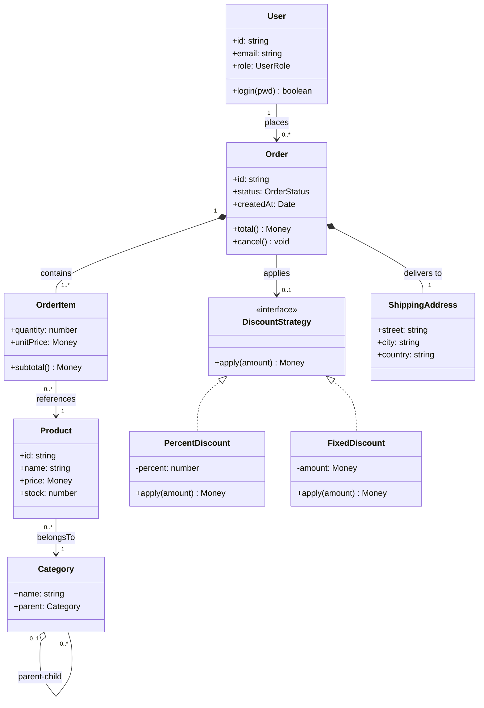

# UML 类图速查表（白板面试版）

## 概述

UML 类图是 OOD 面试的通用语言。这份速查表专为**白板 45 分钟**场景优化：只保留最高频的符号，直接对应 TypeScript 代码。

---

## 类的表示



| 符号 | 含义 | TypeScript |
|------|------|-----------|
| `+` | public | `public` |
| `-` | private | `private` |
| `#` | protected | `protected` |
| `$` | static | `static` |
| 斜体方法/类名 | abstract | `abstract` |
| `<<interface>>` | 接口 | `interface` |
| `<<abstract>>` | 抽象类 | `abstract class` |
| `<<enumeration>>` | 枚举 | `enum` |

---

## 关系类型



---

## 六大关系速记

### 1. 继承（Inheritance）— 实线 + 空心三角

```typescript
// UML: Animal <|-- Dog
abstract class Animal {
  abstract speak(): string;
}
class Dog extends Animal {
  speak(): string { return 'Woof'; }
}
```

**白板画法**：实线，箭头指向父类，箭头是空心三角形 `▷`

---

### 2. 接口实现（Realization）— 虚线 + 空心三角

```typescript
// UML: Flyable <|.. Bird
interface Flyable { fly(): void; }
class Bird implements Flyable {
  fly(): void { console.log('flap flap'); }
}
```

**白板画法**：虚线，箭头指向接口，箭头是空心三角形 `▷`

---

### 3. 组合（Composition）— 实线 + 实心菱形

```typescript
// UML: House *-- Room （House 一侧有实心菱形）
class Room { constructor(public name: string) {} }

class House {
  private rooms: Room[]; // House 创建并拥有 Room

  constructor(roomNames: string[]) {
    this.rooms = roomNames.map(n => new Room(n)); // House 死了，Room 也消亡
  }
}
```

**白板画法**：实线，包含方（House）一侧画实心菱形 `◆`  
**记忆**：强拥有，"一荣俱荣，一损俱损"

---

### 4. 聚合（Aggregation）— 实线 + 空心菱形

```typescript
// UML: Team o-- Player （Team 一侧有空心菱形）
class Player { constructor(public name: string) {} }

class Team {
  constructor(private members: Player[]) {} // Team 不创建 Player，Player 独立存在
  // Team 解散了，Player 还在
}
```

**白板画法**：实线，包含方（Team）一侧画空心菱形 `◇`  
**记忆**：弱拥有，"队解散，人还在"

---

### 5. 关联（Association）— 实线 + 箭头

```typescript
// UML: Student --> Course
class Course { constructor(public name: string) {} }

class Student {
  private enrolledCourses: Course[] = []; // 长期持有引用，但不管生命周期

  enroll(course: Course): void {
    this.enrolledCourses.push(course);
  }
}
```

**白板画法**：实线箭头，指向被关联的类  
**与聚合区别**：语义上没有整体/部分关系，只是"认识"

---

### 6. 依赖（Dependency）— 虚线 + 箭头

```typescript
// UML: OrderService ..> EmailService
class EmailService {
  send(to: string, msg: string): void {}
}

class OrderService {
  placeOrder(order: Order, emailService: EmailService): void { // 参数传入，临时使用
    // ...
    emailService.send(order.userEmail, 'Confirmed');
  }
}
```

**白板画法**：虚线箭头，指向被依赖的类  
**触发条件**：作为方法参数、局部变量、返回类型

---

## 多重性（Multiplicity）



| 符号 | 含义 |
|------|------|
| `1` | 恰好一个 |
| `0..1` | 零或一个（可选） |
| `*` 或 `0..*` | 零到多个 |
| `1..*` | 一到多个（至少一个） |
| `n` | 恰好 n 个 |
| `m..n` | m 到 n 个 |

---

## 完整示例：电商系统类图



---

## 白板画图实用技巧

### 绘图顺序
1. **先写类名**（矩形框）：从核心实体开始（Order、User、Product）
2. **加重要属性**：只写关键字段，不写全部
3. **加核心方法**：只写对外 public 方法
4. **画关系线**：继承 > 组合 > 聚合 > 关联 > 依赖
5. **加多重性**：只在重要的关系上标注

### 简化技巧（节省时间）
```
完整 UML：                白板简化版：
+name: string    →        name
+speak(): string →        speak()
<<interface>>    →        «I» 前缀，或虚线框
```

### 常见白板对话
```
"这里 Order 和 OrderItem 是组合关系，因为 OrderItem 的生命周期
 完全依赖于 Order——Order 删除了 OrderItem 也没有意义了。"

"User 和 Order 是关联而不是组合，User 可以没有订单，
 删除订单也不影响 User 存在。"

"DiscountStrategy 我用了接口，这样可以在不修改 Order 的情况下
 添加新的折扣类型，符合开闭原则。"
```

---

## 速查：看到这些代码，画什么箭头

| TypeScript 代码 | UML 关系 |
|----------------|---------|
| `class A extends B` | `B <\|-- A`（继承，实线空心三角） |
| `class A implements B` | `B <\|.. A`（实现，虚线空心三角） |
| `class A { private b: B }` 且 A 创建 B | `A *-- B`（组合，实心菱形） |
| `class A { private b: B }` 且 B 外部传入 | `A o-- B`（聚合，空心菱形） |
| `class A { private b: B }` 长期持有 | `A --> B`（关联，实线箭头） |
| `method(b: B)` 或 `local b: B` | `A ..> B`（依赖，虚线箭头） |
