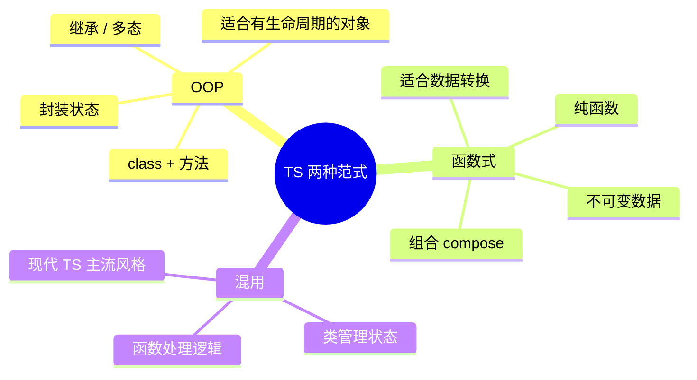
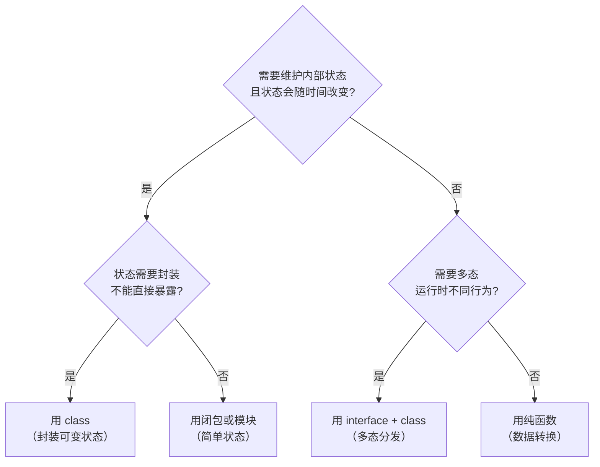

# 函数式 vs OOP：TypeScript 的混用之道

## 核心问题

TypeScript 同时支持两种范式。**不是非此即彼，而是知道什么时候用哪个。**



---

## 关键判断：用 class 还是 function？



---

## 场景对比

### 场景 1：数据转换 → 用函数

```typescript
// ❌ 过度 OOP：为无状态逻辑创建类
class PriceFormatter {
  format(cents: number): string {
    return `¥${(cents / 100).toFixed(2)}`;
  }
}
const formatter = new PriceFormatter();
formatter.format(1999); // ¥19.99

// ✅ 直接用函数：简单、可测试、无副作用
const formatPrice = (cents: number): string =>
  `¥${(cents / 100).toFixed(2)}`;

formatPrice(1999); // ¥19.99

// ✅ 多个相关函数 → 用命名空间或模块导出
export const PriceUtils = {
  format:   (cents: number) => `¥${(cents / 100).toFixed(2)}`,
  toYuan:   (cents: number) => cents / 100,
  toCents:  (yuan: number)  => Math.round(yuan * 100),
  add:      (a: number, b: number) => a + b,
};
```

---

### 场景 2：有生命周期的对象 → 用 class

```typescript
// ✅ WebSocket 连接有状态（连接中/已连接/断开）→ class 合适
class WebSocketClient {
  private ws:       WebSocket | null = null;
  private handlers: Map<string, Set<Function>> = new Map();
  private reconnectTimer: ReturnType<typeof setTimeout> | null = null;

  connect(url: string): void {
    this.ws = new WebSocket(url);
    this.ws.onmessage = (e) => this.emit('message', JSON.parse(e.data));
    this.ws.onclose   = ()  => this.scheduleReconnect(url);
  }

  on(event: string, handler: Function): void {
    if (!this.handlers.has(event)) this.handlers.set(event, new Set());
    this.handlers.get(event)!.add(handler);
  }

  send(data: unknown): void {
    this.ws?.send(JSON.stringify(data));
  }

  disconnect(): void {
    if (this.reconnectTimer) clearTimeout(this.reconnectTimer);
    this.ws?.close();
    this.ws = null;
  }

  private emit(event: string, data: unknown): void {
    this.handlers.get(event)?.forEach(h => h(data));
  }

  private scheduleReconnect(url: string): void {
    this.reconnectTimer = setTimeout(() => this.connect(url), 3000);
  }
}

// 用函数写这个会变成一团闭包，远不如 class 清晰
```

---

### 场景 3：多态行为 → interface + class

```typescript
// ✅ 不同支付方式有不同行为 → 接口 + 实现类
interface PaymentMethod {
  charge(amountCents: number): Promise<{ success: boolean; txId?: string }>;
  refund(txId: string): Promise<boolean>;
}

class StripePayment implements PaymentMethod {
  async charge(amount: number) { /* Stripe API */ return { success: true, txId: 'str_xxx' }; }
  async refund(txId: string)   { return true; }
}

class WeChatPayment implements PaymentMethod {
  async charge(amount: number) { /* WeChat Pay API */ return { success: true, txId: 'wx_xxx' }; }
  async refund(txId: string)   { return true; }
}

// 调用方只依赖接口，运行时多态
async function processOrder(payment: PaymentMethod, amount: number) {
  const result = await payment.charge(amount);
  if (!result.success) throw new Error('Payment failed');
  return result.txId;
}
```

---

### 场景 4：纯逻辑管道 → 函数组合

```typescript
// ✅ 数据处理管道：纯函数组合，每步可单独测试
interface User {
  id:        number;
  name:      string;
  email:     string;
  score:     number;
  deletedAt: Date | null;
}

// 每个函数只做一件事
const isActive    = (u: User): boolean => u.deletedAt === null;
const isHighScore = (u: User): boolean => u.score >= 80;
const toSummary   = (u: User) => ({ id: u.id, name: u.name, score: u.score });

// 管道：不用 class，组合更清晰
const getTopUsers = (users: User[]) =>
  users
    .filter(isActive)
    .filter(isHighScore)
    .map(toSummary)
    .sort((a, b) => b.score - a.score);

// ✅ 通用 compose 工具（函数式）
const compose = <T>(...fns: Array<(x: T) => T>) =>
  (x: T): T => fns.reduceRight((acc, fn) => fn(acc), x);

// ✅ 函数式 vs OOP 对比：同一个需求
// OOP 风格
class UserFilter {
  constructor(private users: User[]) {}
  active()    { return new UserFilter(this.users.filter(isActive)); }
  highScore() { return new UserFilter(this.users.filter(isHighScore)); }
  toSummary() { return this.users.map(toSummary); }
}
// new UserFilter(users).active().highScore().toSummary()

// 函数式风格（更简洁，无需实例化）
// getTopUsers(users)
```

---

## 混用的最佳实践

```typescript
// 现代 TS 项目的典型分层：
//
//   class（状态 + 生命周期）
//   └── 内部用纯函数处理逻辑
//   └── 对外暴露简洁接口

class ShoppingCart {
  private items: CartItem[] = [];

  addItem(product: Product, qty: number): void {
    const existing = this.items.find(i => i.product.id === product.id);
    if (existing) {
      // 用纯函数计算新数量（可单独测试）
      existing.quantity = addQuantity(existing.quantity, qty);
    } else {
      this.items.push(createCartItem(product, qty));
    }
  }

  total(): number {
    // 用纯函数计算总价（可单独测试）
    return calculateTotal(this.items);
  }

  applyDiscount(code: string): void {
    const discount = findDiscount(code); // 纯函数
    if (!discount) throw new Error('Invalid code');
    this.items = applyDiscountToItems(this.items, discount); // 纯函数
  }
}

// 纯函数：独立可测试
const addQuantity    = (current: number, add: number): number => current + add;
const createCartItem = (p: Product, qty: number): CartItem => ({ product: p, quantity: qty });
const calculateTotal = (items: CartItem[]): number =>
  items.reduce((sum, i) => sum + i.product.priceCents * i.quantity, 0);
```

---

## 什么时候不要用 class

```typescript
// ❌ 这些情况用 class 是过度设计：

// 1. 只有静态方法的工具类（用模块导出代替）
class StringUtils {
  static capitalize(s: string) { return s[0].toUpperCase() + s.slice(1); }
  static truncate(s: string, n: number) { return s.length > n ? s.slice(0, n) + '...' : s; }
}
// ✅ 直接导出函数
export const capitalize = (s: string) => s[0].toUpperCase() + s.slice(1);
export const truncate   = (s: string, n: number) => s.length > n ? s.slice(0, n) + '...' : s;

// 2. 只被 new 一次的单例（用模块代替）
class Config {
  static instance: Config;
  private data = { host: 'localhost', port: 3000 };
  static getInstance() { return Config.instance ??= new Config(); }
}
// ✅ 模块天然是单例
export const config = { host: 'localhost', port: 3000 };

// 3. 没有方法的纯数据类（用 interface/type 代替）
class UserDTO {
  constructor(
    public id: string,
    public name: string,
    public email: string
  ) {}
}
// ✅ 直接用 interface
interface UserDTO { id: string; name: string; email: string; }
```

---

## 面试角度

面试官问「你会选择 class 还是 function？」的标准回答框架：

```
"我的判断标准是：

1. 有可变状态 + 需要封装 → class
   （WebSocket 连接、购物车、游戏对象）

2. 需要运行时多态（不同类型不同行为）→ interface + class
   （支付方式、通知渠道、序列化器）

3. 纯粹的数据转换、无副作用 → 纯函数
   （格式化、过滤、计算）

4. 多个相关无状态操作 → 函数模块（命名空间导出）
   （工具函数、验证器）

TypeScript 不强迫你选边，混用才是实际项目中的主流。"
```
