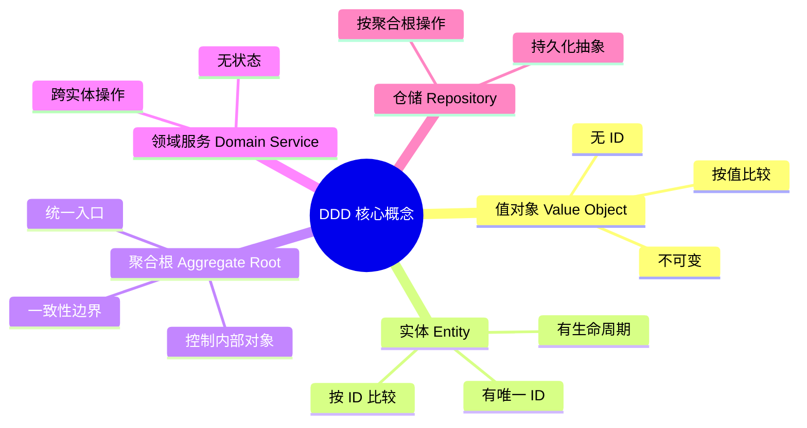

# DDD 基础：OOD 到实际项目的桥梁

## 为什么要懂 DDD？

设计模式解决「类内部怎么写」，DDD 解决「业务逻辑放在哪里、类怎么组织」。

没有 DDD 概念时，常见问题：
- 逻辑散落在 Service 层，Entity 变成贫血模型
- 不知道哪些对象应该有 ID，哪些不需要
- 跨多个对象的操作不知道放哪里



---

## 1. 值对象（Value Object）

**特征**：没有 ID，不可变，按值比较（两个相同值的对象等价）。

**用途**：封装有业务含义的原始类型（消灭 Primitive Obsession）。

```typescript
// ── Money ──────────────────────────────────────────────
class Money {
  // 私有构造，强制通过工厂方法创建（保证合法性）
  private constructor(
    public readonly amountCents: number,
    public readonly currency:    'CNY' | 'USD' | 'EUR'
  ) {}

  static of(cents: number, currency: 'CNY' | 'USD' | 'EUR'): Money {
    if (!Number.isInteger(cents) || cents < 0) {
      throw new Error(`Invalid amount: ${cents}`);
    }
    return new Money(cents, currency);
  }

  static zero(currency: 'CNY' | 'USD' | 'EUR'): Money {
    return new Money(0, currency);
  }

  add(other: Money): Money {
    this.assertSameCurrency(other);
    return new Money(this.amountCents + other.amountCents, this.currency);
  }

  multiply(factor: number): Money {
    return new Money(Math.round(this.amountCents * factor), this.currency);
  }

  isGreaterThan(other: Money): boolean {
    this.assertSameCurrency(other);
    return this.amountCents > other.amountCents;
  }

  // 值对象的相等：按值比较，不是引用
  equals(other: Money): boolean {
    return this.amountCents === other.amountCents && this.currency === other.currency;
  }

  format(): string {
    const symbol = { CNY: '¥', USD: '$', EUR: '€' }[this.currency];
    return `${symbol}${(this.amountCents / 100).toFixed(2)}`;
  }

  private assertSameCurrency(other: Money): void {
    if (this.currency !== other.currency) {
      throw new Error(`Currency mismatch: ${this.currency} vs ${other.currency}`);
    }
  }
}

// ── Email ──────────────────────────────────────────────
class Email {
  private constructor(public readonly value: string) {}

  static of(raw: string): Email {
    const trimmed = raw.trim().toLowerCase();
    if (!/^[^\s@]+@[^\s@]+\.[^\s@]+$/.test(trimmed)) {
      throw new Error(`Invalid email: ${raw}`);
    }
    return new Email(trimmed);
  }

  equals(other: Email): boolean { return this.value === other.value; }
  toString(): string { return this.value; }
}

// ── Address（复合值对象）──────────────────────────────
class Address {
  private constructor(
    public readonly street:  string,
    public readonly city:    string,
    public readonly country: string,
    public readonly zip:     string
  ) {}

  static of(street: string, city: string, country: string, zip: string): Address {
    if (!street || !city || !country) throw new Error('Address fields required');
    return new Address(street, city, country, zip);
  }

  equals(other: Address): boolean {
    return this.street  === other.street &&
           this.city    === other.city   &&
           this.country === other.country &&
           this.zip     === other.zip;
  }

  format(): string { return `${this.street}, ${this.city}, ${this.country} ${this.zip}`; }
}

// 使用
const price1 = Money.of(1999, 'CNY');
const price2 = Money.of(1999, 'CNY');
console.log(price1.equals(price2)); // true（值对象按值比较）
console.log(price1 === price2);     // false（不同引用）
console.log(price1.format());       // ¥19.99
```

---

## 2. 实体（Entity）

**特征**：有唯一 ID，有生命周期（状态随时间变化），按 ID 比较。

**用途**：表达业务中需要追踪的"人/事/物"。

```typescript
// 实体基类（可选）
abstract class Entity<T extends string | number = string> {
  constructor(public readonly id: T) {}

  equals(other: Entity<T>): boolean { return this.id === other.id; }
}

// ── User 实体 ──────────────────────────────────────────
class User extends Entity {
  private _email:    Email;
  private _name:     string;
  private _status:   'active' | 'suspended' | 'deleted' = 'active';
  private _createdAt: Date = new Date();

  constructor(id: string, email: Email, name: string) {
    super(id);
    this._email = email;
    this._name  = name;
  }

  // 业务行为（富领域模型）
  changeEmail(newEmail: Email): void {
    if (this._status !== 'active') throw new Error('Cannot change email of inactive user');
    this._email = newEmail;
  }

  suspend(): void {
    if (this._status !== 'active') throw new Error('User is not active');
    this._status = 'suspended';
  }

  delete(): void {
    this._status = 'deleted';
  }

  // Getter（只读暴露）
  get email():  Email  { return this._email; }
  get name():   string { return this._name; }
  get status(): string { return this._status; }
  get isActive(): boolean { return this._status === 'active'; }
}

// 两个 User 实体：ID 相同就是同一个人，不管其他字段
const u1 = new User('user-001', Email.of('alice@example.com'), 'Alice');
const u2 = new User('user-001', Email.of('alice@gmail.com'),   'Alice (new email)');
console.log(u1.equals(u2)); // true（同一个人，ID 相同）
```

---

## 3. 聚合根（Aggregate Root）

**特征**：一组对象的一致性边界，外部只能通过聚合根操作内部对象。

**用途**：保证业务规则在多个对象间的一致性。

```typescript
// ── Order 聚合（Order 是聚合根，OrderItem 是内部对象）──
class OrderItem {
  // OrderItem 不是实体（没有独立 ID），是聚合内部的对象
  constructor(
    public readonly productId: string,
    public readonly name:      string,
    private _quantity:         number,
    public readonly unitPrice: Money
  ) {
    if (_quantity <= 0) throw new Error('Quantity must be positive');
  }

  get quantity(): number { return this._quantity; }

  get subtotal(): Money { return this.unitPrice.multiply(this._quantity); }

  increaseQuantity(by: number): void {
    if (by <= 0) throw new Error('Must increase by positive amount');
    this._quantity += by;
  }
}

type OrderStatus = 'pending' | 'confirmed' | 'shipped' | 'delivered' | 'cancelled';

class Order extends Entity {
  private _items:  OrderItem[] = [];
  private _status: OrderStatus = 'pending';

  constructor(
    id:     string,
    public readonly customerId: string,
    public readonly currency:   'CNY' | 'USD' | 'EUR' = 'CNY'
  ) {
    super(id);
  }

  // 外部只能通过聚合根修改内部状态
  addItem(productId: string, name: string, quantity: number, unitPrice: Money): void {
    if (this._status !== 'pending') {
      throw new Error('Cannot add items to a non-pending order');
    }

    const existing = this._items.find(i => i.productId === productId);
    if (existing) {
      existing.increaseQuantity(quantity);
    } else {
      this._items.push(new OrderItem(productId, name, quantity, unitPrice));
    }
  }

  removeItem(productId: string): void {
    if (this._status !== 'pending') throw new Error('Cannot modify confirmed order');
    this._items = this._items.filter(i => i.productId !== productId);
  }

  confirm(): void {
    if (this._items.length === 0) throw new Error('Cannot confirm empty order');
    if (this._status !== 'pending') throw new Error('Order is not pending');
    this._status = 'confirmed';
  }

  ship(): void {
    if (this._status !== 'confirmed') throw new Error('Order must be confirmed before shipping');
    this._status = 'shipped';
  }

  cancel(): void {
    if (this._status === 'shipped' || this._status === 'delivered') {
      throw new Error('Cannot cancel shipped/delivered order');
    }
    this._status = 'cancelled';
  }

  // 聚合根内的业务计算
  get total(): Money {
    return this._items.reduce(
      (sum, item) => sum.add(item.subtotal),
      Money.zero(this.currency)
    );
  }

  get itemCount(): number {
    return this._items.reduce((sum, item) => sum + item.quantity, 0);
  }

  get status(): OrderStatus { return this._status; }

  // 返回只读副本（不暴露内部数组引用）
  get items(): ReadonlyArray<OrderItem> { return Object.freeze([...this._items]); }
}

// 使用
const order = new Order('order-001', 'user-001');
order.addItem('prod-1', 'iPhone 15', 1, Money.of(799900, 'CNY'));
order.addItem('prod-2', 'AirPods',   2, Money.of(129900, 'CNY'));
console.log(order.total.format()); // ¥10,595.00
order.confirm();
// order.addItem(...); // 报错：不能向已确认订单加商品
```

---

## 4. 领域服务（Domain Service）

**特征**：跨多个聚合/实体的操作，无状态，不属于任何单一实体。

```typescript
// ── 转账：涉及两个 Account 聚合 ──────────────────────
class Account extends Entity {
  private _balance: Money;

  constructor(id: string, initialBalance: Money) {
    super(id);
    this._balance = initialBalance;
  }

  credit(amount: Money): void {
    this._balance = this._balance.add(amount);
  }

  debit(amount: Money): void {
    if (this._balance.isGreaterThan(amount) === false && !this._balance.equals(amount)) {
      throw new Error('Insufficient balance');
    }
    this._balance = this._balance.add(amount.multiply(-1));
  }

  get balance(): Money { return this._balance; }
}

// 转账逻辑不属于 from Account 也不属于 to Account
// → 领域服务
class TransferService {
  transfer(from: Account, to: Account, amount: Money): void {
    if (amount.amountCents <= 0) throw new Error('Amount must be positive');
    from.debit(amount);
    to.credit(amount);
    // 实际项目中还需要：创建 Transaction 记录、发布领域事件
  }
}
```

---

## 5. 仓储（Repository）

**特征**：持久化的抽象层，隐藏存储细节，按聚合根操作。

```typescript
// 仓储接口（领域层定义，不依赖具体数据库）
interface OrderRepository {
  findById(id: string):               Promise<Order | null>;
  findByCustomerId(customerId: string): Promise<Order[]>;
  save(order: Order):                 Promise<void>;
  delete(id: string):                 Promise<void>;
}

// 内存实现（测试用）
class InMemoryOrderRepository implements OrderRepository {
  private store: Map<string, Order> = new Map();

  async findById(id: string)             { return this.store.get(id) ?? null; }
  async findByCustomerId(customerId: string) {
    return [...this.store.values()].filter(o => o.customerId === customerId);
  }
  async save(order: Order)               { this.store.set(order.id, order); }
  async delete(id: string)               { this.store.delete(id); }
}

// 生产实现（MySQL）
class MySQLOrderRepository implements OrderRepository {
  constructor(private db: DatabaseConnection) {}

  async findById(id: string): Promise<Order | null> {
    const row = await this.db.query('SELECT * FROM orders WHERE id = ?', [id]);
    return row ? this.toDomain(row) : null;
  }

  async save(order: Order): Promise<void> {
    await this.db.execute(
      'INSERT INTO orders ... ON DUPLICATE KEY UPDATE ...',
      this.toRow(order)
    );
  }

  // ORM 映射：数据库行 → 领域对象
  private toDomain(row: any): Order { /* ... */ return {} as Order; }
  private toRow(order: Order): any  { /* ... */ return {}; }

  async findByCustomerId(customerId: string): Promise<Order[]> { return []; }
  async delete(id: string): Promise<void> {}
}
```

---

## 整体架构示意

```mermaid
flowchart TD
    subgraph 领域层（Domain Layer）
        VO["值对象\nMoney / Email / Address"]
        EN["实体\nUser / Order"]
        AR["聚合根\nOrder 控制 OrderItem"]
        DS["领域服务\nTransferService"]
    end

    subgraph 应用层（Application Layer）
        US["用例 / Application Service\nPlaceOrderUseCase"]
    end

    subgraph 基础设施层（Infrastructure Layer）
        REPO["仓储实现\nMySQLOrderRepository"]
        DB[("MySQL")]
    end

    US --> AR
    US --> DS
    AR --> VO
    AR --> EN
    US --> REPO
    REPO --> DB
    REPO -.->|实现接口| AR
```

---

## 速查：我应该用哪个概念？

| 问题 | 用什么 |
|------|--------|
| 这个数据有没有唯一 ID 需要追踪？ | 有→实体，没有→值对象 |
| 这个操作属于哪个对象？ | 属于某个聚合→方法，跨多个聚合→领域服务 |
| 这个对象的状态会变吗？ | 会变→实体，不变→值对象 |
| 两个"相同"的对象是同一个吗？ | 是（按 ID）→实体，否（按值）→值对象 |
| 谁来持久化？ | 仓储，且只持久化聚合根 |
| 一致性边界在哪里？ | 聚合根内的操作保证一致，聚合间最终一致 |

---

## 面试中如何提 DDD

不需要背定义，用实例说即可：

```
"我把 Money 设计成值对象而不是用 number，
 因为金额有货币单位，两个值一样的 Money 对象是等价的，
 而且不可变能防止意外修改。这是 DDD 里值对象的思路。"

"Order 是聚合根，外部不能直接操作 OrderItem，
 必须通过 Order.addItem()，这样能保证一个订单的商品数量
 和总价始终是一致的——这就是聚合的一致性边界。"
```
