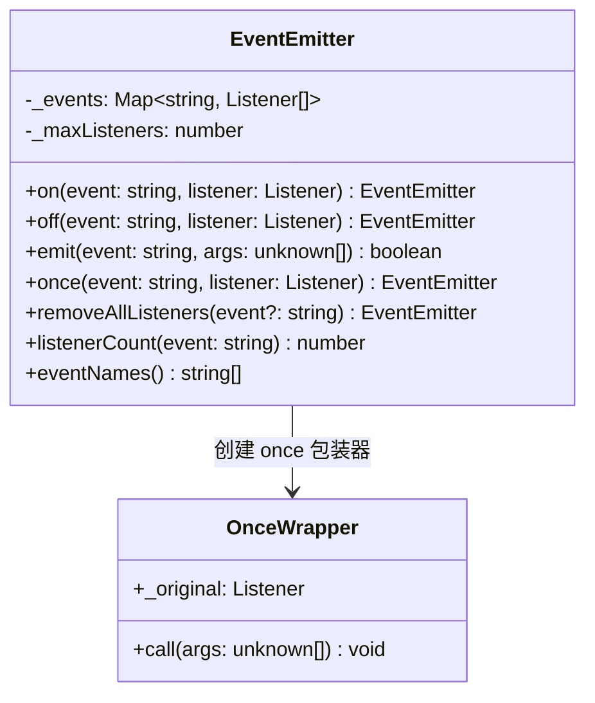

# 实现 EventEmitter

> 经典前端 OOD 题，考察观察者模式、API 设计、内存泄漏防护。
> Node.js `EventEmitter`、浏览器 `EventTarget`、Vue 2 `$on/$emit` 都是这个模式。

---

## 设计思路（面试开场白）

"这是观察者模式（Observer Pattern）的经典实现。核心数据结构是一个 Map，key 是事件名，value 是监听器数组。
首先确认 API 需求——是否需要 once（只触发一次）？是否需要 maxListeners 内存泄漏防护？emit 时 listener 报错是否应该隔离？
核心实现四步：on 往数组 push、off 用 filter 移除、emit 遍历调用、once 用包装器实现（包装器执行后自动 off）。"

---

## 类图



---

## 需求分析（面试时先问清楚）

```
基础 API：
  on(event, listener)      订阅
  off(event, listener)     取消订阅
  emit(event, ...args)     触发
  once(event, listener)    只触发一次

扩展 API：
  removeAllListeners(event?)  清除所有监听器
  listenerCount(event)        查询监听器数量
  eventNames()                查询所有事件名

约束：
  - 同一 listener 可以订阅同一事件多次（Node.js 行为）
  - emit 时 listener 内部的错误不能影响其他 listener
  - 内存泄漏防护：超过 maxListeners 时警告
```

---

## 类图

```
EventEmitter
  - _events: Map<string, Listener[]>
  - _maxListeners: number
  + on(event, listener): this
  + off(event, listener): this
  + emit(event, ...args): boolean
  + once(event, listener): this
  + removeAllListeners(event?): this
  + listenerCount(event): number
  + eventNames(): string[]
```

---

## 白板版（面试15分钟）

```typescript
// 面试写这个版本，生产实现见下方完整版
class EventEmitter {
  private map = new Map<string, Function[]>();

  on(event: string, fn: Function) {
    if (!this.map.has(event)) this.map.set(event, []);
    this.map.get(event)!.push(fn);
  }

  off(event: string, fn: Function) {
    this.map.set(event, (this.map.get(event) ?? []).filter(f => f !== fn));
  }

  emit(event: string, ...args: unknown[]) {
    // 省略：错误处理 / 边界检查
    this.map.get(event)?.slice().forEach(fn => fn(...args));
  }

  once(event: string, fn: Function) {
    const wrap = (...args: unknown[]) => { fn(...args); this.off(event, wrap); };
    this.on(event, wrap);
  }
}
```

---

## 实现

```typescript
type Listener = (...args: unknown[]) => void;

// once 包装器的标记（用于 off 时正确移除）
interface OnceWrapper extends Listener {
  _original: Listener;
}

class EventEmitter {
  private _events = new Map<string, Listener[]>();
  private _maxListeners = 10;

  // ─── 核心 API ───────────────────────────────────────

  on(event: string, listener: Listener): this {
    this._addListener(event, listener, false);
    return this;
  }

  once(event: string, listener: Listener): this {
    this._addListener(event, listener, true);
    return this;
  }

  off(event: string, listener: Listener): this {
    const listeners = this._events.get(event);
    if (!listeners) return this;

    // 匹配原始 listener 或 once 包装器的 _original
    const idx = listeners.findIndex(
      l => l === listener || (l as OnceWrapper)._original === listener
    );
    if (idx !== -1) listeners.splice(idx, 1);
    if (listeners.length === 0) this._events.delete(event);

    return this;
  }

  emit(event: string, ...args: unknown[]): boolean {
    const listeners = this._events.get(event);
    if (!listeners || listeners.length === 0) return false;

    // 复制一份，防止 listener 内部 off 导致迭代错乱
    [...listeners].forEach(listener => {
      try {
        listener(...args);
      } catch (err) {
        // 错误隔离：单个 listener 出错不影响其他 listener
        // 但 'error' 事件本身的错误应该抛出
        if (event === 'error') throw err;
        this.emit('error', err);
      }
    });

    return true;
  }

  removeAllListeners(event?: string): this {
    if (event) {
      this._events.delete(event);
    } else {
      this._events.clear();
    }
    return this;
  }

  listenerCount(event: string): number {
    return this._events.get(event)?.length ?? 0;
  }

  eventNames(): string[] {
    return [...this._events.keys()];
  }

  setMaxListeners(n: number): this {
    this._maxListeners = n;
    return this;
  }

  // ─── 内部方法 ────────────────────────────────────────

  private _addListener(event: string, listener: Listener, once: boolean) {
    if (!this._events.has(event)) {
      this._events.set(event, []);
    }

    const listeners = this._events.get(event)!;

    // 内存泄漏警告
    if (listeners.length >= this._maxListeners) {
      console.warn(
        `MaxListenersExceededWarning: Possible EventEmitter memory leak detected. ` +
        `${listeners.length + 1} "${event}" listeners added. ` +
        `Use emitter.setMaxListeners() to increase limit.`
      );
    }

    if (once) {
      // 包装成自动移除的 wrapper
      const wrapper: OnceWrapper = ((...args: unknown[]) => {
        this.off(event, listener);  // 先移除，再调用（防止 listener 内 throw 导致未移除）
        listener(...args);
      }) as OnceWrapper;
      wrapper._original = listener;
      listeners.push(wrapper);
    } else {
      listeners.push(listener);
    }
  }
}
```

---

## 测试用例

```typescript
const emitter = new EventEmitter();

// 基础订阅/触发
emitter.on('data', (msg) => console.log('listener1:', msg));
emitter.on('data', (msg) => console.log('listener2:', msg));
emitter.emit('data', 'hello');
// listener1: hello
// listener2: hello

// once 只触发一次
emitter.once('connect', () => console.log('connected!'));
emitter.emit('connect');   // connected!
emitter.emit('connect');   // （无输出）

// off 移除特定 listener
const handler = (x: number) => console.log('value:', x);
emitter.on('change', handler);
emitter.emit('change', 1);   // value: 1
emitter.off('change', handler);
emitter.emit('change', 2);   // （无输出）

// off 移除 once 注册的 listener（在触发前移除）
const onceHandler = () => console.log('once');
emitter.once('tick', onceHandler);
emitter.off('tick', onceHandler);   // 移除 once 包装器
emitter.emit('tick');               // （无输出）✓

// listenerCount
emitter.on('test', () => {});
emitter.on('test', () => {});
console.log(emitter.listenerCount('test'));  // 2

// 错误隔离：listener1 抛错不影响 listener2
emitter.on('msg', () => { throw new Error('bad'); });
emitter.on('msg', () => console.log('still runs'));
// 需要监听 error 事件，否则抛出
emitter.on('error', (err) => console.error('caught:', err));
emitter.emit('msg');  // still runs（listener1 出错被隔离）
```

---

## 进阶：支持泛型类型安全

```typescript
// 通过 TypeScript 泛型实现类型安全的 EventEmitter
type EventMap = Record<string, unknown[]>;

class TypedEventEmitter<Events extends EventMap> {
  private emitter = new EventEmitter();

  on<K extends keyof Events & string>(
    event: K,
    listener: (...args: Events[K]) => void
  ): this {
    this.emitter.on(event, listener as Listener);
    return this;
  }

  emit<K extends keyof Events & string>(event: K, ...args: Events[K]): boolean {
    return this.emitter.emit(event, ...args);
  }

  off<K extends keyof Events & string>(
    event: K,
    listener: (...args: Events[K]) => void
  ): this {
    this.emitter.off(event, listener as Listener);
    return this;
  }
}

// 使用
type MyEvents = {
  data: [string, number];    // 事件参数类型
  error: [Error];
  close: [];
};

const ee = new TypedEventEmitter<MyEvents>();
ee.on('data', (msg, code) => {});    // msg: string, code: number ✓
ee.on('data', (msg: number) => {});  // TS 错误 ✓
```

---

## 常见踩坑

**踩坑1：emit 时直接遍历原数组**
❌ 错误：`listeners.forEach(fn => fn(...args))`，listener 内部调用 `off` 会修改正在迭代的数组，导致后续 listener 被跳过。
✓ 正确：遍历前先复制一份快照：`[...listeners].forEach(fn => fn(...args))`。
原因：`forEach` 迭代时数组长度变化会导致部分 listener 被跳过，且行为依赖 JS 引擎实现。

**踩坑2：off 移除 once 注册的 listener 失败**
❌ 错误：`off('event', fn)` 后 `once` 注册的 fn 仍然触发，因为 once 内部创建了包装函数存入 listeners，`off` 找不到原始 fn。
✓ 正确：once 创建的包装器必须带 `_original` 标记，`off` 时同时检查 `wrapper._original === listener`。
原因：直接比较函数引用，包装器与原始函数是两个不同的对象。

**踩坑3：once 先调用 listener 再 off**
❌ 错误：`fn(...args); this.off(event, wrap);`，如果 fn 内部抛出异常，off 永远不会执行，变成永久订阅。
✓ 正确：先 off 再调用：`this.off(event, wrap); fn(...args);`。
原因：先移除保证即使 listener 出错，也不会重复触发。

**踩坑4：忘记内存泄漏防护**
❌ 错误：无限次 `on` 同一事件而不 `off`，listeners 数组无限增长，Node.js 进程内存泄漏。
✓ 正确：超过 `maxListeners`（默认 10）时打印警告，提示调用方检查是否忘记 off。
原因：循环中注册 listener 或组件卸载时未清理是最常见场景。

**踩坑5：error 事件没有监听时直接 throw**
❌ 错误：所有事件的 listener 出错都被 catch 掉静默失败。
✓ 正确：`'error'` 事件比较特殊，如果没有监听 error 事件，emit('error') 应该抛出（与 Node.js 行为一致）。
原因：`error` 事件用于传递运行时错误，静默忽略会导致问题难以排查。

---

## 扩展性追问

**Q: 如何支持通配符事件（`on('user:*', handler)`）？**
思路：on 注册时将含 `*` 的事件名存入单独的 wildcardMap；emit 时除了精确匹配，还遍历 wildcardMap，将事件名转换为正则（`user:*` → `/^user:.+$/`）逐一测试。键的解析可以在 on 时预编译为 RegExp 缓存，避免 emit 时重复创建正则对象。

**Q: 如何实现 async emit，等所有 listener 完成后 resolve？**
思路：将 emit 改为返回 `Promise.allSettled(listeners.map(fn => Promise.resolve(fn(...args))))`，这样异步 listener 的 reject 不会中断其他 listener，调用方可以检查 allSettled 的结果处理失败。注意 slice 快照仍然必要。

**Q: 如何添加 maxListeners 警告，并让调用方可以关闭它？**
思路：在 `_addListener` 中判断 `listeners.length >= this._maxListeners`，打印带事件名的警告。提供 `setMaxListeners(Infinity)` 允许关闭限制，或者 `emitter.setMaxListeners(0)` 表示不限制。Node.js 16+ 支持 `process.setMaxListeners()` 设置全局默认值，可以参考这个 API 设计。

---

## 面试追问

**Q: 为什么 emit 时要先复制 listeners 数组？**
A: 如果 listener 内部调用 `off` 移除自身，会修改正在迭代的数组，导致后续 listener 被跳过。复制一份快照 `[...listeners]` 确保迭代基于触发时的状态。

**Q: once 的实现为什么要先 off 再调用 listener，而不是先调用再 off？**
A: 如果先调用 listener，listener 内部抛出异常，`off` 就永远不会执行，该 listener 变成了永久订阅。先 off 再调用可以保证即使 listener 出错，也不会重复触发。

**Q: 如何检测内存泄漏？**
A: 统计某个事件的 listener 数量，超过 `maxListeners`（默认 10）时打警告。这是 Node.js 的实际行为。常见原因是在循环中 `on` 但忘了 `off`，或者组件卸载时没有清理。

**Q: EventEmitter 和 RxJS Observable 有什么区别？**
A: EventEmitter 是命令式、有状态的推送模型，适合离散事件；Observable 是声明式的数据流，支持操作符（map/filter/debounce）、懒执行、自动完成/错误语义，适合复杂异步流处理。
