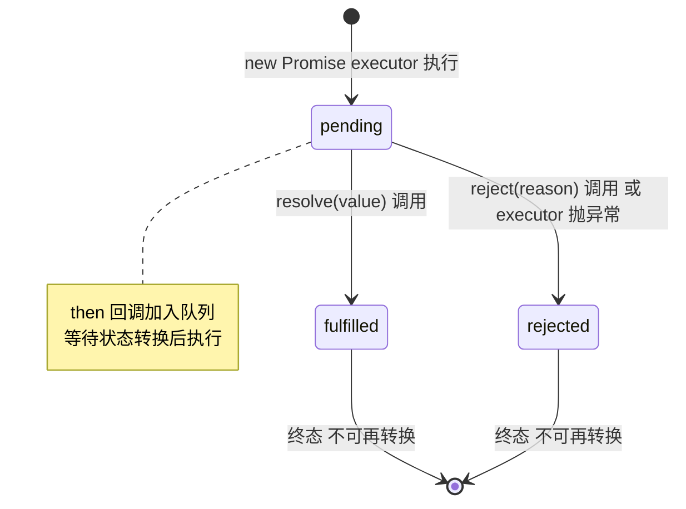
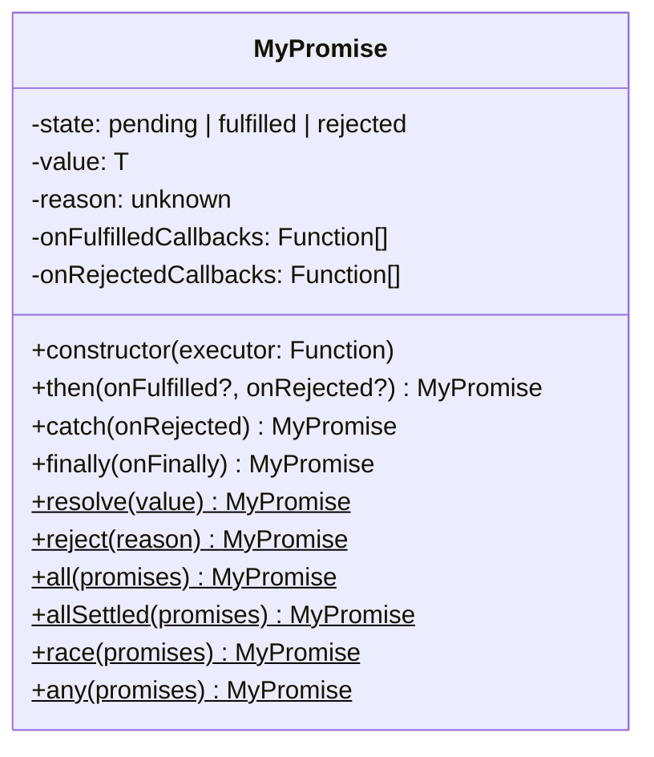

# 实现 Promise（符合 Promises/A+ 规范）

> 考察点：状态机、链式调用、微任务队列、异步错误处理。
> 实现一个能通过 Promises/A+ 规范 872 条测试的 Promise。

---

## 设计思路（面试开场白）

"Promise 的核心是一个状态机——三个状态（pending/fulfilled/rejected），单向流转，不可逆。
关键难点有三个：
一是 then 必须返回新 Promise（支持链式），且 onFulfilled/onRejected 要异步执行（用 queueMicrotask）；
二是 resolve 传入 thenable（另一个 Promise）时要等待它完成；
三是循环引用检测（then 的返回值不能是 then 自身返回的 Promise）。
静态方法 Promise.all 注意：用计数器而非 Promise.all 本身，因为我们就是在实现它。"

---

## 状态机图



---

## 类图



---

## 需求分析

```
核心规范（Promises/A+）：
  - 三个状态：pending → fulfilled | rejected（不可逆）
  - then(onFulfilled, onRejected) 返回新 Promise（支持链式）
  - onFulfilled/onRejected 必须异步执行（微任务）
  - 值穿透：then 参数非函数时透传
  - 循环引用检测

静态方法：
  Promise.resolve(value)
  Promise.reject(reason)
  Promise.all(promises)
  Promise.allSettled(promises)
  Promise.race(promises)
  Promise.any(promises)
```

---

## 状态机

```
pending ──resolve──→ fulfilled
        ──reject───→ rejected

fulfilled / rejected 是终态，不可再转换。
```

---

## 白板版（面试15分钟）

```typescript
// 面试写这个版本，生产实现见下方完整版
type State = 'pending' | 'fulfilled' | 'rejected';

class MyPromise {
  private state: State = 'pending';
  private value: unknown;
  private callbacks: { onFulfilled: Function; onRejected: Function }[] = [];

  constructor(executor: (resolve: Function, reject: Function) => void) {
    const resolve = (value: unknown) => {
      if (this.state !== 'pending') return;
      this.state = 'fulfilled';
      this.value = value;
      this.callbacks.forEach(cb => queueMicrotask(() => cb.onFulfilled(value)));
    };
    const reject = (reason: unknown) => {
      if (this.state !== 'pending') return;
      this.state = 'rejected';
      this.value = reason;
      this.callbacks.forEach(cb => queueMicrotask(() => cb.onRejected(reason)));
    };
    // 省略：循环引用检测 / resolve(thenable) 处理
    try { executor(resolve, reject); } catch (e) { reject(e); }
  }

  then(onFulfilled?: Function, onRejected?: Function): MyPromise {
    const _onFulfilled = typeof onFulfilled === 'function' ? onFulfilled : (v: unknown) => v;
    const _onRejected = typeof onRejected === 'function' ? onRejected : (r: unknown) => { throw r; };

    return new MyPromise((resolve, reject) => {
      const handle = (fn: Function, val: unknown) => {
        queueMicrotask(() => {
          try { resolve(fn(val)); } catch (e) { reject(e); }
        });
      };
      if (this.state === 'fulfilled') handle(_onFulfilled, this.value);
      else if (this.state === 'rejected') handle(_onRejected, this.value);
      else this.callbacks.push({ onFulfilled: (v: unknown) => handle(_onFulfilled, v), onRejected: (r: unknown) => handle(_onRejected, r) });
    });
  }

  catch(onRejected: Function) { return this.then(undefined, onRejected); }

  static resolve(v: unknown) { return new MyPromise(r => r(v)); }
  static reject(r: unknown) { return new MyPromise((_, j) => j(r)); }

  static all(promises: MyPromise[]) {
    return new MyPromise((resolve, reject) => {
      const results: unknown[] = [];
      let count = 0;
      promises.forEach((p, i) => p.then((v: unknown) => {
        results[i] = v;
        if (++count === promises.length) resolve(results);
      }, reject));
    });
  }
}
```

---

## 核心实现

```typescript
type PromiseState = 'pending' | 'fulfilled' | 'rejected';
type Resolve<T> = (value: T | PromiseLike<T>) => void;
type Reject = (reason?: unknown) => void;

class MyPromise<T = unknown> {
  private state: PromiseState = 'pending';
  private value: T | undefined = undefined;
  private reason: unknown = undefined;

  // 等待中的回调队列（then 在 pending 时注册）
  private onFulfilledCallbacks: ((value: T) => void)[] = [];
  private onRejectedCallbacks: ((reason: unknown) => void)[] = [];

  constructor(executor: (resolve: Resolve<T>, reject: Reject) => void) {
    const resolve: Resolve<T> = (value) => {
      // 处理 resolve(thenable)
      if (value && typeof (value as PromiseLike<T>).then === 'function') {
        (value as PromiseLike<T>).then(resolve, reject);
        return;
      }
      if (this.state !== 'pending') return;
      this.state = 'fulfilled';
      this.value = value as T;
      this.onFulfilledCallbacks.forEach(cb => cb(this.value!));
    };

    const reject: Reject = (reason) => {
      if (this.state !== 'pending') return;
      this.state = 'rejected';
      this.reason = reason;
      this.onRejectedCallbacks.forEach(cb => cb(this.reason));
    };

    try {
      executor(resolve, reject);
    } catch (err) {
      reject(err);
    }
  }

  then<TResult1 = T, TResult2 = never>(
    onFulfilled?: ((value: T) => TResult1 | PromiseLike<TResult1>) | null,
    onRejected?: ((reason: unknown) => TResult2 | PromiseLike<TResult2>) | null
  ): MyPromise<TResult1 | TResult2> {
    // 值穿透：非函数时透传
    const _onFulfilled = typeof onFulfilled === 'function'
      ? onFulfilled
      : (v: T) => v as unknown as TResult1;

    const _onRejected = typeof onRejected === 'function'
      ? onRejected
      : (r: unknown) => { throw r; };

    const promise2 = new MyPromise<TResult1 | TResult2>((resolve, reject) => {
      const handleFulfilled = (value: T) => {
        // 规范要求：onFulfilled 必须在微任务中异步执行
        queueMicrotask(() => {
          try {
            const x = _onFulfilled(value);
            resolvePromise(promise2, x, resolve, reject);
          } catch (err) {
            reject(err);
          }
        });
      };

      const handleRejected = (reason: unknown) => {
        queueMicrotask(() => {
          try {
            const x = _onRejected(reason);
            resolvePromise(promise2, x, resolve, reject);
          } catch (err) {
            reject(err);
          }
        });
      };

      if (this.state === 'fulfilled') {
        handleFulfilled(this.value!);
      } else if (this.state === 'rejected') {
        handleRejected(this.reason);
      } else {
        // pending：注册到队列，等待 resolve/reject 时执行
        this.onFulfilledCallbacks.push(handleFulfilled);
        this.onRejectedCallbacks.push(handleRejected);
      }
    });

    return promise2;
  }

  catch<TResult = never>(
    onRejected?: ((reason: unknown) => TResult | PromiseLike<TResult>) | null
  ): MyPromise<T | TResult> {
    return this.then(null, onRejected);
  }

  finally(onFinally?: (() => void) | null): MyPromise<T> {
    return this.then(
      (value) => MyPromise.resolve(onFinally?.()).then(() => value),
      (reason) => MyPromise.resolve(onFinally?.()).then(() => { throw reason; })
    );
  }

  // ─── 静态方法 ────────────────────────────────────────

  static resolve<T>(value: T | PromiseLike<T>): MyPromise<T> {
    if (value instanceof MyPromise) return value;
    return new MyPromise<T>(resolve => resolve(value));
  }

  static reject<T = never>(reason?: unknown): MyPromise<T> {
    return new MyPromise<T>((_, reject) => reject(reason));
  }

  static all<T>(promises: (T | PromiseLike<T>)[]): MyPromise<T[]> {
    return new MyPromise<T[]>((resolve, reject) => {
      if (promises.length === 0) return resolve([]);

      const results: T[] = new Array(promises.length);
      let resolved = 0;

      promises.forEach((p, i) => {
        MyPromise.resolve(p).then(value => {
          results[i] = value;
          if (++resolved === promises.length) resolve(results);
        }, reject);
      });
    });
  }

  static allSettled<T>(
    promises: (T | PromiseLike<T>)[]
  ): MyPromise<({ status: 'fulfilled'; value: T } | { status: 'rejected'; reason: unknown })[]> {
    return MyPromise.all(
      promises.map(p =>
        MyPromise.resolve(p).then(
          value => ({ status: 'fulfilled' as const, value }),
          reason => ({ status: 'rejected' as const, reason })
        )
      )
    );
  }

  static race<T>(promises: (T | PromiseLike<T>)[]): MyPromise<T> {
    return new MyPromise<T>((resolve, reject) => {
      promises.forEach(p => MyPromise.resolve(p).then(resolve, reject));
    });
  }

  static any<T>(promises: (T | PromiseLike<T>)[]): MyPromise<T> {
    return new MyPromise<T>((resolve, reject) => {
      if (promises.length === 0) return reject(new AggregateError([], 'All promises were rejected'));

      const errors: unknown[] = new Array(promises.length);
      let rejected = 0;

      promises.forEach((p, i) => {
        MyPromise.resolve(p).then(resolve, reason => {
          errors[i] = reason;
          if (++rejected === promises.length) {
            reject(new AggregateError(errors, 'All promises were rejected'));
          }
        });
      });
    });
  }
}

// Promise Resolution Procedure（规范 2.3）
function resolvePromise<T>(
  promise2: MyPromise<T>,
  x: unknown,
  resolve: Resolve<T>,
  reject: Reject
) {
  // 循环引用检测
  if (promise2 === x) {
    return reject(new TypeError('Chaining cycle detected for promise'));
  }

  // x 是 Promise 或 thenable
  if (x instanceof MyPromise) {
    x.then(
      value => resolvePromise(promise2, value, resolve, reject),
      reject
    );
    return;
  }

  if (x !== null && (typeof x === 'object' || typeof x === 'function')) {
    let called = false;  // 防止多次调用（thenable 可能多次调用）
    try {
      const then = (x as Record<string, unknown>).then;
      if (typeof then === 'function') {
        then.call(
          x,
          (y: unknown) => {
            if (called) return;
            called = true;
            resolvePromise(promise2, y, resolve, reject);
          },
          (r: unknown) => {
            if (called) return;
            called = true;
            reject(r);
          }
        );
      } else {
        resolve(x as T);
      }
    } catch (err) {
      if (!called) reject(err);
    }
    return;
  }

  resolve(x as T);
}
```

---

## 测试

```typescript
// 基础链式
MyPromise.resolve(1)
  .then(v => v + 1)       // 2
  .then(v => v * 2)       // 4
  .then(v => console.log(v));  // 4

// 异步
new MyPromise<number>((resolve) => {
  setTimeout(() => resolve(42), 100);
}).then(v => console.log(v));  // 42

// 错误传播
MyPromise.resolve(1)
  .then(() => { throw new Error('oops'); })
  .catch(err => console.error(err.message))  // oops
  .then(() => console.log('recovered'));      // recovered

// Promise.all
MyPromise.all([
  MyPromise.resolve(1),
  MyPromise.resolve(2),
  new MyPromise(resolve => setTimeout(() => resolve(3), 50)),
]).then(values => console.log(values));  // [1, 2, 3]

// Promise.allSettled
MyPromise.allSettled([
  MyPromise.resolve(1),
  MyPromise.reject('err'),
]).then(results => console.log(results));
// [{ status: 'fulfilled', value: 1 }, { status: 'rejected', reason: 'err' }]

// 值穿透
MyPromise.resolve(42)
  .then(null)              // 非函数，透传
  .then(v => console.log(v));  // 42

// 循环引用
const p = MyPromise.resolve(1).then(() => p);
p.catch(err => console.log(err.message));  // Chaining cycle detected...

// finally
MyPromise.resolve(1)
  .finally(() => console.log('cleanup'))  // cleanup（无论成功失败）
  .then(v => console.log(v));             // 1（finally 不改变值）
```

---

## 常见踩坑

**踩坑1：then 回调同步执行**
❌ 错误：在 state 已是 fulfilled 时直接同步调用 onFulfilled，导致行为与规范不一致（同步 resolve 和异步 resolve 的 then 执行时机不同）。
✓ 正确：无论 state 是否已落定，onFulfilled/onRejected 都必须用 `queueMicrotask` 包裹，确保异步执行。
原因：Promises/A+ 规范要求 then 回调必须在当前执行栈清空后才调用，保证行为一致性。

**踩坑2：resolve 接受 thenable 时未递归展开**
❌ 错误：`resolve(anotherPromise)` 直接将 Promise 对象作为 fulfilled value 存储，`then` 拿到的是 Promise 而非值。
✓ 正确：在 resolve 内部检查 value 是否有 `.then` 方法，有则调用 `value.then(resolve, reject)` 等待其落定。
原因：`Promise.resolve(promise)` 应该"等待"而不是"包装"，这是链式调用能传递 Promise 的基础。

**踩坑3：循环引用未检测**
❌ 错误：`const p = promise.then(() => p)` 导致无限递归，最终栈溢出或永远 pending。
✓ 正确：在 resolvePromise 中检查 `promise2 === x`，相等时 reject 一个 TypeError。
原因：规范 2.3.1 明确要求检测循环引用，否则会造成死循环。

**踩坑4：Promise.all 用索引收集结果而非 push**
❌ 错误：用 `results.push(value)` 收集 all 的结果，并发完成顺序不定，最终数组顺序与输入不一致。
✓ 正确：用 `results[i] = value` 按原始索引存储，保证输出顺序与输入一致。
原因：Promise.all 的语义要求结果数组与输入数组顺序对应，并发 resolve 顺序是不确定的。

**踩坑5：catch 内的错误被吞掉**
❌ 错误：catch 回调本身抛出异常时，没有传递给下游，导致错误静默消失。
✓ 正确：`catch(fn)` 本质是 `then(null, fn)`，fn 内抛出的错误会 reject 返回的新 Promise，自然传递给下游。
原因：每个 then/catch 返回的是新 Promise，错误通过链传播，不会中断链但也不会消失。

---

## 扩展性追问

**Q: 如何实现可取消的 Promise（CancellablePromise）？**
思路：用 AbortController 包装——创建时传入 `signal`，在 executor 内监听 `signal.abort` 事件，触发时调用 reject(new DOMException('Aborted'))。调用方持有 controller，调用 `controller.abort()` 即可取消。注意 Promise 本身不可取消，取消的是其副作用（如 fetch）。

**Q: 如何实现 Promise.timeout(ms) 包装器？**
思路：返回 `Promise.race([originalPromise, new Promise((_, reject) => setTimeout(() => reject(new Error('Timeout')), ms))])`。注意 race 只解决第一个落定的，超时后原始 Promise 继续执行（无法真正取消），需要配合 AbortController 才能终止副作用。

**Q: 如何实现带指数退避的 retry(fn, times, delay) 包装器？**
思路：递归实现——`fn().catch(err => times > 0 ? sleep(delay).then(() => retry(fn, times - 1, delay * 2)) : Promise.reject(err))`。`sleep(ms)` 用 `new Promise(r => setTimeout(r, ms))` 实现。面试时要说明退避上限（防止 delay 无限增长）和抖动（jitter）防止雷同重试时间段。

---

## 面试追问

**Q: 为什么 then 的回调必须在微任务中执行？**
A: Promises/A+ 规范要求 `onFulfilled`/`onRejected` 必须**异步**调用，确保 `then` 注册时 Promise 可能已经是 fulfilled 状态，但回调仍然在当前同步代码执行完后才运行，行为一致。使用 `queueMicrotask`（或 `Promise.resolve().then()`）而不是 `setTimeout`，因为微任务在当前事件循环的末尾执行，比宏任务更及时。

**Q: `Promise.all` 和 `Promise.allSettled` 有什么区别？**
A: `all` 只要有一个 reject 就立刻 reject 整体；`allSettled` 等所有 Promise 都落定后，返回每个的状态和结果（不 reject）。场景：并行独立请求且不能容忍任何失败用 `all`；需要知道每个请求结果（无论成功失败）用 `allSettled`。

**Q: 为什么需要循环引用检测？**
A: `const p = promise.then(() => p)` 会产生 `p` resolve 的值是 `p` 自身，导致无限递归（永远 pending）。规范要求检测这种情况并 reject 一个 TypeError。

**Q: 用 `queueMicrotask` 还是 `setTimeout` 模拟微任务？**
A: `queueMicrotask` 是真正的微任务（在当前宏任务末尾、下一个宏任务之前执行）。`setTimeout(fn, 0)` 是宏任务，时序不同。测试 Promises/A+ 规范的工具会检查执行时序，必须用微任务。
