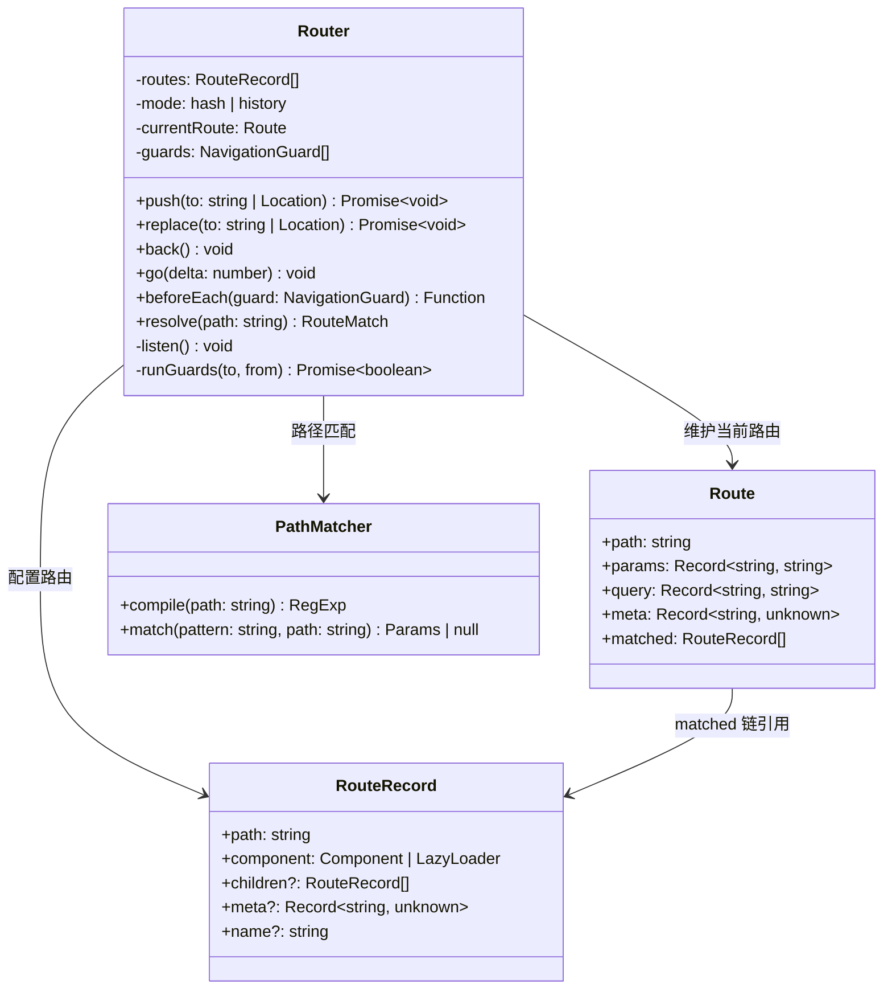
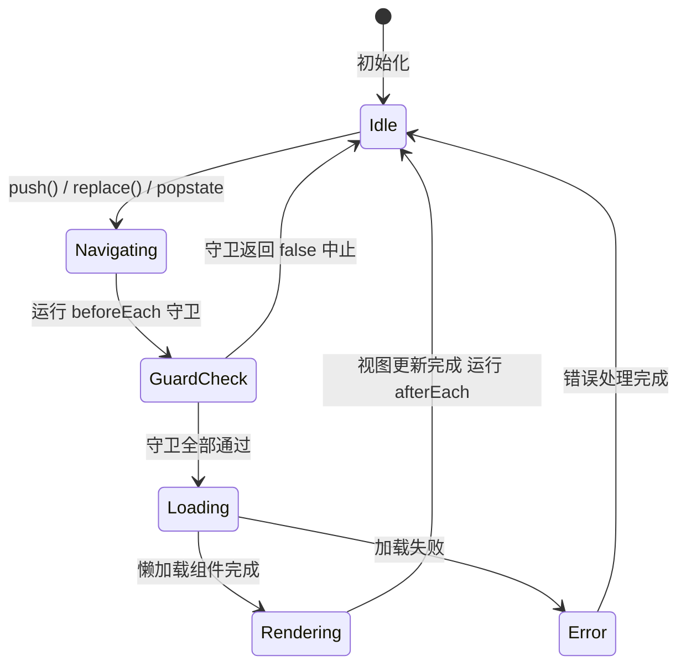

# 设计 SPA Router

> 考察点：History API、路由匹配算法、嵌套路由、导航守卫、代码分割集成。
> React Router、Vue Router 的核心机制都基于此。

---

## 设计思路（面试开场白）

"SPA Router 的核心是两件事：URL 变化的监听，和路径到组件的映射。
先确认模式——hash 模式（监听 hashchange）还是 history 模式（监听 popstate + 拦截 pushState）。
类设计分三层：Router 负责导航控制和守卫执行；RouteRecord 是配置（path + component + children）；Route 是当前路由快照（params + query + matched 链）。
路径匹配把路由配置转换为正则表达式（/user/:id → /user/([^/]+) 并捕获 id），支持精确/动态/通配符三类。
导航守卫是中间件模式，push 时串行执行所有 beforeEach，任一返回 false 则中止导航。"

---

## 类图



---

## Router 导航状态机



---

## 需求分析

```
核心功能：
  - 路径匹配（静态 /about、动态 /user/:id、通配符 *）
  - 两种模式：hash 模式（#/path）、history 模式（/path）
  - 编程式导航：push / replace / go / back
  - 监听路由变化，通知视图更新

扩展功能：
  - 嵌套路由（children）
  - 导航守卫（beforeEach、afterEach）
  - 路由元信息（meta）
  - 懒加载（import()）
  - 查询参数解析（?key=value）
  - 404 通配符路由
```

---

## 类图

```
Router
  - routes: RouteRecord[]
  - mode: 'hash' | 'history'
  - currentRoute: Route
  - guards: NavigationGuard[]
  + push(to): Promise<void>
  + replace(to): Promise<void>
  + back(): void
  + go(delta): void
  + beforeEach(guard): () => void
  + resolve(path): RouteMatch

RouteRecord
  - path: string
  - component: Component | (() => Promise<Component>)
  - children?: RouteRecord[]
  - meta?: Record<string, unknown>

Route（当前路由快照）
  - path: string
  - params: Record<string, string>
  - query: Record<string, string>
  - meta: Record<string, unknown>
  - matched: RouteRecord[]   （嵌套匹配链）
```

---

## 白板版（面试15分钟）

```typescript
// 面试写这个版本，生产实现见下方完整版
interface RouteRecord { path: string; component: unknown; }

class Router {
  private routes: RouteRecord[];
  private listeners: Function[] = [];
  current = '/';

  constructor(routes: RouteRecord[]) {
    this.routes = routes;
    window.addEventListener('popstate', () => this.render(location.pathname));
  }

  push(path: string) {
    history.pushState(null, '', path);
    this.render(path);
  }

  // 省略：导航守卫 / hash 模式 / query 解析
  private match(path: string) {
    for (const r of this.routes) {
      const keys: string[] = [];
      const regex = new RegExp(
        '^' + r.path.replace(/:([^/]+)/g, (_, k) => { keys.push(k); return '([^/]+)'; }) + '$'
      );
      const m = path.match(regex);
      if (m) {
        const params: Record<string, string> = {};
        keys.forEach((k, i) => params[k] = m[i + 1]);
        return { record: r, params };
      }
    }
    return null;
  }

  private render(path: string) {
    this.current = path;
    const matched = this.match(path);
    this.listeners.forEach(fn => fn(matched));
  }

  subscribe(fn: Function) {
    this.listeners.push(fn);
    return () => { this.listeners = this.listeners.filter(f => f !== fn); };
  }
}
```

---

## 路由匹配

```typescript
// 将路由路径转换为正则表达式
interface RouteRecord {
  path: string;
  component: unknown;
  children?: RouteRecord[];
  meta?: Record<string, unknown>;
}

interface RouteMatch {
  record: RouteRecord;
  params: Record<string, string>;
  matched: RouteRecord[];  // 从父到子的完整链
}

function pathToRegex(path: string): { regex: RegExp; keys: string[] } {
  const keys: string[] = [];

  const pattern = path
    .replace(/\//g, '\\/')                     // 转义斜杠
    .replace(/:([^/]+)/g, (_, key) => {        // :param → 捕获组
      keys.push(key);
      return '([^\\/]+)';
    })
    .replace(/\*/g, '(.*)');                   // * → 通配符

  return {
    regex: new RegExp(`^${pattern}$`),
    keys,
  };
}

function matchRoute(
  pathname: string,
  routes: RouteRecord[],
  parentMatched: RouteRecord[] = []
): RouteMatch | null {
  for (const record of routes) {
    const fullPath = parentMatched.length > 0
      ? parentMatched[parentMatched.length - 1].path + record.path
      : record.path;

    const { regex, keys } = pathToRegex(fullPath);
    const match = pathname.match(regex);

    if (match) {
      // 提取动态参数
      const params: Record<string, string> = {};
      keys.forEach((key, i) => {
        params[key] = decodeURIComponent(match[i + 1] ?? '');
      });

      const matched = [...parentMatched, record];

      // 尝试匹配子路由
      if (record.children?.length) {
        const childMatch = matchRoute(pathname, record.children, matched);
        if (childMatch) return childMatch;
      }

      return { record, params, matched };
    }
  }
  return null;
}
```

---

## Router 核心实现

```typescript
interface Route {
  path: string;
  params: Record<string, string>;
  query: Record<string, string>;
  meta: Record<string, unknown>;
  matched: RouteRecord[];
}

type NavigationGuard = (
  to: Route,
  from: Route,
  next: (redirect?: string | false) => void
) => void;

class Router {
  private routes: RouteRecord[];
  private mode: 'hash' | 'history';
  private guards: NavigationGuard[] = [];
  private listeners: Set<(route: Route) => void> = new Set();

  currentRoute: Route;

  constructor(options: { routes: RouteRecord[]; mode?: 'hash' | 'history' }) {
    this.routes = options.routes;
    this.mode = options.mode ?? 'history';
    this.currentRoute = this._createRoute(this._getPath());

    // 监听浏览器前进/后退
    window.addEventListener(
      this.mode === 'hash' ? 'hashchange' : 'popstate',
      () => this._handleLocationChange()
    );
  }

  // ─── 导航 ─────────────────────────────────────────────

  async push(to: string): Promise<void> {
    await this._navigate(to, false);
  }

  async replace(to: string): Promise<void> {
    await this._navigate(to, true);
  }

  back(): void { window.history.back(); }
  forward(): void { window.history.forward(); }
  go(delta: number): void { window.history.go(delta); }

  // ─── 守卫 ─────────────────────────────────────────────

  beforeEach(guard: NavigationGuard): () => void {
    this.guards.push(guard);
    return () => {
      const idx = this.guards.indexOf(guard);
      if (idx !== -1) this.guards.splice(idx, 1);
    };
  }

  // ─── 订阅路由变化（供框架集成用）─────────────────────

  subscribe(listener: (route: Route) => void): () => void {
    this.listeners.add(listener);
    return () => this.listeners.delete(listener);
  }

  // ─── 内部方法 ─────────────────────────────────────────

  private async _navigate(path: string, replace: boolean): Promise<void> {
    const to = this._createRoute(path);
    const from = this.currentRoute;

    // 运行导航守卫链
    const passed = await this._runGuards(to, from);

    if (passed === false) return;                       // 守卫中止
    if (typeof passed === 'string') {                  // 守卫重定向
      return this._navigate(passed, replace);
    }

    // 更新浏览器 URL
    const url = this.mode === 'hash' ? `#${path}` : path;
    if (replace) {
      window.history.replaceState({ path }, '', url);
    } else {
      window.history.pushState({ path }, '', url);
    }

    this.currentRoute = to;
    this.listeners.forEach(l => l(to));
  }

  private async _runGuards(
    to: Route,
    from: Route
  ): Promise<true | false | string> {
    for (const guard of this.guards) {
      const result = await new Promise<true | false | string>((resolve) => {
        guard(to, from, (redirect) => {
          if (redirect === undefined) resolve(true);
          else if (redirect === false) resolve(false);
          else resolve(redirect);
        });
      });
      if (result !== true) return result;
    }
    return true;
  }

  private _handleLocationChange(): void {
    const path = this._getPath();
    const route = this._createRoute(path);
    this.currentRoute = route;
    this.listeners.forEach(l => l(route));
  }

  private _getPath(): string {
    if (this.mode === 'hash') {
      return window.location.hash.slice(1) || '/';
    }
    return window.location.pathname + window.location.search;
  }

  private _createRoute(rawPath: string): Route {
    const [pathname, search = ''] = rawPath.split('?');
    const match = matchRoute(pathname, this.routes);
    const query = Object.fromEntries(new URLSearchParams(search));

    return {
      path: pathname,
      params: match?.params ?? {},
      query,
      meta: match?.record.meta ?? {},
      matched: match?.matched ?? [],
    };
  }
}
```

---

## 懒加载路由

```typescript
// 路由级别的代码分割
const routes: RouteRecord[] = [
  {
    path: '/',
    component: () => import('./pages/Home'),   // 动态 import，返回 Promise
  },
  {
    path: '/user/:id',
    component: () => import('./pages/UserProfile'),
  },
  {
    path: '/admin',
    meta: { requiresAuth: true },
    component: () => import('./pages/Admin'),
    children: [
      {
        path: '/dashboard',
        component: () => import('./pages/AdminDashboard'),
      },
    ],
  },
  {
    path: '*',  // 404
    component: () => import('./pages/NotFound'),
  },
];

const router = new Router({ routes, mode: 'history' });

// 导航守卫：权限控制
router.beforeEach((to, from, next) => {
  if (to.meta.requiresAuth && !isLoggedIn()) {
    next('/login');   // 重定向到登录页
  } else {
    next();           // 放行
  }
});
```

---

## React 集成

```typescript
// 使用 useSyncExternalStore 订阅路由状态
import { useSyncExternalStore } from 'react';

function useRouter() {
  const route = useSyncExternalStore(
    (listener) => router.subscribe(listener),
    () => router.currentRoute,
    () => router.currentRoute  // SSR snapshot
  );
  return { route, router };
}

function Link({ to, children }: { to: string; children: React.ReactNode }) {
  const handleClick = (e: React.MouseEvent) => {
    e.preventDefault();
    router.push(to);
  };
  return <a href={to} onClick={handleClick}>{children}</a>;
}
```

---

## 常见踩坑

**踩坑1：忘记拦截 `<a>` 标签的默认跳转**
❌ 错误：点击 `<a href="/user/1">` 触发完整页面刷新，SPA 的 JS 状态丢失。
✓ 正确：在 Link 组件中 `e.preventDefault()` 后调用 `router.push(to)`，或全局监听 `click` 事件拦截内部链接。
原因：`history.pushState` 只改 URL，不发起网络请求；而 `<a>` 默认行为是向服务器发起 GET 请求。

**踩坑2：history 模式刷新页面 404**
❌ 错误：直接访问 `/user/1` 时服务器返回 404，因为服务器上没有该路径对应的文件。
✓ 正确：服务端配置 fallback：所有路径都返回 `index.html`（Nginx: `try_files $uri /index.html`）。
原因：SPA 的路由由前端 JS 处理，服务端只需返回入口 HTML 即可。

**踩坑3：popstate 事件不监听导致前进/后退失效**
❌ 错误：只处理 `push`，不监听 `popstate`，用户点击浏览器后退按钮时 UI 不更新（URL 变了但视图没变）。
✓ 正确：构造函数中 `window.addEventListener('popstate', () => this._handleLocationChange())`。
原因：`history.back()` / `history.forward()` 触发 `popstate`，而非自定义的 push 逻辑。

**踩坑4：路由匹配顺序问题**
❌ 错误：将 `*`（通配符/404）路由放在前面，导致所有路径都匹配到 404 页面。
✓ 正确：路由按特异性从高到低排列（精确 > 动态 > 通配符），将 `*` 放在最后。
原因：路由匹配是顺序查找，返回第一个匹配项，顺序直接决定结果。

**踩坑5：导航守卫异步时未处理并发导航**
❌ 错误：守卫 A 正在异步等待时，用户再次导航触发守卫 B，两个导航同时进行，后完成的覆盖先完成的。
✓ 正确：开始新导航时取消上一个进行中的导航（设置 cancelled flag 或 AbortController），守卫链完成后先检查是否已被取消。
原因：异步守卫（如权限校验 API 请求）期间用户可能再次触发导航，需要处理竞态。

---

## 扩展性追问

**Q: 如何支持嵌套路由（children）？**
思路：RouteRecord 增加 `children?: RouteRecord[]` 字段；matchRoute 改为递归——先匹配父路由，命中后再用剩余路径匹配 children，返回 `matched` 数组（从根到叶的完整链）。渲染层用 `<RouterOutlet>` 组件，根据 `matched` 数组中的当前层级渲染对应组件。

**Q: 如何实现 beforeEach 导航守卫？**
思路：Router 维护 `guards: NavigationGuard[]` 数组；`push` 时串行 await 每个守卫，守卫调用 `next()` 继续、`next(false)` 中止、`next('/login')` 重定向。用 `for...of` + `await new Promise(resolve => guard(to, from, resolve))` 实现串行，避免 Promise.all 并发。

**Q: 如何支持路由级别的懒加载（lazy routes）？**
思路：`component` 字段允许 `() => import('./Page')` 形式的函数；首次渲染该路由时调用函数动态 import，加载中显示 Suspense fallback，加载完成后缓存到 `componentCache: Map<RouteRecord, Component>`，下次导航到同一路由直接用缓存，不重复加载。

---

## 面试追问

**Q: hash 模式和 history 模式的区别？**
A: hash 模式（`/#/path`）利用 `hashchange` 事件，`#` 后的内容不发送到服务器，兼容性好，不需要服务端配置；history 模式（`/path`）用 `pushState/popState`，URL 干净，但刷新时浏览器会向服务器请求该路径，需服务端配置 fallback（所有路径返回 `index.html`）。

**Q: 动态路由匹配（`:id`）的实现原理？**
A: 将路由 path 编译成正则表达式，`:id` 转换为捕获组 `([^/]+)`，匹配成功后按位置提取捕获值赋给 params。面试中可以写出 `pathToRegex` 函数展示理解。

**Q: 路由守卫的执行顺序？**
A: 以 Vue Router 为例：`beforeEach`（全局）→ `beforeEnter`（路由级）→ `beforeRouteEnter`（组件级）→ 解析异步组件 → `afterEach`（全局）。每个守卫调用 `next()` 才继续，调用 `next(false)` 中止。

**Q: 如何实现路由的过渡动画？**
A: 监听路由变化，给旧路由和新路由分别加 leave/enter 的 CSS 类，利用 `TransitionGroup`（React）或 `<Transition>`（Vue）。可以在 `meta` 中指定动画类型，守卫中读取 `to.meta.transition` 决定动画方向。
