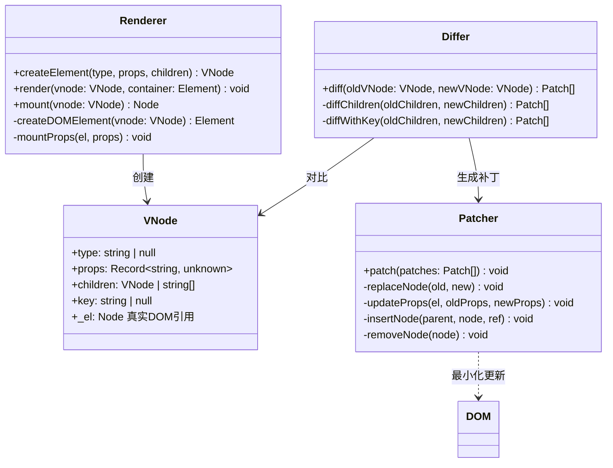

# 实现 Virtual DOM + Diff 算法

> 考察点：树结构建模、Diff 算法复杂度优化、最小化 DOM 操作、key 的作用。
> React、Vue 的核心引擎，理解后面试问"React 为什么快"能答出真正原因。

---

## 设计思路（面试开场白）

"Virtual DOM 的价值不是'快'，而是'声明式'——用 JS 对象描述 UI，框架自动 diff 出最小变更。
设计分四步：createElement 创建 VNode 数据结构（type/props/children/key）；render 把 VNode 变为真实 DOM；diff 对比新旧 VNode 树得出补丁；patch 把补丁应用到 DOM。
关键优化：同层对比（O(n) 而非 O(n³)）；不同 type 直接替换（不 diff 子树）；有 key 时用 Map 匹配可复用节点（列表 Diff）。
面试时要主动提：React Fiber 把 diff 拆成可中断的小任务，而非一次同步完成——这是 React 18 并发特性的基础。"

---

## 类图



---

## 白板版（面试15分钟）

```typescript
// 面试写这个版本，生产实现见下方完整版
interface VNode { type: string; props: Record<string, unknown>; children: (VNode | string)[]; key?: string; _el?: Node; }

function h(type: string, props: Record<string, unknown> | null, ...children: (VNode | string)[]): VNode {
  return { type, props: props ?? {}, children, key: props?.key as string };
}

function createDOM(vnode: VNode | string): Node {
  if (typeof vnode === 'string') return document.createTextNode(vnode);
  const el = document.createElement(vnode.type);
  vnode._el = el;
  Object.entries(vnode.props).forEach(([k, v]) => {
    if (k.startsWith('on')) el.addEventListener(k.slice(2).toLowerCase(), v as EventListener);
    else el.setAttribute(k, String(v));
  });
  vnode.children.forEach(c => el.appendChild(createDOM(c)));
  return el;
}

function patch(parent: Node, oldVNode: VNode | string | null, newVNode: VNode | string | null): void {
  // 省略：key diff / 移动节点优化
  if (!oldVNode) { parent.appendChild(createDOM(newVNode!)); return; }
  if (!newVNode) { parent.removeChild((oldVNode as VNode)._el!); return; }
  if (typeof oldVNode === 'string' || typeof newVNode === 'string') {
    if (oldVNode !== newVNode) parent.replaceChild(createDOM(newVNode), (oldVNode as VNode)._el ?? parent.firstChild!);
    return;
  }
  if (oldVNode.type !== newVNode.type) { parent.replaceChild(createDOM(newVNode), oldVNode._el!); return; }
  const el = oldVNode._el as Element;
  newVNode._el = el;
  // 更新 props
  Object.keys({ ...oldVNode.props, ...newVNode.props }).forEach(k => {
    if (newVNode.props[k] !== oldVNode.props[k]) el.setAttribute(k, String(newVNode.props[k] ?? ''));
  });
  // 递归 diff children（无 key，按位置对比）
  const max = Math.max(oldVNode.children.length, newVNode.children.length);
  for (let i = 0; i < max; i++) patch(el, oldVNode.children[i] ?? null, newVNode.children[i] ?? null);
}
```

---

## 需求分析

```
核心功能：
  1. createElement(type, props, ...children) → VNode
  2. render(vnode, container)    首次渲染 VNode → 真实 DOM
  3. diff(oldVNode, newVNode)    对比两棵 VNode 树
  4. patch(container, patches)  将差异应用到真实 DOM

关键约束：
  - 同层对比（不跨层移动，O(n) 而非 O(n³)）
  - key 优化列表 Diff（识别移动，减少 DOM 操作）
  - 相同 type 节点复用（不销毁重建）
  - 不同 type 节点直接替换
```

---

## VNode 数据结构

```typescript
type VNodeType = string | null;  // string: div/span, null: 文本节点

interface VNode {
  type: VNodeType;
  props: Record<string, unknown>;
  children: (VNode | string)[];
  key: string | null;
  _el?: Node;  // 对应的真实 DOM 节点（挂载后填充）
}

function createElement(
  type: string,
  props: Record<string, unknown> | null,
  ...children: (VNode | string | null | undefined)[]
): VNode {
  return {
    type,
    props: props ?? {},
    children: children.flat().filter(c => c != null) as (VNode | string)[],
    key: (props?.key as string) ?? null,
  };
}

// 简写（JSX 转换目标）
const h = createElement;

// 示例
const vdom = h('div', { class: 'container' },
  h('h1', null, 'Hello World'),
  h('ul', null,
    h('li', { key: '1' }, 'Item 1'),
    h('li', { key: '2' }, 'Item 2'),
  )
);
```

---

## 首次渲染（render）

```typescript
function render(vnode: VNode | string, container: Element): void {
  const el = createDOMNode(vnode);
  container.appendChild(el);
}

function createDOMNode(vnode: VNode | string): Node {
  // 文本节点
  if (typeof vnode === 'string') {
    return document.createTextNode(vnode);
  }

  const el = document.createElement(vnode.type as string);
  vnode._el = el;

  // 设置属性
  setProps(el, vnode.props);

  // 递归创建子节点
  vnode.children.forEach(child => {
    el.appendChild(createDOMNode(child));
  });

  return el;
}

function setProps(el: Element, props: Record<string, unknown>): void {
  Object.entries(props).forEach(([key, value]) => {
    setProp(el, key, value);
  });
}

function setProp(el: Element, key: string, value: unknown): void {
  if (key === 'key') return;  // key 不作为 DOM 属性

  if (key.startsWith('on') && typeof value === 'function') {
    // 事件监听：onClick → click
    el.addEventListener(key.slice(2).toLowerCase(), value as EventListener);
  } else if (key === 'style' && typeof value === 'object') {
    Object.assign((el as HTMLElement).style, value);
  } else if (key === 'className') {
    el.setAttribute('class', value as string);
  } else if (typeof value === 'boolean') {
    if (value) el.setAttribute(key, '');
    else el.removeAttribute(key);
  } else {
    el.setAttribute(key, String(value));
  }
}
```

---

## Diff 算法

```typescript
// 同层对比核心：old VNode 和 new VNode 对比，产生 patch 操作
type PatchType = 'REPLACE' | 'UPDATE_PROPS' | 'UPDATE_TEXT' | 'REORDER';

function diff(oldVNode: VNode | string, newVNode: VNode | string): void {
  const el = (typeof oldVNode === 'string'
    ? oldVNode
    : oldVNode._el) as Node;

  if (!el) return;

  patch(el, oldVNode, newVNode);
}

function patch(
  parent: Node,
  oldVNode: VNode | string | null,
  newVNode: VNode | string | null,
  refNode?: Node  // 插入参考点
): void {
  // Case 1: 旧节点不存在 → 新增
  if (oldVNode == null) {
    parent.insertBefore(createDOMNode(newVNode!), refNode ?? null);
    return;
  }

  // Case 2: 新节点不存在 → 删除
  if (newVNode == null) {
    parent.removeChild(typeof oldVNode === 'string'
      ? findTextNode(parent, oldVNode)!
      : oldVNode._el!
    );
    return;
  }

  // Case 3: 文本节点
  if (typeof oldVNode === 'string' || typeof newVNode === 'string') {
    const oldEl = typeof oldVNode === 'string'
      ? findTextNode(parent, oldVNode)
      : oldVNode._el;
    if (oldVNode !== newVNode) {
      parent.replaceChild(createDOMNode(newVNode), oldEl!);
    }
    return;
  }

  // Case 4: 类型不同 → 直接替换（不复用）
  if (oldVNode.type !== newVNode.type) {
    parent.replaceChild(createDOMNode(newVNode), oldVNode._el!);
    return;
  }

  // Case 5: 相同类型 → 复用 DOM 节点，更新属性和子节点
  const el = oldVNode._el as Element;
  newVNode._el = el;  // 复用

  // 更新属性
  updateProps(el, oldVNode.props, newVNode.props);

  // 更新子节点（关键：key 优化）
  diffChildren(el, oldVNode.children, newVNode.children);
}

function updateProps(
  el: Element,
  oldProps: Record<string, unknown>,
  newProps: Record<string, unknown>
): void {
  // 新增/更新属性
  Object.entries(newProps).forEach(([key, value]) => {
    if (oldProps[key] !== value) setProp(el, key, value);
  });
  // 删除旧属性
  Object.keys(oldProps).forEach(key => {
    if (!(key in newProps)) el.removeAttribute(key);
  });
}
```

---

## 带 key 的列表 Diff（核心难点）

```typescript
function diffChildren(
  parent: Element,
  oldChildren: (VNode | string)[],
  newChildren: (VNode | string)[]
): void {
  // 建立 key → oldVNode 的映射（快速查找可复用节点）
  const keyedOldMap = new Map<string, { vnode: VNode; index: number }>();
  oldChildren.forEach((child, i) => {
    if (typeof child !== 'string' && child.key != null) {
      keyedOldMap.set(child.key, { vnode: child, index: i });
    }
  });

  // 记录已处理的旧节点索引
  const patched = new Set<number>();
  // 需要移动的节点（key 存在但位置变化）
  let lastStableIndex = 0;

  newChildren.forEach((newChild, newIndex) => {
    if (typeof newChild !== 'string' && newChild.key != null) {
      const oldEntry = keyedOldMap.get(newChild.key);

      if (oldEntry) {
        patched.add(oldEntry.index);
        // 复用节点，递归 patch
        patch(parent, oldEntry.vnode, newChild);

        // 判断是否需要移动（LIS 优化的简化版）
        if (oldEntry.index < lastStableIndex) {
          // 需要移动：将节点插到正确位置
          const nextSibling = parent.childNodes[newIndex + 1] ?? null;
          parent.insertBefore(newChild._el!, nextSibling);
        } else {
          lastStableIndex = oldEntry.index;
        }
      } else {
        // 新节点（key 不存在于旧树）→ 插入
        const refNode = parent.childNodes[newIndex] ?? null;
        parent.insertBefore(createDOMNode(newChild), refNode);
      }
    } else {
      // 无 key：按位置对比
      patch(parent, oldChildren[newIndex] ?? null, newChild);
    }
  });

  // 删除旧树中未复用的节点
  oldChildren.forEach((oldChild, i) => {
    if (!patched.has(i) && typeof oldChild !== 'string' && oldChild.key != null) {
      parent.removeChild(oldChild._el!);
    }
  });
}
```

---

## 完整示例

```typescript
// 初始渲染
const container = document.getElementById('app')!;
let vdom = h('ul', null,
  h('li', { key: 'a' }, 'Apple'),
  h('li', { key: 'b' }, 'Banana'),
  h('li', { key: 'c' }, 'Cherry'),
);
render(vdom, container);

// 更新：删除 b，在头部插入 Date，a 和 c 保留并移动
const newVdom = h('ul', null,
  h('li', { key: 'd' }, 'Date'),    // 新增
  h('li', { key: 'c' }, 'Cherry'),  // 移动（从位置2到位置1）
  h('li', { key: 'a' }, 'Apple'),   // 移动（从位置0到位置2）
  // b 被删除
);

// Diff + Patch（只有 3 次 DOM 操作：1次插入、1次移动、1次删除）
diff(vdom, newVdom);
```

---

## 常见踩坑

**踩坑1：列表不加 key 或用 index 作为 key**
❌ 错误：`items.map((item, i) => h('li', { key: i }, item.name))`，在列表头部插入新项时，所有 key 都发生变化，等同于没有 key。
✓ 正确：用稳定的唯一 ID（如数据库 ID）作为 key：`h('li', { key: item.id }, item.name)`。
原因：key 用于在旧树中找到可复用的节点，index 作为 key 在插入/删除时会错误地复用不匹配的节点。

**踩坑2：不同 type 的节点尝试复用**
❌ 错误：old 是 `<div>`，new 是 `<section>`，尝试复用 DOM 并只更新属性，子树状态（input 的值、scroll 位置）残留。
✓ 正确：type 不同时直接 `replaceChild`（销毁旧子树，创建新子树）。
原因：React/Vue 都采用"不同 type 直接替换"的假设，这是 O(n) Diff 的三大前提之一。

**踩坑3：VNode 的 props 直接存事件 listener 导致每次渲染都更新**
❌ 错误：每次 render 传入新的箭头函数，diff 发现 props 不同（引用不等），每次都 removeEventListener + addEventListener。
✓ 正确：事件委托（事件代理）或在 diff 时特殊处理事件属性（不做引用比较，只在首次挂载时绑定）。
原因：箭头函数每次 render 都是新引用，引用比较始终不等，导致不必要的 DOM 操作。

**踩坑4：patch 时忘记将 _el 传递给新 VNode**
❌ 错误：复用 DOM 节点后，新 VNode 的 `_el` 为 undefined，导致下一次 diff 无法找到对应的真实 DOM。
✓ 正确：`newVNode._el = oldVNode._el`，在复用时将真实 DOM 引用赋给新 VNode。
原因：VNode 是下一次 diff 的 oldVNode，必须携带对应的真实 DOM 引用。

---

## 扩展性追问

**Q: 如何支持带 key 的列表高效重排（keyed reconciliation）？**
思路：为旧 children 建立 `Map<key, VNode>`；遍历新 children，命中 key 时复用旧 VNode 并 patch，未命中时创建新节点；遍历结束后删除旧 Map 中未被使用的节点。移动检测用 lastStableIndex：新位置比旧位置更靠前的节点需要 insertBefore。Vue 3 用最长递增子序列（LIS）进一步减少 DOM 移动次数。

**Q: 如何在 VNode 层面支持函数组件（Component Diff）？**
思路：VNode 的 type 除了 string，还允许是 `Function`（函数组件）；patch 时检测 type 是否为 Function，是则调用 `type(props)` 得到子 VNode 树再 diff，并为组件实例维护 `_instance`（存储 hooks 状态）；下次更新时同一组件 type 复用 `_instance` 而不是销毁重建。这是 React Reconciler 的核心思路。

**Q: 如何将同步的递归 diff 改造为可中断的 Fiber 结构？**
思路：将 VNode 树转换为链表（每个节点有 `child`、`sibling`、`return` 指针），用工作循环 `while (nextUnit) nextUnit = performUnitOfWork(nextUnit)` 替代递归；每个工作单元处理完后检查 `deadline.timeRemaining()`（或用 `MessageChannel`），时间不足则中止并 `requestIdleCallback` 继续，实现时间分片。

---

## 面试追问

**Q: 为什么 React 的 Diff 是 O(n) 而不是 O(n³)？**
A: 完整的树 Diff 是 O(n³)（枚举所有节点对 + 排列）。React 做了三个假设：①跨层移动节点的情况极少，只做同层对比；②不同 type 的节点直接替换，不尝试复用子树；③key 帮助识别同层的可复用节点。这三个假设将复杂度降到 O(n)。

**Q: key 的作用是什么？为什么不能用 index 作为 key？**
A: key 让 Diff 算法识别"这个新节点对应哪个旧节点"，从而复用 DOM 而不是重建。用 index 作为 key 时，列表重排（如在头部插入一项）会导致所有节点的 key 都变化，无法复用，等于没有 key。key 应该是稳定的唯一 ID（数据库 ID 或稳定哈希）。

**Q: React Fiber 相比简单 VNode 树有什么改进？**
A: 简单 VNode Diff 是同步递归，无法中断。Fiber 将 VNode 树转换为链表（每个节点有 child/sibling/return 指针），可以在每帧的空闲时间分片执行 Diff（`requestIdleCallback`），高优先级更新（用户交互）可以中断低优先级更新（数据加载），实现并发渲染。

**Q: Vue 和 React 的 Diff 有什么区别？**
A: Vue 3 使用"最长递增子序列（LIS）"算法优化带 key 的列表 Diff，找到不需要移动的最大子序列，只移动其他节点，最小化 DOM 移动次数。React 的简化策略是从左往右扫描，找到第一个需要移动的节点后，之后遇到需要移动的节点都移动（不找 LIS）。Vue 3 的 DOM 移动次数更少，但计算更复杂。
