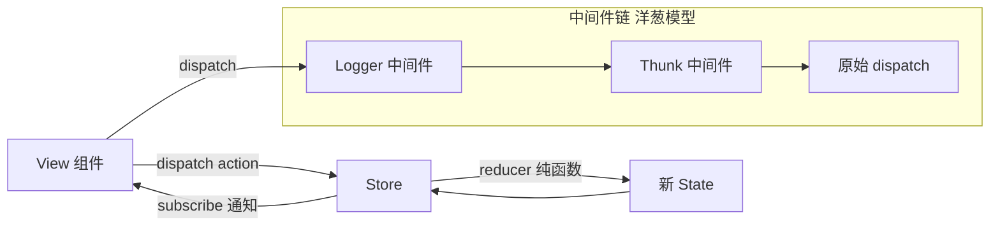
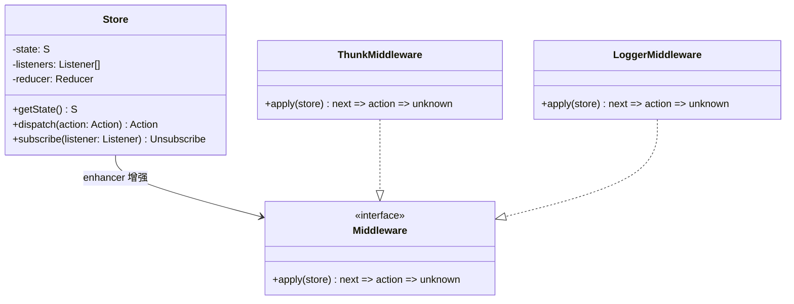

# 设计 Mini Redux

> 考察点：单向数据流、发布订阅、中间件链（洋葱模型）、函数式编程。
> 理解 Redux 后，任何状态管理库（Zustand、Jotai）都是变体。

---

## 设计思路（面试开场白）

"Redux 有三大原则：单一数据源（一个 Store）、State 只读（只能 dispatch action）、Reducer 纯函数（无副作用）。
createStore 核心实现：用闭包保存 state 和 listeners 数组；dispatch 调用 reducer 产生新 state，然后通知所有 listeners；subscribe 往 listeners 数组 push 回调并返回 unsubscribe 函数。
中间件是这道题的难点——applyMiddleware 用 compose 把多个中间件串联成洋葱模型（koa 思路）。每个中间件签名是 store => next => action，compose 让它们从右到左包裹。
面试亮点：说出为什么 Redux 现在不流行了——手动管理 loading/error/缓存 太麻烦，TanStack Query 把服务端状态这块解决了，Zustand 让客户端状态更简单。"

---

## 架构图：Redux 单向数据流



---

## 类图



---

## 需求分析

```
核心 API：
  createStore(reducer, preloadedState?, enhancer?)
    → { getState, dispatch, subscribe }

中间件：
  applyMiddleware(...middlewares)  → StoreEnhancer
  内置中间件：logger、thunk

工具函数：
  combineReducers(reducers)   → 合并多个 reducer
  compose(...fns)             → 函数组合（中间件链基础）

设计原则：
  - 单一数据源（Single Source of Truth）
  - State 只读（只能通过 dispatch action 修改）
  - Reducer 是纯函数（相同输入必须相同输出，无副作用）
```

---

## 白板版（面试15分钟）

```typescript
// 面试写这个版本，生产实现见下方完整版
type Reducer<S, A> = (state: S | undefined, action: A) => S;
type Listener = () => void;

function createStore<S, A extends { type: string }>(reducer: Reducer<S, A>, preloadedState?: S) {
  let state: S = preloadedState ?? reducer(undefined, { type: '@@INIT' } as A);
  const listeners = new Set<Listener>();

  const getState = () => state;
  const dispatch = (action: A) => {
    state = reducer(state, action);
    listeners.forEach(l => l());
    return action;
  };
  const subscribe = (listener: Listener) => {
    listeners.add(listener);
    return () => listeners.delete(listener);
  };

  return { getState, dispatch, subscribe };
}

// 省略：isDispatching 保护 / enhancer 支持
// 中间件：store => next => action => result（洋葱模型）
function applyMiddleware(...middlewares: Function[]) {
  return (createStore: Function) => (reducer: Function, preloadedState: unknown) => {
    const store = createStore(reducer, preloadedState);
    let dispatch = store.dispatch;
    const chain = middlewares.map(m => m({ getState: store.getState, dispatch: (a: unknown) => dispatch(a) }));
    // compose: 从右到左包裹，最左边的中间件最先执行
    dispatch = chain.reduceRight((next, m) => m(next), store.dispatch);
    return { ...store, dispatch };
  };
}
```

---

## createStore

```typescript
type Reducer<S, A> = (state: S | undefined, action: A) => S;
type Listener = () => void;
type Unsubscribe = () => void;
type Dispatch<A> = (action: A) => A;

interface Store<S, A> {
  getState(): S;
  dispatch: Dispatch<A>;
  subscribe(listener: Listener): Unsubscribe;
}

type StoreEnhancer<S, A> = (
  createStore: (reducer: Reducer<S, A>, preloadedState?: S) => Store<S, A>
) => (reducer: Reducer<S, A>, preloadedState?: S) => Store<S, A>;

function createStore<S, A extends { type: string }>(
  reducer: Reducer<S, A>,
  preloadedState?: S,
  enhancer?: StoreEnhancer<S, A>
): Store<S, A> {
  // 如果有 enhancer（applyMiddleware），委托给它创建 store
  if (enhancer) {
    return enhancer(createStore)(reducer, preloadedState);
  }

  let state: S = preloadedState ?? reducer(undefined, { type: '@@INIT' } as A);
  const listeners = new Set<Listener>();
  let isDispatching = false;

  function getState(): S {
    if (isDispatching) throw new Error('Cannot call getState() during dispatch');
    return state;
  }

  function dispatch(action: A): A {
    if (isDispatching) throw new Error('Reducers may not dispatch actions');

    try {
      isDispatching = true;
      state = reducer(state, action);  // 纯函数调用，产生新 state
    } finally {
      isDispatching = false;
    }

    // 通知所有订阅者
    listeners.forEach(listener => listener());

    return action;
  }

  function subscribe(listener: Listener): Unsubscribe {
    listeners.add(listener);
    return () => listeners.delete(listener);
  }

  return { getState, dispatch, subscribe };
}
```

---

## combineReducers

```typescript
type ReducerMap<S> = {
  [K in keyof S]: Reducer<S[K], { type: string }>;
};

function combineReducers<S extends Record<string, unknown>>(
  reducers: ReducerMap<S>
): Reducer<S, { type: string }> {
  const keys = Object.keys(reducers) as (keyof S)[];

  return function combination(state = {} as S, action) {
    let hasChanged = false;
    const nextState = {} as S;

    keys.forEach(key => {
      const reducer = reducers[key];
      const previousStateForKey = state[key];
      const nextStateForKey = reducer(previousStateForKey, action);

      nextState[key] = nextStateForKey;
      hasChanged = hasChanged || nextStateForKey !== previousStateForKey;
    });

    // 只有真正变化时返回新对象（引用相等性优化）
    return hasChanged ? nextState : state;
  };
}
```

---

## compose（函数组合）

```typescript
// compose(f, g, h)(x) === f(g(h(x)))
function compose<T>(...fns: ((arg: T) => T)[]): (arg: T) => T {
  if (fns.length === 0) return (arg: T) => arg;
  if (fns.length === 1) return fns[0];
  return fns.reduce((a, b) => (arg: T) => a(b(arg)));
}
```

---

## applyMiddleware（中间件系统）

```typescript
// 中间件签名：store => next => action => result
type Middleware<S, A> = (
  store: Pick<Store<S, A>, 'getState' | 'dispatch'>
) => (next: Dispatch<A>) => (action: A | unknown) => unknown;

function applyMiddleware<S, A extends { type: string }>(
  ...middlewares: Middleware<S, A>[]
): StoreEnhancer<S, A> {
  return (createStore) => (reducer, preloadedState) => {
    const store = createStore(reducer, preloadedState);

    let dispatch: Dispatch<A> = () => {
      throw new Error('Dispatching while constructing middleware chain is not allowed.');
    };

    // 给每个中间件暴露 getState 和 dispatch（注意：dispatch 是最终的增强版本）
    const middlewareAPI = {
      getState: store.getState,
      dispatch: (action: A) => dispatch(action),  // 闭包引用，指向最终 dispatch
    };

    // 每个中间件拿到 middlewareAPI，返回 (next => action => result) 函数
    const chain = middlewares.map(middleware => middleware(middlewareAPI));

    // 从右往左组合，最右边的中间件最先调用 store.dispatch（真正的 dispatch）
    dispatch = compose(...chain)(store.dispatch) as Dispatch<A>;

    return { ...store, dispatch };
  };
}
```

---

## 内置中间件

```typescript
// Logger 中间件：打印每次 dispatch 前后的 state
const loggerMiddleware: Middleware<unknown, { type: string }> =
  (store) => (next) => (action) => {
    console.group(`action: ${(action as { type: string }).type}`);
    console.log('prev state:', store.getState());
    const result = next(action as { type: string });
    console.log('next state:', store.getState());
    console.groupEnd();
    return result;
  };

// Thunk 中间件：支持 dispatch 函数（异步 action）
type ThunkAction<S, A> = (
  dispatch: Dispatch<A>,
  getState: () => S
) => unknown;

const thunkMiddleware: Middleware<unknown, { type: string }> =
  ({ dispatch, getState }) => (next) => (action) => {
    if (typeof action === 'function') {
      // action 是函数（thunk）→ 调用它，传入 dispatch 和 getState
      return (action as ThunkAction<unknown, { type: string }>)(
        dispatch as Dispatch<{ type: string }>,
        getState
      );
    }
    // action 是普通对象 → 直接传给下一个中间件
    return next(action as { type: string });
  };
```

---

## 完整使用示例

```typescript
// 定义 State 和 Actions
interface CounterState { count: number; }
interface TodoState { items: string[]; }
interface AppState { counter: CounterState; todos: TodoState; }

type CounterAction = { type: 'INCREMENT' } | { type: 'DECREMENT' } | { type: 'RESET' };
type TodoAction = { type: 'ADD_TODO'; payload: string } | { type: 'CLEAR_TODOS' };
type AppAction = CounterAction | TodoAction;

// Reducers
function counterReducer(
  state: CounterState = { count: 0 },
  action: AppAction
): CounterState {
  switch (action.type) {
    case 'INCREMENT': return { count: state.count + 1 };
    case 'DECREMENT': return { count: state.count - 1 };
    case 'RESET':     return { count: 0 };
    default:          return state;
  }
}

function todosReducer(
  state: TodoState = { items: [] },
  action: AppAction
): TodoState {
  switch (action.type) {
    case 'ADD_TODO':   return { items: [...state.items, action.payload] };
    case 'CLEAR_TODOS': return { items: [] };
    default:           return state;
  }
}

// 创建 Store
const rootReducer = combineReducers<AppState>({
  counter: counterReducer as Reducer<CounterState, { type: string }>,
  todos: todosReducer as Reducer<TodoState, { type: string }>,
});

const store = createStore(
  rootReducer,
  undefined,
  applyMiddleware(loggerMiddleware, thunkMiddleware)
);

// 同步 dispatch
store.dispatch({ type: 'INCREMENT' });
console.log(store.getState().counter);  // { count: 1 }

// 异步 dispatch（Thunk）
const fetchTodos = () => async (dispatch: Dispatch<AppAction>) => {
  const todos = await fetch('/api/todos').then(r => r.json());
  todos.forEach((todo: string) => dispatch({ type: 'ADD_TODO', payload: todo }));
};
store.dispatch(fetchTodos() as unknown as AppAction);

// 订阅
const unsubscribe = store.subscribe(() => {
  console.log('State changed:', store.getState());
});

// 取消订阅
unsubscribe();
```

---

## 时间旅行调试

```typescript
// Redux DevTools 的核心：保存每次 action 和 state 快照
class TimeTravel<S, A extends { type: string }> {
  private history: { action: A; state: S }[] = [];
  private currentIndex = -1;
  private store: Store<S, A>;

  constructor(reducer: Reducer<S, A>) {
    this.store = createStore(reducer);
  }

  dispatch(action: A) {
    // 时间旅行后 dispatch 新 action，清除未来历史
    this.history = this.history.slice(0, this.currentIndex + 1);

    const result = this.store.dispatch(action);
    this.history.push({ action, state: this.store.getState() });
    this.currentIndex++;
    return result;
  }

  jumpTo(index: number) {
    // 从初始 state 重放 action 到指定位置
    this.currentIndex = Math.max(0, Math.min(index, this.history.length - 1));
    // 实际 Redux DevTools 通过重放 reducer 实现
    console.log('Jump to state:', this.history[this.currentIndex].state);
  }
}
```

---

## 常见踩坑

**踩坑1：在 Reducer 中直接修改 state**
❌ 错误：`state.count++; return state;`，直接改原对象，combineReducers 的引用相等检查 `nextState !== state` 永远为 false，订阅者不触发。
✓ 正确：返回新对象：`return { ...state, count: state.count + 1 };`。
原因：Redux 依赖引用比较来判断 state 是否变化，Reducer 必须是纯函数，不能改变原 state。

**踩坑2：把服务端缓存数据（API 响应）放进 Redux**
❌ 错误：`dispatch({ type: 'SET_USERS', payload: users })`，手动管理 loading/error/缓存/失效逻辑，样板代码极多。
✓ 正确：服务端状态用 TanStack Query（自动缓存、后台刷新、跨组件共享），Redux/Zustand 只存客户端 UI 状态。
原因：Redux 擅长可预测的客户端状态（modal 开关、选中项），服务端缓存有更专业的工具。

**踩坑3：中间件调用 `dispatch` 而非 `next`**
❌ 错误：在中间件中将 action 传给 `store.dispatch` 而非 `next`，导致 action 重走整个中间件链，产生无限循环。
✓ 正确：普通 action 调用 `next(action)` 传给下一个中间件，只有需要重新派发新 action 时才调用 `dispatch`。
原因：`next` 是链中下一个中间件，`dispatch` 是重新进入整个链的入口，两者语义不同。

**踩坑4：subscribe 回调中读取旧 state**
❌ 错误：`store.subscribe(() => console.log(prevState))`，闭包捕获了旧的 state 引用，subscribe 拿不到最新值。
✓ 正确：subscribe 回调内通过 `store.getState()` 读取最新 state，不依赖闭包捕获的变量。
原因：subscribe 触发时 state 已更新，必须通过 getState() 拉取，不能用旧的引用。

---

## 扩展性追问

**Q: 如何实现 Redux DevTools 的时间旅行调试？**
思路：维护 `history: { action, state }[]` 数组和 `currentIndex`；每次 dispatch 追加记录；`jumpTo(index)` 时直接将 store 的 state 替换为 `history[index].state`（或从 index=0 重放所有 action）；新 dispatch 时清除 `currentIndex` 之后的历史（分叉后不能再 redo）。Redux DevTools 实际使用"重放"而非"快照跳转"，以正确处理副作用。

**Q: 如何实现类似 Redux Toolkit 的 slice 模式？**
思路：`createSlice({ name, initialState, reducers })` 函数自动生成 action creators 和 reducer——遍历 `reducers` 对象，每个方法名对应 `${name}/${methodName}` 的 action type；整合所有 case 生成一个 `switch` reducer；返回 `{ actions, reducer }`。结合 `immer` 可以让 reducer 内部"直接修改"，immer 代理对象会产生新的不可变对象。

**Q: 如何为 selector 添加记忆化（memoized selectors）？**
思路：`createSelector(inputSelector1, inputSelector2, resultFn)` 缓存上次的输入和输出——当 `inputSelector1(state)` 和 `inputSelector2(state)` 返回值（引用）未变时，直接返回上次 `resultFn` 的结果，跳过重新计算。这是 reselect 库的核心原理，防止派生状态（如过滤列表）在无关 state 变化时重新计算导致组件不必要重渲染。

---

## 面试追问

**Q: Redux 的中间件是如何工作的？**
A: 中间件是 `store => next => action => result` 的柯里化函数。`applyMiddleware` 将所有中间件排成链，从左到右依次包裹，形成洋葱模型。每个中间件调用 `next(action)` 将控制权传给下一个中间件，最内层调用真正的 `store.dispatch`。Thunk 中间件在这里拦截函数类型的 action，直接调用而不传给下一层。

**Q: 为什么 Reducer 必须是纯函数？**
A: 纯函数（相同输入→相同输出，无副作用）的好处：①可预测（便于调试和测试）；②支持时间旅行（可以重放 action 序列）；③`combineReducers` 通过引用相等比较（`nextState !== state`）判断是否有变化，如果 reducer 直接改变原 state，这个比较就失效了。

**Q: Redux 和 Zustand 的核心区别？**
A: Redux 强制单向数据流和不可变 state，中间件机制强大但样板代码多；Zustand 直接允许 `set` 修改 state（内部通过 `immer` 保持不可变），API 极简，没有 action/reducer 的概念，适合中小型项目。两者底层都是发布订阅模式。
