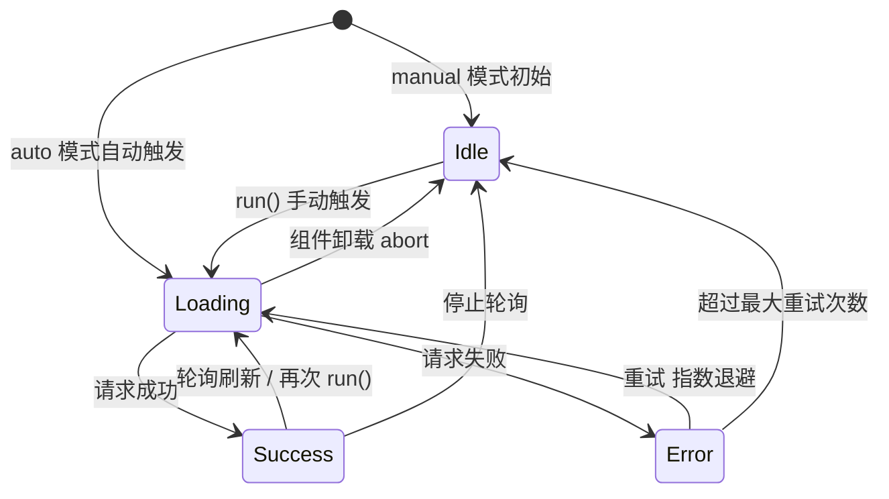
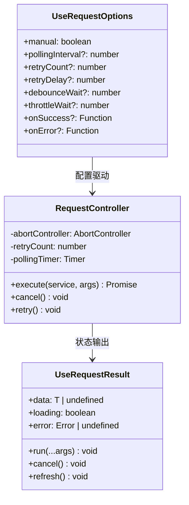

# OOD：useRequest Hook

> 设计通用的数据请求 hook：loading/error/data 状态机、竞态条件处理、重试、轮询、手动触发。
> 原型来自 ahooks 的 `useRequest`，但面试要求从零实现核心机制。

---

## 设计思路（面试开场白）

"useRequest 是对 fetch 的状态管理封装，核心是管理四个状态：loading/error/data/idle。
最重要的难点是竞态条件——用户快速切换，并发请求的响应顺序无法保证。解法一是 AbortController（取消上一次飞行中的请求，推荐）；解法二是版本号（比较响应版本，丢弃旧的响应）。
设计扩展性：manual 模式（不自动执行，等 run() 触发）；轮询（useEffect 里 setInterval）；指数退避重试（失败后 delay * 2^retryCount 后重试）；组件卸载时 AbortController.abort() 取消飞行中请求防内存泄漏。"

---

## 状态机图



---

## 类图



---

## 需求分析

```
功能需求：
  1. 自动执行：组件挂载时自动发请求
  2. 手动触发：支持 manual 模式，手动调用 run()
  3. Loading / Error / Data 状态管理
  4. 竞态条件处理：快速连续请求时，只取最后一次响应
  5. 重试：失败时自动重试（指数退避）
  6. 轮询：每 N 毫秒自动刷新
  7. 请求取消：组件卸载时取消飞行中的请求（AbortController）
  8. 防抖 / 节流：减少频繁触发的请求次数
  
核心难点：
  竞态条件（Race Condition）：
    1. 搜索框快速输入 "a" → "ab" → "abc"
    2. 三个请求并发发出
    3. 网络不稳定，"ab" 的响应比 "abc" 晚回来
    4. 如果不处理：UI 最终显示 "ab" 的结果（错误！）
    
  解法一：AbortController（推荐）— 取消上一次请求
  解法二：版本号（stale closure）— 比较响应版本，丢弃旧的
```

---

## 白板版（面试15分钟）

```typescript
// 面试写这个版本，生产实现见下方完整版
import { useState, useEffect, useRef, useCallback } from 'react';

function useRequest<T>(service: () => Promise<T>, options: { manual?: boolean } = {}) {
  const [data, setData] = useState<T>();
  const [loading, setLoading] = useState(!options.manual);
  const [error, setError] = useState<Error>();
  const abortRef = useRef<AbortController | null>(null);
  // 省略：重试 / 轮询 / 防抖节流 / refresh / mutate

  const run = useCallback(async () => {
    // 取消上一次请求（解决竞态条件）
    abortRef.current?.abort();
    const ctrl = new AbortController();
    abortRef.current = ctrl;

    setLoading(true);
    try {
      const result = await service();
      if (!ctrl.signal.aborted) {
        setData(result);
        setError(undefined);
      }
    } catch (e) {
      if (!ctrl.signal.aborted) setError(e instanceof Error ? e : new Error(String(e)));
    } finally {
      if (!ctrl.signal.aborted) setLoading(false);
    }
  }, [service]);

  useEffect(() => {
    if (!options.manual) run();
    return () => abortRef.current?.abort(); // 组件卸载时取消请求
  }, []);

  return { data, loading, error, run };
}
```

---

## 核心实现

```typescript
// src/hooks/useRequest.ts
import { useState, useEffect, useRef, useCallback } from 'react';

// 状态机
type RequestStatus = 'idle' | 'loading' | 'success' | 'error';

interface UseRequestState<T> {
  data: T | undefined;
  error: Error | undefined;
  status: RequestStatus;
  loading: boolean;
}

interface UseRequestOptions<T, P extends unknown[]> {
  manual?: boolean;          // true = 不自动执行，等待手动 run()
  defaultParams?: P;         // 自动执行时的默认参数
  onSuccess?: (data: T, params: P) => void;
  onError?: (error: Error, params: P) => void;
  onFinally?: (params: P) => void;
  // 重试
  retryCount?: number;       // 最大重试次数（默认 0，不重试）
  retryInterval?: number;    // 重试间隔（ms，默认 1000）
  // 轮询
  pollingInterval?: number;  // 轮询间隔（ms），0 = 不轮询
  pollingWhenHidden?: boolean;  // 页面不可见时是否继续轮询（默认 false）
  // 防抖
  debounceWait?: number;
  // 节流
  throttleWait?: number;
}

interface UseRequestReturn<T, P extends unknown[]> extends UseRequestState<T> {
  run: (...params: P) => void;       // 手动触发（异步，不返回 Promise）
  runAsync: (...params: P) => Promise<T>;  // 手动触发（返回 Promise）
  cancel: () => void;                // 取消当前请求
  refresh: () => void;               // 用上次参数重新请求
  mutate: (data: T | ((old: T | undefined) => T)) => void;  // 手动修改 data
}

function useRequest<T, P extends unknown[] = []>(
  service: (...params: P) => Promise<T>,
  options: UseRequestOptions<T, P> = {}
): UseRequestReturn<T, P> {
  const {
    manual = false,
    defaultParams = [] as unknown as P,
    onSuccess,
    onError,
    onFinally,
    retryCount = 0,
    retryInterval = 1000,
    pollingInterval = 0,
    pollingWhenHidden = false,
    debounceWait,
    throttleWait,
  } = options;

  const [state, setState] = useState<UseRequestState<T>>({
    data: undefined,
    error: undefined,
    status: 'idle',
    loading: !manual,  // 自动执行时初始为 loading
  });

  // 用 ref 保存不触发重渲染的状态
  const abortControllerRef = useRef<AbortController | null>(null);
  const retryCountRef = useRef(0);
  const pollingTimerRef = useRef<NodeJS.Timeout | null>(null);
  const latestParamsRef = useRef<P>(defaultParams);
  const serviceRef = useRef(service);
  serviceRef.current = service;  // 始终指向最新的 service

  // 核心执行函数
  const runAsync = useCallback(async (...params: P): Promise<T> => {
    // 取消上一次未完成的请求（解决竞态条件）
    if (abortControllerRef.current) {
      abortControllerRef.current.abort();
    }
    const controller = new AbortController();
    abortControllerRef.current = controller;

    latestParamsRef.current = params;
    setState(prev => ({ ...prev, status: 'loading', loading: true }));

    try {
      // 将 AbortSignal 传给 service（service 内部需要支持 signal）
      // 这里通过 AbortController 传递，实际可以通过 context 或参数
      const data = await serviceRef.current(...params);

      // 如果请求已被取消（组件卸载 / 新请求发出），忽略此次响应
      if (controller.signal.aborted) {
        return undefined as unknown as T;
      }

      setState({ data, error: undefined, status: 'success', loading: false });
      retryCountRef.current = 0;  // 重置重试计数
      onSuccess?.(data, params);
      return data;
    } catch (err) {
      if (controller.signal.aborted) {
        return undefined as unknown as T;
      }

      const error = err instanceof Error ? err : new Error(String(err));

      // 重试逻辑
      if (retryCountRef.current < retryCount) {
        retryCountRef.current++;
        const delay = retryInterval * Math.pow(2, retryCountRef.current - 1);  // 指数退避
        await new Promise(r => setTimeout(r, delay));
        return runAsync(...params);
      }

      setState({ data: undefined, error, status: 'error', loading: false });
      onError?.(error, params);
      throw error;
    } finally {
      if (!controller.signal.aborted) {
        onFinally?.(params);
      }
    }
  }, [onSuccess, onError, onFinally, retryCount, retryInterval]);

  // 包装 run（不抛出错误，适合事件处理器）
  const run = useCallback((...params: P) => {
    runAsync(...params).catch(() => {});  // 错误通过 onError 处理
  }, [runAsync]);

  // 防抖 / 节流包装
  const debouncedRun = useMemo(() => {
    if (debounceWait) return debounce(run, debounceWait);
    if (throttleWait) return throttle(run, throttleWait);
    return run;
  }, [run, debounceWait, throttleWait]);

  // 取消当前请求
  const cancel = useCallback(() => {
    abortControllerRef.current?.abort();
    if (pollingTimerRef.current) {
      clearTimeout(pollingTimerRef.current);
    }
    setState(prev => ({ ...prev, status: 'idle', loading: false }));
  }, []);

  // 用上次参数刷新
  const refresh = useCallback(() => {
    run(...latestParamsRef.current);
  }, [run]);

  // 手动修改数据（乐观更新用）
  const mutate = useCallback((updater: T | ((old: T | undefined) => T)) => {
    setState(prev => ({
      ...prev,
      data: typeof updater === 'function'
        ? (updater as (old: T | undefined) => T)(prev.data)
        : updater,
    }));
  }, []);

  // 自动执行（非 manual 模式）
  useEffect(() => {
    if (!manual) {
      run(...defaultParams);
    }
  }, []);  // 只在挂载时执行

  // 轮询
  useEffect(() => {
    if (!pollingInterval) return;

    const poll = () => {
      if (!pollingWhenHidden && document.visibilityState === 'hidden') {
        pollingTimerRef.current = setTimeout(poll, pollingInterval);
        return;
      }
      run(...latestParamsRef.current);
      pollingTimerRef.current = setTimeout(poll, pollingInterval);
    };

    pollingTimerRef.current = setTimeout(poll, pollingInterval);

    return () => {
      if (pollingTimerRef.current) clearTimeout(pollingTimerRef.current);
    };
  }, [pollingInterval, pollingWhenHidden]);

  // 组件卸载时取消请求（防内存泄漏）
  useEffect(() => {
    return () => {
      abortControllerRef.current?.abort();
      if (pollingTimerRef.current) clearTimeout(pollingTimerRef.current);
    };
  }, []);

  return {
    ...state,
    run: debouncedRun as typeof run,
    runAsync,
    cancel,
    refresh,
    mutate,
  };
}
```

---

## 解决竞态条件：AbortController vs 版本号

```typescript
// 方案一：AbortController（推荐）
// 真正取消 HTTP 请求，节省带宽

async function searchUsers(query: string, signal?: AbortSignal) {
  const res = await fetch(`/api/users?q=${encodeURIComponent(query)}`, { signal });
  if (!res.ok) throw new Error('Search failed');
  return res.json();
}

// 在 useRequest 中使用时需要传 signal
// 实际 ahooks 通过包装 service 传入 signal：
function useRequest_with_abort<T, P extends unknown[]>(
  service: (signal: AbortSignal, ...params: P) => Promise<T>,
  options: UseRequestOptions<T, P> = {}
) {
  // ... 在 runAsync 中 service(controller.signal, ...params)
}

// 方案二：版本号（stale closure）
// 不取消网络请求，但丢弃旧响应
function useRequestWithVersion<T>(fn: () => Promise<T>) {
  const versionRef = useRef(0);
  const [state, setState] = useState<{ data?: T; loading: boolean }>({ loading: false });

  const run = useCallback(async () => {
    const version = ++versionRef.current;  // 每次请求自增版本
    setState({ loading: true });

    const data = await fn();

    // 只接受最新版本的响应（旧响应被丢弃）
    if (version === versionRef.current) {
      setState({ data, loading: false });
    }
  }, [fn]);

  return { ...state, run };
}
```

---

## 使用示例

```typescript
// 1. 自动请求（组件挂载时执行）
function UserProfile({ userId }: { userId: string }) {
  const { data, loading, error, refresh } = useRequest(
    () => fetchUser(userId),
    {
      onSuccess: (user) => console.log('Loaded:', user.name),
      retryCount: 2,
    }
  );

  if (loading) return <Skeleton />;
  if (error) return <Button onClick={refresh}>重试</Button>;
  return <div>{data!.name}</div>;
}

// 2. 搜索框（防抖 + 竞态保护）
function SearchBox() {
  const [query, setQuery] = useState('');
  const { data, loading, run } = useRequest(
    (q: string) => searchUsers(q),
    {
      manual: true,
      debounceWait: 300,  // 防抖 300ms
    }
  );

  return (
    <div>
      <input
        value={query}
        onChange={(e) => {
          setQuery(e.target.value);
          run(e.target.value);  // 防抖处理，快速输入只发最后一次
        }}
      />
      {loading && <Spinner />}
      {data?.map(u => <UserItem key={u.id} user={u} />)}
    </div>
  );
}

// 3. 手动触发（表单提交）
function CreateUserForm() {
  const { loading, run, error } = useRequest(
    (formData: CreateUserInput) => createUser(formData),
    {
      manual: true,
      onSuccess: () => router.push('/users'),
      onError: (err) => toast.error(err.message),
    }
  );

  return (
    <form onSubmit={(e) => {
      e.preventDefault();
      run(getFormData(e.currentTarget));
    }}>
      <button type="submit" disabled={loading}>
        {loading ? '提交中...' : '创建'}
      </button>
      {error && <p>{error.message}</p>}
    </form>
  );
}

// 4. 轮询（实时订单状态）
function OrderTracker({ orderId }: { orderId: string }) {
  const { data } = useRequest(
    () => fetchOrder(orderId),
    {
      pollingInterval: 3000,
      pollingWhenHidden: false,
    }
  );

  return <div>Status: {data?.status}</div>;
}

// 5. 乐观更新（点赞）
function LikeButton({ postId, initialLiked }: { postId: string; initialLiked: boolean }) {
  const { data, mutate, run } = useRequest(
    () => fetchPost(postId),
    { manual: true }
  );

  const isLiked = data?.isLiked ?? initialLiked;

  const handleLike = () => {
    // 乐观更新：立即翻转状态
    mutate(old => ({ ...old!, isLiked: !isLiked, likeCount: (old?.likeCount ?? 0) + (isLiked ? -1 : 1) }));
    // 发请求（失败时需要回滚，此处简化）
    fetch(`/api/posts/${postId}/like`, { method: 'POST' });
  };

  return <button onClick={handleLike}>{isLiked ? '已赞' : '点赞'}</button>;
}
```

---

## 常见踩坑

**踩坑1：未处理竞态条件**
❌ 错误：快速连续调用 run()，不取消上一次请求，较早发出的请求若较晚返回，会覆盖较新的结果，UI 显示过时数据。
✓ 正确：每次 run 时 `abortRef.current?.abort()` 取消上一次请求，或用版本号比较丢弃旧响应。
原因：并发请求的响应顺序不由发出顺序决定，网络延迟决定到达顺序。

**踩坑2：组件卸载后 setState 导致内存泄漏警告**
❌ 错误：请求完成时组件已卸载，`setData(result)` 触发 React 警告（虽然 React 18 移除了该警告，但状态更新仍然发生）。
✓ 正确：useEffect cleanup 中调用 `abortRef.current?.abort()`，并在 then/catch 中检查 `signal.aborted` 再 setState。
原因：AbortController.abort() 后 fetch 会 reject，catch 中判断 AbortError 直接 return，不更新 state。

**踩坑3：service 函数引用变化导致 useEffect 无限请求**
❌ 错误：`useRequest(() => fetchUser(userId), ...)` 每次渲染传入新的箭头函数，如果 deps 包含 service，useEffect 无限触发。
✓ 正确：useRequest 内部用 `serviceRef.current = service` 存最新 service，useEffect deps 只写 `[]`（仅挂载时执行）。
原因：函数组件每次渲染都会产生新的函数引用，不能直接放入 useEffect 依赖数组。

**踩坑4：重试时用同步 delay 阻塞事件循环**
❌ 错误：重试前用 `while(Date.now() < target){}` 忙等待，彻底阻塞主线程。
✓ 正确：`await new Promise(r => setTimeout(r, delay))` 异步等待，不阻塞其他任务。
原因：JS 是单线程，同步 sleep 会冻结 UI 和所有其他异步任务。

**踩坑5：轮询在页面不可见时继续发请求**
❌ 错误：页面切到后台（`visibilityState === 'hidden'`）后轮询仍在继续，浪费带宽和服务端资源。
✓ 正确：轮询回调中检查 `document.visibilityState`，不可见时跳过本次请求（但保留 timer 继续检查）；或监听 `visibilitychange` 事件暂停/恢复轮询。
原因：后台标签页的请求对用户无感知收益，TanStack Query 的 `refetchOnWindowFocus` 也是同类优化。

---

## 扩展性追问

**Q: 如何实现 SWR 风格的跨组件共享缓存（stale-while-revalidate）？**
思路：将缓存提升到模块级别的 `Map<cacheKey, { data, subscribers, promise }>`；多个组件调用 `useRequest` 传相同 key 时，命中缓存立即返回 stale data（不 loading），同时在后台发起 revalidation，响应回来后更新 Map 并通知所有订阅该 key 的组件重渲染。这是 TanStack Query 的核心机制。

**Q: 如何实现 dependent query（`enabled` 选项，依赖上一个请求的结果）？**
思路：增加 `enabled?: boolean` 选项；useEffect 中检查 `if (!enabled) return;`，enabled 为 false 时不发起请求，state 保持 idle；当依赖的数据（如 userId）加载完成后，调用方传 `enabled: !!userId`，useEffect 依赖 `enabled` 变化时重新执行并发起请求。

**Q: 如何实现带乐观更新的 mutation？**
思路：调用 `mutate` 时先乐观更新本地 data（立即反映到 UI），同时发起真实请求；成功时用服务端返回值覆盖（确认乐观更新）；失败时回滚到 mutation 前的快照（在 mutate 开始时记录 `previousData = data`，catch 中 `setData(previousData)`）。TanStack Query 的 `useMutation` + `onMutate`/`onError` 钩子实现同样模式。

---

## 面试追问

**Q: AbortController 取消请求后，Promise 会变成什么状态？**
A: AbortController 取消后，`fetch` 会 reject 一个 `DOMException`，其 `name` 为 `"AbortError"`。需要在 catch 中判断：`if (err.name === 'AbortError') return;`，不把取消当错误处理。axios 类似，取消后 reject 一个 `CanceledError`，可以用 `axios.isCancel(err)` 判断。ioredis 等非 HTTP 请求不支持 AbortController，需要通过版本号方案处理竞态。

**Q: 为什么用 ref 保存 abortController 而不是 state？**
A: `useRef` 的修改不触发重渲染，且在 `useEffect` cleanup 和事件处理器中读取的是最新值（不受 stale closure 影响）。`AbortController` 是副作用管理的基础设施，不需要也不应该出现在渲染逻辑中，放 `ref` 正确。如果放 `state`，每次 cancel 都会触发额外渲染。

**Q: useRequest 和 TanStack Query 什么时候用哪个？**
A: TanStack Query 适合数据获取（缓存、后台刷新、跨组件共享同一份数据）；useRequest 适合操作类请求（表单提交、文件上传）或不需要缓存的场景（搜索接口、带参数的 lazy 请求）。实际项目里两者配合：GET 数据用 TQ，POST/PUT/DELETE 用 TQ 的 `useMutation`，复杂的 UI 操作逻辑（防抖、轮询、竞态）可以封装自定义 hook。
