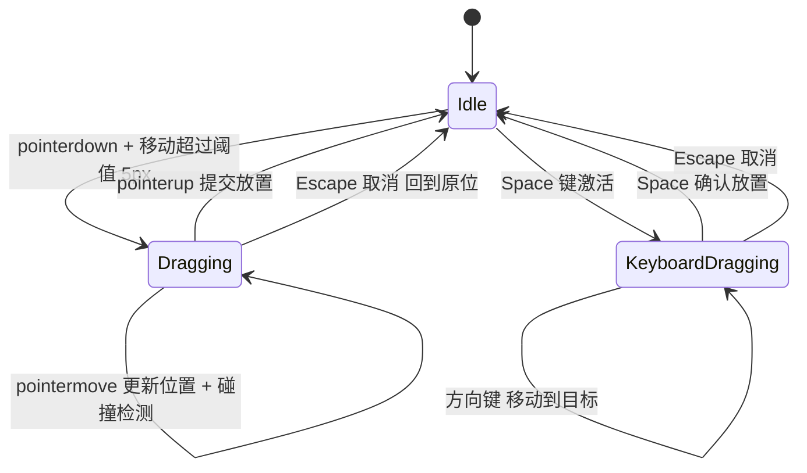
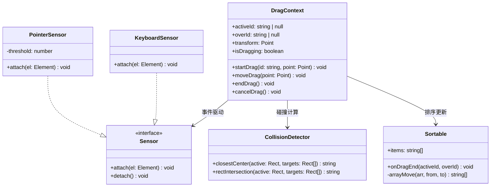

# OOD：拖拽系统（Drag & Drop）

> 设计可排序列表的拖拽系统：状态机、碰撞检测、位置计算、键盘可访问性。
> 原型来自 DnD Kit 的核心设计，面试要求理解并实现状态机和碰撞算法。

---

## 设计思路（面试开场白）

"拖拽系统的核心是状态机——idle → dragging → 提交/取消，其他所有逻辑都从这个状态机派生。
先澄清需求：只支持鼠标还是要键盘可访问性（a11y）？跨容器拖拽还是同列表排序？
关键数据：被拖元素 ID、起始位置、当前指针位置、目标元素 ID。
碰撞检测选最近中心点策略（遍历所有目标，找中心点距离最近的）或矩形重叠策略（选重叠面积最大的）。
实现分层：Sensor 感知指针/键盘事件 → DragContext 维护状态 → Collision 计算碰撞 → Sortable 响应排序变化。"

---

## 状态机图



---

## 类图



---

## 需求分析

```
功能需求：
  1. 拖拽排序列表（元素可以上下拖动改变顺序）
  2. 拖拽反馈：被拖元素半透明、目标位置有占位符
  3. 碰撞检测：判断拖拽元素当前覆盖哪个目标
  4. 放置：在目标位置插入（不是交换）
  5. 取消：按 Esc 取消，回到原位
  6. 键盘支持：Space 开始/确认，方向键移动，Esc 取消

状态机（核心）：
  idle ──(pointerdown + move > threshold)──→ dragging
  dragging ──(pointerup)──→ idle（提交）
  dragging ──(Escape)──→ idle（取消）
```

---

## 核心接口设计

```typescript
// 坐标
interface Point {
  x: number;
  y: number;
}

// 矩形区域（元素的位置和大小）
interface Rect {
  top: number;
  left: number;
  width: number;
  height: number;
  bottom: number;  // top + height
  right: number;   // left + width
}

// 拖拽状态
type DragState =
  | { status: 'idle' }
  | {
      status: 'dragging';
      activeId: string;        // 正在拖的元素 ID
      overId: string | null;   // 当前覆盖的目标 ID
      origin: Point;           // 拖拽起始点
      current: Point;          // 当前指针位置
      delta: Point;            // 偏移量 = current - origin
    };

interface DragContextValue {
  state: DragState;
  startDrag: (id: string, event: PointerEvent) => void;
  updateDrag: (event: PointerEvent) => void;
  endDrag: () => void;
  cancelDrag: () => void;
  registerDroppable: (id: string, rect: Rect) => void;
  unregisterDroppable: (id: string) => void;
}
```

---

## 碰撞检测算法

```typescript
// 碰撞检测：判断拖拽元素和哪个 droppable 重叠最多

// 方案一：中心点命中（最简单）
// 拖拽元素的中心点在哪个 droppable 内
function closestCenter(
  dragRect: Rect,
  droppables: Map<string, Rect>
): string | null {
  const dragCenter: Point = {
    x: dragRect.left + dragRect.width / 2,
    y: dragRect.top + dragRect.height / 2,
  };

  let closest: string | null = null;
  let minDistance = Infinity;

  for (const [id, rect] of droppables) {
    const center: Point = {
      x: rect.left + rect.width / 2,
      y: rect.top + rect.height / 2,
    };
    const distance = Math.sqrt(
      Math.pow(dragCenter.x - center.x, 2) +
      Math.pow(dragCenter.y - center.y, 2)
    );
    if (distance < minDistance) {
      minDistance = distance;
      closest = id;
    }
  }

  return closest;
}

// 方案二：重叠面积最大（更精确）
function intersectionRatio(a: Rect, b: Rect): number {
  const xOverlap = Math.max(0, Math.min(a.right, b.right) - Math.max(a.left, b.left));
  const yOverlap = Math.max(0, Math.min(a.bottom, b.bottom) - Math.max(a.top, b.top));
  const intersection = xOverlap * yOverlap;
  const aArea = a.width * a.height;
  return aArea > 0 ? intersection / aArea : 0;
}

function pointerWithin(
  dragRect: Rect,
  droppables: Map<string, Rect>,
  pointerPosition: Point
): string | null {
  // 优先判断指针点直接命中哪个 droppable
  for (const [id, rect] of droppables) {
    if (
      pointerPosition.x >= rect.left &&
      pointerPosition.x <= rect.right &&
      pointerPosition.y >= rect.top &&
      pointerPosition.y <= rect.bottom
    ) {
      return id;
    }
  }
  return null;
}
```

---

## DragContext 实现

```typescript
// src/dnd/DragContext.tsx
import React, { createContext, useContext, useReducer, useCallback, useRef } from 'react';

type DragAction =
  | { type: 'START'; id: string; origin: Point; current: Point }
  | { type: 'MOVE'; current: Point; overId: string | null }
  | { type: 'END' }
  | { type: 'CANCEL' };

function dragReducer(state: DragState, action: DragAction): DragState {
  switch (action.type) {
    case 'START':
      return {
        status: 'dragging',
        activeId: action.id,
        overId: null,
        origin: action.origin,
        current: action.current,
        delta: { x: 0, y: 0 },
      };
    case 'MOVE':
      if (state.status !== 'dragging') return state;
      return {
        ...state,
        current: action.current,
        overId: action.overId,
        delta: {
          x: action.current.x - state.origin.x,
          y: action.current.y - state.origin.y,
        },
      };
    case 'END':
    case 'CANCEL':
      return { status: 'idle' };
    default:
      return state;
  }
}

const DRAG_THRESHOLD = 5;  // 移动 5px 才算开始拖拽（区分点击和拖拽）

const DragCtx = createContext<DragContextValue | null>(null);

export function DragProvider({
  children,
  onDragEnd,
}: {
  children: React.ReactNode;
  onDragEnd?: (activeId: string, overId: string) => void;
}) {
  const [state, dispatch] = useReducer(dragReducer, { status: 'idle' });
  const droppables = useRef<Map<string, Rect>>(new Map());
  const startPointer = useRef<Point | null>(null);
  const activeIdRef = useRef<string | null>(null);

  const registerDroppable = useCallback((id: string, rect: Rect) => {
    droppables.current.set(id, rect);
  }, []);

  const unregisterDroppable = useCallback((id: string) => {
    droppables.current.delete(id);
  }, []);

  const startDrag = useCallback((id: string, event: React.PointerEvent) => {
    startPointer.current = { x: event.clientX, y: event.clientY };
    activeIdRef.current = id;
    // 不立即 dispatch START，等超过阈值
    event.currentTarget.setPointerCapture(event.pointerId);
  }, []);

  const updateDrag = useCallback((event: React.PointerEvent) => {
    const current = { x: event.clientX, y: event.clientY };

    if (state.status === 'idle' && startPointer.current) {
      // 检查是否超过阈值
      const dx = current.x - startPointer.current.x;
      const dy = current.y - startPointer.current.y;
      if (Math.sqrt(dx * dx + dy * dy) > DRAG_THRESHOLD) {
        dispatch({ type: 'START', id: activeIdRef.current!, origin: startPointer.current!, current });
      }
      return;
    }

    if (state.status === 'dragging') {
      // 计算拖拽元素当前的 Rect（原始 Rect + delta）
      const activeRect = droppables.current.get(state.activeId);
      const overId = activeRect
        ? pointerWithin(activeRect, droppables.current, current)
        : null;

      dispatch({ type: 'MOVE', current, overId: overId !== state.activeId ? overId : null });
    }
  }, [state]);

  const endDrag = useCallback(() => {
    if (state.status === 'dragging' && state.overId) {
      onDragEnd?.(state.activeId, state.overId);
    }
    dispatch({ type: 'END' });
    startPointer.current = null;
  }, [state, onDragEnd]);

  const cancelDrag = useCallback(() => {
    dispatch({ type: 'CANCEL' });
    startPointer.current = null;
  }, []);

  // 全局 keydown：Esc 取消
  React.useEffect(() => {
    const handleKeyDown = (e: KeyboardEvent) => {
      if (e.key === 'Escape' && state.status === 'dragging') {
        cancelDrag();
      }
    };
    document.addEventListener('keydown', handleKeyDown);
    return () => document.removeEventListener('keydown', handleKeyDown);
  }, [state.status, cancelDrag]);

  return (
    <DragCtx.Provider value={{ state, startDrag, updateDrag, endDrag, cancelDrag, registerDroppable, unregisterDroppable }}>
      <div
        onPointerMove={updateDrag}
        onPointerUp={endDrag}
        style={{ userSelect: state.status === 'dragging' ? 'none' : 'auto' }}
      >
        {children}
      </div>
    </DragCtx.Provider>
  );
}

export const useDragContext = () => {
  const ctx = useContext(DragCtx);
  if (!ctx) throw new Error('useDragContext must be used within DragProvider');
  return ctx;
};
```

---

## useDraggable / useDroppable hooks

```typescript
// src/dnd/hooks.ts

export function useDraggable(id: string) {
  const { state, startDrag } = useDragContext();

  const isDragging = state.status === 'dragging' && state.activeId === id;
  const delta = isDragging ? state.delta : { x: 0, y: 0 };

  return {
    isDragging,
    delta,
    // 绑定到可拖拽元素
    dragHandleProps: {
      onPointerDown: (e: React.PointerEvent) => startDrag(id, e),
      style: { cursor: isDragging ? 'grabbing' : 'grab', touchAction: 'none' },
    },
    // 拖拽时的样式
    draggableStyle: {
      transform: isDragging ? `translate(${delta.x}px, ${delta.y}px)` : undefined,
      opacity: isDragging ? 0.5 : 1,
      zIndex: isDragging ? 999 : 'auto',
      position: isDragging ? ('relative' as const) : undefined,
    },
  };
}

export function useDroppable(id: string) {
  const { state, registerDroppable, unregisterDroppable } = useDragContext();
  const ref = useRef<HTMLElement>(null);

  // 注册 droppable 的 rect
  React.useEffect(() => {
    if (!ref.current) return;
    const updateRect = () => {
      const rect = ref.current!.getBoundingClientRect();
      registerDroppable(id, {
        top: rect.top, left: rect.left,
        width: rect.width, height: rect.height,
        bottom: rect.bottom, right: rect.right,
      });
    };
    updateRect();
    const observer = new ResizeObserver(updateRect);
    observer.observe(ref.current);
    return () => {
      observer.disconnect();
      unregisterDroppable(id);
    };
  }, [id, registerDroppable, unregisterDroppable]);

  const isOver = state.status === 'dragging' && state.overId === id;

  return { ref, isOver };
}
```

---

## 排序列表完整示例

```typescript
// 辅助：插入排序（把 from 位置的元素移到 to 位置）
function arrayMove<T>(arr: T[], fromIndex: number, toIndex: number): T[] {
  const result = [...arr];
  const [removed] = result.splice(fromIndex, 1);
  result.splice(toIndex, 0, removed);
  return result;
}

// 排序列表
function SortableList<T extends { id: string; label: string }>({
  initialItems,
}: {
  initialItems: T[];
}) {
  const [items, setItems] = useState(initialItems);

  const handleDragEnd = (activeId: string, overId: string) => {
    const fromIndex = items.findIndex(i => i.id === activeId);
    const toIndex = items.findIndex(i => i.id === overId);
    if (fromIndex !== -1 && toIndex !== -1 && fromIndex !== toIndex) {
      setItems(arrayMove(items, fromIndex, toIndex));
    }
  };

  return (
    <DragProvider onDragEnd={handleDragEnd}>
      <ul style={{ listStyle: 'none', padding: 0 }}>
        {items.map(item => (
          <SortableItem key={item.id} id={item.id} label={item.label} />
        ))}
      </ul>
    </DragProvider>
  );
}

function SortableItem({ id, label }: { id: string; label: string }) {
  const { isDragging, draggableStyle, dragHandleProps } = useDraggable(id);
  const { ref, isOver } = useDroppable(id);

  return (
    <li
      ref={ref as React.RefObject<HTMLLIElement>}
      style={{
        ...draggableStyle,
        padding: '12px 16px',
        marginBottom: 8,
        background: isOver ? '#e3f2fd' : 'white',
        border: `2px solid ${isOver ? '#2196F3' : '#e0e0e0'}`,
        borderRadius: 8,
        display: 'flex',
        alignItems: 'center',
        gap: 12,
        transition: isDragging ? 'none' : 'background 0.15s, border-color 0.15s',
      }}
    >
      {/* 拖拽手柄 */}
      <span {...dragHandleProps} style={{ ...dragHandleProps.style, fontSize: 20 }}>⠿</span>
      {label}
    </li>
  );
}
```

---

## 面试追问

**Q: 为什么用 `transform` 移动拖拽元素而不是改 `top/left`？**
A: `transform` 只触发 **Composite**（GPU 合成层），不触发 Layout 和 Paint，性能极好；`top/left` 需要重新 Layout（重排），涉及所有受影响元素，即使只移动 1px 也可能触发整页重排。拖拽时每帧（~16ms）都在更新位置，必须用 `transform`，否则会掉帧。同理，拖拽层用 `position: fixed` + `will-change: transform` 让浏览器提前创建合成层。

**Q: 碰撞检测触发太频繁（每次 pointermove 都算），如何优化？**
A: 两种方向：① 节流：每 16ms（1 帧）最多算一次（`requestAnimationFrame` 节流）；② 减少计算：`pointermove` 时先判断指针是否离开了当前 `overId` 的边界，没有变化直接跳过整个碰撞检测。实际 DnD Kit 用 `requestAnimationFrame` 调度更新，保证每帧只算一次，不阻塞主线程。

**Q: 跨容器拖拽（从列表 A 拖到列表 B）如何扩展？**
A: 当前实现 `activeId` 和 `overId` 都是元素 ID，扩展时需要：① 每个 droppable 注册时带上 `containerId`；② 碰撞检测时除了返回目标元素 ID，还返回目标容器 ID；③ `onDragEnd` 接受 `{ activeId, overId, activeContainerId, overContainerId }`，父组件根据容器 ID 决定是同容器移动还是跨容器转移。
