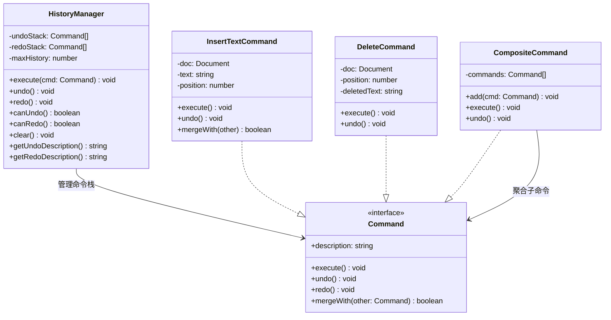
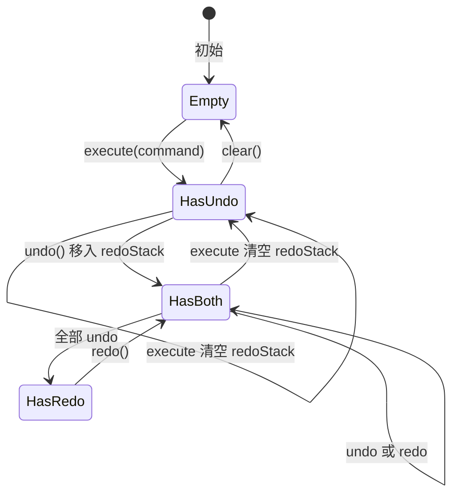

# OOD：撤销/重做系统（Undo/Redo）

> Command 模式实现撤销重做：命令栈、宏命令、合并、History Hook。
> 与 `05_mini_redux.md` 的时间旅行对比：Redux 是 state snapshot，Command 是操作记录。

---

## 设计思路（面试开场白）

"Undo/Redo 有两种实现思路：State Snapshot（存每次操作后的完整状态，简单但内存大）和 Command 模式（存可逆命令对象，高效但需要为每种操作实现 execute/undo 对）。
面试推荐 Command 模式，因为更真实（Google Docs 也是这样做的）。
核心数据结构：两个栈——undoStack（已执行命令，Ctrl+Z 时 pop 并调 undo()）和 redoStack（已撤销命令，Ctrl+Y 时 pop 并调 redo()）。
关键细节：每次 execute 新命令时清空 redoStack（执行了新操作就不能再 Redo 旧的）；连续输入字符可以合并（mergeWith 方法）避免每个字母都是一步 undo；宏命令（CompositeCommand）支持批量操作作为一个 undo 步骤。"

---

## 类图



---

## 状态机图：HistoryManager 状态



---

## 白板版（面试15分钟）

```typescript
// 面试写这个版本，生产实现见下方完整版
interface Command {
  execute(): void;
  undo(): void;
  description: string;
}

class HistoryManager {
  private undoStack: Command[] = [];
  private redoStack: Command[] = [];
  // 省略：maxSize / 命令合并（mergeWindow）

  execute(cmd: Command): void {
    cmd.execute();
    this.undoStack.push(cmd);
    this.redoStack = []; // 新操作清空 redo 栈
  }

  undo(): void {
    const cmd = this.undoStack.pop();
    if (!cmd) return;
    cmd.undo();
    this.redoStack.push(cmd);
  }

  redo(): void {
    const cmd = this.redoStack.pop();
    if (!cmd) return;
    cmd.execute();
    this.undoStack.push(cmd);
  }

  canUndo() { return this.undoStack.length > 0; }
  canRedo() { return this.redoStack.length > 0; }
  getUndoDescription() { return this.undoStack.at(-1)?.description ?? null; }
}

// 简单命令示例
function makeSetCommand<T>(target: Record<string, T>, key: string, newVal: T): Command {
  const oldVal = target[key];
  return {
    description: `设置 ${key}`,
    execute: () => { target[key] = newVal; },
    undo: () => { target[key] = oldVal; },
  };
}
```

---

## 两种实现思路对比

```
方案一：State Snapshot（Redux 时间旅行方式）
  存储每次操作后的完整状态快照
  undo = 跳回上一个快照
  
  优点：实现简单，天然支持任意回跳
  缺点：内存占用大（大文档每次操作都存完整快照），无法"描述"操作
  适合：状态小、操作频率低

方案二：Command Pattern（本篇）
  每次操作存储可逆的命令对象（包含 execute 和 undo）
  undo = 调用命令的 undo() 方法
  redo = 调用命令的 redo() 方法
  
  优点：内存高效（只存差异），可以描述操作（"删除了 Alice"），支持合并
  缺点：需要为每种操作实现 execute/undo 对，复杂操作难以 undo
  适合：文档编辑器、图形工具、IDE
```

---

## Command 接口

```typescript
// 基础命令接口
interface Command {
  execute(): void;
  undo(): void;
  redo?(): void;          // 默认与 execute 相同，可覆盖优化
  description: string;    // 用于 UI 展示（"撤销：删除文字"）
  // 合并支持：相邻命令可以合并为一个（如连续输入字符）
  merge?(other: Command): Command | null;  // null = 不合并
}

// 具体命令类型（文本编辑器示例）
interface TextDocument {
  content: string;
  selection: { start: number; end: number };
}
```

---

## 具体命令实现

```typescript
// 插入文字命令
class InsertTextCommand implements Command {
  description: string;

  constructor(
    private doc: TextDocument,
    private position: number,
    private text: string,
    private setState: (doc: TextDocument) => void
  ) {
    this.description = `插入"${text.slice(0, 10)}${text.length > 10 ? '...' : ''}"`;
  }

  execute() {
    const newContent =
      this.doc.content.slice(0, this.position) +
      this.text +
      this.doc.content.slice(this.position);
    this.setState({
      content: newContent,
      selection: {
        start: this.position + this.text.length,
        end: this.position + this.text.length,
      },
    });
  }

  undo() {
    const newContent =
      this.doc.content.slice(0, this.position) +
      this.doc.content.slice(this.position + this.text.length);
    this.setState({
      content: newContent,
      selection: { start: this.position, end: this.position },
    });
  }

  // 合并相邻的插入命令（连续输入字符合并为一个命令）
  merge(other: Command): Command | null {
    if (!(other instanceof InsertTextCommand)) return null;
    // 只合并位置连续的插入
    if (this.position + this.text.length !== other.position) return null;
    // 换行符不合并（每行分开撤销更直觉）
    if (other.text === '\n') return null;

    return new InsertTextCommand(
      this.doc,
      this.position,
      this.text + other.text,
      this.setState
    );
  }
}

// 删除文字命令
class DeleteTextCommand implements Command {
  private deletedText: string;
  description: string;

  constructor(
    private doc: TextDocument,
    private start: number,
    private end: number,
    private setState: (doc: TextDocument) => void
  ) {
    this.deletedText = doc.content.slice(start, end);
    this.description = `删除"${this.deletedText.slice(0, 10)}"`;
  }

  execute() {
    const newContent = this.doc.content.slice(0, this.start) + this.doc.content.slice(this.end);
    this.setState({
      content: newContent,
      selection: { start: this.start, end: this.start },
    });
  }

  undo() {
    const newContent =
      this.doc.content.slice(0, this.start) +
      this.deletedText +
      this.doc.content.slice(this.start);
    this.setState({
      content: newContent,
      selection: { start: this.start, end: this.end },
    });
  }

  merge(other: Command): Command | null {
    return null;  // 删除命令不合并
  }
}

// 格式化命令（加粗、斜体）
class FormatCommand implements Command {
  private prevFormat: Record<string, unknown>;
  description: string;

  constructor(
    private docRef: { current: TextDocument },
    private range: { start: number; end: number },
    private format: Record<string, unknown>,
    private applyFormat: (range: { start: number; end: number }, format: Record<string, unknown>) => void,
    private getFormat: (range: { start: number; end: number }) => Record<string, unknown>
  ) {
    this.prevFormat = getFormat(range);
    this.description = `格式化：${JSON.stringify(format)}`;
  }

  execute() { this.applyFormat(this.range, this.format); }
  undo() { this.applyFormat(this.range, this.prevFormat); }
  merge() { return null; }
}

// 宏命令（将多个命令组合为一个撤销单元）
class MacroCommand implements Command {
  description: string;

  constructor(
    private commands: Command[],
    description?: string
  ) {
    this.description = description ?? commands.map(c => c.description).join(' + ');
  }

  execute() {
    for (const cmd of this.commands) cmd.execute();
  }

  undo() {
    // 逆序撤销
    for (let i = this.commands.length - 1; i >= 0; i--) {
      this.commands[i].undo();
    }
  }

  merge() { return null; }
}
```

---

## 历史管理器（History Manager）

```typescript
// src/editor/history.ts

interface HistoryOptions {
  maxSize?: number;        // 最多保留多少步（默认 100）
  mergeWindow?: number;    // 多少 ms 内的相邻命令尝试合并（默认 500ms）
}

class HistoryManager {
  private undoStack: Command[] = [];
  private redoStack: Command[] = [];
  private lastCommandTime = 0;
  private options: Required<HistoryOptions>;

  constructor(options: HistoryOptions = {}) {
    this.options = {
      maxSize: options.maxSize ?? 100,
      mergeWindow: options.mergeWindow ?? 500,
    };
  }

  execute(command: Command): void {
    const now = Date.now();
    const shouldMerge =
      this.undoStack.length > 0 &&
      now - this.lastCommandTime < this.options.mergeWindow;

    if (shouldMerge) {
      const last = this.undoStack[this.undoStack.length - 1];
      const merged = last.merge?.(command);
      if (merged) {
        // 用合并后的命令替换栈顶
        this.undoStack[this.undoStack.length - 1] = merged;
        merged.execute();
        this.lastCommandTime = now;
        this.redoStack = [];  // 新操作清空 redo 栈
        return;
      }
    }

    command.execute();
    this.undoStack.push(command);
    this.redoStack = [];  // 新操作清空 redo 栈
    this.lastCommandTime = now;

    // 超出上限：移除最旧的命令
    if (this.undoStack.length > this.options.maxSize) {
      this.undoStack.shift();
    }
  }

  undo(): Command | null {
    const command = this.undoStack.pop();
    if (!command) return null;

    command.undo();
    this.redoStack.push(command);
    return command;
  }

  redo(): Command | null {
    const command = this.redoStack.pop();
    if (!command) return null;

    (command.redo ?? command.execute).call(command);
    this.undoStack.push(command);
    return command;
  }

  canUndo(): boolean { return this.undoStack.length > 0; }
  canRedo(): boolean { return this.redoStack.length > 0; }
  clear(): void { this.undoStack = []; this.redoStack = []; }

  // 获取操作描述（用于 UI 展示"撤销：删除了 Alice"）
  getUndoDescription(): string | null {
    return this.undoStack[this.undoStack.length - 1]?.description ?? null;
  }
  getRedoDescription(): string | null {
    return this.redoStack[this.redoStack.length - 1]?.description ?? null;
  }
}
```

---

## React Hook 封装

```typescript
// src/hooks/useHistory.ts

export function useHistory<S>(initialState: S) {
  const [state, _setState] = useState<S>(initialState);
  const historyRef = useRef(new HistoryManager({ maxSize: 100, mergeWindow: 500 }));
  const stateRef = useRef(state);

  // 保持 stateRef 与 state 同步
  useEffect(() => { stateRef.current = state; }, [state]);

  const setState = useCallback((newState: S) => {
    stateRef.current = newState;
    _setState(newState);
  }, []);

  // 执行可撤销操作
  const executeCommand = useCallback((command: Command) => {
    historyRef.current.execute(command);
    _setState({ ...stateRef.current });  // 触发重渲染
  }, []);

  // 快捷：对状态做变换（适合简单操作）
  const record = useCallback((
    transform: (state: S) => S,
    description: string
  ) => {
    const prev = stateRef.current;
    const next = transform(prev);

    const command: Command = {
      description,
      execute: () => setState(next),
      undo: () => setState(prev),
      merge: () => null,
    };

    historyRef.current.execute(command);
  }, [setState]);

  const undo = useCallback(() => {
    const cmd = historyRef.current.undo();
    if (cmd) _setState({ ...stateRef.current });
  }, []);

  const redo = useCallback(() => {
    const cmd = historyRef.current.redo();
    if (cmd) _setState({ ...stateRef.current });
  }, []);

  // 键盘快捷键
  useEffect(() => {
    const handleKeyDown = (e: KeyboardEvent) => {
      const ctrl = e.ctrlKey || e.metaKey;
      if (ctrl && e.key === 'z' && !e.shiftKey) {
        e.preventDefault();
        undo();
      } else if (ctrl && (e.key === 'y' || (e.key === 'z' && e.shiftKey))) {
        e.preventDefault();
        redo();
      }
    };
    document.addEventListener('keydown', handleKeyDown);
    return () => document.removeEventListener('keydown', handleKeyDown);
  }, [undo, redo]);

  const history = historyRef.current;

  return {
    state,
    executeCommand,
    record,
    undo,
    redo,
    canUndo: history.canUndo(),
    canRedo: history.canRedo(),
    undoDescription: history.getUndoDescription(),
    redoDescription: history.getRedoDescription(),
  };
}
```

---

## 使用示例

```typescript
// 画布编辑器
interface Shape {
  id: string;
  x: number;
  y: number;
  width: number;
  height: number;
  color: string;
}

interface CanvasState {
  shapes: Shape[];
  selectedId: string | null;
}

function CanvasEditor() {
  const { state, record, executeCommand, undo, redo, canUndo, canRedo, undoDescription } = useHistory<CanvasState>({
    shapes: [],
    selectedId: null,
  });

  const addShape = () => {
    record(
      s => ({ ...s, shapes: [...s.shapes, { id: randomId(), x: 100, y: 100, width: 80, height: 60, color: '#6366f1' }] }),
      '添加图形'
    );
  };

  const deleteSelected = () => {
    if (!state.selectedId) return;
    record(
      s => ({ ...s, shapes: s.shapes.filter(sh => sh.id !== s.selectedId), selectedId: null }),
      '删除图形'
    );
  };

  const moveShape = (id: string, dx: number, dy: number) => {
    record(
      s => ({
        ...s,
        shapes: s.shapes.map(sh =>
          sh.id === id ? { ...sh, x: sh.x + dx, y: sh.y + dy } : sh
        ),
      }),
      '移动图形'
    );
  };

  return (
    <div>
      {/* 工具栏 */}
      <div>
        <button onClick={undo} disabled={!canUndo} title={`撤销：${undoDescription}`}>
          ↩ 撤销
        </button>
        <button onClick={redo} disabled={!canRedo}>↪ 重做</button>
        <button onClick={addShape}>+ 添加图形</button>
        <button onClick={deleteSelected} disabled={!state.selectedId}>删除</button>
      </div>

      {/* 画布 */}
      <svg width={800} height={600}>
        {state.shapes.map(shape => (
          <rect
            key={shape.id}
            x={shape.x} y={shape.y}
            width={shape.width} height={shape.height}
            fill={shape.color}
            opacity={state.selectedId === shape.id ? 0.8 : 1}
            onClick={() => record(s => ({ ...s, selectedId: shape.id }), '选中图形')}
          />
        ))}
      </svg>
    </div>
  );
}
```

---

## 常见踩坑

**踩坑1：execute 新命令时未清空 redoStack**
❌ 错误：用户 undo 后执行新操作，redoStack 未清空，导致 redo 后拿到与新操作冲突的旧命令，数据不一致。
✓ 正确：每次 `execute` 新命令时 `this.redoStack = []`，强制清除"未来"历史。
原因：时间线在新操作处分叉，旧的未来不再有效。

**踩坑2：MacroCommand（宏命令）undo 时未逆序执行**
❌ 错误：`commands.forEach(cmd => cmd.undo())`，按正序撤销，结果与预期相反（应先撤销最后执行的命令）。
✓ 正确：`[...commands].reverse().forEach(cmd => cmd.undo())` 或 `for (let i = commands.length - 1; i >= 0; i--)`。
原因：操作的逆序原则——后做的先撤，就像"撤销粘贴"必须先删除粘贴内容再恢复剪贴板状态。

**踩坑3：命令对象持有过时的 doc 引用**
❌ 错误：InsertTextCommand 在构造时捕获 `doc` 对象引用，但 doc 是可变的，后续操作改变了 doc，undo 时基于旧引用操作了错误的状态。
✓ 正确：命令应存储操作时的**快照数据**（如 position、text），而非对象引用；或确保 doc 始终是不可变的（每次操作产生新对象）。
原因：可变引用在命令模式中是"定时炸弹"，undo 后的状态取决于命令之外的变更。

**踩坑4：忘记限制 undoStack 大小**
❌ 错误：无限 push 到 undoStack，长时间使用的应用（如 Figma 会话）内存不断增长，最终 OOM。
✓ 正确：超过 `maxSize`（如 100）时 `undoStack.shift()` 移除最旧的命令，仅保留最近的 N 步。
原因：命令对象可能持有数据快照（删除命令存储被删文本），历史越长内存越大。

**踩坑5：命令合并时机判断错误**
❌ 错误：按任意相邻同类命令都合并，导致跨越换行符的输入合并成一步，Ctrl+Z 一次撤销几段文字。
✓ 正确：合并条件：时间窗口内（500ms）+ 位置连续 + 同类型命令，且换行符/空格等分隔符触发截断合并。
原因：命令合并的目标是"符合用户直觉的撤销粒度"，过度合并和不合并一样影响体验。

---

## 扩展性追问

**Q: 如何将命令历史持久化到 IndexedDB（刷新后仍可 undo）？**
思路：命令接口增加 `type: string` 和 `payload: unknown` 字段（纯数据，无函数）；每次 execute 后将 `undoStack.map(cmd => ({ type, payload }))` 序列化存 IndexedDB；页面加载时读取并根据 type 注册的工厂函数重建 Command 实例。注意函数/闭包无法序列化，Command 必须是纯数据驱动的。

**Q: 多人协同编辑时如何各自维护独立的 undo 栈？**
思路：每个用户维护自己的 `localUndoStack`，只记录本用户的操作；undo 时生成该操作的逆操作（Inverse Operation）并发送给服务端（而非本地执行），服务端将逆操作广播给所有客户端；其他用户的历史不受影响。这是 OT（Operational Transformation）或 CRDT 协同编辑的标准做法，比"全局时间线"更可扩展。

**Q: 如何支持分支历史（撤销到某一步后可以选择不同的历史分支）？**
思路：将线性的两栈结构升级为树结构——每次 undo 不清空 redoStack 而是保存为子分支；每次 execute 新命令时创建新分支；UI 展示历史树（类似 Git 的 git log --graph），用户可以点击切换到任意历史节点。Vim 的 undo tree、VSCode 的 Timeline 都是这种设计。

---

## 面试追问

**Q: Command Pattern 和 Redux 时间旅行的核心区别是什么？**
A: Redux 存的是"状态快照"（每次 dispatch 后的完整 state），时间旅行是跳到某个快照；Command Pattern 存的是"操作"（execute + undo 方法对），撤销是逆向执行操作。前者内存占用与状态大小成正比（大文档 × N 步 = 巨大内存），后者内存占用与操作数量和差异大小成正比（连续输入 100 字符 → 合并为 1 个命令 = 极小内存）。生产编辑器（Google Docs、Figma）都用 Command Pattern，React DevTools 时间旅行用 Snapshot。

**Q: 如何实现"持久化历史"（刷新页面后 Undo 仍然有效）？**
A: 将 Command 序列化存 IndexedDB（Command 必须是纯数据，不能含函数引用）。序列化方案：每个 Command 有 `type` 字符串 + `payload` 纯数据，反序列化时根据 `type` 重建对应的 Command 实例。这也是 OT（Operational Transformation）系统的基础 — 操作可序列化传输给其他用户，实现协同编辑。

**Q: 命令合并（Command Merging）为什么重要？**
A: 连续输入 "Hello World"（11 个字符）如果不合并 = 11 个 Undo 步骤，体验极差（Ctrl+Z 一次只撤销一个字符）。合并后 = 1 个 Undo 步骤，符合用户预期（一次撤销一段输入）。合并策略：时间窗口（500ms 内连续的同类命令）+ 位置连续（上次插入结束位置 = 本次插入开始位置）+ 类型相同。Word/Google Docs 的合并逻辑非常精细（单词边界、换行、格式变化都会截断合并）。
