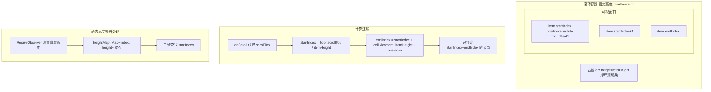
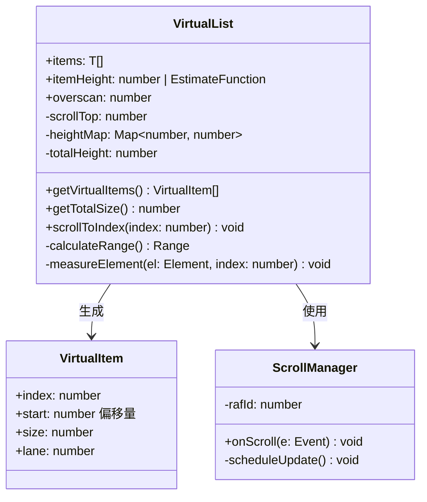

# OOD：虚拟列表（Virtual List / Windowed Rendering）

> 只渲染可视区域内的 DOM 节点，支持百万级列表流畅滚动。
> 面试核心：理解"窗口化"思想，实现 startIndex/endIndex 计算，处理动态高度。

---

## 设计思路（面试开场白）

"虚拟列表的核心思想：不管列表有多长，任何时刻只渲染视口内的 ~20 个 DOM 节点，用一个空占位元素（totalHeight）撑起完整的滚动条。
固定高度实现最简单：startIndex = Math.floor(scrollTop / itemHeight)；endIndex = startIndex + Math.ceil(viewportHeight / itemHeight) + overscan。
动态高度的难点：无法预计算 totalHeight 和每个 item 的偏移量。解法是测量已渲染节点的真实高度（ResizeObserver 或 measureElement 回调）并缓存到 heightMap，未渲染节点用 estimatedHeight 估算。
关键性能点：onScroll 用 rAF 节流；DOM 节点用 absolute + top 定位（避免 Reflow）；overscan 减少滚动白屏。"

---

## 架构图：虚拟列表窗口化原理



---

## 类图



---

## 白板版（面试15分钟）

```typescript
// 面试写这个版本，生产实现见下方完整版
import { useState, useCallback } from 'react';

interface UseVirtualListOptions {
  total: number;
  itemHeight: number;      // 固定高度版本
  viewportHeight: number;
  overscan?: number;
}

function useVirtualList({ total, itemHeight, viewportHeight, overscan = 3 }: UseVirtualListOptions) {
  const [scrollTop, setScrollTop] = useState(0);

  // 省略：动态高度（heightMap + 二分查找）/ rAF 节流
  const startIndex = Math.max(0, Math.floor(scrollTop / itemHeight) - overscan);
  const visibleCount = Math.ceil(viewportHeight / itemHeight);
  const endIndex = Math.min(total - 1, Math.floor(scrollTop / itemHeight) + visibleCount + overscan);
  const offsetY = startIndex * itemHeight;
  const totalHeight = total * itemHeight;

  const onScroll = useCallback((e: React.UIEvent) => {
    setScrollTop((e.target as HTMLElement).scrollTop);
  }, []);

  return { startIndex, endIndex, offsetY, totalHeight, onScroll };
}

// 使用：
// const { startIndex, endIndex, offsetY, totalHeight, onScroll } = useVirtualList({ total: items.length, itemHeight: 60, viewportHeight: 500 });
// <div style={{ height: viewportHeight, overflow: 'auto' }} onScroll={onScroll}>
//   <div style={{ height: totalHeight, position: 'relative' }}>
//     <div style={{ transform: `translateY(${offsetY}px)`, position: 'absolute', width: '100%' }}>
//       {items.slice(startIndex, endIndex + 1).map((item, i) => <Row key={startIndex + i} item={item} />)}
//     </div>
//   </div>
// </div>
```

---

## 为什么需要虚拟列表

```
问题：渲染 10 万条 DOM 节点
  - 初始渲染：~3 秒（浏览器 Layout 开销）
  - 内存：~500MB
  - 滚动：卡顿（每帧需要处理 10 万个节点的事件冒泡）

虚拟列表方案：
  - 任何时刻只渲染可视区内的 ~20 个节点
  - 用一个空的占位元素（totalHeight）撑开滚动条
  - 滚动时动态换内容，而不是换位置
  - 渲染时间恒定 O(visible)，与总数无关
```

---

## 核心概念

```
┌──────────────────────┐ ← scrollTop
│   padding-top(空白)   │   (已滚过的高度)
├──────────────────────┤ ← startIndex
│   item[startIndex]   │
│   item[...]          │ ← 可视区（viewportHeight）
│   item[endIndex]     │
├──────────────────────┤
│  padding-bottom(空白) │
└──────────────────────┘ ← totalHeight

核心变量：
  containerRef  可视容器（固定高度，overflow: auto）
  scrollTop     当前滚动位置
  itemHeight    每项高度（固定高度版）
  viewportHeight 容器可见高度
  startIndex    第一个可见项的索引
  endIndex      最后一个可见项的索引
  overscan      超出可视区外多渲染几项（防止快速滚动白屏）
```

---

## 固定高度实现

```typescript
// src/components/VirtualList/FixedVirtualList.tsx

interface FixedVirtualListProps<T> {
  items: T[];
  itemHeight: number;       // 每项固定高度（px）
  height: number;           // 容器高度（px）
  renderItem: (item: T, index: number) => React.ReactNode;
  overscan?: number;        // 超出可视区外多渲染的项数（默认 3）
  className?: string;
}

export function FixedVirtualList<T>({
  items,
  itemHeight,
  height,
  renderItem,
  overscan = 3,
  className,
}: FixedVirtualListProps<T>) {
  const [scrollTop, setScrollTop] = useState(0);
  const containerRef = useRef<HTMLDivElement>(null);

  const totalHeight = items.length * itemHeight;

  // 计算可见范围（核心算法）
  const startIndex = Math.max(0, Math.floor(scrollTop / itemHeight) - overscan);
  const visibleCount = Math.ceil(height / itemHeight);
  const endIndex = Math.min(
    items.length - 1,
    Math.floor(scrollTop / itemHeight) + visibleCount + overscan
  );

  const visibleItems = items.slice(startIndex, endIndex + 1);

  // 可视区第一个元素的偏移量（用 transform 性能更好）
  const offsetY = startIndex * itemHeight;

  const handleScroll = useCallback((e: React.UIEvent<HTMLDivElement>) => {
    setScrollTop(e.currentTarget.scrollTop);
  }, []);

  return (
    <div
      ref={containerRef}
      style={{ height, overflow: 'auto', position: 'relative' }}
      onScroll={handleScroll}
      className={className}
    >
      {/* 占位元素：撑开总高度，让滚动条正确 */}
      <div style={{ height: totalHeight, position: 'relative' }}>
        {/* 可见项容器：用 transform 偏移到正确位置 */}
        <div style={{ transform: `translateY(${offsetY}px)`, position: 'absolute', width: '100%' }}>
          {visibleItems.map((item, i) => (
            <div
              key={startIndex + i}
              style={{ height: itemHeight, boxSizing: 'border-box' }}
            >
              {renderItem(item, startIndex + i)}
            </div>
          ))}
        </div>
      </div>
    </div>
  );
}
```

---

## 动态高度实现

```typescript
// 每项高度不同时，需要缓存测量结果，并维护位置索引

interface DynamicVirtualListProps<T> {
  items: T[];
  estimatedItemHeight: number;   // 初始估算高度（测量前使用）
  height: number;
  renderItem: (item: T, index: number) => React.ReactNode;
  overscan?: number;
}

// 位置缓存：记录每项的 top 和 height
interface ItemPosition {
  index: number;
  top: number;
  height: number;
  bottom: number;   // top + height
}

export function DynamicVirtualList<T>({
  items,
  estimatedItemHeight,
  height,
  renderItem,
  overscan = 3,
}: DynamicVirtualListProps<T>) {
  const [scrollTop, setScrollTop] = useState(0);
  const [, forceUpdate] = useReducer(x => x + 1, 0);

  // 位置缓存（每项实际测量后更新）
  const positionsRef = useRef<ItemPosition[]>([]);
  const measuredRef = useRef<Map<number, number>>(new Map());

  // 初始化位置（用估算高度）
  function initPositions() {
    positionsRef.current = items.map((_, index) => {
      const height = measuredRef.current.get(index) ?? estimatedItemHeight;
      const top = index === 0 ? 0 : positionsRef.current[index - 1]?.bottom ?? index * estimatedItemHeight;
      return { index, top, height, bottom: top + height };
    });
  }

  // 当 items 变化时重新初始化
  useEffect(() => { initPositions(); }, [items.length, estimatedItemHeight]);

  const totalHeight = positionsRef.current[items.length - 1]?.bottom ?? items.length * estimatedItemHeight;

  // 二分查找：根据 scrollTop 找到 startIndex
  function findStartIndex(scrollTop: number): number {
    let low = 0, high = positionsRef.current.length - 1;
    while (low <= high) {
      const mid = Math.floor((low + high) / 2);
      const pos = positionsRef.current[mid];
      if (pos.bottom < scrollTop) low = mid + 1;
      else if (pos.top > scrollTop) high = mid - 1;
      else return mid;
    }
    return Math.max(0, low - 1);
  }

  function findEndIndex(startIndex: number, viewportBottom: number): number {
    for (let i = startIndex; i < positionsRef.current.length; i++) {
      if (positionsRef.current[i].top >= viewportBottom) return i;
    }
    return positionsRef.current.length - 1;
  }

  const startIndex = Math.max(0, findStartIndex(scrollTop) - overscan);
  const endIndex = Math.min(items.length - 1, findEndIndex(startIndex, scrollTop + height) + overscan);

  const offsetY = positionsRef.current[startIndex]?.top ?? 0;

  // 每项渲染后测量实际高度，更新缓存
  const itemCallbacks = useRef<Map<number, (el: HTMLDivElement | null) => void>>(new Map());
  function getItemRef(index: number) {
    if (!itemCallbacks.current.has(index)) {
      itemCallbacks.current.set(index, (el: HTMLDivElement | null) => {
        if (!el) return;
        const measured = el.getBoundingClientRect().height;
        if (measuredRef.current.get(index) !== measured) {
          measuredRef.current.set(index, measured);
          // 更新此项及之后所有项的位置
          initPositions();
          forceUpdate();
        }
      });
    }
    return itemCallbacks.current.get(index)!;
  }

  return (
    <div
      style={{ height, overflow: 'auto', position: 'relative' }}
      onScroll={(e) => setScrollTop(e.currentTarget.scrollTop)}
    >
      <div style={{ height: totalHeight, position: 'relative' }}>
        <div style={{ transform: `translateY(${offsetY}px)`, position: 'absolute', width: '100%' }}>
          {items.slice(startIndex, endIndex + 1).map((item, i) => {
            const absoluteIndex = startIndex + i;
            return (
              <div key={absoluteIndex} ref={getItemRef(absoluteIndex)}>
                {renderItem(item, absoluteIndex)}
              </div>
            );
          })}
        </div>
      </div>
    </div>
  );
}
```

---

## useVirtualList Hook（更通用的封装）

```typescript
// 抽离核心逻辑为 hook，渲染层自由组合

interface UseVirtualListOptions {
  total: number;
  itemHeight: number | ((index: number) => number);
  viewportHeight: number;
  overscan?: number;
}

interface UseVirtualListResult {
  startIndex: number;
  endIndex: number;
  offsetY: number;
  totalHeight: number;
  scrollProps: {
    onScroll: (e: React.UIEvent) => void;
  };
}

export function useVirtualList({
  total,
  itemHeight,
  viewportHeight,
  overscan = 3,
}: UseVirtualListOptions): UseVirtualListResult {
  const [scrollTop, setScrollTop] = useState(0);

  const getHeight = typeof itemHeight === 'number' ? () => itemHeight : itemHeight;

  // 构建累积高度表（动态高度）
  const cumHeights = useMemo(() => {
    const arr = new Float64Array(total + 1);
    for (let i = 0; i < total; i++) {
      arr[i + 1] = arr[i] + getHeight(i);
    }
    return arr;
  }, [total, itemHeight]);

  const totalHeight = cumHeights[total];

  // 二分查找
  const startIndex = useMemo(() => {
    let lo = 0, hi = total - 1;
    while (lo < hi) {
      const mid = (lo + hi) >> 1;
      if (cumHeights[mid + 1] <= scrollTop) lo = mid + 1;
      else hi = mid;
    }
    return Math.max(0, lo - overscan);
  }, [scrollTop, cumHeights, overscan]);

  const endIndex = useMemo(() => {
    let lo = startIndex, hi = total - 1;
    const bottom = scrollTop + viewportHeight;
    while (lo < hi) {
      const mid = (lo + hi + 1) >> 1;
      if (cumHeights[mid] < bottom) lo = mid;
      else hi = mid - 1;
    }
    return Math.min(total - 1, lo + overscan);
  }, [startIndex, scrollTop, viewportHeight, cumHeights, overscan]);

  const offsetY = cumHeights[startIndex];

  return {
    startIndex,
    endIndex,
    offsetY,
    totalHeight,
    scrollProps: {
      onScroll: (e: React.UIEvent) => setScrollTop((e.target as HTMLElement).scrollTop),
    },
  };
}
```

---

## 与 TanStack Virtual 对比

```typescript
// 生产环境直接用 TanStack Virtual（@tanstack/react-virtual）
import { useVirtualizer } from '@tanstack/react-virtual';

function ProductionVirtualList({ items }: { items: Item[] }) {
  const parentRef = useRef<HTMLDivElement>(null);

  const virtualizer = useVirtualizer({
    count: items.length,
    getScrollElement: () => parentRef.current,
    estimateSize: () => 60,           // 估算高度
    overscan: 5,
  });

  return (
    <div ref={parentRef} style={{ height: 600, overflow: 'auto' }}>
      <div style={{ height: virtualizer.getTotalSize(), position: 'relative' }}>
        {virtualizer.getVirtualItems().map((virtualItem) => (
          <div
            key={virtualItem.key}
            data-index={virtualItem.index}
            ref={virtualizer.measureElement}   // 自动测量实际高度
            style={{
              position: 'absolute',
              top: 0,
              transform: `translateY(${virtualItem.start}px)`,
              width: '100%',
            }}
          >
            {items[virtualItem.index].name}
          </div>
        ))}
      </div>
    </div>
  );
}

// 手写 vs TanStack Virtual：
// 手写：面试用，理解原理
// 生产：直接用 TanStack Virtual（处理了 ResizeObserver 测量、
//       水平虚拟化、Grid、infinite scroll、RTL 等边界情况）
```

---

## 常见踩坑

**踩坑1：用 `position:top` 而非 `transform:translateY` 定位可见区偏移**
❌ 错误：`<div style={{ top: offsetY }}>` 设置 top 值，每次滚动更新触发 Layout 重排，影响所有兄弟元素。
✓ 正确：`<div style={{ transform: \`translateY(${offsetY}px)\` }}>` 只触发 Composite，GPU 处理。
原因：`top` 是布局属性，修改后浏览器必须重新计算页面布局；`transform` 不影响文档流，纯 GPU 合成。

**踩坑2：onScroll 不做节流，每帧触发多次 setState**
❌ 错误：`onScroll` 直接 `setScrollTop(e.target.scrollTop)`，浏览器每帧可能触发多次 scroll 事件，导致多次 re-render。
✓ 正确：用 `requestAnimationFrame` 节流，每帧最多更新一次：`onScroll = () => { if (!rafId) rafId = rAF(() => { setScrollTop(...); rafId = null; }); }`。
原因：React setState 批处理可以合并部分更新，但 rAF 节流从根源减少回调次数。

**踩坑3：动态高度时未考虑测量前的高度估算误差**
❌ 错误：所有节点都用 `estimatedHeight` 计算 startIndex，测量后实际高度与估算差异大，导致 scrollTop 位置跳动（跳变）。
✓ 正确：测量后更新 heightMap 并重新计算受影响的累积偏移；如果 scrollTop 对应的 item 高度发生变化，调整 scrollTop 补偿偏差，防止视图跳动。
原因：累积误差会随列表滚动放大，越滚越"错位"。

**踩坑4：key 用数组索引导致节点复用异常**
❌ 错误：`key={i}`（相对索引），滚动时 startIndex 变化，渲染的节点虽然内容变了但 key 不变，React 认为是同一节点，跳过重新渲染，显示旧内容。
✓ 正确：`key={startIndex + i}`（绝对索引），确保不同数据对应不同 key，强制更新渲染内容。
原因：React 用 key 判断是否复用组件实例，相同 key 的节点内部状态会被保留，导致数据展示错乱。

**踩坑5：忘记设置容器 `overflow: auto` 和固定高度**
❌ 错误：容器没有 `height` 和 `overflow: auto`，内部撑起的 `totalHeight` div 直接展开，没有滚动行为，虚拟化失效。
✓ 正确：外层容器必须设置 `height: viewportHeight; overflow: auto; position: relative`，让滚动在容器内发生。
原因：虚拟列表的滚动必须约束在固定高度的容器内，scrollTop 才有意义。

---

## 扩展性追问

**Q: 如何支持水平虚拟化（Horizontal Virtualization）？**
思路：将 `scrollTop`/`itemHeight`/`viewportHeight` 替换为 `scrollLeft`/`itemWidth`/`viewportWidth`，其余算法完全对称；渲染层将 `translateY` 改为 `translateX`，flex-direction 改为 row。同时维护两个维度的 scrollTop 和 scrollLeft 可实现 2D 网格虚拟化（Grid）。

**Q: 如何实现 2D 网格虚拟化（Virtual Grid）？**
思路：垂直方向计算 `rowStart/rowEnd`，水平方向计算 `colStart/colEnd`，只渲染矩形可见区内的 `(rowEnd-rowStart) × (colEnd-colStart)` 个单元格；每个单元格用 `position: absolute; transform: translate(colOffset, rowOffset)` 定位。关键难点是固定首行/首列（不随内容虚拟化滚动）的实现。

**Q: 如何实现 scrollToIndex 并带有平滑动画？**
思路：固定高度：目标 `scrollTop = index * itemHeight`，调用 `containerEl.scrollTo({ top, behavior: 'smooth' })`；动态高度：先确保 index 对应的 item 已测量（可能需要预渲染），再根据累积高度计算 scrollTop。对于跨越大量未测量节点的跳转，需要分步渲染：先跳到估算位置，测量后微调，避免大范围布局抖动。

---

## 面试追问

**Q: `transform: translateY` 和 `position: absolute; top` 有什么区别？**
A: 两种方案都常见，但 `transform` 性能更好：`transform` 只触发 Composite（GPU 层），`top` 变化会触发 Layout（重排）。对于虚拟列表，每次滚动都要更新位置，必须用 `transform`。实际 TanStack Virtual 也用 `transform: translateY`。

**Q: 为什么要有 `overscan`？**
A: 防止快速滚动时白屏。用户滚动速度可能超过浏览器重绘速度（尤其移动端），多渲染可视区外 3-5 项作为缓冲，用户看到的始终有内容。`overscan` 不能太大（浪费 DOM），也不能太小（白屏）。

**Q: 虚拟列表和无限滚动如何结合？**
A: 两者正交：虚拟列表解决"已有数据不全渲染"，无限滚动解决"数据按需加载"。结合方式：`items` 是已加载的所有数据（给虚拟列表），在 `endIndex` 接近 `items.length` 时触发加载下一页（追加到 `items`），加载中在末尾渲染 Skeleton。TanStack Query `useInfiniteQuery` + TanStack Virtual 是标准组合。
