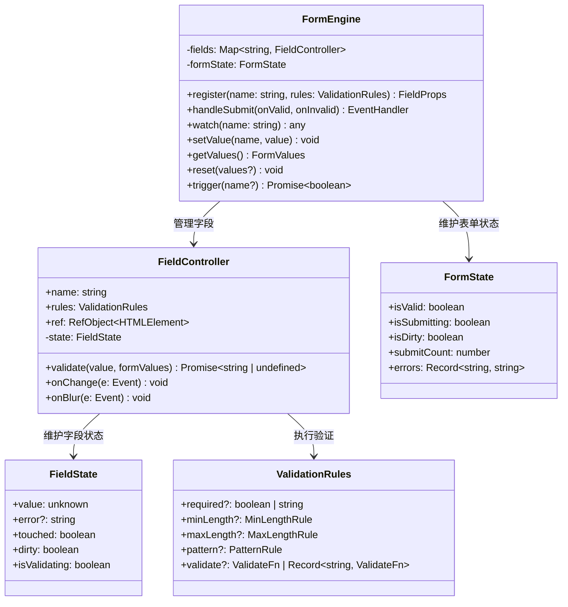

# OOD：表单验证引擎（Form Validation Engine）

> 设计字段级验证、异步验证、联动规则、表单状态机。
> 原型来自 React Hook Form 的核心设计，面试要求从零实现字段注册、验证管道、错误收集。

---

## 设计思路（面试开场白）

"表单引擎的核心是字段注册 + 验证管道 + 状态收集。
先说三个状态层次：字段状态（value/error/touched/dirty）、表单状态（isValid/isSubmitting/isDirty）、提交状态。
验证管道：每个字段有 rules 数组（required/minLength/pattern/自定义 validate），按顺序执行，遇到第一个失败就停止（fail-fast），异步规则用 await 串行。
关键设计决策：非受控组件（ref 直接读 DOM 值，不触发 React re-render）比受控组件（useState 每次输入都 re-render）性能好 10x——React Hook Form 之所以快就是这个原因。
联动验证（confirm password）：watch() 订阅其他字段变化，在自身 validate 里读 watched 值做比较。"

---

## 类图



---

## 白板版（面试15分钟）

```typescript
// 面试写这个版本，生产实现见下方完整版
import { useRef, useReducer, useEffect } from 'react';

type Validator = (value: unknown) => true | string;

function useForm() {
  const fieldsRef = useRef<Map<string, { rules: Validator[]; el: HTMLInputElement | null }>>(new Map());
  const errorsRef = useRef<Record<string, string>>({});
  const [, forceUpdate] = useReducer(x => x + 1, 0);
  // 省略：async validate / touched / dirty / mode / reset

  function register(name: string, ...rules: Validator[]) {
    fieldsRef.current.set(name, { rules, el: null });
    return {
      name,
      ref: (el: HTMLInputElement | null) => {
        const field = fieldsRef.current.get(name);
        if (field) field.el = el;
      },
    };
  }

  function validate(name: string): boolean {
    const field = fieldsRef.current.get(name);
    if (!field || !field.el) return true;
    const value = field.el.value;
    for (const rule of field.rules) {
      const result = rule(value);
      if (result !== true) { errorsRef.current[name] = result; forceUpdate(); return false; }
    }
    delete errorsRef.current[name]; forceUpdate(); return true;
  }

  function handleSubmit(onValid: (data: Record<string, string>) => void) {
    return (e: React.FormEvent) => {
      e.preventDefault();
      const allValid = [...fieldsRef.current.keys()].every(name => validate(name));
      if (!allValid) return;
      const data: Record<string, string> = {};
      fieldsRef.current.forEach((field, name) => { if (field.el) data[name] = field.el.value; });
      onValid(data);
    };
  }

  return { register, handleSubmit, errors: errorsRef.current };
}
```

---

## 需求分析

```
功能需求：
  1. 字段注册：register(name, rules) 绑定字段到表单
  2. 内置规则：required / minLength / maxLength / pattern / min / max
  3. 自定义规则：validate: (value) => true | ErrorMessage
  4. 异步验证：validate: async (value) => Promise<true | ErrorMessage>
  5. 联动验证：watch 其他字段的值（如"确认密码"依赖"密码"）
  6. 提交验证：handleSubmit 触发全量验证
  7. 触发时机：onChange / onBlur / onSubmit 三种模式

状态模型：
  每个字段有独立状态 FieldState：
    value    当前值
    error    错误信息（undefined = 无错误）
    touched  是否被 blur 过
    dirty    是否与初始值不同

  表单状态 FormState：
    isValid    所有字段无错误
    isSubmitting 提交中（异步验证期间）
    isDirty    任一字段 dirty
    submitCount 提交次数
```

---

## 核心接口

```typescript
// 验证规则
type ValidationRule =
  | { required: boolean | string }                         // string = 自定义错误信息
  | { minLength: number | { value: number; message: string } }
  | { maxLength: number | { value: number; message: string } }
  | { pattern: RegExp | { value: RegExp; message: string } }
  | { min: number | { value: number; message: string } }
  | { max: number | { value: number; message: string } }
  | { validate: Validator | Record<string, Validator> };   // 自定义函数 / 多个

type Validator = (value: unknown, formValues: Record<string, unknown>) => true | string | Promise<true | string>;

// 字段注册返回的 props（直接 spread 到 input 上）
interface FieldProps {
  name: string;
  onChange: (e: React.ChangeEvent<HTMLInputElement>) => void;
  onBlur: () => void;
  ref: React.RefCallback<HTMLInputElement>;
}

// 表单状态
interface FieldState {
  value: unknown;
  error?: string;
  touched: boolean;
  dirty: boolean;
  validating: boolean;
}

interface FormState {
  isValid: boolean;
  isSubmitting: boolean;
  isDirty: boolean;
  submitCount: number;
  errors: Record<string, string>;
}
```

---

## FormEngine 核心实现

```typescript
// src/form/FormEngine.ts

type Mode = 'onChange' | 'onBlur' | 'onSubmit';

interface FormOptions<T extends Record<string, unknown>> {
  defaultValues?: Partial<T>;
  mode?: Mode;   // 验证触发时机（默认 onBlur）
}

class FormEngine<T extends Record<string, unknown> = Record<string, unknown>> {
  private fields: Map<string, {
    rules: ValidationRule[];
    element: HTMLInputElement | null;
    defaultValue: unknown;
  }> = new Map();

  private fieldStates: Map<string, FieldState> = new Map();
  private listeners: Set<() => void> = new Set();   // 订阅状态变化的监听器

  private defaultValues: Partial<T>;
  private mode: Mode;
  private submitCount = 0;
  private isSubmitting = false;

  constructor({ defaultValues = {}, mode = 'onBlur' }: FormOptions<T> = {}) {
    this.defaultValues = defaultValues;
    this.mode = mode;
  }

  // ─── 字段注册 ───────────────────────────────────────────

  register(name: keyof T & string, ...rules: ValidationRule[]): FieldProps {
    const defaultValue = this.defaultValues[name] ?? '';

    if (!this.fields.has(name)) {
      this.fields.set(name, { rules, element: null, defaultValue });
      this.fieldStates.set(name, {
        value: defaultValue,
        error: undefined,
        touched: false,
        dirty: false,
        validating: false,
      });
    }

    return {
      name,
      ref: (el: HTMLInputElement | null) => {
        const field = this.fields.get(name);
        if (field) {
          field.element = el;
          if (el && defaultValue !== undefined) {
            el.value = String(defaultValue);
          }
        }
      },
      onChange: (e: React.ChangeEvent<HTMLInputElement>) => {
        const value = e.target.type === 'checkbox' ? e.target.checked : e.target.value;
        this.setFieldValue(name, value);
        if (this.mode === 'onChange') this.validateField(name);
      },
      onBlur: () => {
        this.setFieldTouched(name);
        if (this.mode === 'onBlur') this.validateField(name);
      },
    };
  }

  // ─── 值操作 ─────────────────────────────────────────────

  private setFieldValue(name: string, value: unknown) {
    const state = this.fieldStates.get(name);
    const field = this.fields.get(name);
    if (!state || !field) return;

    this.fieldStates.set(name, {
      ...state,
      value,
      dirty: value !== field.defaultValue,
    });
    this.notify();
  }

  private setFieldTouched(name: string) {
    const state = this.fieldStates.get(name);
    if (!state) return;
    this.fieldStates.set(name, { ...state, touched: true });
    this.notify();
  }

  getValues(): T {
    const result: Record<string, unknown> = {};
    for (const [name, state] of this.fieldStates) {
      result[name] = state.value;
    }
    return result as T;
  }

  // ─── 验证引擎 ────────────────────────────────────────────

  async validateField(name: string): Promise<string | undefined> {
    const field = this.fields.get(name);
    const state = this.fieldStates.get(name);
    if (!field || !state) return undefined;

    this.fieldStates.set(name, { ...state, validating: true });
    this.notify();

    const value = state.value;
    const allValues = this.getValues();
    let error: string | undefined;

    for (const rule of field.rules) {
      error = await this.runRule(rule, value, allValues);
      if (error) break;  // 遇到第一个错误即停止
    }

    const currentState = this.fieldStates.get(name)!;
    this.fieldStates.set(name, { ...currentState, error, validating: false });
    this.notify();
    return error;
  }

  // 单条规则执行
  private async runRule(
    rule: ValidationRule,
    value: unknown,
    allValues: Record<string, unknown>
  ): Promise<string | undefined> {
    const v = value as string | number | boolean | undefined;
    const str = String(v ?? '');

    if ('required' in rule) {
      const isEmpty = v === '' || v === null || v === undefined || v === false;
      if (isEmpty) {
        return typeof rule.required === 'string' ? rule.required : '此项为必填';
      }
    }

    if ('minLength' in rule) {
      const { value: min, message } = normalizeRule(rule.minLength);
      if (str.length < min) return message ?? `最少 ${min} 个字符`;
    }

    if ('maxLength' in rule) {
      const { value: max, message } = normalizeRule(rule.maxLength);
      if (str.length > max) return message ?? `最多 ${max} 个字符`;
    }

    if ('pattern' in rule) {
      const { value: pattern, message } = normalizeRule(rule.pattern);
      if (!(pattern as RegExp).test(str)) return message ?? '格式不正确';
    }

    if ('min' in rule) {
      const { value: min, message } = normalizeRule(rule.min);
      if (Number(v) < (min as number)) return message ?? `不能小于 ${min}`;
    }

    if ('max' in rule) {
      const { value: max, message } = normalizeRule(rule.max);
      if (Number(v) > (max as number)) return message ?? `不能大于 ${max}`;
    }

    if ('validate' in rule) {
      const validators = typeof rule.validate === 'function'
        ? { default: rule.validate }
        : rule.validate;

      for (const [, fn] of Object.entries(validators)) {
        const result = await fn(v, allValues);
        if (result !== true) return result;
      }
    }

    return undefined;
  }

  // 全量验证（提交时）
  async validateAll(): Promise<boolean> {
    const results = await Promise.all(
      Array.from(this.fields.keys()).map(name => this.validateField(name))
    );
    return results.every(e => !e);
  }

  // ─── 提交处理 ────────────────────────────────────────────

  handleSubmit(onValid: (data: T) => void | Promise<void>) {
    return async (e?: React.FormEvent) => {
      e?.preventDefault();
      this.submitCount++;
      this.isSubmitting = true;
      this.notify();

      // 提交时标记所有字段为 touched（显示所有错误）
      for (const [name, state] of this.fieldStates) {
        this.fieldStates.set(name, { ...state, touched: true });
      }

      const isValid = await this.validateAll();
      if (isValid) {
        await onValid(this.getValues());
      }

      this.isSubmitting = false;
      this.notify();
    };
  }

  // ─── 状态查询 ────────────────────────────────────────────

  getFormState(): FormState {
    const errors: Record<string, string> = {};
    let isDirty = false;

    for (const [name, state] of this.fieldStates) {
      if (state.error) errors[name] = state.error;
      if (state.dirty) isDirty = true;
    }

    return {
      isValid: Object.keys(errors).length === 0,
      isSubmitting: this.isSubmitting,
      isDirty,
      submitCount: this.submitCount,
      errors,
    };
  }

  getFieldState(name: string): FieldState | undefined {
    return this.fieldStates.get(name);
  }

  // ─── 订阅 / 观察者 ───────────────────────────────────────

  subscribe(listener: () => void) {
    this.listeners.add(listener);
    return () => this.listeners.delete(listener);
  }

  private notify() {
    for (const listener of this.listeners) listener();
  }

  // ─── 工具 ────────────────────────────────────────────────

  reset(values?: Partial<T>) {
    const newDefaults = values ?? this.defaultValues;
    for (const [name, field] of this.fields) {
      field.defaultValue = newDefaults[name] ?? '';
      this.fieldStates.set(name, {
        value: field.defaultValue,
        error: undefined,
        touched: false,
        dirty: false,
        validating: false,
      });
      if (field.element) field.element.value = String(field.defaultValue);
    }
    this.submitCount = 0;
    this.notify();
  }

  setError(name: string, message: string) {
    const state = this.fieldStates.get(name);
    if (state) {
      this.fieldStates.set(name, { ...state, error: message, touched: true });
      this.notify();
    }
  }
}

// 辅助：统一 { value, message } 和原始值两种写法
function normalizeRule(rule: unknown): { value: unknown; message?: string } {
  if (rule && typeof rule === 'object' && 'value' in rule) {
    return rule as { value: unknown; message?: string };
  }
  return { value: rule };
}
```

---

## React Hook 封装

```typescript
// src/form/useForm.ts

export function useForm<T extends Record<string, unknown>>(options: FormOptions<T> = {}) {
  const formRef = useRef(new FormEngine<T>(options));
  const [, forceUpdate] = useReducer(x => x + 1, 0);

  useEffect(() => {
    const unsubscribe = formRef.current.subscribe(forceUpdate);
    return unsubscribe;
  }, []);

  return {
    register: formRef.current.register.bind(formRef.current),
    handleSubmit: formRef.current.handleSubmit.bind(formRef.current),
    reset: formRef.current.reset.bind(formRef.current),
    setError: formRef.current.setError.bind(formRef.current),
    getValues: formRef.current.getValues.bind(formRef.current),
    formState: formRef.current.getFormState(),
    getFieldState: formRef.current.getFieldState.bind(formRef.current),
  };
}

// 字段错误提示组件
function FieldError({ name, form }: { name: string; form: ReturnType<typeof useForm> }) {
  const state = form.getFieldState(name);
  if (!state?.touched || !state.error) return null;
  return <span style={{ color: 'red', fontSize: 12 }}>{state.error}</span>;
}
```

---

## 使用示例

```typescript
// 注册表单
interface RegisterForm {
  username: string;
  email: string;
  password: string;
  confirmPassword: string;
}

function RegisterPage() {
  const form = useForm<RegisterForm>({
    defaultValues: { username: '', email: '', password: '', confirmPassword: '' },
    mode: 'onBlur',
  });

  const onSubmit = async (data: RegisterForm) => {
    await api.register(data);
    router.push('/dashboard');
  };

  return (
    <form onSubmit={form.handleSubmit(onSubmit)}>
      <div>
        <input
          {...form.register('username',
            { required: '用户名必填' },
            { minLength: { value: 3, message: '用户名至少 3 位' } },
            { maxLength: { value: 20, message: '用户名最多 20 位' } },
            { pattern: { value: /^[a-zA-Z0-9_]+$/, message: '只允许字母、数字、下划线' } }
          )}
          placeholder="用户名"
        />
        <FieldError name="username" form={form} />
      </div>

      <div>
        <input
          {...form.register('email',
            { required: '邮箱必填' },
            { pattern: { value: /^[^\s@]+@[^\s@]+\.[^\s@]+$/, message: '邮箱格式不正确' } },
            // 异步验证：检查邮箱是否已注册
            { validate: async (value) => {
                const exists = await api.checkEmail(String(value));
                return exists ? '邮箱已被注册' : true;
              }
            }
          )}
          placeholder="邮箱"
        />
        <FieldError name="email" form={form} />
      </div>

      <div>
        <input
          {...form.register('password',
            { required: '密码必填' },
            { minLength: { value: 8, message: '密码至少 8 位' } },
            { validate: (value) => {
                const s = String(value);
                if (!/[A-Z]/.test(s)) return '必须包含大写字母';
                if (!/[0-9]/.test(s)) return '必须包含数字';
                return true;
              }
            }
          )}
          type="password"
          placeholder="密码"
        />
        <FieldError name="password" form={form} />
      </div>

      <div>
        <input
          {...form.register('confirmPassword',
            { required: '请确认密码' },
            // 联动验证：访问其他字段的值
            { validate: (value, allValues) => {
                return value === allValues.password ? true : '两次密码不一致';
              }
            }
          )}
          type="password"
          placeholder="确认密码"
        />
        <FieldError name="confirmPassword" form={form} />
      </div>

      <button
        type="submit"
        disabled={form.formState.isSubmitting}
      >
        {form.formState.isSubmitting ? '注册中...' : '注册'}
      </button>
    </form>
  );
}
```

---

## 常见踩坑

**踩坑1：用 `useState` 管理每个字段值导致每次按键整表重渲染**
❌ 错误：`const [value, setValue] = useState('')`，每次输入触发 setState，整个表单组件树重渲染，100 个字段的大表单严重卡顿。
✓ 正确：非受控组件（ref 直接读 DOM 值）+ 订阅机制（只在 error/formState 变化时才触发必要的重渲染）。
原因：React Hook Form 性能领先的核心就是"不把字段 value 放 state"，按键时不触发 React 渲染。

**踩坑2：验证规则按 fail-fast 原则实现时出错**
❌ 错误：`await Promise.all(rules.map(r => r(value)))` 并发执行所有规则，多个错误同时显示，且跑了不必要的异步请求（required 都没过还去发 API 验证唯一性）。
✓ 正确：串行执行（`for...of` + `await`），遇到第一个错误就 break，之后的规则不执行。
原因：规则有优先级，required 最先校验，昂贵的异步规则放最后，fail-fast 减少不必要请求。

**踩坑3：联动验证（confirm password）只单向触发**
❌ 错误：修改 password 时只验证 password 字段，confirmPassword 未重新验证，虽然已不匹配但不显示错误，直到 confirmPassword 再次 blur。
✓ 正确：字段声明 `deps: ['password']`，password 变化时自动触发 confirmPassword 的验证；或 handleSubmit 时全量验证所有字段。
原因：表单字段间有依赖关系，单字段验证必须考虑触发关联字段重验证。

**踩坑4：异步验证（检查邮箱唯一性）没有防抖和竞态处理**
❌ 错误：每次 onChange 都立即发 API 请求验证邮箱，每个按键触发一次请求，且早发出的请求可能覆盖晚发出的结果。
✓ 正确：对异步 validate 函数加 300ms debounce；用 AbortController 取消上一次未完成的验证请求，只接受最新结果。
原因：异步验证和搜索框一样有竞态问题，必须防抖 + 取消旧请求。

**踩坑5：handleSubmit 未在提交前标记所有字段为 touched**
❌ 错误：mode=onBlur 时，从未 blur 的字段（用户跳过直接点提交）不显示错误，即使验证失败用户也不知道哪里有问题。
✓ 正确：handleSubmit 开始时遍历所有字段设置 `touched = true`，然后全量验证，所有错误一并展示。
原因：提交时必须暴露所有字段的验证错误，而不只是已交互字段的错误。

---

## 扩展性追问

**Q: 如何支持数组字段（useFieldArray，动态增减行）？**
思路：字段名支持 `items[0].name`、`items[1].name` 格式；`useFieldArray(name)` 返回 `{ fields, append, remove, move }`——内部维护 `fieldIds[]` 数组，append 时 push 新 id，remove 时 filter；渲染时 `fields.map(field => register(\`items.${field.id}.name\`, ...))`；getValues 时递归解析点号路径聚合成嵌套对象。

**Q: 如何支持条件字段（watch 某字段值，动态 show/hide 其他字段）？**
思路：`watch(name)` 订阅指定字段变化——在 FormEngine 中为 watch 字段添加 onChange 回调，变化时通知订阅者重渲染；组件中 `const type = watch('type')` 得到实时值，用条件渲染控制 `{type === 'company' && <input {...register('companyName')} />}`；字段隐藏时 `unregister('companyName')` 清理其值和错误（避免隐藏字段的验证错误阻止提交）。

**Q: 如何实现多步表单向导（Form Wizard）？**
思路：每个步骤是独立的字段集合，FormEngine 实例跨步骤共享；`nextStep` 时只验证当前步骤的字段集（`trigger(['step1Field1', 'step1Field2'])`），全部通过才允许进入下一步；最后一步 handleSubmit 时用 `getValues()` 收集所有步骤的数据提交；步骤切换时不销毁已填字段的数据（不 unregister），允许用户返回修改。

---

## 面试追问

**Q: 为什么不用 `useState` 管理每个字段状态，而用 `FormEngine` 类 + 订阅？**
A: 表单性能的核心问题：每次按键如果用 `useState`，会触发整个表单树的重渲染。`FormEngine` 将状态存在类实例中（不触发 React 重渲染），只在状态变化时通知订阅者。React Hook Form 的设计哲学相同：非受控组件 + 订阅机制，使表单无论多大字段数，按键性能都是 O(1)。只有 `formState`（提交状态、全局错误）才用 React state 驱动重渲染。

**Q: 联动验证（confirm password 依赖 password）如何处理？**
A: 验证函数的第二个参数 `allValues` 包含当前所有字段值（验证时从 `getValues()` 获取）。另一个需要注意的点：当 `password` 字段改变时，`confirmPassword` 也需要重新验证——这需要依赖追踪：在 `password` 变化时自动触发 `confirmPassword` 的验证。实现方式：字段级别声明 `deps: ['password']`，变化时触发依赖字段的重新验证。

**Q: 异步验证（检查邮箱是否已注册）如何防抖？**
A: 每次 `onChange` 都触发异步验证会造成大量 API 请求。防抖方案：在 `validateField` 中对异步 `validate` 规则做 debounce（例如 300ms），或在 `onChange` 的 validate 触发时加 debounce。另外需要处理竞态：慢的验证响应可能覆盖快的，用 AbortController 取消上一次未完成的异步验证。
