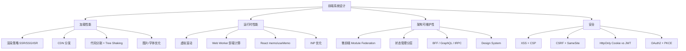

# 前端系统设计专题概览

> 面向 TypeScript / 全栈工程师的系统设计补充模块。
> 后端系统设计已有完整体系（见 01-09 章），本专题聚焦**前端特有的规模化挑战**。

---

## 面试框架（45分钟怎么答）

**第一步（5 min）需求澄清**：目标用户数/DAU？首屏性能目标？SEO 需求？团队规模和部署频率？
**第二步（10 min）架构概览**：渲染策略选型（CSR/SSR/SSG/ISR）→ 数据获取方式 → 状态管理边界划分
**第三步（20 min）核心难点深挖**：缓存策略 / 代码分割 / 跨团队隔离 / 监控与告警
**第四步（10 min）差异化得分**：主动量化——CDN 命中率对 TTFB 的影响；Core Web Vitals 各指标目标值；Module Federation 如何防止 React 双实例

---

## 前端系统设计思维导图



---

## 为什么需要专门的前端系统设计

后端系统设计关心：QPS、存储、一致性、容错。

前端系统设计额外关心：
- **首屏速度**：用户等待超过 3s 跳出率翻倍
- **交互响应**：INP < 200ms 才算"良好"
- **客户端状态**：几十个组件共享数据，如何不乱
- **缓存边界**：CDN / Service Worker / 内存缓存，各管一段
- **跨团队协作**：微前端解决的是组织问题，不只是技术问题

---

## 本专题文件索引

| 文件 | 主题 | 核心内容 |
|------|------|---------|
| [01 SSR/SSG/ISR 架构](01_ssr_ssg_isr.md) | 渲染策略 | 四种渲染模式对比；ISR 失效策略；CDN + Edge 协作；缓存雪崩防御 |
| [02 微前端架构](02_micro_frontend.md) | 应用拆分 | Module Federation；路由治理；共享状态；样式隔离；独立部署流水线 |
| [03 BFF 架构](03_bff.md) | Backend for Frontend | GraphQL BFF + DataLoader（N+1）；tRPC 类型安全 API；REST vs GraphQL 选型 |
| [04 前端性能监控](04_frontend_monitoring.md) | RUM | Core Web Vitals 采集 SDK；Beacon API；ClickHouse 时序存储；环比异常告警 |
| [05 框架横向对比](05_framework_comparison.md) | 生态选型 | Next.js / Remix / TanStack Start / Astro / Nuxt / SvelteKit 对比；选型决策树 |
| [06 状态管理](06_state_management.md) | 状态架构 | 服务端状态（TanStack Query / SWR）vs 客户端状态（Zustand / Jotai / Redux Toolkit）|
| [07 性能优化](07_performance_optimization.md) | 加载 + 运行时 | 代码分割；bundle 优化；虚拟滚动（TanStack Virtual）；Web Worker；关键渲染路径 |
| [08 前端安全](08_security.md) | 安全 | XSS / CSRF / CSP；NextAuth.js / Clerk 认证方案；HttpOnly Cookie vs JWT 存储 |
| [09 Design System](09_design_system.md) | 设计系统 | Design Token 3 层模型；CSS Variables 主题切换；Style Dictionary；Radix UI；shadcn/ui；Storybook；Changesets 发布 |
| [10 PWA & 离线](10_pwa_offline.md) | 离线能力 | Service Worker 生命周期；5 种缓存策略；Workbox；Dexie.js IndexedDB；Background Sync；Push Notifications |
| [11 Feature Flag & A/B](11_feature_flag_ab.md) | 功能开关 | 确定性 Hash 分桶；Client/Server/Edge 分流；FOUC 防护；GrowthBook vs LaunchDarkly；A/B 统计显著性 |
| [12 CI/CD & 测试](12_cicd_testing.md) | 工程质量 | Vitest；Testing Library；MSW v2；Playwright POM；Chromatic 视觉回归；Lighthouse CI；Preview Deploy |
| [13 国际化（i18n）](13_i18n.md) | 多语言 | next-intl ICU 格式；RTL CSS 逻辑属性；Intl API；Lokalise 翻译工作流；时区处理 |
| [14 实时通信](14_realtime_frontend.md) | 实时 | WebSocket 重连（指数退避）；客户端消息队列；乐观 UI；Presence 在线状态；SSE |
| [15 文件上传](15_file_upload.md) | 大文件 | 分块上传（断点续传）；Pre-signed URL 直传 S3；tus 协议；客户端图片压缩；上传安全 |
| [16 浏览器存储](16_browser_storage.md) | 存储选型 | Cookie/LocalStorage/SessionStorage/IndexedDB/Cache API/OPFS 对比；选型决策树；配额管理 |
| [17 SEO 架构](17_seo_architecture.md) | SEO | Meta 标签；Open Graph；JSON-LD 结构化数据；动态 OG 图片；Sitemap；Canonical URL |
| [18 项目架构](18_project_architecture.md) | 可维护性 | Feature-Sliced Design；Turborepo/Nx Monorepo；Barrel Exports 反模式；依赖方向约束 |
| [19 图片与媒体优化](19_image_optimization.md) | 资源优化 | WebP/AVIF 格式选型；响应式 srcset；Next/Image；CDN 图片变换；懒加载；blur placeholder；视频优化 |
| [20 错误监控与边界](20_error_monitoring.md) | 稳定性 | React Error Boundary；全局错误捕获；Sentry 集成；Source Map；错误告警分级；TanStack Query 错误处理 |
| [21 动画性能](21_animation_performance.md) | 渲染性能 | 浏览器渲染流水线；transform vs top/left；will-change；rAF；WAAPI；Framer Motion；FLIP；Layout Thrashing |
| [22 可访问性（a11y）](22_accessibility.md) | 无障碍 | WCAG 2.1 POUR；语义化 HTML；ARIA；键盘导航；焦点管理；颜色对比度；表单可访问性；axe 自动检测 |
| [23 Feed 流设计](23_feed_design.md) | 信息流 | 虚拟列表；无限滚动（IntersectionObserver）；SSE 实时新帖；乐观更新（点赞回滚）；cursor 分页 |
| [24 协作编辑器](24_collaborative_editor_frontend.md) | 多人协作 | CRDT 客户端（Yjs）；光标同步（Awareness）；WebSocket 离线队列；Yjs + ProseMirror 集成 |
| [25 视频播放器](25_video_player.md) | 流媒体 | HLS/DASH 自适应码率（ABR）；hls.js 接入；缓冲策略；Quality Selector；续播位置；PiP |
| [26 Next.js App Router](26_nextjs_app_router.md) | App Router | RSC vs Client Component 边界；Server Actions；四层缓存（Request/Data/Full Route/Router）；Streaming；PPR |

---

## 常见踩坑

**踩坑1：把所有页面都做成 SSR**
❌ 错误：不考虑页面特性，统一用 SSR 渲染，服务器压力大，TTFB 反而变慢。
✓ 正确：按页面特性选型——营销页 SSG、商品详情 ISR、用户数据 SSR、后台管理 CSR。
原因：不同渲染策略适合不同场景，混合使用才能最优。

**踩坑2：前端系统设计只考虑功能，不考虑可观测性**
❌ 错误：设计方案里只有组件树和数据流，没有监控、告警和错误追踪。
✓ 正确：方案中必须包含错误监控（Sentry）、性能采集（Web Vitals）和日志上报链路。
原因：生产环境问题靠猜是不够的，可观测性是系统质量的基础。

**踩坑3：忽视 Core Web Vitals 指标量化**
❌ 错误：性能优化只说"加 CDN 和缓存"，无法量化优化效果。
✓ 正确：以 LCP < 2.5s、INP < 200ms、CLS < 0.1 为量化目标，每个优化措施对应具体指标提升。
原因：Google 将 CWV 纳入搜索排名，且指标是与用户体验直接挂钩的度量。

**踩坑4：状态管理选型只看流行度**
❌ 错误：所有项目都上 Redux，或所有项目都用 Context，不考虑数据的性质（服务端 vs 客户端状态）。
✓ 正确：服务端状态用 TanStack Query，客户端 UI 状态用 Zustand，只在必要时用 Redux。
原因：服务端状态和客户端状态的关切点完全不同，专用工具解决专用问题。

**踩坑5：前端安全只考虑 XSS，忘记 CSRF 和供应链风险**
❌ 错误：只做 HTML 转义防 XSS，忽略 Cookie 的 SameSite 设置和 npm 依赖的安全审计。
✓ 正确：XSS + CSRF + CSP + 依赖审计（npm audit）+ HttpOnly Cookie 要全面考虑。
原因：前端安全是多层防御，任一层缺失都可能被攻击者利用。

---

## 面试中如何呈现前端系统设计

前端系统设计面试与后端一样，**也用 45 分钟框架**（见 [09_interview_guide](../../backend/ood/guide/09_interview_guide.md)），但侧重点不同：

```
需求澄清（5 min）
  ↓ 目标用户数？DAU？首屏目标？SEO 需求？团队规模？
架构概览（10 min）
  ↓ 渲染策略选型 → 数据获取方式 → 状态管理边界
核心难点深挖（20 min）
  ↓ 缓存策略 / 代码分割 / 跨团队隔离 / 监控
追问应对（10 min）
  ↓ "如果 DAU 涨 10 倍？" / "如何保证一致性？"
```

**差异化得分点**：能主动提出 Core Web Vitals 指标、能量化说出 CDN 命中率对 TTFB 的影响、能解释 Module Federation 的 shared 配置如何防止 React 双实例。
