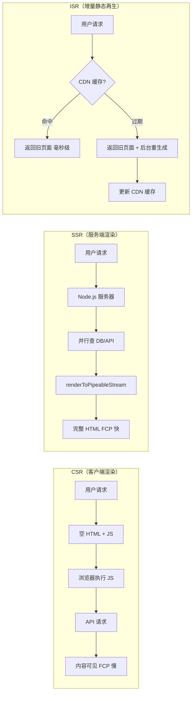
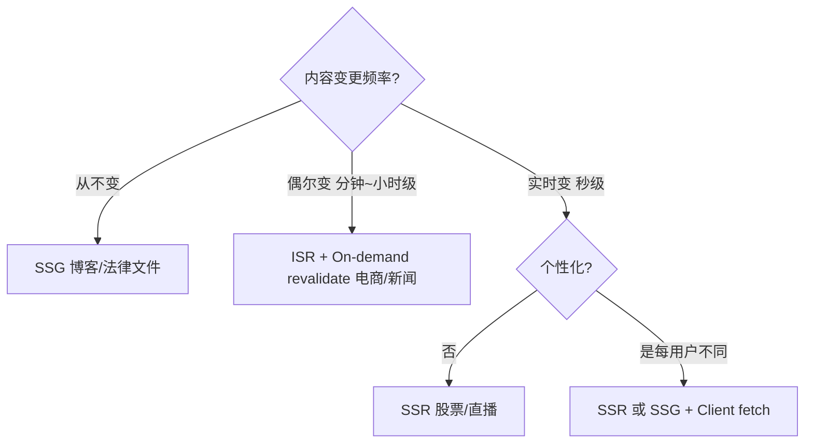

# SSR / SSG / ISR 架构深度解析

---

## 面试框架（45分钟怎么答）

**第一步（开场）**：澄清场景——内容更新频率？SEO 重要性？个性化程度？服务端预算？
**第二步（核心）**：用决策树对比四种渲染模式，说清楚 ISR 的 Stale-While-Revalidate 机制
**第三步（深挖）**：重点讲 CDN 分层缓存、缓存雪崩防御（随机抖动）、On-demand ISR 一致性
**差异化得分点**：提出 Partial Prerendering（静态壳 + 动态流式填充）；能量化 CDN 命中率 > 95% 对 TTFB 的影响

---

## 架构图：渲染模式数据流对比



---

## 决策树：选哪种渲染模式？



---

## 四种渲染模式对比

| 模式 | 全称 | HTML 生成时机 | 典型场景 |
|------|------|-------------|---------|
| **CSR** | Client-Side Rendering | 浏览器运行时 | 后台管理、重交互 SPA |
| **SSR** | Server-Side Rendering | 每次请求时 | 个性化内容、实时数据 |
| **SSG** | Static Site Generation | 构建时 | 博客、文档、营销页 |
| **ISR** | Incremental Static Regeneration | 构建时 + 按需重生成 | 电商商品页、新闻、活动页 |

---

## CSR 的问题

```
用户请求
  → 返回空 HTML + JS bundle
  → 浏览器下载并执行 JS（可能 2-5s）
  → React 渲染
  → 数据请求（又一次网络往返）
  → 最终内容可见
```

**问题**：
1. FCP（First Contentful Paint）极差 → SEO 惩罚
2. JS bundle 越来越大 → 低端设备更慢
3. 数据瀑布（Waterfall）：渲染完才知道要请求什么

---

## SSR 架构

### 数据流

```
用户请求
  → Node.js 服务器
  → 并行获取数据（DB / API）
  → React renderToString() / renderToPipeableStream()
  → 返回完整 HTML（带内联数据）
  → 浏览器展示内容（FCP 极快）
  → Hydration（绑定事件）
  → 可交互
```

### TypeScript 实现关键点（Next.js App Router）

```typescript
// 服务端组件 — 直接 async/await，零客户端 JS
export default async function ProductPage({ params }: { params: { id: string } }) {
  // 这里的 fetch 在服务端执行，支持并行
  const [product, reviews] = await Promise.all([
    fetchProduct(params.id),
    fetchReviews(params.id),
  ]);

  return <ProductView product={product} reviews={reviews} />;
}
```

### SSR 的代价

| 问题 | 原因 | 解决方案 |
|------|------|---------|
| 服务器 CPU 高 | 每请求都 renderToString | 流式 SSR（renderToPipeableStream）|
| TTFB 高 | 等数据库返回才开始输出 | Suspense 边界 + Streaming |
| 无法缓存 CDN | 每次内容不同 | 拆分静态壳 + 动态部分 |

### 流式 SSR（Streaming）

```typescript
// Suspense 边界让页面"分段"流式输出
export default function Page() {
  return (
    <div>
      <Header />          {/* 立即发送 */}
      <Suspense fallback={<ProductSkeleton />}>
        <ProductDetail /> {/* 数据就绪后发送 */}
      </Suspense>
      <Suspense fallback={<ReviewsSkeleton />}>
        <Reviews />       {/* 独立加载，不阻塞上面 */}
      </Suspense>
    </div>
  );
}
```

**效果**：TTFB 从等所有数据变成等 Header 数据，FCP 大幅提升。

---

## SSG 架构

### 构建时生成

```
npm run build
  → 框架遍历所有页面路径
  → 调用 generateStaticParams() 获取所有 ID
  → 并行渲染每个页面为静态 HTML
  → 产物：/dist/product/[id].html
```

```typescript
// Next.js 14 App Router
export async function generateStaticParams() {
  const products = await fetchAllProducts();
  return products.map(p => ({ id: p.id }));
}

export default async function ProductPage({ params }) {
  const product = await fetchProduct(params.id); // 构建时执行
  return <ProductView product={product} />;
}
```

### CDN 分发

```
Build 产物 → 上传 S3 / Vercel → CDN 全球分发

用户请求 → 命中最近 CDN PoP → 直接返回 HTML
  → TTFB < 50ms（无服务器计算）
  → CDN 命中率目标 > 95%
```

**问题**：商品价格变了怎么办？→ 需要重新 build（小站可以，10 万商品页不行）。

---

## ISR 架构（Incremental Static Regeneration）

### 核心思路

> "先用旧缓存响应，后台悄悄重新生成"
> — Stale-While-Revalidate 策略

```typescript
// Next.js：revalidate 单位是秒
export const revalidate = 60; // 页面最多 60s 过期

// 或者按需触发（On-demand ISR）
// app/api/revalidate/route.ts
export async function POST(req: Request) {
  const { path, secret } = await req.json();
  if (secret !== process.env.REVALIDATE_SECRET) {
    return Response.json({ error: 'Unauthorized' }, { status: 401 });
  }
  revalidatePath(path);
  return Response.json({ revalidated: true });
}
```

### ISR 请求流程

```
第 1 次请求（页面不存在）
  → 服务器实时 SSR → 缓存结果 → 返回

第 2-N 次请求（缓存有效期内）
  → CDN 直接命中缓存 → 返回旧页面（毫秒级）

第 N+1 次请求（缓存过期）
  → CDN 返回旧页面（用户不等待）
  → 后台触发重新生成
  → 生成完成后更新缓存

On-demand ISR（CMS 内容更新时触发）
  → CMS Webhook → POST /api/revalidate → 立即失效指定路径
```

### ISR vs SSR vs SSG 决策树

```
内容变更频率？
  ├── 从不变 → SSG（博客、法律文件）
  ├── 偶尔变（分钟/小时级）→ ISR + On-demand revalidate（电商、新闻）
  ├── 实时变（秒级）→ SSR（股票、直播数据）
  └── 个性化（每用户不同）→ SSR 或 SSG + Client fetch
```

---

## CDN 与 Edge 协作架构

### 分层缓存策略

```
用户浏览器
  ↕ Cache-Control: max-age=0, s-maxage=86400, stale-while-revalidate=3600
CDN 边缘节点（PoP，全球 200+ 个）
  ↕ 仅缓存未命中时回源
源站（Next.js / Node.js）
  ↕
数据库 / 上游 API
```

**HTTP 缓存头配置**：

```typescript
// Next.js Route Handler
export async function GET() {
  const data = await fetchData();
  return Response.json(data, {
    headers: {
      // CDN 缓存 1 小时，同时允许 stale 内容在重新验证期间使用
      'Cache-Control': 'public, s-maxage=3600, stale-while-revalidate=86400',
      // 用于 CDN 按内容失效（Surrogate Keys）
      'Cache-Tag': 'product,product-123',
    },
  });
}
```

### Edge Runtime（边缘计算）

将逻辑推到离用户最近的节点执行：

```typescript
// Next.js Edge Middleware（在 CDN 节点运行，非 Node.js）
export const config = { runtime: 'edge' };

export function middleware(req: NextRequest) {
  // A/B 测试 — 在边缘分流，不回源
  const bucket = req.cookies.get('ab-bucket')?.value ?? assignBucket();
  const url = req.nextUrl.clone();
  url.pathname = bucket === 'B' ? '/new-landing' : '/landing';
  return NextResponse.rewrite(url);
}
```

**Edge 适合的场景**：
- A/B 测试分流
- 地理重定向
- Auth Token 验证（JWT 校验，无 DB 查询）
- 简单个性化（基于 cookie/geo）

**Edge 不适合**：
- 复杂 DB 查询（延迟高、连接池限制）
- 大计算量任务
- 依赖 Node.js 原生模块

---

## 大规模 ISR 的工程挑战

### 问题 1：缓存雪崩（Cache Stampede）

场景：10 万商品页同时过期，后台并发触发 10 万次重生成 → 源站崩溃。

**解法：过期时间加随机抖动**

```typescript
// 不要固定过期时间
export const revalidate = 3600; // 所有页面同时过期 ❌

// 用 generateMetadata 动态设置不同过期时间
export async function generateMetadata({ params }) {
  // 基础时间 + 基于 ID 的随机偏移（确定性，同一 ID 每次相同）
  const jitter = parseInt(params.id, 36) % 600; // 0-600s 偏移
  return { other: { revalidate: String(3600 + jitter) } };
}
```

### 问题 2：On-demand ISR 的一致性

场景：CMS 更新商品，触发 revalidate，但 CDN 有 5 个 PoP，哪个先刷新？

**解法：Surrogate Key（Cache Tag）批量失效**

```
// Cloudflare Cache Tags
POST https://api.cloudflare.com/client/v4/zones/{zone}/purge_cache
{
  "tags": ["product-123"]  // 同时失效所有 PoP 上带此 tag 的缓存
}
```

### 问题 3：Build 时间爆炸

场景：100 万商品页，SSG 构建需要 2 小时。

**解法：Partial Prerendering（PPR）**

```typescript
// 只预渲染高流量的 Top N 页面
export async function generateStaticParams() {
  // 只生成 Top 1000 热门商品
  const hotProducts = await fetchTopProducts({ limit: 1000 });
  return hotProducts.map(p => ({ id: p.id }));
}
// 其余商品首次访问时按需 SSR，结果缓存为静态
```

---

## 常见踩坑

**踩坑1：SSR 页面未缓存导致服务器过载**
❌ 错误：每个请求都实时 SSR，高并发时服务端 CPU 被渲染占满，TTFB 飙升到 2s+。
✓ 正确：SSR 结果加 CDN 缓存（s-maxage + stale-while-revalidate），或使用 ISR 降低实时渲染压力。
原因：SSR 的服务端渲染是 CPU 密集型操作，必须配合缓存策略才能扛住流量。

**踩坑2：Hydration Mismatch 因为 Date.now() 或 Math.random()**
❌ 错误：组件中直接用 `Date.now()` 生成 key 或内容，服务端和客户端执行时间不同导致 HTML 不匹配，React 报 Hydration Error。
✓ 正确：时间/随机相关逻辑放在 `useEffect` 中（仅客户端执行），或用 `suppressHydrationWarning` 标记允许差异的节点。
原因：SSR 要求服务端和客户端首次渲染结果完全一致，任何非确定性代码都会导致 mismatch。

**踩坑3：SSG 的 revalidate 时间设置不当**
❌ 错误：电商商品页 revalidate 设置为 3600s（1小时），秒杀活动时价格改变了 1 小时后才更新，用户看到旧价格。
✓ 正确：高频变化的数据（库存/价格）走客户端 fetch，页面框架走 ISR，两层分离。
原因：ISR 不是实时的，不能用于对时效性要求高的数据。

**踩坑4：ISR 的"雷群效应"**
❌ 错误：大量页面同时过期，瞬间收到大量 revalidation 请求，数据库/API 被打垮。
✓ 正确：为不同页面的 revalidate 时间加随机抖动（`revalidate: 3600 + Math.random() * 600`），分散重建时机。
原因：所有 ISR 页面用相同 revalidate 时间，同时过期时产生流量峰值。

---

## 面试常见追问

**Q: SSR 和 SSG 的 SEO 差别？**
A: 两者 Google 都能索引。SSG TTFB 更低，Googlebot 爬取效率更高，间接利于 SEO。SSR 适合内容频繁变化且需要实时索引（新闻）。

**Q: Hydration Mismatch 是什么？怎么避免？**
A: 服务端渲染的 HTML 和客户端 React 第一次渲染结果不一致，React 会报警告并重新渲染，导致闪烁。原因通常是：依赖 `window`/`Date.now()`/随机数 的代码在服务端和客户端执行结果不同。解法：用 `suppressHydrationWarning`、延迟到 `useEffect` 执行、或使用 `dynamic(() => import(...), { ssr: false })`。

**Q: ISR 如何保证金融/库存类数据的实时性？**
A: ISR 不适合实时性要求高的数据。正确做法：页面框架用 ISR/SSG（静态），价格/库存用 Client-side fetch（实时）+ SWR/React Query（轮询或 WebSocket）。两层分开处理。

**Q: Edge Runtime 和 Serverless Function 的区别？**
A: Edge Runtime 运行在 CDN PoP，冷启动 ~0ms，但 API 受限（无 Node.js API、内存小）；Serverless Function 运行在单一区域，冷启动 100ms-1s，但功能完整。
