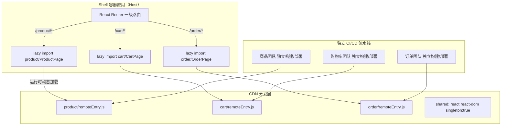
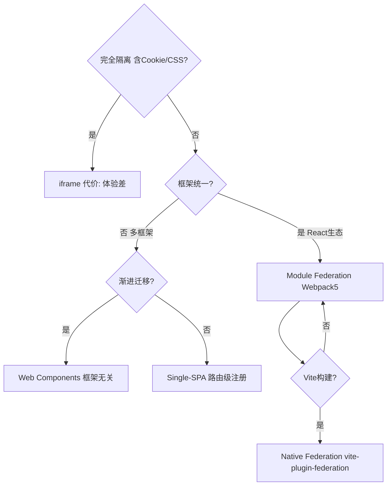

# 微前端架构

> 微前端解决的本质是**组织问题**：多个团队如何独立开发、独立部署同一个 Web 应用，而不互相阻塞。

---

## 面试框架（45分钟怎么答）

**第一步（开场）**：主动说"这是组织问题，不只是技术问题"——澄清团队规模、部署频率、技术栈迁移需求
**第二步（核心）**：重点讲 Module Federation——Host/Remote/Shared 三要素；singleton:true 防双 React 实例
**第三步（深挖）**：路由治理（Shell 一级路由 + 子应用 MemoryRouter）；样式隔离（CSS Modules + 前缀）；故障隔离（ErrorBoundary 独立包裹）
**差异化得分点**：主动提 "什么时候不该用微前端"（团队 < 10人、业务耦合紧密），体现工程判断力

---

## 架构图：Module Federation 运行时



---

## 决策树：微前端方案选型



---

## 为什么需要微前端

### 巨石前端（Monolith Frontend）的痛点

```
巨石前端
├── 团队 A（商品）
├── 团队 B（购物车）
├── 团队 C（订单）
└── 团队 D（用户中心）

问题：
- 任何团队 merge 都可能影响全局
- 发布需要所有团队协调
- 技术栈升级要全体同意（React 17 → 18 要等半年）
- CI 构建时间随代码量线性增长
```

### 微前端目标

```
容器应用（Shell）
├── 子应用 A（商品团队，独立部署）
├── 子应用 B（购物车团队，独立部署）
├── 子应用 C（订单团队，独立部署）
└── 子应用 D（用户中心，独立部署）

好处：
- 独立发布，互不阻塞
- 渐进式技术栈迁移（新团队可用 React 18，老团队暂留 React 17）
- 故障隔离（子应用崩溃不影响整体）
```

---

## 主流实现方案对比

| 方案 | 原理 | 优点 | 缺点 |
|------|------|------|------|
| **Module Federation** | Webpack 5 运行时共享模块 | 无 iframe、体验好、共享依赖 | 配置复杂、版本耦合 |
| **iframe** | 最古老的隔离方式 | 完全隔离（CSS/JS/Cookie）| 通信麻烦、SEO 差、性能差 |
| **Web Components** | 浏览器原生自定义元素 | 框架无关 | 浏览器兼容、Shadow DOM 限制 |
| **NPM 包** | 子应用打包为 npm 包 | 简单、类型安全 | 无法独立部署（需重新发布 Shell）|
| **Single-SPA** | 路由级子应用注册 | 框架无关 | 配置繁琐、无原生共享 |

**面试推荐方案**：Module Federation（Webpack 5）或 Native Federation（Vite 生态）。

---

## Module Federation 深度解析

### 核心概念

```
Host（容器应用）
  → 消费远程模块

Remote（子应用）
  → 暴露自己的模块供 Host 使用

Shared（共享依赖）
  → react、react-dom 只加载一个版本，不重复下载
```

### 配置示例

**子应用（商品团队）Webpack 配置**：

```typescript
// apps/product/webpack.config.ts
import { ModuleFederationPlugin } from 'webpack';

export default {
  plugins: [
    new ModuleFederationPlugin({
      name: 'product',  // 子应用名称，全局唯一
      filename: 'remoteEntry.js',  // 入口文件，供 Host 加载
      exposes: {
        // 暴露给外部的模块
        './ProductPage': './src/pages/ProductPage',
        './ProductCard': './src/components/ProductCard',
      },
      shared: {
        react: { singleton: true, requiredVersion: '^18.0.0' },
        'react-dom': { singleton: true, requiredVersion: '^18.0.0' },
        // singleton: true — 强制只用一个实例，避免 React Context 失效
      },
    }),
  ],
};
```

**容器应用（Shell）配置**：

```typescript
// apps/shell/webpack.config.ts
new ModuleFederationPlugin({
  name: 'shell',
  remotes: {
    // key: 本地引用名，value: 远程地址
    product: 'product@https://cdn.example.com/product/remoteEntry.js',
    cart: 'cart@https://cdn.example.com/cart/remoteEntry.js',
  },
  shared: {
    react: { singleton: true },
    'react-dom': { singleton: true },
  },
})
```

**在 Shell 中懒加载子应用**：

```typescript
// apps/shell/src/App.tsx
import React, { Suspense, lazy } from 'react';

// 动态导入 — 只有路由匹配时才加载子应用 JS
const ProductPage = lazy(() => import('product/ProductPage'));
const CartPage = lazy(() => import('cart/CartPage'));

export function App() {
  return (
    <Router>
      <Suspense fallback={<PageSkeleton />}>
        <Routes>
          <Route path="/product/*" element={<ProductPage />} />
          <Route path="/cart/*" element={<CartPage />} />
        </Routes>
      </Suspense>
    </Router>
  );
}
```

---

## 路由治理

### 两层路由架构

```
Shell 路由（一级路由）
  /product/*  → 加载 product 子应用
  /cart/*     → 加载 cart 子应用
  /order/*    → 加载 order 子应用

子应用内部路由（二级路由）
  /product/123        → 商品详情
  /product/search     → 搜索结果
  /product/category/* → 分类页
```

**原则**：Shell 只管一级路径前缀，子应用内部路由自治，互不干涉。

### History 同步问题

子应用内部的 `react-router` 也会监听 `history` 变化，需要避免冲突：

```typescript
// 子应用使用 Memory Router（路由状态在内存，不操作 URL）
// Shell 统一管理 URL
import { MemoryRouter } from 'react-router-dom';

export function ProductApp({ basePath }: { basePath: string }) {
  return (
    <MemoryRouter initialEntries={[window.location.pathname.replace(basePath, '')]}>
      <ProductRoutes />
    </MemoryRouter>
  );
}
```

---

## 共享状态管理

### 原则：尽量不共享状态

子应用间共享状态意味着耦合。大多数"需要共享"的需求可以通过 URL / BFF API 解决。

**真正需要共享的**：用户信息（登录态）、全局主题、购物车数量（Badge）。

### 方案 1：通过 Shell Props 下发（推荐）

```typescript
// Shell 持有全局状态，通过 props/context 传给子应用
interface ShellContext {
  user: User | null;
  theme: 'light' | 'dark';
  cartCount: number;
}

const ShellContext = React.createContext<ShellContext>(null!);

// 子应用通过 shared context 消费（需要在 shared 中配置）
export function useShellContext() {
  return useContext(ShellContext);
}
```

### 方案 2：CustomEvent 跨应用通信

```typescript
// 子应用 A 发布事件
window.dispatchEvent(new CustomEvent('cart:updated', {
  detail: { itemCount: 3 }
}));

// 子应用 B / Shell 监听
window.addEventListener('cart:updated', (e: CustomEvent) => {
  setCartCount(e.detail.itemCount);
});
```

**适用**：松耦合的单向通知（购物车更新通知 Header 刷新数量）。

### 方案 3：共享 Store（慎用）

```typescript
// 通过 Module Federation shared 配置共享 store 实例
// webpack shared: { 'store/cartStore': { singleton: true } }

// 这会产生隐式耦合：子应用依赖了 Shell 的内部实现
// 仅当团队高度协调时考虑
```

---

## 样式隔离

### 问题

```css
/* 子应用 A */
.button { color: red; }

/* 子应用 B */
.button { color: blue; }  /* 谁后加载，谁生效 */
```

### 方案对比

| 方案 | 效果 | 代价 |
|------|------|------|
| CSS Modules | 类名自动哈希，完全隔离 | 需要构建工具支持 |
| CSS-in-JS（styled-components）| 运行时注入，完全隔离 | 运行时开销 |
| BEM 命名约定 | 手动约定前缀，容易遗漏 | 不可靠 |
| Shadow DOM | 浏览器原生隔离 | 与 React Context 不兼容 |

**推荐**：CSS Modules + 子应用名前缀兜底。

```typescript
// webpack.config.ts — CSS Modules 配置
{
  loader: 'css-loader',
  options: {
    modules: {
      // [appname]__[local]--[hash:5]
      // e.g.: product__button--a3f2c
      localIdentName: `${APP_NAME}__[local]--[hash:base64:5]`,
    },
  },
}
```

---

## 独立部署流水线

```
子应用 A 代码变更
  → 独立 CI（lint + test + build）
  → 产物上传 CDN：cdn.example.com/product/[version]/
  → 更新 remoteEntry.js（容器应用无需重新构建）
  → 测试环境验证
  → 生产发布

Shell 无需重新部署 ✓
其他子应用无需感知 ✓
```

### 版本管理

```typescript
// Shell 配置中指定版本（确定性部署）
remotes: {
  product: `product@https://cdn.example.com/product/${PRODUCT_VERSION}/remoteEntry.js`,
}

// 或使用 latest（快速迭代，但需要完善的测试）
remotes: {
  product: 'product@https://cdn.example.com/product/latest/remoteEntry.js',
}
```

---

## 监控与故障隔离

### 子应用级错误边界

```typescript
// Shell 为每个子应用包裹独立 ErrorBoundary
export class SubAppErrorBoundary extends React.Component {
  state = { hasError: false };

  static getDerivedStateFromError() {
    return { hasError: true };
  }

  componentDidCatch(error: Error, info: React.ErrorInfo) {
    // 上报到监控系统，带子应用标识
    reportError({ error, subApp: this.props.name, componentStack: info.componentStack });
  }

  render() {
    if (this.state.hasError) {
      // 子应用崩溃，显示降级 UI，不影响其他子应用
      return <SubAppFallback name={this.props.name} />;
    }
    return this.props.children;
  }
}
```

---

## 常见踩坑

**踩坑1：子应用和主应用使用不同版本 React 导致 Hook 报错**
❌ 错误：Module Federation shared 配置未设置 `singleton: true`，子应用和主应用各自加载了 React，调用 Hook 时报"Invalid hook call"。
✓ 正确：在 webpack.config.js 的 shared 中配置 `react: { singleton: true, requiredVersion: '^18.0.0' }`，强制全局只有一个 React 实例。
原因：React Hook 依赖全局的 React 实例存储 Fiber，多实例时 Hook 状态无法共享，直接报错。

**踩坑2：子应用路由与主应用路由冲突**
❌ 错误：主应用和子应用都监听 `popstate`，URL 变化时两套路由系统都响应，页面出现双重渲染或路由死循环。
✓ 正确：主应用负责顶层路由（`/order/*` 分发给订单子应用），子应用只处理自己路径前缀下的二级路由，不监听顶层变化。
原因：多个路由实例共用同一个 `window.history` 必须约定明确的路由所有权边界。

**踩坑3：子应用样式污染主应用**
❌ 错误：子应用全局 CSS（如 `body { font-size: 14px }`）在 mount 后影响到主应用和其他子应用的样式。
✓ 正确：子应用样式做隔离——Shadow DOM 完全隔离，或 CSS Modules / CSS-in-JS，或运行时动态 inject/remove style 标签（随子应用挂载/卸载）。
原因：全局 CSS 无命名空间，不同子应用之间样式选择器会相互覆盖。

**踩坑4：子应用独立运行时忘记 fallback 数据**
❌ 错误：子应用依赖主应用通过 props 传入用户信息，独立开发调试时主应用不存在，子应用直接报错无法启动。
✓ 正确：子应用入口检测是否在微前端环境中（`window.__MICRO_APP__`），否则使用 mock 数据启动，支持独立开发调试。
原因：子应用独立可运行是微前端架构的核心要求之一，保障各团队独立开发效率。

**踩坑5：忘记在子应用卸载时清理副作用**
❌ 错误：子应用 mount 时注册了全局事件监听（`window.addEventListener`）或 setInterval，卸载时没有清理，下次 mount 时副作用累积。
✓ 正确：框架（qiankun/MicroApp）提供 `unmount` 生命周期钩子，在此清理所有全局副作用，包括 event listener、timer、全局变量。
原因：微前端的子应用可能被多次挂载/卸载，每次 mount 都应该是干净的起点。

---

## 面试常见追问

**Q: Module Federation 的 singleton 如果版本不兼容怎么办？**
A: Webpack 会在控制台 warn 并使用已加载的版本。如果 API 不兼容（如 React 17 vs 18），组件可能运行异常。解法：在 CI 中加版本兼容性检查，或采用统一升级策略（所有子应用锁定同一大版本范围）。

**Q: 微前端对性能有影响吗？**
A: 主要影响是额外的网络请求（每个子应用一个 remoteEntry.js）和运行时模块解析开销。缓解方式：合理设置 remoteEntry.js 的缓存头（内容 hash 长缓存）、Shared 依赖避免重复加载、路由懒加载按需拉取子应用。

**Q: 什么时候不该用微前端？**
A: 团队小于 10 人、业务耦合紧密（子应用间频繁共享状态）、性能要求极高（首屏关键路径上不允许额外网络请求）。微前端是组织规模化的解法，小团队的成本大于收益。

**Q: 如何渐进式迁移巨石前端到微前端？**
A: 用 iframe 或 Web Components 先隔离边界清晰的低耦合页面（如"用户中心"），验证部署流水线，逐步迁移，不要一次性大重构。
