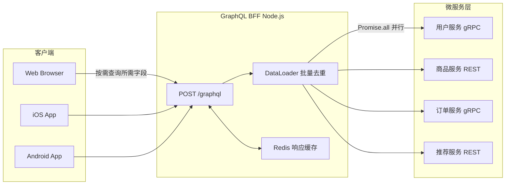
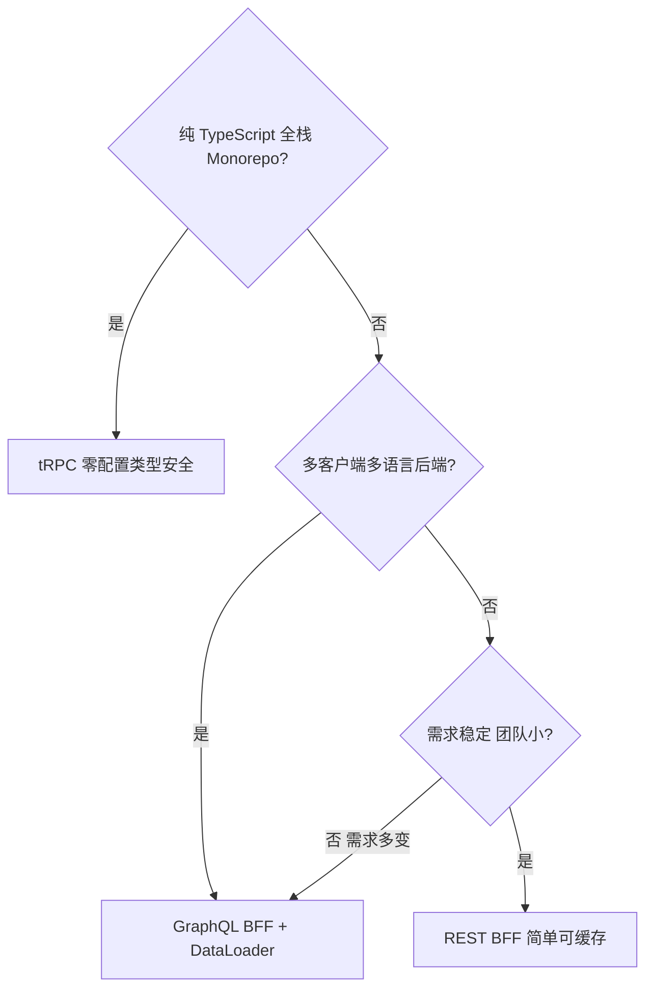

# BFF 架构（Backend for Frontend）

> BFF 是专为某个前端客户端（Web、iOS、Android）量身定制的 API 层，
> 解决"通用后端 API 与特定客户端需求不匹配"的问题。

---

## 面试框架（45分钟怎么答）

**第一步（开场）**：说清楚 BFF 解决的问题——客户端多次请求/过度获取/聚合逻辑分散，然后问面试官"客户端是否多样（Web+Mobile）？是否有 TypeScript 全栈约束？"
**第二步（核心）**：GraphQL BFF 架构（DataLoader 解决 N+1）+ tRPC 全栈类型安全——两种方案都要能讲
**第三步（深挖）**：DataLoader 批量机制（同一 tick 内收集 → 下一 tick 批量请求）；GraphQL 安全（depth limit + complexity limit）；Persisted Query 让 POST 变 GET 走 CDN 缓存
**差异化得分点**：主动提 "BFF 会不会变成新的巨石" 及其解法（按客户端拆分 / Schema Federation）

---

## 架构图：GraphQL BFF 数据流



---

## 决策树：REST vs GraphQL vs tRPC



---

## 为什么需要 BFF

### 通用后端 API 的痛点

```
移动端 App 首页需要：
  用户名 + 头像 + 未读消息数 + 推荐商品列表（含价格/图片）

微服务架构：
  用户服务   → GET /users/123
  消息服务   → GET /messages/unread?userId=123
  推荐服务   → GET /recommendations?userId=123
  商品服务   → GET /products?ids=...（需要先拿推荐列表再查详情）

问题：
1. 客户端需要 4 次串行/并行请求
2. 数据格式是服务端视角，不是客户端视角
3. 移动端带宽有限，返回了大量客户端不需要的字段
4. 聚合逻辑分散在每个客户端，重复实现
```

### BFF 解决方案

```
客户端 → BFF → 各微服务

BFF 职责：
  1. 并行调用多个微服务
  2. 聚合/裁剪/转换数据
  3. 处理客户端特有的业务逻辑
  4. 缓存（对客户端屏蔽后端延迟）
```

---

## BFF 的三种形态

### 形态 1：按客户端拆分（经典 BFF）

```
Web BFF     → 桌面端 / PC 浏览器
Mobile BFF  → iOS + Android
TV BFF      → 智能电视
```

适合：各端差异大（移动端需要数据极简，PC 端需要完整数据）。

### 形态 2：GraphQL BFF（最流行）

```
客户端按需查询自己需要的字段
  → GraphQL BFF 解析查询
  → 并行调用对应 Resolver（内部调用微服务）
  → 返回精确匹配的数据结构
```

### 形态 3：tRPC BFF（TypeScript 全栈）

```
共享类型定义（TypeScript interface）
  → 前端调用像本地函数一样
  → 编译时类型检查，无需维护 API 文档
```

---

## GraphQL BFF 深度解析

### 架构图

```
浏览器
  ↕ 单一端点 POST /graphql
GraphQL BFF（Node.js）
  ├── UserResolver      → 用户微服务 gRPC
  ├── ProductResolver   → 商品微服务 REST
  └── OrderResolver     → 订单微服务 gRPC
```

### TypeScript 实现（Apollo Server + DataLoader）

```typescript
import { ApolloServer } from '@apollo/server';
import DataLoader from 'dataloader';

// Schema 定义（精确描述客户端需要什么）
const typeDefs = `#graphql
  type User {
    id: ID!
    name: String!
    avatar: String
    unreadMessageCount: Int!
  }

  type Product {
    id: ID!
    name: String!
    price: Float!
    thumbnailUrl: String!
    # 故意不暴露 rawCostPrice 等敏感字段
  }

  type Query {
    me: User
    homeFeed(limit: Int = 10): [Product!]!
  }
`;

// DataLoader 解决 N+1 问题
// 场景：查询 100 个商品，每个商品要查 seller 信息
// 不用 DataLoader：100 次独立 SQL/HTTP 请求
// 用 DataLoader：自动批量合并为 1 次请求
const createProductLoader = () =>
  new DataLoader<string, Product>(async (ids) => {
    // 批量获取，一次请求
    const products = await productService.batchGet(ids as string[]);
    // 必须按 ids 顺序返回
    return ids.map(id => products.find(p => p.id === id) ?? new Error(`Product ${id} not found`));
  });

// Resolvers
const resolvers = {
  Query: {
    me: async (_: unknown, __: unknown, ctx: Context) => {
      // 并行获取用户信息和未读消息数
      const [user, unreadCount] = await Promise.all([
        userService.getUser(ctx.userId),
        messageService.getUnreadCount(ctx.userId),
      ]);
      return { ...user, unreadMessageCount: unreadCount };
    },

    homeFeed: async (_: unknown, { limit }: { limit: number }, ctx: Context) => {
      const recommendedIds = await recommendService.getRecommendations(ctx.userId, limit);
      // DataLoader 批量加载，避免 N+1
      return ctx.loaders.product.loadMany(recommendedIds);
    },
  },
};

// 创建 Apollo Server
const server = new ApolloServer({
  typeDefs,
  resolvers,
  // 生产环境关闭 introspection（避免暴露 schema）
  introspection: process.env.NODE_ENV !== 'production',
});
```

### 关键：DataLoader 解决 N+1 问题

```typescript
// N+1 问题场景
// 查询：{ homeFeed { seller { name } } }
// 
// 不用 DataLoader（N+1）：
//   1. 查 10 个商品
//   2. 对每个商品查 seller → 10 次独立请求 = 11 次总请求
//
// 用 DataLoader（批量）：
//   1. 查 10 个商品
//   2. 收集所有 sellerId → 批量查询 → 1 次请求 = 2 次总请求

const resolvers = {
  Product: {
    seller: (product: Product, _: unknown, ctx: Context) => {
      // 不直接调用，而是通过 DataLoader 排队
      return ctx.loaders.seller.load(product.sellerId);
    },
  },
};

// 每次请求创建新的 DataLoader 实例（避免跨请求缓存）
function createContext(): Context {
  return {
    loaders: {
      product: createProductLoader(),
      seller: createSellerLoader(),
    },
  };
}
```

### GraphQL 缓存策略

```typescript
// 字段级缓存控制（Apollo Cache Hints）
const typeDefs = `#graphql
  type Product @cacheControl(maxAge: 300) {   # 商品信息缓存 5 分钟
    id: ID!
    name: String!
    price: Float! @cacheControl(maxAge: 30)   # 价格缓存 30 秒（变动频繁）
    seller: User @cacheControl(maxAge: 600)   # 卖家信息缓存 10 分钟
  }

  type User @cacheControl(maxAge: 0, scope: PRIVATE) {  # 用户数据不缓存
    id: ID!
    name: String!
  }
`;
```

### GraphQL 安全：防止恶意查询

```typescript
import depthLimit from 'graphql-depth-limit';
import { createComplexityLimitRule } from 'graphql-validation-complexity';

const server = new ApolloServer({
  validationRules: [
    depthLimit(7),                        // 最多 7 层嵌套，防止深度查询攻击
    createComplexityLimitRule(1000),      // 查询复杂度评分限制
  ],
});

// 防止：{ user { friends { friends { friends { ... } } } } }（指数级数据库查询）
```

---

## tRPC：TypeScript 全栈类型安全 API

### 核心理念

> 不写 API 文档，不生成客户端代码，直接共享 TypeScript 类型。

### 架构

```
packages/
  api/
    router.ts        ← 定义所有 procedure（类型在这里）
  web/
    hooks/
      trpc.ts        ← 调用 api/router 的类型，自动推断
```

### 服务端实现

```typescript
// packages/api/router.ts
import { z } from 'zod';
import { router, publicProcedure, protectedProcedure } from './trpc';

export const productRouter = router({
  // Query：读操作
  getById: publicProcedure
    .input(z.object({ id: z.string() }))
    .query(async ({ input, ctx }) => {
      const product = await ctx.db.product.findUnique({ where: { id: input.id } });
      if (!product) throw new TRPCError({ code: 'NOT_FOUND' });
      return product;  // 返回类型自动推断
    }),

  // Mutation：写操作（需要登录）
  create: protectedProcedure
    .input(z.object({
      name: z.string().min(1).max(100),
      price: z.number().positive(),
    }))
    .mutation(async ({ input, ctx }) => {
      return ctx.db.product.create({
        data: { ...input, sellerId: ctx.session.userId },
      });
    }),
});

// 合并所有路由
export const appRouter = router({
  product: productRouter,
  user: userRouter,
  order: orderRouter,
});

export type AppRouter = typeof appRouter;  // 这个类型导出给客户端用
```

### 客户端调用（完全类型安全）

```typescript
// packages/web/hooks/trpc.ts
import { createTRPCReact } from '@trpc/react-query';
import type { AppRouter } from '@myapp/api';

export const trpc = createTRPCReact<AppRouter>();

// 在组件中使用
function ProductPage({ id }: { id: string }) {
  // 完全类型推断：result.data 的类型是 Product，不需要手写
  const { data, isLoading } = trpc.product.getById.useQuery({ id });

  const createMutation = trpc.product.create.useMutation();

  const handleCreate = () => {
    createMutation.mutate(
      { name: 'New Product', price: 99.9 },
      { onSuccess: () => toast('Created!') }
    );
  };

  // IDE 自动补全，类型错误编译时报出
  if (data) console.log(data.name);  // ✓ string
  // console.log(data.nonExistent);  // ✗ 编译错误

  return <div>{data?.name}</div>;
}
```

### tRPC vs GraphQL 选型

| 维度 | tRPC | GraphQL |
|------|------|---------|
| 适用范围 | 纯 TypeScript 全栈（Next.js/Remix）| 多客户端、多语言 |
| 类型安全 | 自动推断，零配置 | 需要 codegen（graphql-codegen）|
| 灵活性 | 固定 procedure，客户端不能自定义查询 | 客户端按需查询字段 |
| 学习曲线 | 极低 | 中等（Schema、Resolver、DataLoader）|
| 微服务集成 | 适合 monorepo，跨服务需要转换 | 天然适合聚合多个服务 |

**决策树**：
- 纯 TypeScript 全栈 + monorepo → **tRPC**
- 多语言后端 / 多客户端（Web + Mobile + 第三方）→ **GraphQL**
- 简单增删改查 / 小团队 → **REST**

---

## REST BFF vs GraphQL BFF

```
REST BFF（适合稳定、明确的客户端需求）：
  GET /bff/home-feed     → 首页数据聚合
  GET /bff/product/:id   → 商品详情聚合
  POST /bff/checkout     → 结账聚合

优点：简单、可缓存（GET 请求 CDN 友好）、易调试
缺点：每次客户端新需求都要改 BFF 接口

GraphQL BFF（适合需求多变、客户端多样）：
  POST /graphql          → 统一端点，客户端自己组合
  
优点：客户端灵活、减少无效字段、Schema 作为文档
缺点：POST 请求不易 CDN 缓存（需要 Persisted Queries）、N+1 需要 DataLoader
```

### GraphQL 持久化查询（解决缓存问题）

```typescript
// 客户端预注册查询（hash → query string）
// 请求时只发 hash，服务端查找完整 query
// GET /graphql?extensions={"persistedQuery":{"sha256Hash":"abc123"}}
// 这样 GET 请求可以被 CDN 缓存

// Apollo Client 自动处理
import { ApolloClient, createPersistedQueryLink } from '@apollo/client';

const client = new ApolloClient({
  link: createPersistedQueryLink({ useGETForHashedQueries: true }).concat(httpLink),
});
```

---

## 面试常见追问

**Q: BFF 会不会变成新的巨石？**
A: 会，如果所有客户端共用一个 BFF。解法：按客户端拆分（Web BFF / Mobile BFF），或用 GraphQL 的 schema stitching / federation 将 BFF 本身微服务化（每个领域一个 subgraph）。

## 常见踩坑

**踩坑1：BFF 成为"业务逻辑的垃圾桶"**
❌ 错误：前端开发者把所有数据处理逻辑、权限校验、业务规则都写进 BFF，BFF 越来越臃肿，变成另一个难以维护的后端服务。
✓ 正确：BFF 只做数据聚合、格式转换、协议适配（REST→GraphQL）和前端缓存，核心业务逻辑必须在领域服务中。
原因：BFF 属于前端团队，应保持"薄层"，厚重业务逻辑放进去会导致职责边界模糊和团队摩擦。

**踩坑2：GraphQL N+1 问题未用 DataLoader 解决**
❌ 错误：`posts` resolver 返回 100 条帖子，每条帖子的 `author` resolver 单独查一次数据库，产生 101 次查询。
✓ 正确：用 DataLoader 将同一批次内的 author ID 合并为一次 `SELECT * FROM users WHERE id IN (...)` 批量查询。
原因：GraphQL resolver 是按字段独立执行的，没有 DataLoader 时列表查询的数据库压力是 O(N)。

**踩坑3：BFF 未对下游服务设置超时**
❌ 错误：下游某个微服务响应慢，BFF 的 `Promise.all` 等待超时，最终整个 BFF 响应超时，前端白屏。
✓ 正确：每个下游调用设置独立超时（如 1000ms），超时后返回降级数据或忽略该字段，不阻塞其他数据的返回。
原因：下游服务不可靠，BFF 必须有故障隔离，单个服务超时不应影响整体响应。

**踩坑4：BFF 层做了权限校验但遗漏了字段级别的过滤**
❌ 错误：接口层校验了用户是否登录，但 GraphQL resolver 返回了包含敏感字段（`salary`、`phone`）的完整对象，普通用户也能读取管理员字段。
✓ 正确：resolver 层根据 `context.user.role` 过滤敏感字段，或用 `@auth` 指令在 schema 层声明字段级权限。
原因：BFF 的字段聚合灵活性也带来了过度暴露数据的风险，必须做字段级鉴权。

---

**Q: BFF 的性能瓶颈在哪里？**
A: 主要是后端服务调用的聚合延迟。缓解：并行调用（`Promise.all`）、DataLoader 批量、响应缓存（Redis）、连接复用（gRPC 长连接 vs HTTP/2）。

**Q: tRPC 能用于公开 API 吗？**
A: 不适合。tRPC 设计用于内部全栈调用，客户端必须是 TypeScript 且能访问类型定义。对外开放 API（第三方开发者、移动端 App 独立团队）仍然用 REST 或 GraphQL + OpenAPI/SDL 文档。

**Q: GraphQL N+1 在生产中有多严重？**
A: 非常严重。100 个列表项 × 每项 1 次 DB 查询 = 101 次查询，轻松把数据库打满。DataLoader 是标准解法，必须在所有列表 Resolver 中使用。
