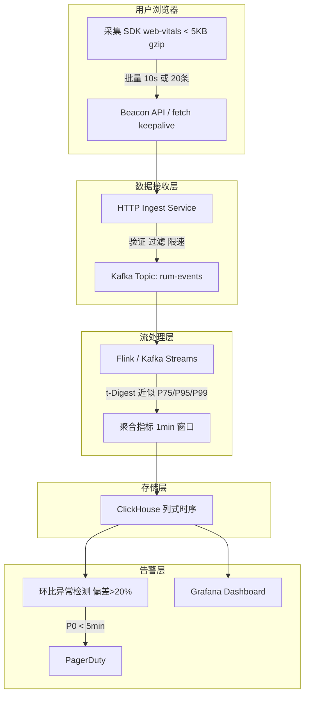

# 前端性能监控系统（RUM）

> RUM = Real User Monitoring（真实用户监控）
> 与后端 APM 不同，RUM 关注的是**真实用户在真实设备/网络下的体验**，而不是服务器的视角。

---

## 面试框架（45分钟怎么答）

**第一步（开场）**：先背三大 Core Web Vitals（LCP/INP/CLS + 阈值），然后说"后端 APM 看不到客户端网络和设备的影响，需要 RUM"
**第二步（核心）**：SDK 设计（web-vitals 库 + Beacon API + 采样率）→ 数据接收层（Kafka 削峰）→ 存储（ClickHouse 列式）
**第三步（深挖）**：P99 不能简单平均（t-Digest 近似算法）；环比异常检测（vs 过去7天同时段）；Beacon vs fetch 的区别
**差异化得分点**：分层采样策略（JS 错误 100% 上报 + 性能数据 10% 采样）；按 connection 类型分组分析定位问题

---

## 架构图：RUM 数据管道



---

## 为什么后端监控不够

```
后端 Prometheus 显示：API P99 = 80ms ✓

但用户投诉页面很慢，因为：
  - 用户在 4G 网络，JS bundle 下载需要 3s
  - 低端安卓机 JS 解析执行需要 2s
  - 第三方广告脚本阻塞了主线程

后端看不到这些 → 需要 RUM
```

---

## Core Web Vitals（Google 核心指标）

这是面试中必须能背出来的三个指标：

| 指标 | 全称 | 含义 | 良好阈值 | 需改进 | 差 |
|------|------|------|---------|--------|-----|
| **LCP** | Largest Contentful Paint | 最大内容绘制（首屏最大元素渲染完成）| < 2.5s | 2.5-4s | > 4s |
| **INP** | Interaction to Next Paint | 交互到下次绘制（用户操作响应延迟）| < 200ms | 200-500ms | > 500ms |
| **CLS** | Cumulative Layout Shift | 累计布局偏移（页面意外移动）| < 0.1 | 0.1-0.25 | > 0.25 |

> 2024 年 INP 已取代 FID（First Input Delay）。

其他重要指标：

| 指标 | 全称 | 含义 |
|------|------|------|
| **TTFB** | Time to First Byte | 首字节时间（网络 + 服务器处理）|
| **FCP** | First Contentful Paint | 首次内容绘制（页面开始有内容）|
| **TTI** | Time to Interactive | 可交互时间（主线程空闲）|
| **TBT** | Total Blocking Time | 主线程阻塞总时长（与 INP 相关）|

---

## RUM 系统架构

```
用户浏览器
  → 采集 SDK（嵌入页面的轻量 JS）
  → 批量上传（Beacon API / XHR）
  ↓
数据接收层（高吞吐 HTTP Ingest）
  → 验证 / 过滤 / 限速
  ↓
消息队列（Kafka）
  → 削峰填谷，防止后端压力
  ↓
流处理（Flink / Kafka Streams）
  → 实时聚合：P75/P95/P99 分位数
  → 异常检测
  ↓
时序数据库（ClickHouse / TimescaleDB）
  → 存储原始指标 + 聚合指标
  ↓
查询 API + 告警引擎
  ↓
Dashboard（Grafana）/ 告警（PagerDuty）
```

---

## 采集 SDK 设计

### 核心原则：轻量、不阻塞、不影响被监控页面性能

```typescript
// rum-sdk/src/index.ts

interface RUMConfig {
  appId: string;
  endpoint: string;
  sampleRate?: number;     // 采样率，默认 1.0（100%）
  maxBatchSize?: number;   // 批量发送阈值
  flushInterval?: number;  // 定时发送间隔（ms）
}

class RUMCollector {
  private queue: MetricEvent[] = [];
  private config: Required<RUMConfig>;

  constructor(config: RUMConfig) {
    this.config = {
      sampleRate: 1.0,
      maxBatchSize: 20,
      flushInterval: 10_000,
      ...config,
    };

    // 采样：不是所有用户都上报（节省带宽和存储）
    if (Math.random() > this.config.sampleRate) return;

    this.initWebVitals();
    this.initErrorTracking();
    this.initResourceTiming();
    this.setupFlush();
  }

  private initWebVitals() {
    // 使用 web-vitals 库采集 Core Web Vitals
    import('web-vitals').then(({ onLCP, onINP, onCLS, onFCP, onTTFB }) => {
      onLCP(metric => this.enqueue({ type: 'LCP', value: metric.value, rating: metric.rating }));
      onINP(metric => this.enqueue({ type: 'INP', value: metric.value, rating: metric.rating }));
      onCLS(metric => this.enqueue({ type: 'CLS', value: metric.value, rating: metric.rating }));
      onFCP(metric => this.enqueue({ type: 'FCP', value: metric.value }));
      onTTFB(metric => this.enqueue({ type: 'TTFB', value: metric.value }));
    });
  }

  private initErrorTracking() {
    // JS 运行时错误
    window.addEventListener('error', (event) => {
      this.enqueue({
        type: 'JS_ERROR',
        message: event.message,
        stack: event.error?.stack,
        filename: event.filename,
        line: event.lineno,
      });
    });

    // Promise 未捕获异常
    window.addEventListener('unhandledrejection', (event) => {
      this.enqueue({
        type: 'UNHANDLED_REJECTION',
        reason: String(event.reason),
      });
    });
  }

  private initResourceTiming() {
    // 监控慢资源（JS/CSS/图片加载时间）
    const observer = new PerformanceObserver((list) => {
      for (const entry of list.getEntries()) {
        if (entry.duration > 1000) {  // 超过 1s 才上报
          this.enqueue({
            type: 'SLOW_RESOURCE',
            name: entry.name,
            duration: entry.duration,
            initiatorType: (entry as PerformanceResourceTiming).initiatorType,
          });
        }
      }
    });
    observer.observe({ type: 'resource', buffered: true });
  }

  private enqueue(event: Omit<MetricEvent, 'timestamp' | 'sessionId' | 'url'>) {
    this.queue.push({
      ...event,
      timestamp: Date.now(),
      sessionId: this.sessionId,
      url: location.href,
      // 上下文信息
      userAgent: navigator.userAgent,
      connection: (navigator as any).connection?.effectiveType,  // '4g' | '3g' | '2g'
      deviceMemory: (navigator as any).deviceMemory,              // GB
    });

    if (this.queue.length >= this.config.maxBatchSize) {
      this.flush();
    }
  }

  private flush() {
    if (this.queue.length === 0) return;
    const events = this.queue.splice(0);  // 清空队列

    // Beacon API：页面关闭时也能发送，不阻塞
    // 比 XHR 更可靠（页面 unload 时 XHR 会被取消）
    const success = navigator.sendBeacon(
      this.config.endpoint,
      JSON.stringify({ appId: this.config.appId, events })
    );

    if (!success) {
      // Beacon 失败（数据太大），降级到 fetch
      fetch(this.config.endpoint, {
        method: 'POST',
        body: JSON.stringify({ appId: this.config.appId, events }),
        keepalive: true,  // 页面关闭后仍可发送
      });
    }
  }

  private setupFlush() {
    // 定时发送
    setInterval(() => this.flush(), this.config.flushInterval);

    // 页面可见性变化时发送（切换 Tab 或关闭）
    document.addEventListener('visibilitychange', () => {
      if (document.visibilityState === 'hidden') this.flush();
    });
  }
}
```

---

## 数据接收层（Ingest Service）

### 设计要点

```typescript
// ingest-service/src/routes/collect.ts
import { Kafka } from 'kafkajs';

const producer = kafka.producer({
  // 批量发送，提升吞吐
  batch: { size: 1024 * 1024, lingerMs: 10 },
});

export async function handleCollect(req: Request): Promise<Response> {
  // 1. 快速验证（不做复杂逻辑，保持低延迟）
  const { appId, events } = await req.json();
  if (!isValidAppId(appId)) {
    return new Response('Unauthorized', { status: 401 });
  }

  // 2. 过滤：丢弃明显异常数据（机器人、爬虫）
  const filtered = events.filter(isHumanEvent);

  // 3. 写入 Kafka（异步，不等结果）
  // 按 appId 路由到同一分区，保证同一应用数据有序
  await producer.send({
    topic: 'rum-events',
    messages: filtered.map(event => ({
      key: appId,
      value: JSON.stringify({ ...event, receivedAt: Date.now() }),
    })),
  });

  // 4. 立即返回（客户端不需要等处理结果）
  return new Response(null, { status: 204 });
}
```

### 限速：防止单一客户端打爆 Ingest

```typescript
// 基于 IP + AppId 的令牌桶限速
const rateLimiter = new RateLimiter({
  tokensPerInterval: 100,  // 每个 IP 每秒最多 100 个事件
  interval: 'second',
});

if (!rateLimiter.tryRemoveTokens(1, clientIp)) {
  return new Response('Rate Limited', { status: 429 });
}
```

---

## 流处理：实时聚合分位数

### 挑战：P99 不能简单平均

```
错误做法：每条记录 LCP 存数据库，查询时计算 P99
  → 数据量大（DAU 100 万 × 每人 5 个指标 = 500 万条/天）
  → 实时计算 P99 需要排序全量数据

正确做法：流处理中用近似算法实时计算
  → t-Digest 或 HdrHistogram
  → 压缩存储分位数桶，误差 < 1%
```

### Kafka Streams 实现（概念版）

```typescript
// 每 1 分钟输出一次聚合结果
const stream = kafka.stream('rum-events')
  .filter(event => event.type === 'LCP')
  .groupBy(event => `${event.appId}:${event.url}`)
  .windowedBy(TimeWindows.of(Duration.ofMinutes(1)))
  .aggregate(
    () => new TDigest(),  // 初始化 t-Digest 聚合器
    (key, event, digest) => {
      digest.push(event.value);
      return digest;
    }
  )
  .mapValues(digest => ({
    p50: digest.percentile(50),
    p75: digest.percentile(75),
    p95: digest.percentile(95),
    p99: digest.percentile(99),
    count: digest.size(),
  }))
  .to('rum-aggregated-metrics');
```

---

## 存储层：ClickHouse 时序数据

### 为什么选 ClickHouse

- 列式存储，聚合查询快（比 MySQL 快 100x）
- 原生支持时间序列查询（`toStartOfMinute`, `quantile`）
- 压缩比高（RUM 数据重复性强）

```sql
-- 原始事件表
CREATE TABLE rum_events (
    app_id      String,
    event_type  LowCardinality(String),  -- LowCardinality 优化低基数字段
    value       Float32,
    url         String,
    session_id  String,
    timestamp   DateTime,
    connection  LowCardinality(String),
    country     LowCardinality(String)
) ENGINE = MergeTree()
PARTITION BY toYYYYMM(timestamp)        -- 按月分区，方便删除旧数据
ORDER BY (app_id, event_type, timestamp) -- 排序键决定查询性能
TTL timestamp + INTERVAL 90 DAY;        -- 90天自动删除

-- 常用查询：某 App 过去 1 小时 LCP P75/P95
SELECT
    toStartOfMinute(timestamp) AS minute,
    quantile(0.75)(value)      AS p75,
    quantile(0.95)(value)      AS p95,
    count()                    AS sample_count
FROM rum_events
WHERE app_id = 'my-app'
  AND event_type = 'LCP'
  AND timestamp >= now() - INTERVAL 1 HOUR
GROUP BY minute
ORDER BY minute;
```

---

## 告警设计

### 异常检测策略

```typescript
// 策略 1：静态阈值（简单，容易误报）
// LCP P75 > 4s 就告警

// 策略 2：环比异常（推荐）
// 当前 1 小时 P75 vs 过去 7 天同时段 P75，偏差 > 20% 则告警
async function checkLCPAnomaly(appId: string): Promise<Alert | null> {
  const [current, baseline] = await Promise.all([
    queryP75(appId, 'LCP', '1h'),
    queryP75Baseline(appId, 'LCP', { daysBack: 7, sameHour: true }),
  ]);

  const deviation = (current - baseline) / baseline;
  if (deviation > 0.2) {
    return {
      severity: deviation > 0.5 ? 'critical' : 'warning',
      metric: 'LCP',
      current,
      baseline,
      deviation: `+${(deviation * 100).toFixed(1)}%`,
    };
  }
  return null;
}
```

### 告警分级

```
P0（立即响应，< 5min）：
  - 错误率 > 1%（用户大量报错）
  - LCP P75 > 8s（页面基本不可用）

P1（1 小时内响应）：
  - Core Web Vitals 环比恶化 > 50%
  - 新版本发布后指标下降

P2（工作时间处理）：
  - 特定页面/设备/地区指标异常
  - 长期趋势缓慢劣化
```

---

## 用户会话回放（可选进阶）

```
用户操作记录（rrweb 库）
  → 录制 DOM 变化、鼠标轨迹、点击
  → 压缩后上传（仅错误发生时的会话）
  → 回放时精确复现用户遇到的问题

隐私保护：
  - 自动屏蔽密码框、信用卡号
  - 遵守 GDPR：需要用户同意
  - 采样率设低（仅 1-5%，或只在报错时触发）
```

---

## 面试常见追问

**Q: RUM 数据量很大，如何控制成本？**
A: 三层控制：①客户端采样（10% 用户上报 → 数据有代表性，量减 90%）；②服务端按 URL 聚合（不存每条原始记录，只存分桶数据）；③数据分级存储（热数据 ClickHouse，90 天后归档 S3）。

**Q: 采样会不会错过 P99 用户（最慢的那些）？**
A: 有影响，但可接受。对于异常监控，可以用"错误采样率 100%"（所有 JS 错误都上报）+ "正常采样率 10%"的分层采样策略。P99 估算误差在统计上是可接受的。

**Q: 如何区分用户网络慢导致的 LCP 差，和代码问题导致的 LCP 差？**
A: 在数据中携带 `connection` 字段（effectiveType: 4g/3g/2g），查询时按网络类型分组。如果 4G 用户 LCP 也差，说明是代码/服务端问题；如果只有 2G 用户差，说明资源体积过大。

**Q: 前端监控 SDK 本身会不会影响页面性能？**
A: 需要严格控制：①懒加载 SDK（`<script async>` 或动态 import）；②SDK JS 体积 < 5KB gzip；③所有采集用异步 API（PerformanceObserver、requestIdleCallback）；④不在关键渲染路径上执行任何逻辑。
