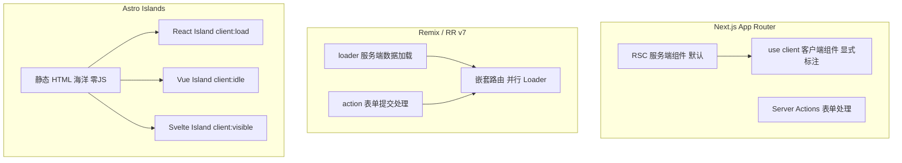
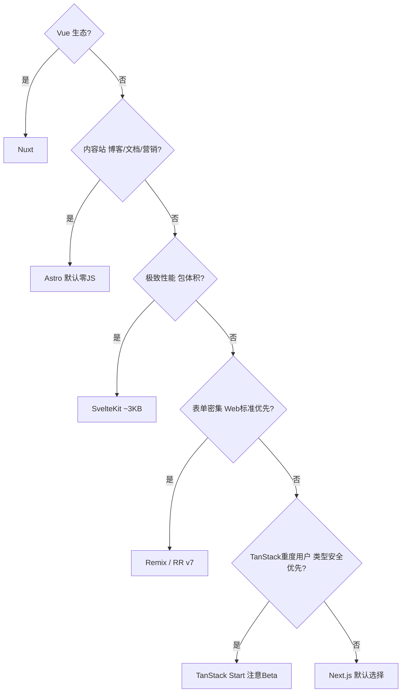

# 前端全栈框架横向对比

> 面试高频问："你们为什么选 Next.js 而不是 Remix？" 能给出有依据的答案，是加分项。
> 本文对比主流框架的渲染策略、路由模型、数据获取、适用场景。

---

## 面试框架（45分钟怎么答）

**第一步（开场）**：先问场景约束——React 还是 Vue 生态？内容站还是交互 App？团队 TypeScript 深度？性能要求？
**第二步（核心）**：给出选型决策树；重点对比 Next.js vs Remix（RSC vs loader/action；缓存模型复杂度；表单场景）
**第三步（深挖）**：Astro Islands 架构（默认零 JS）；SvelteKit 编译器优势（包体积对比）；TanStack Start 类型安全端到端推断
**差异化得分点**：能说出各框架的缺点（Next.js App Router 学习曲线陡；Remix 静态生成支持有限）——比只讲优点更有说服力

---

## 架构图：框架渲染模型对比



---

## 决策树：框架选型



---

## 框架全景图

| 框架 | 生态 | 渲染策略 | 路由模型 | 数据获取 | 适用场景 |
|------|------|---------|---------|---------|---------|
| **Next.js** | React | CSR/SSR/SSG/ISR/PPR | 文件系统 | Server Components / fetch | 通用全栈，大公司首选 |
| **Remix / RR v7** | React | SSR（为主）| 嵌套文件系统 | loader / action | 表单重、交互复杂的 Web App |
| **TanStack Start** | React | SSR / CSR | TanStack Router | server functions | 类型安全优先，中小项目 |
| **Astro** | 多框架 | SSG / SSR + Islands | 文件系统 | 顶层 frontmatter fetch | 内容站、文档、营销页 |
| **Nuxt** | Vue | SSR/SSG/ISR | 文件系统 | useFetch / useAsyncData | Vue 生态全栈 |
| **SvelteKit** | Svelte | SSR/SSG | 文件系统 | load function | 性能极致要求，包体小 |

---

## Next.js

### 定位
React 生态事实标准全栈框架，Vercel 维护。App Router（RSC）是当前主线。

### 核心特性

```typescript
// App Router — React Server Components（默认服务端，零客户端 JS）
// app/products/[id]/page.tsx
export default async function ProductPage({ params }: { params: { id: string } }) {
  const product = await db.product.findUnique({ where: { id: params.id } });
  return <ProductView product={product} />;
  // 这个组件的 JS 不会出现在客户端 bundle 里
}

// 需要客户端交互时，显式声明
'use client';
export function AddToCartButton({ productId }: { productId: string }) {
  const [loading, setLoading] = useState(false);
  // ...
}
```

### 渲染策略灵活性（同一项目混用）

```typescript
// 静态页面（构建时生成）
export const dynamic = 'force-static';

// 动态 SSR（每次请求重新渲染）
export const dynamic = 'force-dynamic';

// ISR（60s 缓存，后台重验证）
export const revalidate = 60;

// Partial Prerendering（静态壳 + 动态填充，Next.js 15 实验特性）
import { Suspense } from 'react';
export default function Page() {
  return (
    <StaticShell>
      <Suspense fallback={<Skeleton />}>
        <DynamicContent />  {/* 运行时流式填充 */}
      </Suspense>
    </StaticShell>
  );
}
```

### 生态配套

| 场景 | 推荐包 |
|------|-------|
| 数据库 ORM | Prisma / Drizzle |
| 认证 | NextAuth.js (Auth.js) / Clerk |
| 样式 | Tailwind CSS |
| UI 组件 | shadcn/ui / Radix UI |
| 表单 | React Hook Form + Zod |
| 部署 | Vercel（官方）/ AWS / Docker |

### 适用场景
- 电商、SaaS、内容平台——需要 SEO + 动态内容
- 大团队——生态成熟、招人容易
- 需要 ISR 的场景

### 缺点
- App Router 学习曲线陡（RSC 心智模型复杂）
- 构建速度随项目变大变慢（Turbopack 改善中）
- 与 Vercel 平台耦合（self-host 有额外配置成本）

---

## Remix / React Router v7

### 定位
以 Web 标准为核心（Form、Request/Response API），强调渐进增强。
2024 年 Remix v3 与 React Router v7 合并，统一为 React Router v7（framework mode）。

### 核心特性：嵌套路由 + Loader/Action

```typescript
// routes/orders.$orderId.tsx
import { useLoaderData, Form, redirect } from 'react-router';
import type { Route } from './+types/orders.$orderId';

// loader：页面数据加载（服务端执行）
export async function loader({ params }: Route.LoaderArgs) {
  const order = await getOrder(params.orderId);
  if (!order) throw new Response('Not Found', { status: 404 });
  return { order };
}

// action：表单提交处理（服务端执行）
export async function action({ params, request }: Route.ActionArgs) {
  const formData = await request.formData();
  const intent = formData.get('intent');

  if (intent === 'cancel') {
    await cancelOrder(params.orderId);
    return redirect('/orders');
  }
}

// 组件：数据从 loader 来，无需 useState + useEffect 获取数据
export default function OrderPage({ loaderData }: Route.ComponentProps) {
  const { order } = loaderData;

  return (
    <div>
      <h1>Order #{order.id}</h1>
      {/* Form 直接触发 action，支持渐进增强（无 JS 时也能工作）*/}
      <Form method="post">
        <input type="hidden" name="intent" value="cancel" />
        <button type="submit">Cancel Order</button>
      </Form>
    </div>
  );
}
```

### 嵌套路由的优势

```
routes/
  _layout.tsx          → 共享布局（导航、Sidebar）
  orders.tsx           → /orders 父路由（列表）
  orders.$orderId.tsx  → /orders/123 子路由（详情）

父子路由并行加载数据（Parallel Loaders），不是瀑布！
```

### 适用场景
- 表单密集型应用（CRM、后台管理、B2B SaaS）
- 需要渐进增强（低 JS 环境也能用）
- 强调 Web 标准、不想被框架私有 API 绑定

### 与 Next.js 对比

| 维度 | Next.js | Remix/RR v7 |
|------|---------|------------|
| 数据获取 | RSC async fetch | loader/action |
| 表单处理 | Server Actions | Form + action |
| 缓存模型 | 复杂（fetch cache / revalidate / tags）| 简单（HTTP 标准缓存）|
| 学习曲线 | 较高（RSC 新心智模型）| 较低（贴近 Web 标准）|
| 静态生成 | 完整支持 | 有限支持 |

---

## TanStack Start

### 定位
TanStack 团队（React Query / Table / Router 作者）出品的全栈框架，基于 TanStack Router + Vinxi。
**核心卖点：端到端类型安全**，类型从数据库到 UI 全程推断。

### 核心特性：Server Functions + 类型安全路由

```typescript
// app/routes/products.$productId.tsx
import { createFileRoute } from '@tanstack/react-router';
import { createServerFn } from '@tanstack/start';
import { z } from 'zod';

// Server Function — 类似 RPC，类型自动从服务端传到客户端
const getProduct = createServerFn({ method: 'GET' })
  .validator(z.object({ id: z.string() }))
  .handler(async ({ data }) => {
    return db.product.findUnique({ where: { id: data.id } });
    // 返回类型自动推断，客户端无需手写
  });

export const Route = createFileRoute('/products/$productId')({
  // loader 类型安全：params.productId 是 string（由路由定义保证）
  loader: ({ params }) => getProduct({ data: { id: params.productId } }),
  component: ProductPage,
});

function ProductPage() {
  const product = Route.useLoaderData();
  // product 的类型完全来自 getProduct 的返回类型，无需手写 interface
  return <div>{product?.name}</div>;
}
```

### 与 tRPC 的关系

```
tRPC：用于服务间 / BFF 通信，需要 client + server 分别配置
TanStack Start Server Functions：页面级的服务端调用，更简单
两者不冲突，大项目可同时使用
```

### 适用场景
- 类型安全优先的中小项目
- 已重度使用 TanStack Router / Query 的项目
- 希望比 Next.js 更轻量但保留类型安全的团队

### 现状（2024-2025）
仍处于 Beta 阶段，生产使用需评估稳定性。社区和生态还在成长中。

---

## Astro

### 定位
内容优先的框架，核心理念是 **Islands Architecture**（岛屿架构）。
默认零 JS，只有需要交互的组件才注入 JS。

### Islands 架构

```
传统 SPA/SSR：
  整个页面一个 JS 运行时 → 所有组件都是 JS

Astro Islands：
  静态 HTML 海洋中的可交互 JS 岛屿
  ├── 头部导航 → 纯 HTML（无 JS）
  ├── 文章正文 → 纯 HTML（无 JS）
  ├── 评论区 → React 组件（加载 JS，懒加载）
  └── 侧边栏搜索 → Vue 组件（加载 JS，立即加载）
```

```astro
---
// 服务端执行（在 --- 之间）
const posts = await fetch('https://api.example.com/posts').then(r => r.json());
---

<!-- 纯 HTML，零 JS -->
<ul>
  {posts.map(post => <li>{post.title}</li>)}
</ul>

<!-- client:load — 页面加载时注入 JS -->
<ReactSearchBar client:load />

<!-- client:idle — 浏览器空闲时注入（不影响 LCP）-->
<VueCommentSection client:idle />

<!-- client:visible — 滚动到视口时才注入 -->
<SvelteRecommendations client:visible />
```

### 多框架支持

```
同一个 Astro 项目里可以混用：
  - React 组件
  - Vue 组件
  - Svelte 组件
  - Lit Web Components

渐进迁移利器：老项目部分页面迁移到 Astro，新旧组件共存
```

### 适用场景
- 博客、文档站、营销页（内容 > 交互）
- 追求极致 Lighthouse 分数（默认零 JS）
- 技术栈迁移过渡期（多框架共存）

### 不适合
- 重交互的 Web App（Astro 不是 SPA 框架）
- 需要客户端路由（页面间跳转是传统多页应用模式）

---

## Nuxt（Vue 生态）

### 对应关系
Nuxt ≈ Vue 的 Next.js（但有自己的设计哲学）

```typescript
// pages/products/[id].vue
<script setup lang="ts">
// useFetch：自动处理 SSR/CSR 数据同步（服务端取到的数据"脱水"到客户端）
const { data: product } = await useFetch(`/api/products/${route.params.id}`, {
  transform: (data) => data.product,  // 数据转换
});

// useAsyncData：更细粒度控制
const { data, error, refresh } = await useAsyncData('product', () =>
  $fetch(`/api/products/${route.params.id}`)
);
</script>
```

### Nuxt 特有的 Auto-imports

```typescript
// Nuxt 自动导入 composables / components，无需手动 import
// composables/useCart.ts
export const useCart = () => {
  const items = ref([]);
  // ...
};

// pages/index.vue — 直接用，不需要 import
const cart = useCart(); // ✓ Nuxt 自动处理
```

### 适用场景
- Vue 技术栈团队的全栈首选
- 需要 Nuxt Content（Markdown 驱动的 CMS）
- 国内中台/后台项目（Vue 生态在国内更流行）

---

## SvelteKit

### 定位
Svelte 的全栈框架。Svelte 的核心优势：编译时框架，无虚拟 DOM，运行时极小。

```typescript
// src/routes/products/[id]/+page.server.ts
import type { PageServerLoad } from './$types';

// load 函数（服务端）
export const load: PageServerLoad = async ({ params, fetch }) => {
  const product = await fetch(`/api/products/${params.id}`).then(r => r.json());
  return { product };
  // 类型自动传递给页面组件
};

// src/routes/products/[id]/+page.svelte
<script lang="ts">
  import type { PageData } from './$types';
  export let data: PageData;  // 类型从 load 函数推断
</script>

<h1>{data.product.name}</h1>
```

### 包体积对比（Hello World）

```
React (Vite)     ~140KB gzip
Vue (Vite)       ~50KB gzip
Svelte (Vite)    ~3KB gzip   ← 编译器把框架代码变成原生 JS
```

### 适用场景
- 性能极致要求（低端设备、弱网环境）
- 嵌入式 Web UI（智能硬件控制台、Electron 嵌入）
- 对包体积敏感的移动 Web

---

## 框架选型决策树

```
需要 Vue 生态？
  ├── 是 → Nuxt
  └── 否 ↓

内容为主（博客/文档/营销页）？
  ├── 是 → Astro
  └── 否 ↓

极致性能 / 包体积？
  ├── 是 → SvelteKit
  └── 否 ↓

表单密集 / Web 标准优先？
  ├── 是 → Remix / React Router v7
  └── 否 ↓

类型安全优先 / TanStack 重度用户？
  ├── 是 → TanStack Start（注意：Beta）
  └── 否 → Next.js（默认选择）
```

---

## 面试常见追问

**Q: Next.js App Router vs Pages Router 怎么选？**
A: 新项目用 App Router（React Server Components 是未来方向，更好的流式渲染和数据获取）。已有 Pages Router 项目不必急迁移，两者可在同一项目共存。

**Q: Remix 的 loader 和 Next.js 的 Server Components 哪个更好？**
A: 解决不同问题。Remix loader 是路由级数据加载，与嵌套路由并行加载结合非常强大；RSC 是组件级数据加载，粒度更细。Remix 更贴近 Web 标准，Next.js 生态更完整。

**Q: TanStack Start 值得现在用吗？**
A: 2025 年还在 Beta，不建议大型生产项目使用。但如果是小项目且已深度使用 TanStack Router / Query，可以尝试。值得关注，类型安全的设计理念很先进。

**Q: Astro 能做 Web App 吗？**
A: Astro 3.0 后支持 View Transitions 和更丰富的客户端路由，但本质仍是 MPA 思路。重交互的 Web App（如 Figma 类工具）不适合，内容+轻交互的场景非常适合。
