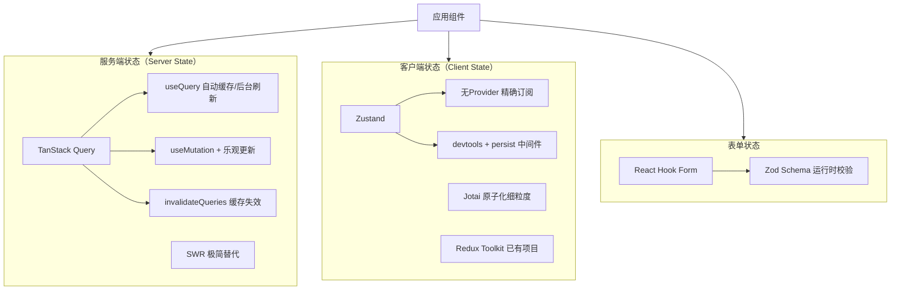
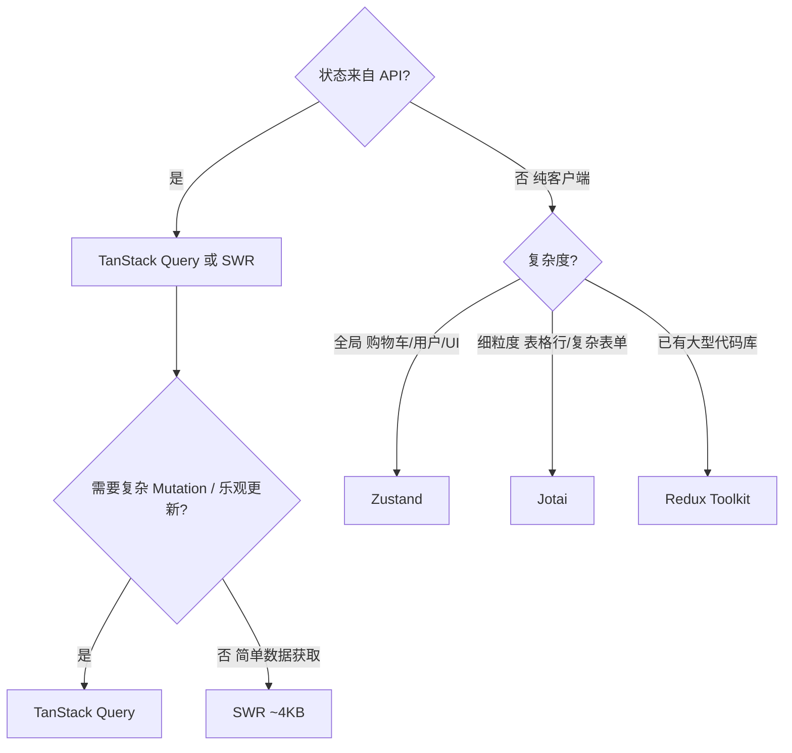

# 前端状态管理

> 面试中"你们如何管理状态"几乎必问。
> 核心判断：**服务端状态**（Server State）和**客户端状态**（Client State）是两类不同问题，用不同工具解决。

---

## 面试框架（45分钟怎么答）

**第一步（开场）**：先做状态分类——服务端状态（来自 API、需要同步）vs 客户端状态（本地 UI 状态），这是整个回答的核心框架
**第二步（核心）**：TanStack Query（staleTime/gcTime/乐观更新/失效策略）+ Zustand（无 Provider、精确订阅）
**第三步（深挖）**：乐观更新三步骤（onMutate 保存旧值 → UI 立即更新 → onError 回滚）；SSR 集成（dehydrate/HydrationBoundary）；Context API 为何不适合高频更新
**差异化得分点**：主动说"把服务端状态放进 Redux 是最常见错误"，然后说如何判断（刷新后从服务端重取 → 服务端状态）

---

## 架构图：状态分层模型



---

## 决策树：状态方案选型



---

## 状态分类

```
应用状态
├── 服务端状态（Server State）
│     数据存在服务器，前端只是缓存的副本
│     特点：异步获取、可能过期、需要同步
│     例子：用户列表、商品数据、订单状态
│     工具：TanStack Query / SWR
│
└── 客户端状态（Client State）
      数据只存在浏览器，服务端不关心
      特点：同步、由用户操作驱动
      例子：当前选中的 Tab、弹窗是否打开、表单草稿
      工具：useState / Zustand / Jotai

混淆这两类是最常见的状态管理错误：
  把服务端状态放进 Redux → 手动管理 loading/error/缓存失效 → 代码爆炸
```

---

## 服务端状态：TanStack Query（React Query）

### 核心概念

```typescript
import { useQuery, useMutation, useQueryClient } from '@tanstack/react-query';

// useQuery — 获取数据，自动处理 loading/error/缓存/后台刷新
function ProductList() {
  const { data, isLoading, error, isFetching } = useQuery({
    queryKey: ['products', { category: 'electronics' }],  // 缓存 key
    queryFn: () => fetchProducts({ category: 'electronics' }),
    staleTime: 5 * 60 * 1000,   // 5分钟内认为数据新鲜，不重新请求
    gcTime: 10 * 60 * 1000,     // 10分钟后从缓存中删除（原 cacheTime）
    refetchOnWindowFocus: true,  // 切换 tab 回来自动刷新
  });

  // isLoading: 第一次加载（无缓存）
  // isFetching: 后台刷新（有缓存但在更新）
  if (isLoading) return <Skeleton />;
  if (error) return <ErrorMessage />;

  return <ProductGrid products={data} />;
}
```

### 乐观更新（Optimistic Update）

```typescript
function LikeButton({ postId }: { postId: string }) {
  const queryClient = useQueryClient();

  const likeMutation = useMutation({
    mutationFn: (postId: string) => likePost(postId),

    // 乐观更新：请求发出前先更新 UI
    onMutate: async (postId) => {
      await queryClient.cancelQueries({ queryKey: ['post', postId] });

      // 保存旧数据（用于回滚）
      const previousPost = queryClient.getQueryData(['post', postId]);

      // 立即更新缓存（UI 即时响应）
      queryClient.setQueryData(['post', postId], (old: Post) => ({
        ...old,
        likeCount: old.likeCount + 1,
        isLiked: true,
      }));

      return { previousPost };
    },

    // 请求失败 → 回滚
    onError: (err, postId, context) => {
      queryClient.setQueryData(['post', postId], context?.previousPost);
    },

    // 请求完成 → 重新获取最新数据
    onSettled: (_, __, postId) => {
      queryClient.invalidateQueries({ queryKey: ['post', postId] });
    },
  });

  return <button onClick={() => likeMutation.mutate(postId)}>Like</button>;
}
```

### 缓存失效策略

```typescript
const queryClient = useQueryClient();

// 方式 1：精确失效（推荐）
queryClient.invalidateQueries({ queryKey: ['products', productId] });

// 方式 2：前缀失效（所有 products 相关缓存）
queryClient.invalidateQueries({ queryKey: ['products'] });

// 方式 3：直接更新缓存（避免重新请求）
queryClient.setQueryData(['product', productId], updatedProduct);

// 方式 4：预取（用户 hover 时提前加载）
queryClient.prefetchQuery({
  queryKey: ['product', productId],
  queryFn: () => fetchProduct(productId),
});
```

### SSR 集成（Next.js App Router）

```typescript
// 服务端预取，客户端直接用缓存（不重复请求）
import { dehydrate, HydrationBoundary, QueryClient } from '@tanstack/react-query';

// app/products/page.tsx（Server Component）
export default async function ProductsPage() {
  const queryClient = new QueryClient();

  // 服务端预取
  await queryClient.prefetchQuery({
    queryKey: ['products'],
    queryFn: fetchProducts,
  });

  return (
    // 将服务端缓存"脱水"注入客户端
    <HydrationBoundary state={dehydrate(queryClient)}>
      <ProductList />  {/* 客户端直接从缓存读，不重复请求 */}
    </HydrationBoundary>
  );
}
```

---

## 服务端状态：SWR

### 核心概念

```typescript
import useSWR from 'swr';

// 极简 API
function UserProfile({ id }: { id: string }) {
  const { data, error, isLoading, mutate } = useSWR(
    `/api/users/${id}`,
    fetcher,
    {
      refreshInterval: 30000,      // 每30s轮询刷新
      revalidateOnFocus: true,
      dedupingInterval: 2000,      // 2s内相同 key 的请求去重
    }
  );

  return <div>{data?.name}</div>;
}

// 手动触发刷新
mutate();                          // 重新请求
mutate(updatedUser, false);        // 直接更新缓存，不重新请求
```

### TanStack Query vs SWR 选型

| 维度 | TanStack Query | SWR |
|------|---------------|-----|
| API 复杂度 | 较高（功能更多）| 极简 |
| 乐观更新 | 内置完善支持 | 需要手动实现 |
| Mutation | 完整的 useMutation | 需要配合 fetch |
| 无限滚动 | useInfiniteQuery | useSWRInfinite |
| 包体积 | ~13KB gzip | ~4KB gzip |
| 适用场景 | 复杂数据交互 | 简单数据获取 |

**结论**：默认选 TanStack Query；项目简单或对包体积敏感选 SWR。

---

## 客户端状态：Zustand

### 定位
轻量（~1KB）、无 Provider 包裹、API 简单的客户端状态管理。

```typescript
import { create } from 'zustand';
import { devtools, persist } from 'zustand/middleware';

interface CartStore {
  items: CartItem[];
  addItem: (product: Product) => void;
  removeItem: (productId: string) => void;
  clearCart: () => void;
  total: () => number;
}

export const useCartStore = create<CartStore>()(
  devtools(           // Redux DevTools 支持
    persist(          // localStorage 持久化
      (set, get) => ({
        items: [],

        addItem: (product) => set((state) => {
          const existing = state.items.find(i => i.productId === product.id);
          if (existing) {
            return {
              items: state.items.map(i =>
                i.productId === product.id
                  ? { ...i, quantity: i.quantity + 1 }
                  : i
              ),
            };
          }
          return { items: [...state.items, { productId: product.id, product, quantity: 1 }] };
        }),

        removeItem: (productId) => set((state) => ({
          items: state.items.filter(i => i.productId !== productId),
        })),

        clearCart: () => set({ items: [] }),

        // 计算属性（不存在 state 里，每次调用计算）
        total: () => get().items.reduce((sum, i) => sum + i.product.price * i.quantity, 0),
      }),
      { name: 'cart-storage' }  // localStorage key
    )
  )
);

// 组件中使用（不需要 Provider）
function CartIcon() {
  const itemCount = useCartStore(state => state.items.length);  // 精确订阅，减少重渲染
  return <Badge count={itemCount} />;
}
```

### Zustand 的 Slice 模式（大型应用）

```typescript
// 拆分 store（避免单文件过大）
const createUserSlice = (set) => ({
  user: null,
  setUser: (user) => set({ user }),
  logout: () => set({ user: null }),
});

const createSettingsSlice = (set) => ({
  theme: 'light',
  setTheme: (theme) => set({ theme }),
});

// 合并
export const useStore = create((...args) => ({
  ...createUserSlice(...args),
  ...createSettingsSlice(...args),
}));
```

---

## 客户端状态：Jotai（原子化状态）

### 定位
受 Recoil 启发，基于原子（atom）的细粒度状态管理。每个 atom 独立，按需订阅。

```typescript
import { atom, useAtom, useAtomValue, useSetAtom } from 'jotai';

// 定义 atom（原子状态单元）
const themeAtom = atom<'light' | 'dark'>('light');
const userAtom = atom<User | null>(null);

// 派生 atom（类似 computed）
const isLoggedInAtom = atom((get) => get(userAtom) !== null);

// 异步 atom（自动处理 loading）
const productAtom = atom(async (get) => {
  const id = get(selectedProductIdAtom);
  return fetch(`/api/products/${id}`).then(r => r.json());
});

// 组件中使用
function ThemeToggle() {
  const [theme, setTheme] = useAtom(themeAtom);
  return <button onClick={() => setTheme(t => t === 'light' ? 'dark' : 'light')}>{theme}</button>;
}

// 只读（不触发订阅写操作的重渲染）
function UserBadge() {
  const isLoggedIn = useAtomValue(isLoggedInAtom);
  return isLoggedIn ? <Avatar /> : <LoginButton />;
}
```

### Jotai vs Zustand 选型

| 维度 | Zustand | Jotai |
|------|---------|-------|
| 状态组织 | 集中式 Store | 分散的原子（按需组合）|
| 重渲染控制 | 手动选择器 `state => state.x` | 自动（订阅哪个 atom 就只在它变化时渲染）|
| 代码风格 | 类 Flux | 类 Recoil / 响应式 |
| 适合场景 | 购物车、全局 UI 状态 | 细粒度状态（表格行选中、复杂表单）|

---

## 客户端状态：Redux Toolkit

### 现代写法（RTK）

```typescript
import { createSlice, createAsyncThunk, configureStore } from '@reduxjs/toolkit';

// createAsyncThunk — 处理异步 action（已被 TanStack Query 大量替代）
export const fetchUserById = createAsyncThunk(
  'users/fetchById',
  async (userId: string) => {
    return userApi.findById(userId);
  }
);

const usersSlice = createSlice({
  name: 'users',
  initialState: { entities: {}, status: 'idle' } as UsersState,
  reducers: {
    userUpdated: (state, action: PayloadAction<User>) => {
      state.entities[action.payload.id] = action.payload;  // Immer 支持直接修改
    },
  },
  extraReducers: (builder) => {
    builder
      .addCase(fetchUserById.pending, (state) => { state.status = 'loading'; })
      .addCase(fetchUserById.fulfilled, (state, action) => {
        state.status = 'idle';
        state.entities[action.payload.id] = action.payload;
      });
  },
});
```

### Redux Toolkit Query（RTK Query）

```typescript
// RTK Query — Redux 内置的服务端状态方案（对标 TanStack Query）
import { createApi, fetchBaseQuery } from '@reduxjs/toolkit/query/react';

export const productsApi = createApi({
  reducerPath: 'productsApi',
  baseQuery: fetchBaseQuery({ baseUrl: '/api' }),
  endpoints: (builder) => ({
    getProduct: builder.query<Product, string>({
      query: (id) => `/products/${id}`,
      providesTags: (result, error, id) => [{ type: 'Product', id }],
    }),
    updateProduct: builder.mutation<Product, Partial<Product> & { id: string }>({
      query: ({ id, ...patch }) => ({ url: `/products/${id}`, method: 'PATCH', body: patch }),
      invalidatesTags: (result, error, { id }) => [{ type: 'Product', id }],
    }),
  }),
});

export const { useGetProductQuery, useUpdateProductMutation } = productsApi;
```

### 什么时候还选 Redux？

```
仍然适合 Redux 的场景：
  ✓ 已有大型 Redux 代码库（迁移成本 > 收益）
  ✓ 需要 Redux DevTools 的时光旅行调试
  ✓ 复杂的跨组件事件流（action 被多个 reducer 监听）
  ✓ 团队熟悉 Redux，业务逻辑已封装在 slice 中

可以不用 Redux 的场景（用更轻量方案）：
  ✗ 只是为了"全局状态" → Zustand
  ✗ 服务端数据缓存 → TanStack Query
  ✗ 新项目从零开始 → 默认不选 Redux
```

---

## 表单状态：React Hook Form + Zod

```typescript
import { useForm } from 'react-hook-form';
import { zodResolver } from '@hookform/resolvers/zod';
import { z } from 'zod';

// Schema 定义（同时用于类型推断和运行时校验）
const CheckoutSchema = z.object({
  email: z.string().email('Invalid email'),
  address: z.string().min(10, 'Address too short'),
  cardNumber: z.string().regex(/^\d{16}$/, 'Invalid card number'),
});

type CheckoutForm = z.infer<typeof CheckoutSchema>;

function CheckoutForm() {
  const { register, handleSubmit, formState: { errors, isSubmitting } } = useForm<CheckoutForm>({
    resolver: zodResolver(CheckoutSchema),
  });

  const onSubmit = async (data: CheckoutForm) => {
    await submitOrder(data);
  };

  return (
    <form onSubmit={handleSubmit(onSubmit)}>
      <input {...register('email')} />
      {errors.email && <span>{errors.email.message}</span>}
      <button type="submit" disabled={isSubmitting}>Submit</button>
    </form>
  );
}
```

**为什么不用 Formik？**：React Hook Form 基于非受控组件（不受控输入不触发 React re-render），性能显著优于 Formik 的受控组件方案。表单字段多时差距尤为明显。

---

## 状态管理选型总结

```
服务端数据（API 数据）
  → TanStack Query（功能全）或 SWR（极简）

全局客户端状态（购物车、用户设置、UI 状态）
  → Zustand（简单直观）

原子化细粒度状态（复杂表格、多步骤表单状态）
  → Jotai

已有 Redux 项目 / 需要复杂事件流
  → Redux Toolkit（+ RTK Query 替代 TanStack Query）

表单
  → React Hook Form + Zod

不要把服务端状态放进客户端 Store（最重要的原则）
```

---

## 面试常见追问

**Q: Context API 为什么不适合高频更新的全局状态？**
A: Context 更新时所有消费该 Context 的组件都会重渲染，即使它们用的字段没有变化。Zustand / Jotai 通过精确订阅避免这个问题。Context 适合低频更新的全局数据（主题、语言、登录用户）。

**Q: TanStack Query 和 Redux 能共存吗？**
A: 完全可以。推荐的分工：服务端数据用 TanStack Query（不放进 Redux），客户端 UI 状态用 Redux（或迁移到 Zustand）。

**Q: 如何决定某个状态是"服务端状态"还是"客户端状态"？**
A: 判断：如果刷新页面后这个状态需要从服务器重新获取，它是服务端状态；如果刷新后合理重置，它是客户端状态。示例：用户的订单列表 → 服务端状态；当前展开的手风琴面板 → 客户端状态。
