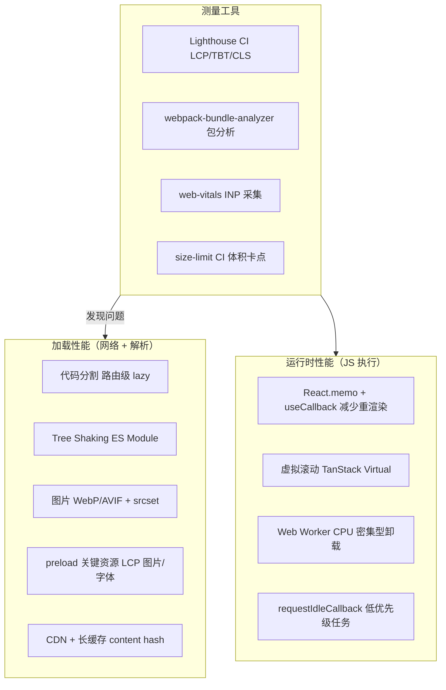

# 前端性能优化

> 性能优化不是猜测，是测量、定位、修复的循环。
> 本文覆盖：代码分割、bundle 优化、运行时性能、虚拟滚动、Web Worker。

---

## 面试框架（45分钟怎么答）

**第一步（开场）**：先说"优化前先测量"——Lighthouse 看 LCP/TBT/CLS，Bundle Analyzer 找大包，PerformanceObserver 采集 INP
**第二步（核心）**：代码分割（路由级 lazy + Suspense）→ Bundle 优化（Tree Shaking + 替代轻量库）→ 运行时（memo/useCallback + 虚拟滚动）
**第三步（深挖）**：虚拟滚动原理（只渲染视口内 ~60 个 DOM）；Web Worker 卸载 CPU 密集型任务；React Compiler 自动 memo
**差异化得分点**：能说出 "useMemo 什么时候不该用"（memo 本身有对比开销，React Compiler 时代大多数情况不再需要手动）

---

## 架构图：性能优化层次



---

## 性能指标回顾

优化前先明确目标指标（见 [04_frontend_monitoring.md](04_frontend_monitoring.md)）：

```
加载性能（网络 + 解析）：
  LCP < 2.5s     — 最大内容绘制（主要靠减少资源大小 + CDN）
  TTFB < 800ms   — 首字节（主要靠 SSR/CDN/服务端优化）
  FCP < 1.8s     — 首次内容绘制

运行时性能（JS 执行）：
  INP < 200ms    — 交互响应（主要靠减少主线程阻塞）
  CLS < 0.1      — 布局稳定性（主要靠给图片/广告预留尺寸）
  TBT < 200ms    — 主线程阻塞总时长
```

---

## 代码分割（Code Splitting）

### 原理

```
不分割（默认）：
  main.bundle.js = 全部代码（1.2MB）
  → 用户加载首页也要下载后台管理页的代码

按路由分割（推荐）：
  main.chunk.js          = 核心框架（200KB）
  home.chunk.js          = 首页组件（50KB）
  dashboard.chunk.js     = 后台（400KB，首页不加载）
  admin.chunk.js         = 管理员功能（300KB，普通用户不加载）
```

### React 动态导入

```typescript
import { lazy, Suspense } from 'react';

// 路由级分割（最高优先级）
const Dashboard = lazy(() => import('./pages/Dashboard'));
const AdminPanel = lazy(() => import('./pages/AdminPanel'));

// 条件分割（用户才能看到的功能）
const RichTextEditor = lazy(() => import('./components/RichTextEditor'));

function App() {
  const { isAdmin } = useAuth();

  return (
    <Router>
      <Suspense fallback={<PageSkeleton />}>
        <Routes>
          <Route path="/dashboard" element={<Dashboard />} />
          {isAdmin && <Route path="/admin" element={<AdminPanel />} />}
        </Routes>
      </Suspense>

      {/* 条件渲染的重型组件 */}
      {showEditor && (
        <Suspense fallback={<EditorSkeleton />}>
          <RichTextEditor />
        </Suspense>
      )}
    </Router>
  );
}
```

### 预加载（Prefetch）策略

```typescript
// 用户 hover 时预加载，点击时已经 ready
function NavLink({ to, children }: { to: string; children: React.ReactNode }) {
  const handleMouseEnter = () => {
    // 根据路由预加载对应 chunk
    if (to === '/dashboard') {
      import('./pages/Dashboard');  // 触发预下载，不等待
    }
  };

  return (
    <Link to={to} onMouseEnter={handleMouseEnter}>
      {children}
    </Link>
  );
}

// Next.js 的 Link 组件默认在视口内预取（可配置）
<Link href="/dashboard" prefetch={false}>Dashboard</Link>
```

### Webpack / Vite Magic Comments

```typescript
// 命名 chunk（便于分析 bundle）
const Dashboard = lazy(() =>
  import(/* webpackChunkName: "dashboard" */ './pages/Dashboard')
);

// 预加载（高优先级，用于用户即将访问的页面）
import(/* webpackPreload: true */ './CriticalComponent');

// 预取（低优先级，用于将来可能访问的页面）
import(/* webpackPrefetch: true */ './Dashboard');
```

---

## Bundle 优化

### 分析工具

```bash
# Webpack Bundle Analyzer
npm install --save-dev webpack-bundle-analyzer
# 生成可视化报告，找出最大的包

# Vite 的 rollup-plugin-visualizer
npm install --save-dev rollup-plugin-visualizer
```

### Tree Shaking（死代码消除）

```typescript
// ❌ 导入整个库（lodash 全量 70KB）
import _ from 'lodash';
const result = _.debounce(fn, 300);

// ✓ 按需导入（只打包 debounce 相关代码 ~2KB）
import debounce from 'lodash-es/debounce';

// ✓ 或用更小的替代库
import { debounce } from 'es-toolkit';  // 比 lodash-es 小 97%

// Tree Shaking 要求：
// 1. ES Module（import/export），不能是 CommonJS（require）
// 2. 副作用声明（package.json: "sideEffects": false）
// 3. 生产模式构建
```

### 常见体积优化替代方案

| 原包 | 替代方案 | 体积减少 |
|------|---------|---------|
| moment.js (67KB) | dayjs (2KB) / date-fns (按需) | ~97% |
| lodash (70KB) | lodash-es + tree shaking / es-toolkit | ~90%+ |
| axios (13KB) | 原生 fetch / ky (4KB) | ~70% |
| react-icons 全量 | 按需导入单个图标 | ~99% |
| chart.js 全量 | 只注册用到的模块 | 50%+ |

### 依赖分析脚本

```typescript
// 在 CI 中检查 bundle 大小，超过阈值报警
// package.json scripts
"analyze": "ANALYZE=true next build",
"size-limit": "size-limit"

// .size-limit.json
[
  { "path": "dist/main.js", "limit": "200 KB" },
  { "path": "dist/vendor.js", "limit": "400 KB" }
]
```

---

## 图片优化

### 格式与压缩

```
WebP vs JPEG vs PNG：
  WebP：比 JPEG 小 25-34%，比 PNG 小 26%，支持透明
  AVIF：比 WebP 再小 20%，但编码慢，兼容性稍差（Chrome 85+, Safari 16+）
  → 用 <picture> 提供多格式 + 降级
```

```html
<!-- 现代格式 + 降级 -->
<picture>
  <source srcset="hero.avif" type="image/avif" />
  <source srcset="hero.webp" type="image/webp" />
  
</picture>
```

```typescript
// Next.js Image 组件（自动处理格式转换、懒加载、防 CLS）
import Image from 'next/image';

<Image
  src="/hero.jpg"
  alt="Hero"
  width={800}
  height={400}
  priority           // LCP 图片加上这个，避免懒加载延迟
  placeholder="blur" // 模糊占位，防止 CLS
/>
```

### 响应式图片

```html
<!-- 根据视口宽度加载不同分辨率 -->

```

---

## 运行时性能

### React 重渲染优化

```typescript
// 问题：父组件重渲染 → 子组件无谓重渲染
function Parent() {
  const [count, setCount] = useState(0);
  const handleClick = () => setCount(c => c + 1);

  return (
    <div>
      <button onClick={() => setCount(c => c + 1)}>Count: {count}</button>
      <ExpensiveChild onAction={handleClick} />  {/* count 变化时 ExpensiveChild 也重渲染 */}
    </div>
  );
}

// 解法 1：React.memo（浅比较 props）
const ExpensiveChild = React.memo(function ExpensiveChild({ onAction }) {
  console.log('rendered'); // 只在 onAction 变化时渲染
  return <button onClick={onAction}>Action</button>;
});

// 解法 2：useCallback（稳定函数引用）
function Parent() {
  const [count, setCount] = useState(0);
  // handleClick 在 render 间保持同一引用
  const handleClick = useCallback(() => setCount(c => c + 1), []);

  return <ExpensiveChild onAction={handleClick} />;
}

// 解法 3：useMemo（缓存计算结果）
function ProductList({ products, filters }) {
  const filteredProducts = useMemo(
    () => products.filter(p => matchesFilters(p, filters)),
    [products, filters]  // 只在依赖变化时重新计算
  );

  return <Grid items={filteredProducts} />;
}
```

### 何时不需要 memo

```typescript
// ❌ 过度优化（memo 本身有开销）
const SimpleText = React.memo(({ text }: { text: string }) => <span>{text}</span>);

// 以下情况 memo 有意义：
// ✓ 组件渲染很昂贵（复杂计算、大型列表）
// ✓ 父组件频繁重渲染
// ✓ props 实际上很少变化
```

### React Compiler（React 19）

```typescript
// React 19 的编译器自动插入 memo/useCallback/useMemo
// 大多数手动优化将不再必要
// 当前（2025）仍处于 RC 阶段，逐步在生产中采用

// 开启方式（Next.js 15）
// next.config.js
const nextConfig = {
  experimental: { reactCompiler: true },
};
```

---

## 虚拟滚动（Virtual Scrolling）

### 问题：渲染 10000 条数据

```
直接渲染 10000 个 <div>：
  DOM 节点：10000 个
  内存：~500MB
  滚动帧率：< 10fps（卡顿）

虚拟滚动：
  DOM 节点：视口内 ~20 个 + 缓冲区 ~40 个 = 60 个
  内存：~3MB
  滚动帧率：60fps
```

### TanStack Virtual（推荐）

```typescript
import { useVirtualizer } from '@tanstack/react-virtual';

function VirtualList({ items }: { items: Item[] }) {
  const parentRef = useRef<HTMLDivElement>(null);

  const virtualizer = useVirtualizer({
    count: items.length,
    getScrollElement: () => parentRef.current,
    estimateSize: () => 50,      // 每项预估高度（支持动态高度）
    overscan: 10,                 // 视口外额外渲染行数（减少白屏）
  });

  return (
    <div ref={parentRef} style={{ height: '600px', overflow: 'auto' }}>
      {/* 撑开滚动高度 */}
      <div style={{ height: `${virtualizer.getTotalSize()}px`, position: 'relative' }}>
        {virtualizer.getVirtualItems().map(virtualRow => (
          <div
            key={virtualRow.index}
            style={{
              position: 'absolute',
              top: `${virtualRow.start}px`,
              width: '100%',
              height: `${virtualRow.size}px`,
            }}
          >
            <ItemRow item={items[virtualRow.index]} />
          </div>
        ))}
      </div>
    </div>
  );
}
```

### 动态高度虚拟列表

```typescript
// 当每行高度不固定时（如社交 Feed）
const virtualizer = useVirtualizer({
  count: items.length,
  getScrollElement: () => parentRef.current,
  estimateSize: () => 120,  // 初始估算值
  // 渲染后测量真实高度并更新
  measureElement: (el) => el.getBoundingClientRect().height,
});
```

---

## Web Worker：主线程卸载

### 解决的问题

```
JS 是单线程的，主线程同时负责：
  - JS 执行
  - 布局计算
  - 绘制
  
如果 JS 执行 > 50ms → 主线程阻塞 → 用户交互无响应（INP 升高）

Web Worker：将 CPU 密集型任务移到后台线程
  主线程：保持响应用户输入
  Worker 线程：计算、解析、加密等
```

```typescript
// 场景：前端解析大型 CSV 文件（100MB）
// 不用 Worker（阻塞主线程 ~2s）：
function parseCSV(csvText: string) {
  return Papa.parse(csvText).data;  // 同步，阻塞主线程
}

// 使用 Worker（主线程不阻塞）：
// workers/csvParser.worker.ts
self.onmessage = async (e: MessageEvent<{ csv: string }>) => {
  const result = Papa.parse(e.data.csv).data;
  self.postMessage(result);
};

// 主线程
function useCSVParser() {
  return useCallback((csvText: string): Promise<Row[]> => {
    return new Promise((resolve, reject) => {
      const worker = new Worker(
        new URL('./workers/csvParser.worker.ts', import.meta.url)
      );
      worker.onmessage = (e) => { resolve(e.data); worker.terminate(); };
      worker.onerror = (e) => { reject(e); worker.terminate(); };
      worker.postMessage({ csv: csvText });
    });
  }, []);
}
```

### Comlink（简化 Worker 通信）

```typescript
// worker.ts
import { expose } from 'comlink';

const api = {
  async parseCSV(csv: string) {
    return Papa.parse(csv).data;
  },
  async encryptData(data: string, key: string) {
    return crypto.subtle.encrypt(...);
  },
};

expose(api);

// 主线程
import { wrap } from 'comlink';

const worker = new Worker(new URL('./worker.ts', import.meta.url));
const api = wrap<typeof import('./worker.ts')>(worker);

// 像调用本地函数一样调用 Worker（自动处理消息传递）
const rows = await api.parseCSV(csvText);
```

---

## 关键渲染路径优化

### 资源加载优先级

```html
<!-- 预连接（减少 DNS + TLS 握手时间）-->
<link rel="preconnect" href="https://fonts.googleapis.com" />
<link rel="preconnect" href="https://cdn.example.com" crossorigin />

<!-- 预取关键资源（LCP 图片必加）-->
<link rel="preload" as="image" href="/hero.webp" fetchpriority="high" />
<link rel="preload" as="font" href="/fonts/Inter.woff2" crossorigin />

<!-- 非关键 CSS 异步加载 -->
<link rel="preload" as="style" href="/non-critical.css"
      onload="this.rel='stylesheet'" />
```

### Script 加载策略

```html
<!-- ❌ 阻塞 HTML 解析 -->
<script src="app.js"></script>

<!-- ✓ async：下载不阻塞，下载完立即执行（顺序不保证）-->
<script src="analytics.js" async></script>

<!-- ✓ defer：下载不阻塞，HTML 解析完再执行（保证顺序）-->
<script src="app.js" defer></script>

<!-- ✓ type="module"：默认 defer，支持 ES Module -->
<script type="module" src="app.js"></script>
```

---

## 社区工具汇总

| 场景 | 工具 | 说明 |
|------|------|------|
| Bundle 分析 | `webpack-bundle-analyzer` / `rollup-plugin-visualizer` | 可视化 bundle 组成 |
| 体积监控 | `size-limit` | CI 中设置 bundle 大小阈值 |
| 依赖大小查询 | `bundlephobia.com` | 查包的 gzip 大小 |
| 图片压缩 | `sharp` / `squoosh` | 服务端/CLI 图片优化 |
| 虚拟滚动 | `@tanstack/react-virtual` | 功能最全，官方维护 |
| Web Worker | `comlink` | 简化 Worker 通信 |
| 性能测试 | `Lighthouse CI` | CI 中自动跑性能测试 |
| 细粒度测量 | `web-vitals` | 浏览器内 CWV 采集 |

---

## 面试常见追问

**Q: useMemo 和 useCallback 什么时候用，什么时候不用？**
A: 用的前提：（1）memo 包裹的子组件的 props、或（2）useEffect/useMemo 的依赖数组里用到了这个函数/值。其他情况不要用，因为 memo 本身有对比开销。React Compiler 会自动处理大多数情况。

**Q: 虚拟滚动在 SSR 里怎么处理？**
A: 服务端渲染时没有视口高度，无法计算可见区域，只能渲染第一屏的几条数据（用 initialRect 指定预估尺寸）。TanStack Virtual 支持 SSR 配置，但虚拟滚动本质上是客户端技术，SSR 只做首屏数量的"近似"渲染。

**Q: Web Worker 可以访问 DOM 吗？**
A: 不能。Worker 线程无法访问 window、document 等 DOM API。只能处理纯计算逻辑，通过 postMessage 与主线程通信传递数据。需要操作 DOM 的只能在主线程做。

**Q: 如何确定是否需要代码分割？**
A: 先测量：用 Lighthouse 看 TBT（Total Blocking Time）和 bundle 大小。如果首屏 JS > 200KB 或 TBT > 300ms，再考虑分割。过早优化浪费时间，工具链配置也有维护成本。
