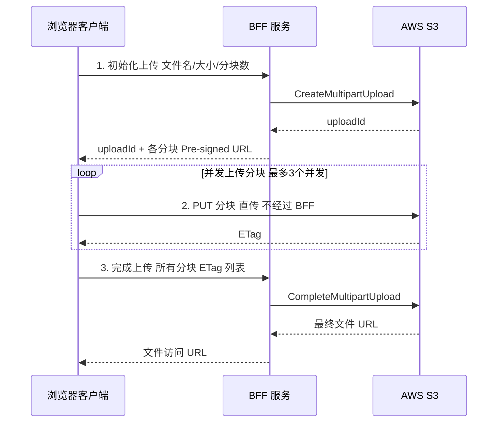

# 文件上传架构

> 文件上传看似简单，但生产环境需要处理：大文件分块、断点续传、并发限制、
> 客户端压缩、进度展示、错误重试、安全校验。

---

## 面试框架（45分钟怎么答）

**第一步（开场）**：先澄清约束——最大文件大小？断点续传？是否需要直传云存储（S3）？客户端压缩/格式转换需求？
**第二步（核心）**：大文件分块上传流程（file.slice → 并发上传分块 → 服务端合并）；Pre-signed URL 直传 S3（服务端不中转，节省带宽）
**第三步（深挖）**：断点续传（上传前查询已上传分块列表，跳过已完成的）；客户端图片压缩（Canvas + toBlob 降分辨率）；上传安全（文件类型校验不能只看扩展名，要读 magic bytes）
**差异化得分点**：提出 tus 协议（标准化断点续传，有官方客户端库 tus-js-client）；并发限制（同时最多 3 个分块请求，避免占满带宽）

---

## 架构图：大文件分块上传流程



---

## 决策树：上传方案选型


---

## 上传方案选型

| 方案 | 适用场景 | 最大文件 | 断点续传 |
|------|---------|---------|---------|
| **直接 POST** | 小文件（< 5MB）| 受服务端限制 | ✗ |
| **分块上传** | 中大文件（5MB - 5GB）| 理论无限制 | ✓（手动实现）|
| **Pre-signed URL** | 直传云存储（S3）| 5TB | ✓（分片上传）|
| **tus 协议** | 大文件、不稳定网络 | 无限制 | ✓（标准协议）|

---

## 简单文件上传

```typescript
// 基础上传组件
function FileUpload({ onSuccess }: { onSuccess: (url: string) => void }) {
  const [progress, setProgress] = useState(0);
  const [status, setStatus] = useState<'idle' | 'uploading' | 'done' | 'error'>('idle');

  const upload = async (file: File) => {
    // 客户端校验
    if (file.size > 10 * 1024 * 1024) {
      alert('文件不能超过 10MB');
      return;
    }
    if (!['image/jpeg', 'image/png', 'image/webp'].includes(file.type)) {
      alert('只支持 JPG/PNG/WebP 格式');
      return;
    }

    setStatus('uploading');
    const formData = new FormData();
    formData.append('file', file);

    try {
      // XMLHttpRequest 支持进度事件（fetch 不支持上传进度）
      const result = await uploadWithProgress(formData, (pct) => setProgress(pct));
      setStatus('done');
      onSuccess(result.url);
    } catch {
      setStatus('error');
    }
  };

  return (
    <div
      onDragOver={e => e.preventDefault()}
      onDrop={e => {
        e.preventDefault();
        const file = e.dataTransfer.files[0];
        if (file) upload(file);
      }}
    >
      <input type="file" accept="image/*" onChange={e => {
        const file = e.target.files?.[0];
        if (file) upload(file);
      }} />
      {status === 'uploading' && <ProgressBar value={progress} />}
    </div>
  );
}

// XMLHttpRequest 上传（支持进度）
function uploadWithProgress(
  formData: FormData,
  onProgress: (pct: number) => void
): Promise<{ url: string }> {
  return new Promise((resolve, reject) => {
    const xhr = new XMLHttpRequest();

    xhr.upload.addEventListener('progress', (event) => {
      if (event.lengthComputable) {
        onProgress(Math.round((event.loaded / event.total) * 100));
      }
    });

    xhr.addEventListener('load', () => {
      if (xhr.status >= 200 && xhr.status < 300) {
        resolve(JSON.parse(xhr.responseText));
      } else {
        reject(new Error(`Upload failed: ${xhr.status}`));
      }
    });

    xhr.addEventListener('error', () => reject(new Error('Network error')));

    xhr.open('POST', '/api/upload');
    xhr.setRequestHeader('Authorization', `Bearer ${getToken()}`);
    xhr.send(formData);
  });
}
```

---

## 分块上传（Chunked Upload）

### 核心逻辑

```typescript
const CHUNK_SIZE = 5 * 1024 * 1024; // 5MB per chunk

interface ChunkUploadState {
  fileId: string;
  totalChunks: number;
  uploadedChunks: Set<number>;
  status: 'uploading' | 'paused' | 'done' | 'error';
}

class ChunkedUploader {
  private abortController: AbortController | null = null;
  private concurrency = 3;  // 最多同时上传 3 个分块

  async upload(
    file: File,
    onProgress: (pct: number) => void
  ): Promise<string> {
    // 1. 初始化上传会话（服务端分配 fileId）
    const { fileId, uploadedChunks = [] } = await this.initUpload(file);

    const totalChunks = Math.ceil(file.size / CHUNK_SIZE);
    const uploadedSet = new Set(uploadedChunks);

    this.abortController = new AbortController();

    // 2. 生成待上传分块列表（跳过已上传的）
    const pendingChunks = Array.from(
      { length: totalChunks },
      (_, i) => i
    ).filter(i => !uploadedSet.has(i));

    // 3. 并发上传分块（控制并发数）
    await this.uploadChunksConcurrently(
      file, fileId, pendingChunks, totalChunks, uploadedSet, onProgress
    );

    // 4. 通知服务端合并分块
    const { url } = await this.completeUpload(fileId);
    return url;
  }

  private async uploadChunksConcurrently(
    file: File,
    fileId: string,
    chunks: number[],
    total: number,
    uploaded: Set<number>,
    onProgress: (pct: number) => void
  ) {
    // 信号量控制并发
    const semaphore = new Semaphore(this.concurrency);

    await Promise.all(
      chunks.map(chunkIndex =>
        semaphore.acquire().then(async (release) => {
          try {
            await this.uploadChunk(file, fileId, chunkIndex);
            uploaded.add(chunkIndex);
            onProgress(Math.round((uploaded.size / total) * 100));
          } finally {
            release();
          }
        })
      )
    );
  }

  private async uploadChunk(file: File, fileId: string, chunkIndex: number) {
    const start = chunkIndex * CHUNK_SIZE;
    const end = Math.min(start + CHUNK_SIZE, file.size);
    const chunk = file.slice(start, end);  // Blob.slice，不复制内存

    const formData = new FormData();
    formData.append('chunk', chunk);
    formData.append('fileId', fileId);
    formData.append('chunkIndex', String(chunkIndex));

    // 自动重试（网络抖动）
    for (let attempt = 0; attempt < 3; attempt++) {
      try {
        const res = await fetch('/api/upload/chunk', {
          method: 'POST',
          body: formData,
          signal: this.abortController?.signal,
        });
        if (!res.ok) throw new Error(`Chunk ${chunkIndex} failed: ${res.status}`);
        return;
      } catch (err) {
        if (attempt === 2) throw err;
        await sleep(1000 * 2 ** attempt);  // 指数退避
      }
    }
  }

  private async initUpload(file: File): Promise<{ fileId: string; uploadedChunks: number[] }> {
    // 用文件内容 hash 作为 fileId，实现秒传（服务端已有相同文件直接返回 URL）
    const hash = await computeFileHash(file);

    const res = await fetch('/api/upload/init', {
      method: 'POST',
      headers: { 'Content-Type': 'application/json' },
      body: JSON.stringify({
        fileId: hash,
        fileName: file.name,
        fileSize: file.size,
        mimeType: file.type,
        totalChunks: Math.ceil(file.size / CHUNK_SIZE),
      }),
    });
    return res.json();
  }

  private async completeUpload(fileId: string): Promise<{ url: string }> {
    const res = await fetch('/api/upload/complete', {
      method: 'POST',
      headers: { 'Content-Type': 'application/json' },
      body: JSON.stringify({ fileId }),
    });
    return res.json();
  }

  pause() { this.abortController?.abort(); }
  resume(file: File, onProgress: (pct: number) => void) {
    return this.upload(file, onProgress);  // 重新上传，服务端返回已上传 chunks 跳过
  }
}

// 文件内容 Hash（用于秒传）
async function computeFileHash(file: File): Promise<string> {
  // 大文件只取前后各 2MB 计算 hash（避免阻塞主线程太久）
  const sampleSize = 2 * 1024 * 1024;
  const head = file.slice(0, sampleSize);
  const tail = file.slice(Math.max(0, file.size - sampleSize));

  const [headBuf, tailBuf] = await Promise.all([
    head.arrayBuffer(),
    tail.arrayBuffer(),
  ]);

  // 合并 head + 文件大小 + tail
  const combined = new Uint8Array(headBuf.byteLength + 8 + tailBuf.byteLength);
  combined.set(new Uint8Array(headBuf), 0);
  new DataView(combined.buffer).setBigUint64(headBuf.byteLength, BigInt(file.size));
  combined.set(new Uint8Array(tailBuf), headBuf.byteLength + 8);

  const hashBuf = await crypto.subtle.digest('SHA-256', combined);
  return Array.from(new Uint8Array(hashBuf)).map(b => b.toString(16).padStart(2, '0')).join('');
}
```

---

## Pre-signed URL（直传 S3）

```typescript
// 客户端直传云存储，不经过业务服务器（节省带宽和服务器资源）

async function uploadToS3(file: File, onProgress: (pct: number) => void): Promise<string> {
  // 1. 向业务服务端请求预签名 URL
  const { uploadUrl, fileKey } = await fetch('/api/upload/presign', {
    method: 'POST',
    headers: { 'Content-Type': 'application/json' },
    body: JSON.stringify({
      fileName: file.name,
      fileType: file.type,
      fileSize: file.size,
    }),
  }).then(r => r.json());

  // 2. 直接 PUT 到 S3（Pre-signed URL 已包含认证信息）
  await uploadWithProgress(
    uploadUrl,
    'PUT',
    file,   // 直接 PUT 文件，不用 FormData
    { 'Content-Type': file.type },
    onProgress
  );

  // 3. 通知业务服务端上传完成
  const { publicUrl } = await fetch('/api/upload/confirm', {
    method: 'POST',
    headers: { 'Content-Type': 'application/json' },
    body: JSON.stringify({ fileKey }),
  }).then(r => r.json());

  return publicUrl;
}

// 服务端生成 Pre-signed URL
// api/upload/presign.ts
import { S3Client, PutObjectCommand } from '@aws-sdk/client-s3';
import { getSignedUrl } from '@aws-sdk/s3-request-presigner';

export async function POST(req: Request) {
  const { fileName, fileType, fileSize } = await req.json();

  // 安全校验
  if (fileSize > 100 * 1024 * 1024) return Response.json({ error: 'File too large' }, { status: 400 });
  if (!['image/jpeg', 'image/png', 'video/mp4'].includes(fileType)) {
    return Response.json({ error: 'File type not allowed' }, { status: 400 });
  }

  const fileKey = `uploads/${crypto.randomUUID()}/${fileName}`;

  const command = new PutObjectCommand({
    Bucket: process.env.S3_BUCKET,
    Key: fileKey,
    ContentType: fileType,
    ContentLength: fileSize,
    // 防止用户上传超大文件（双重保险）
    Metadata: { 'max-size': String(100 * 1024 * 1024) },
  });

  const uploadUrl = await getSignedUrl(s3Client, command, { expiresIn: 300 }); // 5 分钟有效

  return Response.json({ uploadUrl, fileKey });
}
```

---

## tus 协议（断点续传标准）

```typescript
// tus 是开放的断点续传协议，服务端/客户端都有成熟实现

import { Upload } from 'tus-js-client';

function uploadWithTus(file: File, onProgress: (pct: number) => void): Promise<string> {
  return new Promise((resolve, reject) => {
    const upload = new Upload(file, {
      endpoint: 'https://tusd.example.com/files/',
      retryDelays: [0, 3000, 5000, 10000, 20000],  // 自动重试时间间隔
      chunkSize: 5 * 1024 * 1024,  // 5MB 分块
      metadata: {
        filename: file.name,
        filetype: file.type,
      },
      headers: {
        Authorization: `Bearer ${getToken()}`,
      },

      onProgress(bytesUploaded, bytesTotal) {
        onProgress(Math.round((bytesUploaded / bytesTotal) * 100));
      },

      onSuccess() {
        resolve(upload.url!);
      },

      onError(error) {
        reject(error);
      },
    });

    // 检查是否有未完成的上传（断点续传）
    upload.findPreviousUploads().then(previousUploads => {
      if (previousUploads.length > 0) {
        upload.resumeFromPreviousUpload(previousUploads[0]);
      }
      upload.start();
    });
  });
}
```

---

## 客户端图片压缩

```typescript
// 上传前在浏览器端压缩图片，减少上传时间和存储成本
import Compressor from 'compressorjs';

function compressImage(file: File, options?: Compressor.Options): Promise<File> {
  return new Promise((resolve, reject) => {
    new Compressor(file, {
      quality: 0.8,           // 80% 质量（通常视觉无感知）
      maxWidth: 1920,         // 最大宽度
      maxHeight: 1080,
      convertSize: 2000000,  // > 2MB 的 PNG 转换为 JPEG
      success(result) {
        // Compressor 返回 Blob，包装为 File
        resolve(new File([result], file.name, { type: result.type }));
      },
      error: reject,
      ...options,
    });
  });
}

// 在上传前先压缩
async function handleImageUpload(file: File) {
  let processedFile = file;

  if (file.type.startsWith('image/') && file.size > 500 * 1024) {
    console.log(`Compressing: ${(file.size / 1024).toFixed(0)}KB`);
    processedFile = await compressImage(file);
    console.log(`Compressed: ${(processedFile.size / 1024).toFixed(0)}KB`);
  }

  return uploadToS3(processedFile, setProgress);
}
```

---

## 多文件并发上传

```typescript
// 并发上传多个文件（控制并发数避免占满带宽）
class Semaphore {
  private permits: number;
  private queue: (() => void)[] = [];

  constructor(permits: number) {
    this.permits = permits;
  }

  acquire(): Promise<() => void> {
    return new Promise(resolve => {
      const tryAcquire = () => {
        if (this.permits > 0) {
          this.permits--;
          resolve(() => {
            this.permits++;
            this.queue.shift()?.();
          });
        } else {
          this.queue.push(tryAcquire);
        }
      };
      tryAcquire();
    });
  }
}

async function uploadMultipleFiles(
  files: File[],
  onProgress: (fileIndex: number, pct: number) => void
): Promise<string[]> {
  const semaphore = new Semaphore(3);  // 最多同时上传 3 个文件

  const results = await Promise.allSettled(
    files.map(async (file, index) => {
      const release = await semaphore.acquire();
      try {
        return await uploadToS3(file, pct => onProgress(index, pct));
      } finally {
        release();
      }
    })
  );

  // 返回成功上传的 URL，失败的记录错误
  return results.map((result, index) => {
    if (result.status === 'fulfilled') return result.value;
    console.error(`File ${files[index].name} upload failed:`, result.reason);
    return '';
  }).filter(Boolean);
}
```

---

## 上传安全

```typescript
// 服务端：必须对上传文件进行安全校验

// 1. 文件类型校验（不信任 MIME type，检查文件魔数）
import { fileTypeFromBuffer } from 'file-type';

async function validateFileType(buffer: ArrayBuffer, allowedTypes: string[]): Promise<boolean> {
  const type = await fileTypeFromBuffer(buffer);
  return type ? allowedTypes.includes(type.mime) : false;
}

// 2. 病毒扫描（接入 ClamAV 或 VirusTotal API）
async function scanForViruses(fileBuffer: Buffer): Promise<boolean> {
  // 接入 ClamAV
  const result = await clamav.scanBuffer(fileBuffer);
  return result.isClean;
}

// 3. 图片元数据清理（防止 EXIF 信息泄露位置）
import sharp from 'sharp';
async function stripMetadata(imageBuffer: Buffer): Promise<Buffer> {
  return sharp(imageBuffer).rotate().toBuffer();  // rotate() 会自动应用 EXIF 方向并清除元数据
}

// 4. 内容审核（接入 AWS Rekognition / 阿里云绿网）
async function moderateImage(s3Key: string): Promise<boolean> {
  const result = await rekognition.detectModerationLabels({ Image: { S3Object: { Bucket, Name: s3Key } } });
  return result.ModerationLabels?.length === 0;  // 无违规内容
}
```

---

## 面试常见追问

**Q: 为什么要分块上传而不是整个文件上传？**
A: 三个原因：①断点续传（网络中断后从已上传的分块继续）；②内存效率（`file.slice()` 不复制内存，只是引用原始数据）；③并行上传（多个分块同时上传，利用多连接）。

**Q: Pre-signed URL 有什么安全风险？**
A: ①URL 泄露（有效期内任何人都能上传）→ 设置短过期时间（5-15 分钟）；②绕过服务端校验直接上传恶意文件 → 上传完成后服务端异步校验（文件类型、病毒扫描）、不合规则删除文件；③用户上传超大文件 → PutObject 设置 ContentLength 限制。

**Q: 断点续传的状态存在哪里？**
A: 客户端：localStorage 存 `{fileHash → uploadedChunks[]}`；服务端：Redis 存上传会话状态（TTL 24-72 小时）。两者结合：用文件内容 Hash 作为 key，客户端启动时查询服务端已上传的分块，跳过已上传的。

**Q: 大文件上传如何防止内存溢出？**
A: `file.slice(start, end)` 返回的是 Blob 的**引用**，不复制数据到内存。真正的内存消耗发生在 `chunk.arrayBuffer()` 时。分块上传 + 每次只处理一个分块（信号量控制并发）可以将内存占用控制在 `并发数 × 分块大小` 以内。
