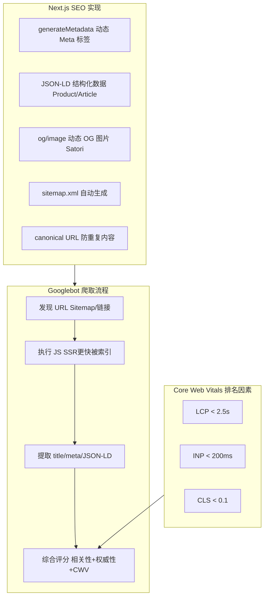

# SEO 架构

> SEO 对于内容站、电商、SaaS 落地页至关重要。
> 本文覆盖：Meta 标签、Open Graph、JSON-LD 结构化数据、动态 OG 图片、Sitemap、Canonical URL。

---

## 面试框架（45分钟怎么答）

**第一步（开场）**：澄清场景——内容站 / 电商 / SaaS 落地页？SEO 重要性多高？有多少页面需要索引（影响 Sitemap 策略）？
**第二步（核心）**：SSR/SSG 确保爬虫看到完整内容；Meta 标签（title/description/OG/Twitter Card）；JSON-LD 结构化数据（Product/Article/BreadcrumbList）
**第三步（深挖）**：动态 OG 图片（Next.js ImageResponse 用 Satori 服务端渲染 JSX 为图片）；Sitemap 自动生成（动态路由 + lastmod 时间戳）；Canonical URL 防重复内容惩罚
**差异化得分点**：Core Web Vitals 是 Google 排名因素之一（LCP/INP/CLS）；提出 `hreflang` 标签用于多语言站点告诉 Google 各语言版本关系

---

## 架构图：SEO 技术栈



---

## SEO 基础：搜索引擎如何工作

```
1. 爬取（Crawl）：Googlebot 发现并访问页面
2. 渲染（Render）：Google 执行 JS（但有延迟，SSR 更可靠）
3. 索引（Index）：提取内容、标题、链接
4. 排名（Rank）：根据相关性、权威性、体验给出排名

前端 SEO 关注点：
  ✓ 服务端渲染（爬虫看到完整内容）
  ✓ Meta 标签（标题、描述）
  ✓ 结构化数据（JSON-LD，让搜索引擎理解内容）
  ✓ Core Web Vitals（页面体验信号）
  ✓ Sitemap（帮助发现所有页面）
  ✓ Canonical URL（避免重复内容）
```

---

## Meta 标签

### 基础 Meta 标签

```typescript
// Next.js App Router — 动态 Metadata
import type { Metadata, ResolvingMetadata } from 'next';

// 静态 Metadata
export const metadata: Metadata = {
  title: {
    template: '%s | My Store',  // %s 替换为页面标题
    default: 'My Store',
  },
  description: 'The best online store for electronics',
  keywords: ['electronics', 'iPhone', 'laptop'],
  authors: [{ name: 'My Store Team' }],
  robots: {
    index: true,
    follow: true,
    googleBot: { index: true, follow: true, 'max-image-preview': 'large' },
  },
};

// 动态 Metadata（根据页面数据生成）
export async function generateMetadata(
  { params }: { params: { id: string } },
  parent: ResolvingMetadata
): Promise<Metadata> {
  const product = await fetchProduct(params.id);

  // 继承父级 Metadata
  const parentMeta = await parent;

  return {
    title: product.name,
    description: product.description.slice(0, 160),  // 描述控制在 160 字符内
    openGraph: {
      title: product.name,
      description: product.description,
      images: [
        {
          url: product.imageUrl,
          width: 1200,
          height: 630,
          alt: product.name,
        },
      ],
      type: 'website',
    },
    twitter: {
      card: 'summary_large_image',
      title: product.name,
      description: product.description,
      images: [product.imageUrl],
    },
    alternates: {
      canonical: `https://example.com/products/${product.slug}`,
      languages: {
        'en-US': `https://example.com/en/products/${product.slug}`,
        'zh-CN': `https://example.com/zh/products/${product.slug}`,
      },
    },
  };
}
```

### 渲染后的 HTML

```html
<head>
  <title>iPhone 16 Pro | My Store</title>
  <meta name="description" content="iPhone 16 Pro with A18 chip...">
  <meta name="robots" content="index, follow">
  <link rel="canonical" href="https://example.com/products/iphone-16-pro">

  <!-- Open Graph（Facebook / 微信分享）-->
  <meta property="og:title" content="iPhone 16 Pro">
  <meta property="og:description" content="iPhone 16 Pro with A18 chip...">
  <meta property="og:image" content="https://example.com/og/iphone-16-pro.jpg">
  <meta property="og:url" content="https://example.com/products/iphone-16-pro">
  <meta property="og:type" content="product">

  <!-- Twitter Card -->
  <meta name="twitter:card" content="summary_large_image">
  <meta name="twitter:title" content="iPhone 16 Pro">
  <meta name="twitter:image" content="https://example.com/og/iphone-16-pro.jpg">

  <!-- 多语言 hreflang -->
  <link rel="alternate" hreflang="en" href="https://example.com/en/products/iphone-16-pro">
  <link rel="alternate" hreflang="zh" href="https://example.com/zh/products/iphone-16-pro">
</head>
```

---

## JSON-LD 结构化数据

> Google 会在搜索结果中为包含结构化数据的页面显示"富摘要"（Rich Snippets），
> 提高点击率（CTR）。

### 商品页（Product Schema）

```typescript
// 商品页结构化数据 → Google 展示价格、库存、评分
function ProductJsonLd({ product }: { product: Product }) {
  const schema = {
    '@context': 'https://schema.org',
    '@type': 'Product',
    name: product.name,
    description: product.description,
    image: product.images,
    brand: { '@type': 'Brand', name: product.brand },
    sku: product.sku,
    offers: {
      '@type': 'Offer',
      url: `https://example.com/products/${product.slug}`,
      priceCurrency: 'CNY',
      price: product.price,
      priceValidUntil: '2025-12-31',
      availability: product.inStock
        ? 'https://schema.org/InStock'
        : 'https://schema.org/OutOfStock',
      seller: { '@type': 'Organization', name: 'My Store' },
    },
    aggregateRating: product.reviewCount > 0 ? {
      '@type': 'AggregateRating',
      ratingValue: product.avgRating,
      reviewCount: product.reviewCount,
      bestRating: 5,
    } : undefined,
  };

  return (
    <script
      type="application/ld+json"
      dangerouslySetInnerHTML={{ __html: JSON.stringify(schema) }}
    />
  );
}
```

### 面包屑（BreadcrumbList）

```typescript
// 面包屑 → Google 在搜索结果中显示路径（提升 CTR）
function BreadcrumbJsonLd({ items }: { items: { name: string; url: string }[] }) {
  const schema = {
    '@context': 'https://schema.org',
    '@type': 'BreadcrumbList',
    itemListElement: items.map((item, index) => ({
      '@type': 'ListItem',
      position: index + 1,
      name: item.name,
      item: item.url,
    })),
  };

  return <script type="application/ld+json" dangerouslySetInnerHTML={{ __html: JSON.stringify(schema) }} />;
}

// 使用
<BreadcrumbJsonLd items={[
  { name: '首页', url: 'https://example.com' },
  { name: '手机', url: 'https://example.com/phones' },
  { name: 'iPhone 16 Pro', url: 'https://example.com/phones/iphone-16-pro' },
]} />
```

### 常用 Schema 类型

| Schema 类型 | 适用页面 | 富摘要效果 |
|------------|---------|----------|
| `Product` | 商品详情页 | 价格、库存、评分星级 |
| `Article` | 博客文章 | 作者、发布时间 |
| `FAQPage` | FAQ 页面 | 直接在搜索结果展开问答 |
| `HowTo` | 教程 | 分步骤展示 |
| `LocalBusiness` | 本地商家 | 地址、电话、营业时间 |
| `Recipe` | 食谱 | 配料、时间、评分 |
| `Event` | 活动 | 时间、地点、价格 |
| `JobPosting` | 招聘 | 职位、薪资、地点 |

---

## 动态 OG 图片生成

> 每个页面有独特的预览图，分享到微信/Twitter 时显示漂亮的卡片。

### 方案 1：Vercel OG（@vercel/og）

```typescript
// app/api/og/route.tsx — 动态生成 OG 图片
import { ImageResponse } from 'next/og';

export const runtime = 'edge';  // 在边缘节点运行，全球低延迟

export async function GET(request: Request) {
  const { searchParams } = new URL(request.url);
  const title = searchParams.get('title') ?? 'My Page';
  const description = searchParams.get('description') ?? '';
  const category = searchParams.get('category') ?? '';

  // 加载字体（支持中文）
  const fontData = await fetch(
    new URL('../../../public/fonts/NotoSansSC-Bold.ttf', import.meta.url)
  ).then(res => res.arrayBuffer());

  return new ImageResponse(
    (
      // JSX → PNG（1200x630，OG 标准尺寸）
      <div
        style={{
          width: '1200px', height: '630px',
          display: 'flex', flexDirection: 'column',
          background: 'linear-gradient(135deg, #1677ff 0%, #0052cc 100%)',
          padding: '60px',
          fontFamily: 'NotoSansSC',
        }}
      >
        {category && (
          <span style={{ color: 'rgba(255,255,255,0.7)', fontSize: '24px', marginBottom: '16px' }}>
            {category}
          </span>
        )}
        <h1 style={{ color: 'white', fontSize: '64px', fontWeight: 700, margin: 0, lineHeight: 1.2 }}>
          {title}
        </h1>
        {description && (
          <p style={{ color: 'rgba(255,255,255,0.8)', fontSize: '32px', marginTop: '24px' }}>
            {description.slice(0, 100)}
          </p>
        )}
        <div style={{ marginTop: 'auto', display: 'flex', alignItems: 'center', gap: '12px' }}>
          
          <span style={{ color: 'rgba(255,255,255,0.9)', fontSize: '28px' }}>My Store</span>
        </div>
      </div>
    ),
    {
      width: 1200,
      height: 630,
      fonts: [{ name: 'NotoSansSC', data: fontData, weight: 700 }],
    }
  );
}

// 在 Metadata 中引用
export async function generateMetadata({ params }) {
  const product = await fetchProduct(params.id);
  const ogImageUrl = `https://example.com/api/og?title=${encodeURIComponent(product.name)}&category=${encodeURIComponent(product.category)}`;

  return {
    openGraph: {
      images: [{ url: ogImageUrl, width: 1200, height: 630 }],
    },
  };
}
```

---

## Sitemap

### 动态 Sitemap 生成

```typescript
// app/sitemap.ts — Next.js 自动生成 sitemap.xml
import { MetadataRoute } from 'next';

export default async function sitemap(): Promise<MetadataRoute.Sitemap> {
  const baseUrl = 'https://example.com';

  // 静态页面
  const staticPages: MetadataRoute.Sitemap = [
    { url: baseUrl, lastModified: new Date(), changeFrequency: 'daily', priority: 1 },
    { url: `${baseUrl}/about`, changeFrequency: 'monthly', priority: 0.5 },
    { url: `${baseUrl}/blog`, changeFrequency: 'daily', priority: 0.8 },
  ];

  // 动态页面（从数据库获取）
  const products = await db.product.findMany({
    select: { slug: true, updatedAt: true },
    where: { status: 'active' },
  });

  const productPages: MetadataRoute.Sitemap = products.map(p => ({
    url: `${baseUrl}/products/${p.slug}`,
    lastModified: p.updatedAt,
    changeFrequency: 'weekly',
    priority: 0.7,
  }));

  return [...staticPages, ...productPages];
}
```

### 大型站点的 Sitemap Index

```typescript
// 商品超过 50000 条时，需要 Sitemap Index（拆分多个 Sitemap 文件）
// app/sitemap-index.xml/route.ts

export async function GET() {
  const totalProducts = await db.product.count();
  const sitemapsNeeded = Math.ceil(totalProducts / 50000);

  const sitemapIndex = `<?xml version="1.0" encoding="UTF-8"?>
<sitemapindex xmlns="http://www.sitemaps.org/schemas/sitemap/0.9">
  <sitemap>
    <loc>https://example.com/sitemap-static.xml</loc>
    <lastmod>${new Date().toISOString()}</lastmod>
  </sitemap>
  ${Array.from({ length: sitemapsNeeded }, (_, i) => `
  <sitemap>
    <loc>https://example.com/sitemap-products-${i + 1}.xml</loc>
    <lastmod>${new Date().toISOString()}</lastmod>
  </sitemap>`).join('')}
</sitemapindex>`;

  return new Response(sitemapIndex, {
    headers: { 'Content-Type': 'application/xml' },
  });
}
```

---

## Canonical URL（规范 URL）

### 重复内容问题

```
同一商品可能通过多个 URL 访问：
  /products/iphone-16-pro
  /products/iphone-16-pro?color=black
  /products/iphone-16-pro?ref=homepage
  /products/123  （旧 ID URL）

如果不设 Canonical，Google 不知道哪个是"正确"的，分散权重
```

```typescript
// 设置 Canonical（Next.js）
export async function generateMetadata({ params, searchParams }) {
  const product = await fetchProduct(params.slug);

  return {
    alternates: {
      // Canonical 永远指向"干净"的 URL（不含跟踪参数）
      canonical: `https://example.com/products/${product.slug}`,
    },
  };
}

// 分页内容的 Canonical 处理
// /products?page=1 → canonical: /products（第一页指向无参数 URL）
// /products?page=2 → canonical: /products?page=2（后续页面保留页码参数）
```

---

## robots.txt

```typescript
// app/robots.ts
import { MetadataRoute } from 'next';

export default function robots(): MetadataRoute.Robots {
  return {
    rules: [
      {
        userAgent: '*',
        allow: '/',
        disallow: [
          '/admin/',
          '/api/',
          '/checkout/',
          '/account/',
          '/*?*',  // 禁止爬取带参数的 URL（减少重复内容）
        ],
      },
      {
        userAgent: 'GPTBot',  // 禁止 OpenAI 爬虫
        disallow: '/',
      },
    ],
    sitemap: 'https://example.com/sitemap.xml',
    host: 'https://example.com',
  };
}
```

---

## 国际化 SEO（hreflang）

```typescript
// 多语言站点必须设置 hreflang，告知 Google 各语言版本
export async function generateMetadata({ params: { locale, slug } }) {
  const locales = ['en', 'zh', 'ja', 'ko'];

  return {
    alternates: {
      canonical: `https://example.com/${locale}/products/${slug}`,
      languages: Object.fromEntries(
        locales.map(l => [l, `https://example.com/${l}/products/${slug}`])
      ),
      // x-default 指向默认语言（通常是英语）
      // { 'x-default': `https://example.com/en/products/${slug}` }
    },
  };
}
```

---

## 面试常见追问

**Q: CSR（React SPA）的 SEO 问题是什么？**
A: Googlebot 能执行 JS，但有延迟（可能是几天）且不保证完全渲染。首次爬取看到的是空 HTML，索引滞后。解决：用 SSR/SSG 确保爬虫直接看到完整内容；或使用预渲染服务（prerender.io）为爬虫提供静态 HTML。

**Q: 如何验证结构化数据是否正确？**
A: Google 的 Rich Results Test（search.google.com/test/rich-results），输入 URL 或 HTML，检查 JSON-LD 是否有效并预览富摘要效果。也可以用 Schema.org Validator。

**Q: 动态 OG 图片有性能问题吗？**
A: @vercel/og 基于 Satori（JSX → SVG → PNG），运行在 Edge Runtime，生成时间约 50-100ms。建议给 OG 图片 API 加 CDN 缓存（`Cache-Control: public, max-age=86400`），相同参数只生成一次。

**Q: ISR 和 SEO 怎么配合？**
A: ISR 对 SEO 友好：首次访问生成静态 HTML，后续请求从 CDN 返回（TTFB 极低）。内容更新后触发 On-demand Revalidation，Google 下次爬取时看到新内容。关键：确保 `Last-Modified` 响应头正确，帮助 Google 判断是否需要重新爬取。
