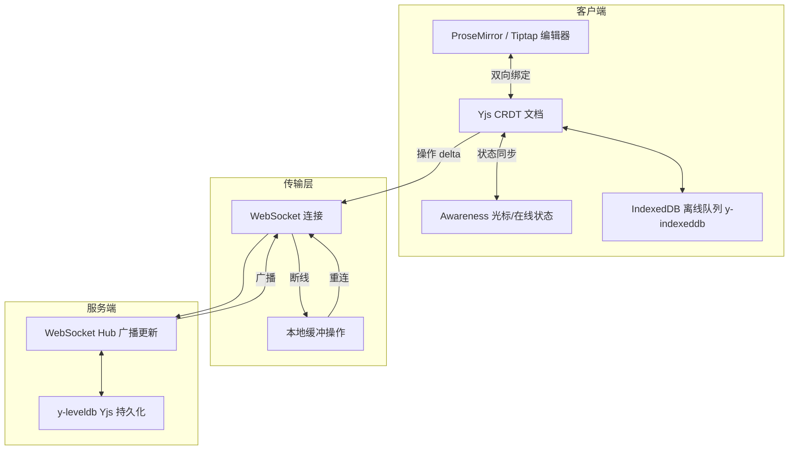

# 协作编辑器前端设计（Google Docs 风格）

> 考察：CRDT 客户端实现、光标同步、WebSocket 实时协作、离线支持。

---

## 面试框架（45分钟怎么答）

**第一步（开场，5 min）**：澄清——同时在线人数？离线编辑支持时长？富文本 vs 纯文本？操作历史（版本）需求？
**第二步（架构，10 min）**：CRDT（Yjs）vs OT——说清"CRDT 不需要中央服务器仲裁，天然支持离线合并"；Yjs + ProseMirror/Tiptap 的组合
**第三步（深挖，20 min）**：Awareness 协议（光标同步）；WebSocket 断线时本地操作存 IndexedDB，重连后批量同步；Undo/Redo 只撤销自己的操作（UndoManager per user）
**差异化得分点**：能说出 OT 和 CRDT 的区别（OT 需要中央服务器转换操作，CRDT 合并是可交换的/结合律）；提出"存档版本"用 Y-leveldb 持久化 Yjs doc

---

## 架构图：协作编辑器技术架构



---

## 需求理解（先问）

```
功能需求：
  - 多人同时实时编辑同一文档
  - 实时看到他人的光标位置和选区
  - 离线编辑后重连自动同步
  - 操作历史（Undo/Redo）
  - 用户在线状态（在线/离线/正在编辑）

非功能需求：
  - 操作延迟 < 100ms（本地即时反馈）
  - 并发编辑不丢数据，最终一致
  - 断网 30 分钟内重连后能同步
```

---

## 架构概览

```
┌─────────────────────────────────────────────────────────────────┐
│                     协作编辑器架构                               │
│                                                                 │
│  ┌──────────────┐    操作    ┌───────────────┐                  │
│  │  Editor UI   │ ─────────→ │  CRDT Engine  │                  │
│  │  (ProseMirror│ ←───────── │  (Yjs/自实现) │                  │
│  │   / Slate)   │  state变更 └───────┬───────┘                  │
│  └──────────────┘                    │ operations               │
│                                      ↓                          │
│                           ┌──────────────────────┐             │
│                           │   Sync Manager        │             │
│                           │   ├── WebSocket       │             │
│                           │   ├── Offline Queue   │             │
│                           │   └── Reconnect Logic │             │
│                           └──────────────────────┘             │
│                                      ↕ WebSocket               │
│                                  Server (Y-WebSocket)           │
│                                      ↕                          │
│                         其他客户端 (同样的 CRDT Engine)          │
└─────────────────────────────────────────────────────────────────┘
```

---

## CRDT 基础（理解 Yjs）

CRDT（Conflict-free Replicated Data Type）保证：任意顺序合并操作，最终结果相同。

**核心思想**：每个字符都有全局唯一 ID（clientID + clock），插入时记录"插在哪个字符后面"，删除是标记删除（不移动后续字符 ID）。

```typescript
// 简化版 CRDT：基于 Logoot/LSEQ 思想
interface Op {
  type: 'insert' | 'delete';
  id: string;          // 唯一 ID：`${clientId}-${clock}`
  afterId: string;     // 插在哪个字符后面（'ROOT' 表示开头）
  char?: string;       // insert 时的字符
}

class SimpleCRDT {
  private clientId: string;
  private clock = 0;
  // 有序字符列表（包含已删除的，但标记为 deleted）
  private chars: Array<{
    id: string;
    afterId: string;
    char: string;
    deleted: boolean;
  }> = [];

  constructor(clientId: string) {
    this.clientId = clientId;
  }

  // 本地插入：在位置 index 后插入字符
  localInsert(index: number, char: string): Op {
    const visibleChars = this.chars.filter(c => !c.deleted);
    const afterId = index === 0 ? 'ROOT' : visibleChars[index - 1].id;
    const id = `${this.clientId}-${++this.clock}`;

    const op: Op = { type: 'insert', id, afterId, char };
    this._applyInsert(op);
    return op;
  }

  // 本地删除
  localDelete(index: number): Op {
    const visibleChars = this.chars.filter(c => !c.deleted);
    const target = visibleChars[index];
    const op: Op = { type: 'delete', id: target.id, afterId: '' };
    this._applyDelete(op);
    return op;
  }

  // 应用远端操作（保证幂等）
  applyRemote(op: Op): void {
    if (op.type === 'insert') this._applyInsert(op);
    else this._applyDelete(op);
  }

  getText(): string {
    return this.chars
      .filter(c => !c.deleted)
      .map(c => c.char)
      .join('');
  }

  private _applyInsert(op: Op): void {
    // 已存在则跳过（幂等）
    if (this.chars.find(c => c.id === op.id)) return;

    // 找到 afterId 的位置，插在其后
    let insertIdx = 0;
    if (op.afterId !== 'ROOT') {
      const afterIdx = this.chars.findIndex(c => c.id === op.afterId);
      if (afterIdx === -1) return;  // afterId 不存在，等待依赖（实际需要操作缓冲）
      insertIdx = afterIdx + 1;
    }

    // 处理并发插入到同一位置：按 ID 字典序排（保证确定性）
    while (
      insertIdx < this.chars.length &&
      this.chars[insertIdx].afterId === op.afterId &&
      this.chars[insertIdx].id > op.id
    ) {
      insertIdx++;
    }

    this.chars.splice(insertIdx, 0, {
      id: op.id,
      afterId: op.afterId,
      char: op.char!,
      deleted: false,
    });
  }

  private _applyDelete(op: Op): void {
    const char = this.chars.find(c => c.id === op.id);
    if (char) char.deleted = true;
  }
}
```

---

## 光标同步

```typescript
interface CursorState {
  userId: string;
  name: string;
  color: string;   // 随机颜色，用于区分用户
  // 锚点（选区开始）和焦点（选区结束）
  anchor: { path: number[]; offset: number };
  focus: { path: number[]; offset: number };
}

// 光标同步：本地编辑时广播，收到远端光标时渲染
class CursorManager {
  private cursors = new Map<string, CursorState>();
  private listeners = new Set<() => void>();

  // 更新本地光标，广播给其他用户
  updateLocalCursor(state: Omit<CursorState, 'userId'>, ws: WebSocket) {
    ws.send(JSON.stringify({
      type: 'cursor',
      ...state,
    }));
  }

  // 收到远端光标
  handleRemoteCursor(state: CursorState) {
    this.cursors.set(state.userId, state);
    this.listeners.forEach(l => l());
  }

  // 用户离开时清除
  handleUserLeave(userId: string) {
    this.cursors.delete(userId);
    this.listeners.forEach(l => l());
  }

  getAll(): CursorState[] {
    return [...this.cursors.values()];
  }

  subscribe(listener: () => void): () => void {
    this.listeners.add(listener);
    return () => this.listeners.delete(listener);
  }
}

// 光标渲染（叠加在编辑器文本上）
function RemoteCursors({ cursors }: { cursors: CursorState[] }) {
  return (
    <>
      {cursors.map(cursor => (
        <div key={cursor.userId}>
          {/* 光标线 */}
          <div
            className="remote-cursor"
            style={{
              position: 'absolute',
              // 实际位置需通过编辑器 API 将 path/offset 转换为屏幕坐标
              borderLeft: `2px solid ${cursor.color}`,
            }}
          />
          {/* 用户名标签 */}
          <div
            className="remote-cursor-label"
            style={{ backgroundColor: cursor.color }}
          >
            {cursor.name}
          </div>
        </div>
      ))}
    </>
  );
}
```

---

## WebSocket 连接管理

```typescript
type SyncMessage =
  | { type: 'op'; op: Op; docVersion: number }
  | { type: 'cursor'; cursor: CursorState }
  | { type: 'sync'; ops: Op[] }           // 重连后的全量同步
  | { type: 'presence'; users: string[] };

class CollabSync {
  private ws: WebSocket | null = null;
  private pendingOps: Op[] = [];         // 离线期间的操作队列
  private docVersion = 0;
  private reconnectDelay = 1000;
  private isOnline = navigator.onLine;

  constructor(
    private docId: string,
    private crdt: SimpleCRDT,
    private onRemoteOp: (op: Op) => void
  ) {
    window.addEventListener('online', () => this._handleOnline());
    window.addEventListener('offline', () => this._handleOffline());
    this._connect();
  }

  sendOp(op: Op): void {
    if (this.ws?.readyState === WebSocket.OPEN) {
      this.ws.send(JSON.stringify({
        type: 'op',
        op,
        docVersion: this.docVersion,
      }));
    } else {
      // 离线：缓存操作
      this.pendingOps.push(op);
      this._persistPendingOps();  // 写入 IndexedDB
    }
  }

  private _connect(): void {
    this.ws = new WebSocket(`wss://collab.example.com/doc/${this.docId}`);

    this.ws.onopen = () => {
      this.reconnectDelay = 1000;
      // 重连后请求缺失的操作
      this.ws!.send(JSON.stringify({
        type: 'sync_request',
        fromVersion: this.docVersion,
      }));
    };

    this.ws.onmessage = (e) => {
      const msg = JSON.parse(e.data) as SyncMessage;
      this._handleMessage(msg);
    };

    this.ws.onclose = () => {
      // 指数退避重连
      setTimeout(() => this._connect(), this.reconnectDelay);
      this.reconnectDelay = Math.min(this.reconnectDelay * 2, 30000);
    };
  }

  private _handleMessage(msg: SyncMessage): void {
    if (msg.type === 'op') {
      this.onRemoteOp(msg.op);
      this.docVersion = msg.docVersion;
    } else if (msg.type === 'sync') {
      // 重连后补齐缺失的操作
      msg.ops.forEach(op => this.onRemoteOp(op));
      // 将离线期间的操作发送给服务器
      this._flushPendingOps();
    }
  }

  private _flushPendingOps(): void {
    while (this.pendingOps.length > 0) {
      const op = this.pendingOps.shift()!;
      this.sendOp(op);
    }
  }

  private _handleOnline(): void {
    this.isOnline = true;
    if (!this.ws || this.ws.readyState !== WebSocket.OPEN) {
      this._connect();
    }
  }

  private _handleOffline(): void {
    this.isOnline = false;
  }

  private _persistPendingOps(): void {
    // 写入 IndexedDB 以防页面刷新时丢失
    localStorage.setItem(
      `pending_ops_${this.docId}`,
      JSON.stringify(this.pendingOps)
    );
  }
}
```

---

## 生产方案：Yjs

```typescript
// 生产中直接使用 Yjs（成熟的 CRDT 库）
import * as Y from 'yjs';
import { WebsocketProvider } from 'y-websocket';
import { QuillBinding } from 'y-quill';  // 或 y-prosemirror

const doc = new Y.Doc();
const provider = new WebsocketProvider(
  'wss://yjs-server.example.com',
  'my-document-id',
  doc
);

// 共享文本类型
const yText = doc.getText('content');

// 用户状态（光标、颜色）
provider.awareness.setLocalStateField('user', {
  name: 'Alice',
  color: '#ff0000',
});

// 监听他人光标变化
provider.awareness.on('change', () => {
  const states = provider.awareness.getStates();
  // 渲染他人光标...
});

// 连接 Quill 编辑器
const binding = new QuillBinding(yText, quillEditor, provider.awareness);

// 离线支持：IndexedDB 持久化
import { IndexeddbPersistence } from 'y-indexeddb';
const persistence = new IndexeddbPersistence('my-document-id', doc);
```

---

## 性能优化

```typescript
// 1. 操作批处理：快速连续输入时批量发送
class OpBatcher {
  private batch: Op[] = [];
  private timer: ReturnType<typeof setTimeout> | null = null;

  add(op: Op, onFlush: (ops: Op[]) => void): void {
    this.batch.push(op);
    if (!this.timer) {
      this.timer = setTimeout(() => {
        onFlush([...this.batch]);
        this.batch = [];
        this.timer = null;
      }, 50);  // 50ms 内的操作批量发送
    }
  }
}

// 2. 大文档分片加载：只加载当前视口附近的内容
// 3. 操作压缩：合并连续的同类操作（如连续插入"hello"压缩为一个操作）
// 4. 服务端操作排序：使用 Lamport 时间戳保证操作顺序确定性
```

---

## 面试追问

**Q: 为什么选择 CRDT 而不是 OT（操作转换）？**
A: OT（Google Docs 原始方案）需要中心化服务器对操作进行全局排序和转换，服务端逻辑复杂，且 P2P 扩展困难。CRDT 不需要中心服务器，操作可以以任意顺序合并，最终结果相同，天然支持离线和 P2P，但内存开销更大（保留已删除字符）。Yjs、Automerge 都是 CRDT 的成熟实现。

## 常见踩坑

**踩坑1：用字符索引同步光标位置**
❌ 错误：用户 A 的光标在第 50 个字符，广播 `cursorPos: 50`；用户 B 在位置 20 插入 5 个字符后，用户 A 的光标实际应在第 55 位，但 B 收到的仍是 50，光标偏移。
✓ 正确：用 CRDT 的相对位置（`Y.RelativePosition`）锚定光标到具体字符 ID，插入/删除不影响光标绑定的语义位置。
原因：绝对索引在并发编辑时随时失效，CRDT 的稳定 ID 才能正确追踪位置。

**踩坑2：OT（Operational Transformation）中间件在客户端实现不正确**
❌ 错误：自行实现 OT 的 transform 函数，忽略了部分并发操作组合（如同位置同时删除），导致客户端文档状态分叉，不同用户看到不同内容。
✓ 正确：直接使用 ShareDB（OT）或 Yjs（CRDT）等经过严格测试的库，不自行实现协同算法。
原因：OT/CRDT 的正确性证明极其复杂，自行实现极易出错，生产环境必须用经过验证的库。

**踩坑3：未做离线冲突处理**
❌ 错误：用户离线编辑，重新上线后将本地修改全量发送，服务端直接覆盖其他用户在此期间的修改。
✓ 正确：CRDT（如 Yjs）的 update 可以无序合并（commutative + associative），离线修改上线后应用到最新状态，自动合并冲突。
原因：OT 需要知道操作相对于服务端状态的版本才能 transform，而 CRDT 不依赖中央版本，天然支持离线合并。

**踩坑4：Awareness（用户光标/在线状态）通过文档 CRDT 同步**
❌ 错误：将用户光标坐标存入 Y.Doc（文档 CRDT），光标移动产生大量 CRDT 操作混入文档历史，污染 undo 栈。
✓ 正确：用 Yjs 的 Awareness 协议同步光标和在线状态——Awareness 是临时的、非持久化的广播，不进入文档历史，断线自动清除。
原因：文档 CRDT 用于持久化的内容协作，临时的用户状态（光标/选区/在线）应走独立的 ephemeral 频道。

---

**Q: 光标同步为什么不能用字符索引？**
A: 当远端插入/删除字符时，所有后续字符的索引都会偏移。CRDT 中的光标应该绑定到具体的字符 ID 而不是索引，这样字符移动不影响光标语义。Yjs 的 `Y.RelativePosition` 实现了这种相对位置锚定。

**Q: 如何处理大量用户同时编辑？**
A: Awareness（用户状态）通过 gossip 协议广播，不经过服务端持久化。Operations 可以按文档分区（sharding），每个文档一个 WebSocket 连接池。服务端可以使用 Redis Pub/Sub 在多个 WebSocket 服务器间广播。文档级别的"房间"隔离并发，不同文档不相互影响。
