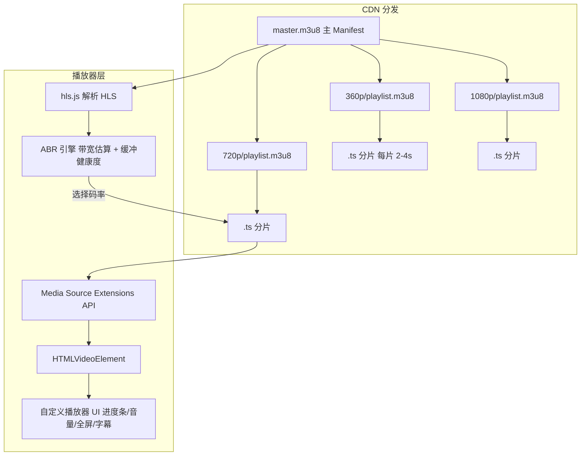

# 视频播放器前端设计

> 考察：HLS/DASH 自适应码率、缓冲策略、Quality Selector、播放器 UI 架构。

---

## 面试框架（45分钟怎么答）

**第一步（开场，5 min）**：澄清——最大视频时长/大小？需要 DRM 版权保护？字幕？移动端适配？首帧时间目标？
**第二步（架构，10 min）**：为什么不用 `<video src="...">`——说清 HLS/DASH 自适应码率原理（分成 2-4s 的分片 + Manifest 描述各清晰度）
**第三步（深挖，20 min）**：hls.js 接入流程；ABR 算法（基于当前带宽和缓冲健康度选择码率）；缓冲策略（预缓冲前 30s；网络差时降级）；续播位置存 localStorage
**差异化得分点**：提出"首帧优化"——`<video preload="metadata">` 只加载头部 + hls.js 从最低码率开始（快速启动）；PiP（Picture in Picture API）实现

---

## 架构图：HLS 自适应码率播放



---

## 需求理解（先问）

```
功能需求：
  - 支持大视频文件流式播放（不等全下完）
  - 自适应码率（网络差时自动降质）
  - 手动质量选择（360p/720p/1080p）
  - 播放/暂停/进度条/音量/全屏/画中画
  - 字幕支持（WebVTT）
  - 续播（记住上次播放位置）

非功能需求：
  - 首帧时间 < 2s
  - 缓冲暂停次数 < 1次/10分钟
  - 移动端省流量模式
```

---

## 视频流格式

```
原始视频 (MP4/MOV)
        ↓ 服务端转码（FFmpeg/AWS MediaConvert）
┌───────────────────────────────────────────────┐
│  HLS (HTTP Live Streaming) - Apple 标准       │
│  master.m3u8  ← 主播放列表，列出所有码率      │
│  ├── 360p.m3u8   → seg001.ts, seg002.ts, ...  │
│  ├── 720p.m3u8   → seg001.ts, seg002.ts, ...  │
│  └── 1080p.m3u8  → seg001.ts, seg002.ts, ...  │
│                                               │
│  DASH (Dynamic Adaptive Streaming) - 开放标准 │
│  manifest.mpd  ← XML 格式主文件               │
│  ├── 360p/  → chunk-001.mp4, chunk-002.mp4   │
│  ├── 720p/                                   │
│  └── 1080p/                                  │
└───────────────────────────────────────────────┘

分片大小：通常 2-6 秒，影响：
  - 分片越小 → ABR 切换更及时，但请求次数更多
  - 分片越大 → 请求少，但切换慢，首帧慢
```

---

## 播放器架构

```typescript
// 三层架构：UI → 播放器控制器 → HLS.js/原生
class VideoPlayer {
  private video: HTMLVideoElement;
  private hls?: Hls;            // hls.js 处理 HLS 流
  private dash?: DashJS.MediaPlayerClass;  // dash.js 处理 DASH 流
  private state: PlayerState;
  private listeners = new Map<string, Set<Function>>();

  constructor(container: HTMLElement, config: PlayerConfig) {
    this.video = document.createElement('video');
    this.video.playsInline = true;  // iOS 不强制全屏
    container.appendChild(this.video);

    this.state = {
      isPlaying: false,
      currentTime: 0,
      duration: 0,
      buffered: 0,
      volume: 1,
      quality: 'auto',
      isLoading: true,
    };

    this._setupEventListeners();
  }

  // 加载视频（自动检测格式）
  async load(url: string): Promise<void> {
    if (url.endsWith('.m3u8')) {
      await this._loadHLS(url);
    } else if (url.endsWith('.mpd')) {
      await this._loadDASH(url);
    } else {
      // 普通 MP4：直接设置 src
      this.video.src = url;
    }
  }

  play(): Promise<void> { return this.video.play(); }
  pause(): void { this.video.pause(); }
  seek(time: number): void { this.video.currentTime = time; }
  setVolume(v: number): void { this.video.volume = Math.max(0, Math.min(1, v)); }
  setMuted(muted: boolean): void { this.video.muted = muted; }

  destroy(): void {
    this.hls?.destroy();
    this.video.src = '';
    this.video.remove();
  }

  private _setupEventListeners(): void {
    const events: (keyof HTMLMediaElementEventMap)[] = [
      'play', 'pause', 'ended', 'timeupdate', 'waiting', 'canplay',
      'volumechange', 'durationchange', 'progress',
    ];

    events.forEach(event => {
      this.video.addEventListener(event, () => this._handleVideoEvent(event));
    });
  }

  private _handleVideoEvent(event: string): void {
    switch (event) {
      case 'timeupdate':
        this._setState({ currentTime: this.video.currentTime });
        // 更新缓冲进度
        if (this.video.buffered.length > 0) {
          this._setState({
            buffered: this.video.buffered.end(this.video.buffered.length - 1),
          });
        }
        break;
      case 'waiting':
        this._setState({ isLoading: true });
        break;
      case 'canplay':
        this._setState({ isLoading: false });
        break;
      case 'durationchange':
        this._setState({ duration: this.video.duration });
        break;
    }
    this._emit(event, this.state);
  }

  private _setState(partial: Partial<PlayerState>): void {
    this.state = { ...this.state, ...partial };
    this._emit('statechange', this.state);
  }

  private _emit(event: string, data: unknown): void {
    this.listeners.get(event)?.forEach(l => l(data));
  }

  on(event: string, listener: Function): () => void {
    if (!this.listeners.has(event)) this.listeners.set(event, new Set());
    this.listeners.get(event)!.add(listener);
    return () => this.listeners.get(event)?.delete(listener);
  }
}
```

---

## HLS 自适应码率（ABR）

```typescript
private async _loadHLS(url: string): Promise<void> {
  // 检测原生 HLS 支持（Safari）
  if (this.video.canPlayType('application/vnd.apple.mpegurl')) {
    this.video.src = url;
    return;
  }

  // 其他浏览器使用 hls.js
  if (!Hls.isSupported()) {
    throw new Error('HLS not supported');
  }

  this.hls = new Hls({
    // ABR 算法配置
    abrEwmaDefaultEstimate: 500000,   // 初始带宽估算 500kbps
    abrBandWidthFactor: 0.95,         // 实际使用带宽的 95% 防抖动
    abrBandWidthUpFactor: 0.7,        // 升级质量时更保守

    // 缓冲配置
    maxBufferLength: 30,              // 最大缓冲 30 秒
    maxMaxBufferLength: 600,          // 极端情况最大 10 分钟
    maxBufferSize: 60 * 1000 * 1000,  // 60MB
    backBufferLength: 90,             // 保留 90 秒已播内容（用于快退）

    // 分片加载
    fragLoadingMaxRetry: 6,
    manifestLoadingMaxRetry: 4,
  });

  this.hls.loadSource(url);
  this.hls.attachMedia(this.video);

  // 监听码率切换事件
  this.hls.on(Hls.Events.LEVEL_SWITCHED, (_, data) => {
    const level = this.hls!.levels[data.level];
    this._setState({
      quality: level ? `${level.height}p` : 'auto',
    });
  });

  // 监听缓冲不足（卡顿）
  this.hls.on(Hls.Events.ERROR, (_, data) => {
    if (data.fatal) {
      switch (data.type) {
        case Hls.ErrorTypes.NETWORK_ERROR:
          this.hls!.startLoad();  // 尝试重新加载
          break;
        case Hls.ErrorTypes.MEDIA_ERROR:
          this.hls!.recoverMediaError();
          break;
        default:
          this._emit('fatalerror', data);
      }
    }
  });
}

// 手动设置质量（-1 = 自动 ABR）
setQuality(levelIndex: number): void {
  if (!this.hls) return;

  if (levelIndex === -1) {
    this.hls.currentLevel = -1;  // 恢复自动 ABR
    this._setState({ quality: 'auto' });
  } else {
    this.hls.currentLevel = levelIndex;
    const level = this.hls.levels[levelIndex];
    this._setState({ quality: `${level.height}p` });
  }
}

getAvailableQualities(): Quality[] {
  if (!this.hls) return [];
  return this.hls.levels.map((level, index) => ({
    index,
    label: `${level.height}p`,
    bitrate: level.bitrate,
    width: level.width,
    height: level.height,
  }));
}
```

---

## 缓冲策略与预加载

```typescript
// 智能预加载：根据用户行为调整
class BufferManager {
  private video: HTMLVideoElement;
  private minBuffer = 10;     // 最少缓冲 10 秒才播放
  private targetBuffer = 30;  // 目标缓冲 30 秒

  // 判断是否需要暂停等待缓冲
  shouldBuffer(): boolean {
    const buffered = this.getBufferedAhead();
    return buffered < this.minBuffer;
  }

  getBufferedAhead(): number {
    const { buffered, currentTime } = this.video;
    for (let i = 0; i < buffered.length; i++) {
      if (buffered.start(i) <= currentTime && buffered.end(i) > currentTime) {
        return buffered.end(i) - currentTime;
      }
    }
    return 0;
  }

  // 省流模式：降低目标缓冲
  setLowBandwidthMode(enabled: boolean): void {
    this.targetBuffer = enabled ? 15 : 30;
    this.minBuffer = enabled ? 5 : 10;
  }
}

// Link rel=preload 预加载视频（用于已知的下一个视频）
function preloadNextVideo(url: string): void {
  const link = document.createElement('link');
  link.rel = 'preload';
  link.as = 'fetch';
  link.href = url;
  link.crossOrigin = 'anonymous';
  document.head.appendChild(link);
}
```

---

## 播放器 UI

```typescript
function VideoPlayerUI({ src }: { src: string }) {
  const containerRef = useRef<HTMLDivElement>(null);
  const playerRef = useRef<VideoPlayer | null>(null);
  const [state, setState] = useState<PlayerState | null>(null);
  const [showControls, setShowControls] = useState(true);
  const hideControlsTimer = useRef<ReturnType<typeof setTimeout>>();

  useEffect(() => {
    if (!containerRef.current) return;

    const player = new VideoPlayer(containerRef.current, {});
    playerRef.current = player;

    // 续播：从上次位置继续
    const savedTime = Number(localStorage.getItem(`video_time_${src}`)) || 0;

    player.on('statechange', (s: PlayerState) => setState({ ...s }));
    player.load(src).then(() => {
      if (savedTime > 10) player.seek(savedTime);
    });

    return () => player.destroy();
  }, [src]);

  // 保存播放位置（每 5 秒一次）
  useEffect(() => {
    if (!state?.currentTime) return;
    const timer = setInterval(() => {
      localStorage.setItem(`video_time_${src}`, String(state.currentTime));
    }, 5000);
    return () => clearInterval(timer);
  }, [state?.currentTime, src]);

  // 鼠标移动时显示控制栏
  const handleMouseMove = () => {
    setShowControls(true);
    clearTimeout(hideControlsTimer.current);
    hideControlsTimer.current = setTimeout(() => {
      if (state?.isPlaying) setShowControls(false);
    }, 3000);
  };

  const player = playerRef.current;

  return (
    <div
      ref={containerRef}
      className="video-container"
      onMouseMove={handleMouseMove}
    >
      {/* video 元素由 VideoPlayer 注入 */}

      {/* 缓冲 Loading */}
      {state?.isLoading && (
        <div className="buffering-spinner" aria-label="缓冲中..." />
      )}

      {/* 控制栏 */}
      <div
        className={`controls ${showControls ? 'visible' : 'hidden'}`}
        aria-label="视频控制"
      >
        {/* 进度条 */}
        <ProgressBar
          current={state?.currentTime ?? 0}
          duration={state?.duration ?? 0}
          buffered={state?.buffered ?? 0}
          onSeek={(time) => player?.seek(time)}
        />

        {/* 按钮行 */}
        <div className="controls-row">
          <button
            onClick={() => state?.isPlaying ? player?.pause() : player?.play()}
            aria-label={state?.isPlaying ? '暂停' : '播放'}
          >
            {state?.isPlaying ? '⏸' : '▶'}
          </button>

          <VolumeControl
            volume={state?.volume ?? 1}
            onVolumeChange={(v) => player?.setVolume(v)}
          />

          <TimeDisplay current={state?.currentTime ?? 0} duration={state?.duration ?? 0} />

          <QualitySelector
            qualities={player?.getAvailableQualities() ?? []}
            current={state?.quality ?? 'auto'}
            onSelect={(idx) => player?.setQuality(idx)}
          />

          <button
            onClick={() => document.fullscreenElement
              ? document.exitFullscreen()
              : containerRef.current?.requestFullscreen()
            }
            aria-label="全屏"
          >
            ⛶
          </button>

          <button
            onClick={() => player?.video.requestPictureInPicture()}
            aria-label="画中画"
          >
            ⧉
          </button>
        </div>
      </div>
    </div>
  );
}

// 进度条：支持点击跳转 + 显示缓冲进度
function ProgressBar({ current, duration, buffered, onSeek }: ProgressBarProps) {
  const handleClick = (e: React.MouseEvent<HTMLDivElement>) => {
    const rect = e.currentTarget.getBoundingClientRect();
    const ratio = (e.clientX - rect.left) / rect.width;
    onSeek(ratio * duration);
  };

  return (
    <div
      className="progress-bar"
      onClick={handleClick}
      role="slider"
      aria-valuemin={0}
      aria-valuemax={duration}
      aria-valuenow={current}
      aria-label="播放进度"
    >
      {/* 缓冲进度（灰色） */}
      <div
        className="buffered-bar"
        style={{ width: `${(buffered / duration) * 100}%` }}
      />
      {/* 播放进度（红色/主题色） */}
      <div
        className="played-bar"
        style={{ width: `${(current / duration) * 100}%` }}
      />
    </div>
  );
}
```

---

## 面试追问

**Q: HLS 和 DASH 的区别，选哪个？**
A: HLS 是 Apple 标准，iOS/Safari 原生支持；DASH 是 ISO 开放标准，Chrome/Firefox/Edge 原生支持。HLS 用 `.m3u8` + `.ts` 文件，DASH 用 `.mpd` + `.mp4` 分片。选择取决于平台：如果要支持 iOS 必须支持 HLS；如果只针对 PC/Android 可用 DASH。生产中通常两者都提供（内容协商），或统一用 HLS（hls.js 在非 Safari 上 polyfill）。

## 常见踩坑

**踩坑1：原生 `<video src="video.mp4">` 无法实现 ABR**
❌ 错误：直接用 `<video src="large.mp4" />`，用户全程下载固定码率文件，网络差时持续卡顿，不能根据带宽自动切质量。
✓ 正确：用 HLS.js 或 dash.js 加载 `.m3u8` / `.mpd` manifest，这些库实现了 ABR（自适应码率）、分片下载和缓冲管理。
原因：ABR 需要视频预先切片为多个码率版本，运行时按带宽动态选择，原生 `<video>` 不支持此能力。

**踩坑2：频繁码率切换导致用户体验抖动**
❌ 错误：ABR 算法对带宽抖动过度敏感，每秒切换一次码率，播放器画质频繁变化（高→低→高→低），用户察觉且体验差。
✓ 正确：用 EWMA（指数加权移动平均）平滑带宽估算，设置滞后阈值（升级 ×1.5 带宽，降级 ×0.8），避免频繁切换；同时结合缓冲水位判断。
原因：播放器应优先保证稳定播放，不应为追求最高质量而频繁切换，稳定性比即时最优更重要。

**踩坑3：seek 后缓冲策略仍按顺序加载**
❌ 错误：用户 seek 到视频 80% 位置，播放器仍然从头部按顺序下载分片，导致 seek 后长时间缓冲（bufferingCircle 转圈）。
✓ 正确：seek 时立即请求目标时间点附近的分片（abort 当前分片请求），优先保证 seek 目标可播放，再按时序继续预缓冲后续分片。
原因：seek 是用户的即时意图，应中断当前预加载策略，优先满足 seek 请求。

**踩坑4：DRM（数字版权保护）密钥请求失败无降级处理**
❌ 错误：EME 的 `generateRequest` 或密钥服务器返回错误时，播放器无任何提示，视频黑屏，用户不知道是版权问题还是网络问题。
✓ 正确：监听 `MediaKeySession` 的 `keystatuseschange` 事件，密钥状态异常时展示对应错误（expired/output-restricted/内容不可用）并提示用户。
原因：DRM 错误类型多样（密钥过期/地区限制/设备不支持），必须有明确的用户反馈，不能静默黑屏。

---

**Q: ABR（自适应码率）的工作原理？**
A: 播放器持续测量下载速度（带宽探针 or 分片下载时间），根据当前可用带宽选择码率：①带宽 > 当前码率 × 1.5 时升级；②带宽 < 当前码率 × 0.8 时降级。还要考虑缓冲水位：缓冲充足时更激进升级，缓冲不足时保守降级。常见算法：EWMA（指数加权移动平均）平滑带宽估算，防止因瞬时抖动频繁切换质量（影响体验）。

**Q: 首帧时间如何优化？**
A: ①分片时间设短（2s），首段下载快；②使用 CDN 边缘节点缓存热门视频的第一个分片；③`<link rel=preload>` 预加载 manifest 文件；④提供低分辨率的首帧图片（poster）作为占位；⑤服务端 keyframe 对齐：确保每个分片都以关键帧开始，避免解码延迟；⑥MP4 文件移动 MOOV box 到文件头（`faststart`），允许边下边播。
